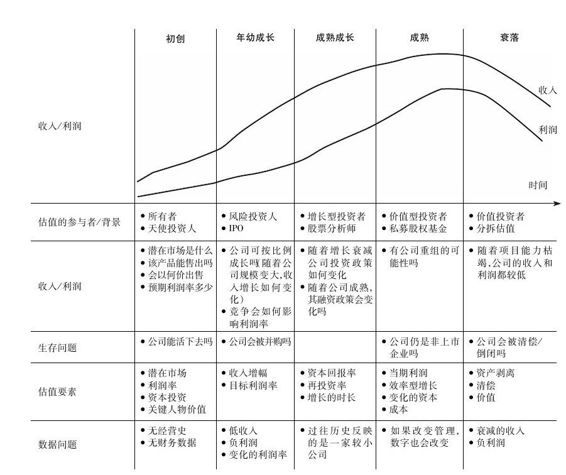

# 估值：难点、解决方案及相关案例

## [美]达莫达兰(Damodaran A.)　著|李必龙 李羿 郭海等 译

### 译者序

资产的灵魂是价值，但在资产为国人所竞相追逐的今天，鲜有人掌握价值管理的系统方法。

估值是价值管理的基础。无论是资产管理还是投资管理，它们的本质都是价值管理。

今日中国，所有公司都面临着价值管理的问题。从银行、证券公司、基金管理公司，到担保公司、物业公司，再到多如繁星的实业企业，莫不如此。

价值管理应用范围广泛，从贷款管理、理财产品管理，到证券投资、VC/PE投资，到对担保对象的估值、实业企业已有资产和新增投资的管理，再到企业并购和资产并购等。

随着中国的资产越来越多，资产管理的专业需求会越来越明显。没有系统的估值技术作支撑的管理，只会浮于表面，价值危害极大。

本书是目前市场上专业水准很高的一本专著，作者达莫达兰被评为2012年“全球十大顶级商学院教授”，是业界举足轻重的人物。

本书不仅根据企业所处行业特点、发展阶段、市场环境及其他各种不确定因素的影响，系统地整理出了估值时所面临的问题，提出了系统的解决方法，而且给出了很多相关案例。

如果你想做好资产管理或投资管理，或是想成为这类管理的高级人才，这是一本必读之作！

本书的第1~5章由郭海翻译，第6、7章由文雅翻译，第8~12章由李羿翻译，第13~18章由李必龙翻译。全书译文由李必龙进行总校对。

### 作者简介

埃斯瓦斯·达莫达兰（Aswath Damodaran）是纽约大学斯特恩商学院的金融学教授。他为MBA学员讲授公司金融和股权估值课程。达莫达兰在加州大学洛杉矶分校获得了工商管理硕士和博士学位。迄今为止，他已经撰写了数本有关公司金融、公司估值和投资组合管理的书籍。达莫达兰自1986年始就在纽约大学教书，八次荣获斯特恩商学院的最佳教学奖（由毕业班授予）。他在1994年被《商业周刊》评为“美国十大顶级商学院教授”之一。

### 前言

本书第1版带有时代印记，但它是该书的本源。创作本书第1版的灵感闪现于1999年年底，时值互联网的盛期之末。这个灵感触发于两个现象：

●传统的估值模型似乎不能解读当时技术类公司（特别是新技术）的天价股。

●面对估值难点，分析师放弃传统估值方法，却陷入一些“误区”——使用各种新的技法和讲故事方式，为所估价格作说辞和搪塞。

本书第1版的出版恰逢互联网泡沫破灭之时。

随着市场的演进与改变，焦点也发生了位移。这种泡沫及其相关的新技法和新模型的辩词又张冠李戴于一组新股票（中国和印度的股权）和一些新型资产（次级按揭贷款）。我逐渐意识到，一旦分析师遭遇困境，无法用传统模型和方法对公司进行估值时，就容易陷入某种“误区”。这次的第2版反映的视角更加广泛：第1版聚焦于年幼公司和高科技（网络）公司，第2版的视野将扫描所有难以估值的公司。

第2~5章回顾了估值的基础性工具。它们侧重概述传统的现金流贴现模型、概率模型（模拟算法和决策树）、相对估值模型和实物期权。这些内容多半都在我的其他估值著作里有过表述。

第6~8章探讨了影响所有估值的宏观变量的问题和争议。第6章审视的是无风险利率——其他所有估值要素的必要组成部分，并挑战这样一种观念：政府债券利率永远是无风险利率的有效评估值。第7章探讨股权风险溢价。这是另一个在估值中被视为不言自明的数字，主要是因为长期以来成熟市场的风险溢价都很稳定。在不断演变且波动性大的市场里，风险溢价甚至在短期内也会发生很大的变化。无视这种现实会导致对结果的误估。第8章研究了其他一些隐含于估值中的有关实体经济增长的宏观经济假设。本章还关注了汇率和通货膨胀率，讨论其评估的不一致性如何影响我们的结论。

第9~12章探讨不同企业周期面临的估值挑战。下图列示了这些挑战。

估值的生命周期观

在第9章，我们关注估值初创公司时面临的挑战：这类公司有了某种产品或服务的创意，但缺乏有形的商业化产品。此时，它们的收入和市场都很有限，但该章还是探讨了这类创意演化为商业化产品的一些循序渐进的方法。该章还审视了初创企业估值最初阶段所面临的那些挑战。这些都是风险投资人在向小企业提供“天使投资”时所必须面对的挑战。第10章顺企业生命周期阶梯拾级而上，审视年幼成长型公司——其产品和服务已经找到了市场，而且收入增长很快。该章还研究了上市（相对于不上市）和保持增长的可持续性的估值内涵。另外，该章还认真打量了闯过风险投资阶段并已经上市的成长型公司。这些公司具有很好的增长表现，但它们的规模不够。在第11章，我们把注意力投向了成熟公司——它们已不再成长，提升价值的主要方式是并购、业务重组和财务重组。在这个过程中，我们也探讨了在杠杆收购的背景下，私募股权投资者如何看待成熟公司的价值及其控制权的价值。第12章关注处于衰落中的公司——负增长，且很可能陷入困境和出现倒闭。

第13~17章探究了出于各种原因很难估值的各类公司。第13章审视了大宗商品类（石油和黄金）公司和周期性公司。它们的利润受外部因素（大宗商品价格和经济状况）左右、动荡不定，使得各种预测变得很困难。在第14章，我们梳理了与金融服务公司（银行、保险公司和投资银行）相关的特有挑战，重点放在监管的变化会如何影响价值上。第15章所考虑的公司，其价值都依赖于无形资产：专利、科技实力和人力资本。这些公司的资产性质及其会计处理准则的缺陷，为估值带来了很大的挑战。第16章审视了在动荡和年幼经济体（新兴市场）中经营的公司，探讨如何更好地评估这类公司的价值。第17章则设法了解在多国从事多元化经营的公司，探讨如何更好地处理这些公司内部不同部分的相互影响。

总之，本书的第2版涉猎了所有类别的公司（不仅仅是年幼的技术类公司）在估值上的负面行为和不良做法。

### 第1章 估值的难点

#### 1.1 价值基础

#### 1.2 跨期估值

#### 1.3 跨生命周期的估值

#### 1.4 各类公司的估值

#### 1.5 厘清估值的难点

#### 1.6 结论

### 第2章 内生性估值

#### 2.1 现金流贴现估值

#### 2.2 现金流贴现估值的衍生版

#### 2.3 内生性估值模型给我们带来了什么

#### 2.4 结论

### 第3章 概率估值：情景分析、决策树和模拟算法

#### 3.1 情景分析

#### 3.2 决策树

#### 3.3 模拟算法

#### 3.4 概率风险评估方法综述

#### 3.5 结论

### 第4章 相对估值

#### 4.1 什么是相对估值

#### 4.2 相对估值的普遍性

#### 4.3 相对估值流行的原因和潜在的缺陷

#### 4.4 标准化价值和倍数

#### 4.5 应用倍数的四个基础步骤

#### 4.6 相对估值和内生性估值的协调

#### 4.7 结论

### 第5章 实物期权估值

#### 5.1 实物期权的本质

#### 5.2 实物期权、风险调整过的价值及其概率评估

#### 5.3 实物期权案例

#### 5.4 实物期权的注意事项

#### 5.5 结论

#### 附录5A 期权及其定价的基础

### 第6章 摇晃的根基：无风险利率的“风险性”

#### 6.1 什么是无风险资产

#### 6.2 为什么无风险利率重要

#### 6.3 评估无风险利率

#### 6.4 评估无风险利率的问题

#### 6.5 有关无风险利率的最后想法

#### 6.6 结论

#### 附录6A 国家的主权信用

### 第7章 风险投资：评估风险的价格

#### 7.1 为什么风险溢价重要

#### 7.2 风险溢价的决定要素是什么

#### 7.3 评估风险溢价的标准方法

#### 7.4 结论

### 第8章 基本面举足轻重：实体经济

#### 8.1 实体经济的增长

#### 8.2 预期通胀率

#### 8.3 汇率

#### 8.4 流行的做法

#### 8.5 难点

#### 8.6 药方

#### 8.7 结论

### 第9章 蹒跚学步：创业和年幼公司

#### 9.1 经济体中的年幼公司

#### 9.2 估值问题

#### 9.3 估值的难点

#### 9.4 估值的亮点

#### 9.5 结论

### 第10章 攀升的新星：成长型公司

#### 10.1 成长型公司

#### 10.2 估值问题

#### 10.3 估值的难点

#### 10.4 估值的亮点

#### 10.5 结论

### 第11章 长大成形：成熟公司

#### 11.1 经济体中的成熟公司

#### 11.2 估值问题

#### 11.3 估值的难点

#### 11.4 估值的亮点

#### 11.5 结论

### 第12章 日薄西山：衰落的公司

#### 12.1 经济中的衰落公司

#### 12.2 估值问题

#### 12.3 估值的难点

#### 12.4 估值的亮点

#### 12.5 结论

### 第13章 潮起潮落：周期性和大宗商品类公司

#### 13.1 关键词

#### 13.2 估值的难点

#### 13.3 估值的亮点

#### 13.4 结论

### 第14章 随行就市：金融服务公司

#### 14.1 金融服务公司：全局图

#### 14.2 金融服务公司的特征

#### 14.3 估值的难点

#### 14.4 结论

### 第15章 看不见的投资：具有大量无形资产的公司

#### 15.1 具有大量无形资产的公司

#### 15.2 估值的难点

#### 15.3 估值的亮点

#### 15.4 结论

### 第16章 波动性规则：新兴市场中的公司

#### 16.1 新兴市场公司的角色

#### 16.2 估值难点

#### 16.3 估值的亮点

#### 16.4 结论

### 第17章 章鱼：多元化全球公司

#### 17.1 跨国性

#### 17.2 估值争议

#### 17.3 估值的难点

#### 17.4 估值的亮点

#### 17.5 结论

### 第18章 直击要旨：消弭难点

#### 18.1 坚守原则、善用新工具、弹性评估

#### 18.2 关注市场，但不要让它们左右你的估值

#### 18.3 不要忽视风险

#### 18.4 增长不是免费的，不会总是加分的

#### 18.5 好事都有尽头

#### 18.6 小心遇上截断风险

#### 18.7 回顾过去，思考未来

#### 18.8 善用大数定律

#### 18.9 接受不确定性，相机处置

#### 18.10 把故事转化为数字

#### 18.11 结论

