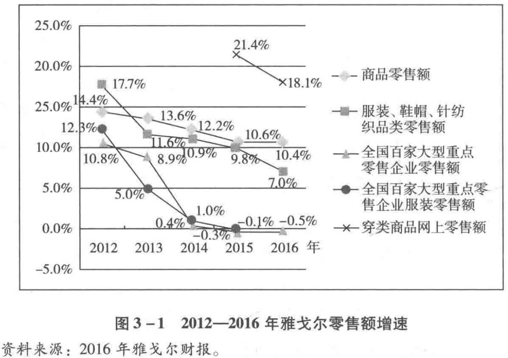

# 价值投资实战手册

## 唐朝 著

### 第一章 正确面对股价波动

#### 什么是投资

巴菲特：“投资是为了在未来更有能力消费而放弃今天的消费。”

#### 股票的本质

面对这样一个“七亏两平一个赚”的市场，普通投资者有什么办法可以应对呢？总体无外乎两条路：一是珍爱生命，远离股市；二是放弃猜人心的票模式投机，做大概率成功的股模式投资。

#### 投资是持续终身的事

在法币时代，现金是少有的、100%确定亏损的资产。

#### 股票收益的来源

股票投资回报给股东带来收益的来源主要有三种：企业经营增值、企业高价增发新股或分拆下属子公司IPO融资、股票投资者情绪波动导致的股价无序波动。

#### 最简单的投资方法

巴菲特将投资品分为三个大类。

第一类是现金等价物，包括银行存款、货币基金、债券等。这些资产表面上看起来很安全，但事实上它们是最危险的资产，因为在法币时代，现金及其等价物是少数“购买力确定会不断减少的资产”。

第二类是那些实际不产生任何收益的资产，但买家认为其他人未来会以更高的价格买走。例如，黄金、艺术品、收藏品、古董。

第三类是有生产力的资产，如农地及公司股票等。这些投资品“能在通胀时期让产出保持自身的购买力价值”。投资这类资产，长期收益将轻松超越无生产力资产和货币资产。

#### 普通投资者的道路

股价（P）=市盈率（PE）*每股盈利（EPS）

市场参与者主要有三种选择类型：

①来股市花钱打发时间的。

②赚取市盈率变化的钱。或由于持股期限短（以月或日为单位），一般预期企业利润不会发生大的变动，或对企业利润变化持不可知态度，主要意图站在④位置，获取市场情绪变化导致的市盈率升高带来的股价增长利润。此类还可分为AB两种：

A型，侧重选择市盈率低于甚至是远低于市场平均水平，或市盈率低于甚至是远低于该公司历史平均水平，意图获取市盈率回归市场平均水平或该公司历史平均水平，带来的股价变化利润。市场上常见的师从格雷厄姆、施洛斯、邓普顿等人，以及网格交易派、以PE位置来决定对某些指数或ETF投资仓位的，指导思想大体都属于本类。主要特点是依赖低估、分散和常识，不追求局部得失，乐意承受概率损失，获取总体上的回归利润；

B型，不在意当前市盈率高低，依赖某种判断，认为未来市盈率会提升的，意图获取市盈率升高带来的股价变化。市场常见的技术图表分析流派——无论是跟随派或逆转派，以及预测和追逐基本面热点的流派——新闻联播党和宏观牛熊党，基本属于这一类。B类也是网络上最容易受到追捧、最多股神故事、最容易换来粉丝金钱和人气的类型；

③赚取企业净利润变化的钱。可分为CD两种类型。

C型，所谓价值投资者，以伴随企业成长为核心，以收获市盈率变化为意外。又可大略的分为当下选择低市盈率、更强调安全边际的所谓“纯正夹头”，和更注重企业未来成长、在市盈率方面放的比较松的成长股投资者两种。其目标是占领①和②区间，特点是注重对行业前景、企业财报及同行竞争等领域的深度研究；

D型，重组或逆转股投资者，以企业利润水平即将发生根本性逆转为前提，实施投资。这类投资，专业预判和灵通消息兼而有之。所谓专业预判，指对企业重组或行业逆转的可能性进行研究，通过广泛埋伏于具备重组或逆转可能的目标企业中，守株待兔等待重组发生或者宏观环境的变化，获取企业净利润大幅变化带来的利润。所谓灵通消息，你懂的，每一桩重组案里面，几乎不可能少了内部人吃肉的机会，关键问题是你是否有资源交换到这样的消息，以及是否有能力承担交换的后果。

#### 投资无须“接盘侠”

时间是我们最好的朋友，伴随年龄的增长，伴随我们的学习、研究和跟踪，能理解的企业越来越多，所承受的行业性风险越来越小，面临局部过分高估或某些基本面变化时，可腾挪和接力的机会也越来越多。其他的，真心不重要。

#### 股权与其他投资品的对比

数字告诉我们的：优秀股权的投资回报是最高的，远高于其他投资手段，甚至超过了帝都那传奇的房价涨幅。事实上，上市超过20年的企业中，盈利增长水平达到或超越泸州老窖的并不罕见，感兴趣的朋友可以自行统计计算。同样，今天的A股里，未来盈利增长水平，可能超过泸州老窖的也不会少。挖掘和研究这些企业，就是帮助投资者长期盈利的“正事儿”。

##### 如何面对铁公鸡？    

留存部分利润，相当于首先分掉全部利润，然后股东再优先按照净资产值（面值）认购某息率为10%~12%的特殊债券，整个过程免税。对于非股东而言，这种息率为10%~12%的特殊债券是需要付出净资产值的两倍三倍甚至更多倍代价才能购买到的。此时留存利润成为了一种股东特权。这种有权以净资产值（面值）购买高息债券的特权，类似中国股市诞生初期的认购证，本身是有价值的。

因而股市投资者会发现自己将收获三重回报：首先，投资者享受了远超真实债券息率的公司经营回报；其次，这些回报的大部分又以特权形式，重新认购了他人无权认购的高息债券；最后，当前面两点好处被广泛认知的时候，股票会受到资本追捧而造成股价攀升。

然而，这一切要建立在公司的留存再投入本身会继续产生高于真实债券息率的假设下。譬如伯克希尔·哈撒韦公司，自沃伦·巴菲特取得控股权至今五十多年，仅分红过一次，且数量微不足道。其原因就是巴菲特认为将资金留在自己手上投资，带给股东的回报率会高于分红后股东自行投资。事实上，股东也确实因为这种留存而获利丰厚。

但是，如果上市公司并没有将留存利润产生高回报的投资途径，仅仅因为管理层或大股东意图掌控更多资金而不分红或低分红，那么，这就不是特权，而是一种价值的损失。这种情况令人讨厌，但不难规避。

首先，如果公司在无合理理由的情况下不分红或低分红，我们需要怀疑公司利润的真实性及管理层诚信问题，可以作为对公司估值的扣分项。

其次，如果公司很赚钱，控股股东也没有必要冒着违法违规的风险去占用本来可以通过分红后合法使用的资金。这种想法会驱动对管理层的制约。

再次，在资本市场里，如果一台收银机里堆积的钱多了，总会有各种各样的资本去想办法取出来，这种博弈本身会纠错或者推升股价。过去一两年围绕万科展开的一系列精彩资本大战，就是这种博弈的体现。

最后，在我国资本市场，证监会对上市公司分红尤其是现金分红，有一些规则上的强制要求。所以目前绝大部分优秀企业，都有股东回报规划，有按年现金分红的比例约定，这也算是我国资本市场的制度优势。

#### 优质企业的特征

选股，通常有两种路径，一种是自上而下，一种是自下而上。

自上而下，选择的路径是先选行业再选企业。思考路线是首先前瞻性地找出未来发展空间较大的行业，即先找到一张可能越来越大的饼；然后再寻找这个行业内某家或某几家优势企业，即找到未来在这张大饼中可能获取较大份额的企业。如果有条件的话，还可以在选择行业之前，加上选择国家，即首先选择那些经济增速可能较快的国家，然后才在这些国家内去选择发展空间大的行业。

这种方法，对投资者个人商业前瞻能力要求较高，投资者需要具备识别产业机会的能力，能大概率判断出未来某产业的腾飞。大部分成功的风险投资家，以及大部分成功的企业家，都是因为选择了正确的行业，站在了风口。

自下而上，也有两大类投资方法，一种侧重寻找严重低估，一种侧重寻找优秀企业。

### 第二章 如何估算内在价值

#### 格雷厄姆奠定的理论基石

格雷厄姆式投资的标准流程。这套流程发布于1976年9月20日的一本杂志中（次日，82岁的格雷厄姆去世）。原文是以访谈形式发表的。

（1）找出所有TTM市盈率低于X倍的股票（TTM市盈率=市值/最近四个季度公司净利润）。    
（2）X=1/两倍的无风险收益率。例如，当无风险收益率为4%时，X=1/8%=12.5。    
（3）找出其中资产负债率<50%。资产负债率=总负债/总资产。    
（4）选择至少30家以上，每家投入不超过总资本的2.5%。    
（5）剩余的25%资金及不足30家导致的剩余资金买入美国国债。假设当时市场只能选出10只符合标准的股票，则股票占比不超过25%，国债占比75%；如果一只也选不出来，国债占比100%；能选出50只，国债占比25%，每只个股投入总资金的75%/50=1.5%。美国国债可以用任何无风险收益产品替代。    
（6）任何一只个股上涨50%以后，卖出，换入新的可选对象或国债。    
（7）购买后的第二年年底前，该股涨幅不到50%，卖掉，换入新的可选对象或国债，除非它依然符合买入标准。    
（8）如此周而复始。    

格雷厄姆说：“这是一种以最少的工作量从普通股票中取得满意回报的安全方法。这种方法真好，简直让人难以置信。但我可以用60年的经验保证，它绝对经得起我的任何检验。” 按照格雷厄姆的预计，该方法长期而言能够获得超过15%的收益率。

#### 巴菲特的继承与思考

格雷厄姆认为，如果一只股票买入后获利50%应该卖掉，买入第二年末不能获利50％也应该卖掉。而费雪认为，只有在三种情形下才考虑卖出：1.原始买入所犯下的错误情况越来越明显；2.公司营运每况愈下；3.发现另一家更好的公司。否则，卖出时机几乎永远不会到来。仅仅因为市场波动来决定卖出是荒谬的。

典型的格雷厄姆式烟蒂股的估值方式，是寻找市值低于有形资产净值或者流动资产净值的股票，这方法清晰明白，可以直接录入数据在excel表格中精确计算。不过，如果对格雷厄姆的认识仅限于此，那就狭隘了。格雷厄姆也并非只盯住烟蒂，对于优质企业，他也有自己的认识。

在对大型企业的思考中，格雷厄姆给出过自己清晰的估值建议，他说：“我认为道琼斯指数成分股或者标准普尔指数成分股的收益率至少应相当于AAA级债券收益率的4/3倍，这样与债券相比，才有一定的吸引力。”就是说假设目前AAA级债券的收益率是4.5%，则道琼斯指数成分股或者标准普尔指数成分股的收益率应该在4/3×4.5%=6%以上，即市盈率低于16.6倍（100/6=16.6）属于合理位置。

格雷厄姆解释说“股票投资应比债券投资多要求至少1/3的收益，因为股票投资比债券投资麻烦得多。”

并且，格雷厄姆曾给出清晰的买点：

我设定的买点就是当前AAA级债券利率水平的两倍，同时市盈率倍数不超过7~10倍。如果当前AAA级债券利率水平低于5%，买入最高市盈率倍数设定为10倍；如果当前AAA级债券利率水平高于7%，则买入最高市盈率倍数设定为7倍。”——摘自欧文·卡恩《本杰明·格雷厄姆：金融分析之父》。

这个买点为当前AAA级债券利率水平两倍的思考，源于格雷厄姆的一个研究结果，他说：我发明了一种简单有效的方法来确定道·琼斯工业平均指数的中间价值，即，以AAA级债券利率的2倍为比例将十年平均盈利资本化。这种方法假设，一组股票在过十年中的平均盈利可以成为确定其未来盈利的基础，但这种保守的估计会偏低。它还假设，把AAA级债券的资本化比例提高一倍，可以适当抵销优质股票和债券之间存在的风险差异。虽然人们或许会在理论上反对这种方法，但是它实际上已基本正确地反映出1881年以来工业普通股票平均的中间价值。——摘自珍妮特·洛尔的《格雷厄姆论价值投资》。

对于卖出股票的时点，格雷厄姆也毫不含糊地给出自己的看法：作为一个粗浅的常识，投资者应该在主要指数（例如，道·琼斯指数和标准普尔指数）的收益率低于优质债券收益率时离开股票市场。——摘自珍妮特·洛尔的《格雷厄姆论价值投资》。

在格雷厄姆体系里“股票代表企业（现有资产所有权）的一部分”，因此关注点是企业资产真实性和可变现价值。格雷厄姆体系之所以特别强调计算价值时要去掉商誉、无形资产，只计算净有形资产价值，甚至某些时候还要去掉固定资产和设备，只计算净流动资产。其核心原因并非格雷厄姆认为商誉、无形资产不是资产，而是认为它们或者无法变现，或者变现非常困难——包括非通用设备及固定资产也是同理。

一旦将思路调整为“股权代表企业（未来收益索取权）的一部分”后，企业今天账面上拥有多少资产，就没那么重要了。重要的是企业靠什么赚钱，今后能够赚到多少钱，其中多少钱可以拿来供股东分配？思考的重心自然而然地从“现在拥有”转向“未来盈利”。

#### 芒格与费雪推动的突破

这种经济商誉之所以宝贵，就在于他构成了一条仅靠金钱填不平的护城河。在资本逐利天性的驱使下，仅靠金钱就可以填平的护城河，一定会被金钱填平。拥有金钱无法购买的经济商誉，企业才有成为伟大企业的可能性。

##### 经济商誉在哪里？    

其实巴菲特已经多次公开告诉我们寻找方法了，那就是顺着ROE（净资产回报率）指标去寻找。他说：“我选择的公司都是净资产回报率超过20%的企业”。

大部分投资者对于ROE指标的使用有误解，以为ROE很高的企业，账面资产有什么神秘之处，值得市场以很高的价格购买。其实不然，当我们看见一家公司财务报表里用很少的净资产就创造了很高的利润（即ROE很高），它的含义并不是这家公司的账面资产有什么神奇之处，而是代表一定有些什么能带来收入的东西，没有被记录在财务报表上。

所以，ROE指标实际上需要我们倒过来看：看到高ROE，要去思考这家公司有什么资产没有记录在账面上？看到低ROE，要去思考这家公司的什么资产已经损毁，却还没有从账面上抹去？

自由现金流是个模糊的概念，它也不在财报上。财报上只有经营现金流、投资现金流和筹资现金流。所谓自由现金流，指的是每年公司赚的利润里，如果拿出来分给股东，也不会影响公司现有盈利能力的钱（是不是真的分，和本问题无关）。

因此，自由现金流的数量，无法从财报上直接获得。只能在你理解公司售卖什么、如何获利、如何抵御竞争之后进行估算，不需要很准，但不能错的离谱。对于我喜欢的公司，主要属于净利润为真，利润可持续，持续获取利润不以投入大量新资本为前提，所以我直接用报表净利润模拟自由现金流。

如果硬是要找个公式的话，可以用报表上的“经营现金流净额—购建固定资产、无形资产和其他长期资产支付的现金”来保守模拟。之所以说是“保守”模拟，是因为“购建……的现金”金额实际上包括着部分公司为业务扩张的产生投入，这部分并不属于“维持原有获利能力所必须的投入”。

#### 应用于实战的快速估值法

更高的盈利能力，必将被逐利资本推高价格，这与你我是否想赚股价差完全无关。正如巴菲特在1987年股东信里引用的《财富》杂志研究成果：1977年到1986年间，每1000家企业中只有25家可以通过两项有关企业是否杰出的测试：①10年内的平均净资产收益率达到20%；②没有任何一年低于15%。这些生意上的超级明星同时也是股票市场的宠儿。在这10年里，25家中有24家的股价表现超越了标普500指数。

老唐个人将实战中的估值简化为一句话：“三年后以15~25倍市盈率卖出能够赚100%的位置就可以买入，高杠杆企业打七折。”

这里有两个概念要解释。

①这里说的高杠杆企业，指有息负债超过总资产70%的企业。有息负债就是需要企业支付利息的债务，通常出现在短期借款、一年内到期的非流动负债、长期借款、应付债券、其他非流动负债科目。金融类公司通常还会有向央行借款、吸收存款及同业存放等科目。

②打七折的意思指对于高杠杆企业，要求三年后以10.5倍市盈率（简化为10倍）卖出就能赚100%时，才会考虑买入。打折的原因是高杠杆企业更脆弱，对于宏观经济及意外情况更加敏感，所以需要更高的风险溢价作为补偿。

这种简化的估值法，同样需要首先确定三大前提：利润为真否？可持续否？维持当前盈利需要大量资本投入否？这是理解企业的范畴。不能回答这三个问题，属于看不懂的企业，无法谈论估值，直接淘汰。

在确定了这三大前提后，老唐的简化估值法实际上是两段式自由现金流折现法的极简版本，即：

第一步，估算最近三年企业所能产生的自由现金流。由于已经确定该企业利润为真，可持续，且持续不需要大量的资本投入，所以直接借用报表净利润近似替代自由现金流，即假设公司每年计提的折旧和摊销费用，足以支持企业维持当前盈利水平——再次强调，必须要确认企业能够满足三大前提才能使用如此替代法；

第二步，保守地将三年后的该企业视为等同于债券的资产。由于目前无风险收益率大致在4%~5%区间，对应市盈率20~25倍。或者也可以看作假设永续增长率等于无风险收益率，而要求回报率（折现率）为无风险收益率的两倍（两倍设置参照格雷厄姆的研究成果“把AAA级债券的资本化比例提高一倍，可以适当抵销优质股票和债券之间存在的风险差异。”）两种情况分子都是自由现金流，分母前者为无风险收益率，后者为“2*无风险收益率-无风险收益率”，所以两种视角计算出来的结果实际是相同的。

对于某些确定性稍微差点儿，或者净利润可能并非全部是自由现金流的企业，做粗略的折扣调整，按照15~20倍市盈率计算（实际是模拟了市盈率不变，但自由现金流数额降低）。最终得出三年后合理估值为15~25倍市盈率区间——所谓合理估值，指假设市场认同该资产相当于一份债券的情况下给出的估值，或者假设该企业永续增长率等于无风险收益率，同时要求回报率两倍于无风险收益率的情况下给的估值。

这个合理估值的市盈率倍数，不区别行业特性或企业历史市盈率数据，它只受无风险收益率变动影响。不同的行业或企业，或许在自由现金流与净利润的比例关系上有不同，投资者需要做的是调整自由现金流估算值。至于合理市盈率，别忘了All cash is equal，没有哪个行业赚到的金钱比其他行业低贱或者高贵，它们赚到的自由现金流，对投资者只有数量多少差异，没有质地优劣差异。

实质上，符合前述三大前提的企业，几乎确定长期价值高于债券，将其等价于债券估算合理估值，或者在债券的基础上折扣计算合理估值，具备一定的保守因素。——也有极少的案例，企业自由现金流可以预期长期高于报表净利润，老唐会将三年后的合理估值对应市盈率从25倍上调至25~30倍区间，以体现该企业明显优于债券的特点。但这种情况需要非常谨慎。截止目前为止，老唐仅对茅台和腾讯两家公司实施过这种上调。

第三步，即便如此，也要考虑有估算错误的可能——投资者一定有机会犯错的，我保证——给自己预留足够的安全边际。因此将两段估值折现加总后再给予50%左右折扣，确定为买入价格。实战中，为简单起见，大概地以前段自由现金流数额抵扣后段折现导致的减少部分，直接以第三年未折现估值的50%做简易估算。这个买入价格，基本保证自己的估算即便出了偏差，也很难造成亏损。

例如，假设一个企业符合三大前提，无风险收益率为4%，折现率为两倍无风险收益率，2018年可以用于模拟自由现金流的报表净利润基数为100，未来三年净利润分别为120、140、180。将这家企业视为一份债券，按照两段式折现法计算，今日价值可以表达为：

120/104%+140/104%^2+180/4%/104%^3    
=115.4+129.4+4500/104%^3    
=245+4000    
=4245    

如果我们预留50%安全边际，买入点应该在4245/2=2123。实践中，我为口算方便，直接用三年后未折现过的180/4%=4500（即180*25=4500）打五折得到4500/2=2250。

例子中的245即“前段自由现金流”，4500-4000=500即“后段自由现金流因折现导致的减少部分”。直接以4500的50%估算出的2250，相当于4245的五三折，与标准五折2123近似，这就是老唐估值法的简化口算法。

这个简化估值法虽然没有使用自由现金流折现法的具体计算公式，但它和自由现金流折现法同样具备如下特点：    
①都需要考虑三大前提，在确信目标企业符合三大前提的情况下，才可以使用。我们必须要坦率承认，大部分企业我们是无法估值的，无论对其计算出个什么数字，都是瞎蒙；    
②从这个意义上说，这两种估值法与其说是“估值公式”，不如说是一种选股原则，是将大部分企业拒绝在股票池之外的工具；    
③都使用了约8%~10%的要求回报（折现率）和约4%~5%的永续增长率假设。对于永续增长率难以确定超过无风险收益率的企业，实施排除。    
④都坚持长期的思考方式，忽略受到各种短期因素影响的股价波动，以至少三年的时间长度和资金占用时间，去看待企业内在价值的变化；    
⑤都认定自己会有估算错误，坚持安全边际要求，留下容错空间。    

那么，估算出来以后，是不是就等待三年或更短时间内翻倍然后卖出呢？不是。别忘了，投资者应该用长期乃至永恒的视角看待投资。

买入后，老唐做的事情，就是每年（或有重大事件发生时）继续按照简化估值法对持有企业估值，然后与手边潜在的各种投资品种——不仅包括已持有企业、新涉及企业，也包括指数基金及债券、货基、理财等类现金资产——进行收益率比较。如果无法看出某品种收益率明显更高，则持有不动；反之，则调换——若调换品种如果恰好是债券、货基、理财等类现金资产，看上去就像是日常我们所说的减仓卖出。任何持股，只有一个结局，被其他更高收益率的投资对象替代。而替代的原因可能有两种，一种是价格上涨导致的收益率下降后被替换，一种是有证据证明之前的估值有错误而导致被替换。就这么持续，直到永远。

### 第三章 企业分析案例

#### 生人勿近雅戈尔

##### 基本结论：生人勿近

雅戈尔涉足服装、地产、纺织、电力和投资业务，其中纺织体量太小，电力已经剥离。纺织和电力2016年合计仅实现营业收入1.67亿元，亏损2747万元，可以暂时忽略。公司重点业务三大块:服装、地产和投资。

老唐的结论是:服装举步维艰，地产没有空间，只有投资是唯一希望。但雅戈尔的投资业务操盘者，风格飘忽、逻辑难懂，投资雅戈尔有巨大的赌运气成分。所以，除非对雅戈尔投资业务操盘人的体系有系统了解，或者对其投资对象有成熟认识，否则建议生人勿近。

##### 服装板块：精打细算的苦命生意

###### 基本经营数据

2016年，雅戈尔服装板块取得营业收入44.6亿元，其中品牌服装生产销售42.7亿元；品牌服装销售中，主品牌Younger(雅戈尔)完成营收37.9亿元，其他子品牌4.8亿元。销售模式分为直营、加盟和团购三种，直营是主要形态，完成营收36.1亿元，同比增长1.4%，占营收比例超过八成，是收入的主要来源。加盟和团购均是两三亿元的规模，不成气候，分别下滑8%和14%。线下销售占比97%，线上销售仅占3%，依然是传统销售模式。

44.6亿元营业收入，带来净利润5.5亿元，净利润率约12%，貌似还不错。但如果学习私营老板，盘点一下自己的店面，情况却远比表面数字艰难。

公司推行大店战略,共有置营加盟等店面合计2554家,合计营业面积38.2万平方米,平均单店面积约150平方米。446亿元销售收入摊到每家店面,年均单店营收175万元,日均销售约4800元;5.5亿元净利润,折合单店年利润21.5万元,每天不到600元。一个150平方米的店面,每天销售4800元,赚取不足600元的利润,算是个苦命生意了。

再来分析品牌服装中的产品结构,如表3-1所示,与印象不同的是,没看财报前,老唐以为雅戈尔主要收入来自西装。看后才知,原来自产的衬衣和外包的上衣(夹克)才是雅戈尔的最大营收来源。这张表展示的结论很清晰,基本零增长,且产品结构也大体固定。几乎可以忽略的少量营业额增长,来自营业面积的扩大—2016年38.2万平米,2015年34.9万平方米,2014年34.3万平方米。

表3-1 品牌服装中的产品结构（单位:亿元）

||2016年营收|占比|215年营收|占比|2014年营收|占比|
|:--|--:|--:|--:|--:|--:|--:|
|衬衫|14.1|33%|13.9|33%|13.6|33%|
|上衣|12.9|30%|12.7|30%|11.7|28%|
|西装|8.6|20%|8.7|21%|9.3|23%|
|裤子|6.3|15%|6|14%|5.6|14%|
|其他|0.8|2%|1|2%|1.1|2%|
|总计|42.7|100%|42.3|100%|41.3|100%|

###### 惊人的库存

而财报中的另一张表,看后就更令人担忧了。

>(2)产销量情况分析表（单位:万件/万套）
>
>|主要产品|生产量|销售量|库存量|生产量比上年增减(%)|销售量比上年增减(%)|库存量比上年增减(%)|
>|:--|--:|--:|--:|--:|--:|--:|
>|衬衫|486.25|578.56|504.46|-0.56|1.41|-15.51|
>|西服|70.30|77.28|121.94|1.30|-5.38|46.07|
>|裤子|186.12|217.48|211.73|0.25|4.19|-12.66|
>|上衣|219.53|251.15|252.62|7.65|9.86|-11.12|
>|其他|73.45|104.08|127.06|-19.32|-10.68|-19.96|
>|合计|1035.65|1228.55|1217.81|-0.32|1.86|-10.85|
>
>产销量情况说明
>
>公司一方面“以销定产”，实施商品企划推进产品结构调整和供给侧改革；另一方面积极“促销量、去库存”，在确保毛利率保持稳定水平的前提下，存货去化率提升2.86个百分点至12.52％。

以这张表的数据和表末的说明看，公司2016年是控制了生产，以尽力消化库存，体现为每种品类当年生产量都低于销售量。然而，年末各品类库存量均远大于当年产量，接近于全年的销售总量，其中西服库存甚至超过一年半的销售量。
单店平均库存衬衣约2000件，西服近500套，裤子800多条，夹克近1000件，其他约500件。存货价值17亿元，按照雅戈尔64％毛利率倒推，相当于对应着47亿元销售额。按照雅戈尔的存货跌价准备计提方法，服装存货只要不超过三年，就不计提跌价准备。这状况，如果我是老板，会冒冷汗的。

老唐咨询了一位服装行业（和雅戈尔定位近似的地方西装品牌）的从业者，其有二十多年的生产和销售经验，对方看了数据后说，以她对服装行业以及雅戈尔的了解，这个库存量是以直营为主的服装企业基本合理的库存。以批发为主要经营模式的服装企业，库存可以控制在年销量的20％左右。

这行业不好干啊！如果是老唐，看着一堆确定必将随着时间推移贬值的库存，绝对一个头两个大。

###### 营收为何乏力？

回过头来说，为什么不断增加投入，扩张营业面积，而雅戈尔服装板块的营业收入却基本不动呢？

图3-1中的曲线可以说明三个问题：①服装、鞋帽、针织品零售额的增速呈现下滑趋势，但依然超过GDP平均增速；②穿类商品网上销售增速较快；③“大型”服装企业增长远远落后于行业平均增速。其中的原因也不难理解。网上销售的便利性我们都有亲身感受，网上销售的增长，对于雅戈尔这种线下销售占比97％的传统服装企业而言，挤压几乎是必然的。

大型企业不好过，可能是消费升级带来的个性化需求增长的体现。小型服装企业追赶流行潮流更快，决策环节更少，加上网络销售的展示和推广速度，满足了消费者求新、求变、求个性的心理需求。此种情况下，大型企业的规模化生产，反而容易变成规模不经济，加上决策链条长，对市场反应较慢，增速落后也实属情理之中。

此外，关于消费品市场的客群分析，有一个略微粗俗但又不失真实的分类与定位，有人将消费者分为六大类，按照购买力强弱和市场价值，由高到低分为：少女、儿童、少妇、老人、狗、男人。当然，这里有一定调侃的成分。但是，针对男性的服装消费品类市场的价值究竟有多大，值得投资者思考。

雅戈尔，一家主要以“线下经营为主”，目标消费者为“男人”的“大型”服装企业，行业三大不利因素占齐，怎么增长？

###### 经营者的宏大战略

对于这个问题，估计董事长李如成也在不停思索，以前试图发展地产，大搞金融投资，而业绩却犹如那海上的波浪，有时起、有时落。这眼看地产和投资也是靠不住，67岁的李如成老先生，在淡出企业管理很久后，2016年秋天高调复出，宣布要在三年内投资100亿元——财报中写道，2015-2020年间投资100亿元，其中2017年投20亿～30亿元——再造一个雅戈尔。

百亿投资的重心是下注Mayor品牌，产品计划定价在8000～15000元，打造“中国管理者的新装”。其中80亿元投入实施平台战略，20亿元投入实施会员战略、多品牌战略、供应链战略及信息系统建设。

Mayor品牌过去三年的专卖店数量、营业收入和毛利如表3-2所示。

>表3-2 品牌经营数据
>
>|年|专卖店（家）|营业收入（万元）|毛利率|毛利润（万元）|
>|:--:|:--:|:--:|:--:|:--:|
>|2014|31|2099|64%|1324|
>|2015|41|2829|42%|1184|
>|2016|41|4756|59%|2812|
>
>注：毛利润＝营业收入－原料及直接生产成本。

过去三年，Mayor的毛利率均低于现有主品牌雅戈尔（雅戈尔2014-2016年分别为69％、65％、64％），营业收入也暂时处于可以忽略的地位。它如何才能变成另一个雅戈尔呢？

李如成宣布，他将在三年时间内，投入100亿元，启动科技与创新战略，打造服装实体产业发展的加速度，成为中国服装行业乃至整个服务产业的时尚坐标。为此，雅戈尔挖来了乔治·阿玛尼的设计师龚乃杰，担任公司设计总监。新装修的雅戈尔之家，请来的是顶尖设计师Philip Handford-过去，他们只为Burberry等奢侈品牌设计门店空间。同样在这篇报道里，还披露了李如成董事长不计成本的大气魄：9月24日，在无锡最热闹的三阳广场周边，占地面积近3000平方米的雅戈尔之家开张了，这是雅戈尔再次为百年老店投入的资产。这个大型专卖店地产的购入总价为2.5亿元，装修价格达到了每平方米1万元，因此这家卖场总计投入近3亿元。而李如成对这家新开卖场的销售预期，第一年有2000万元。稍加计算便可得出，这家卖场的销售总额仅能与卖场折旧持平。

亏损只是李如成“千店战略”计划的一部分。李如成已在公司内部提出，近几年要在国内建立1000家类似规模的卖场，预期销售额均为千万级。

在上海的南京路，这家企业已经投资上亿元建立了第一个中心卖场。“南京路这家卖场的销售额为4000万元，但如果我们拿来出租，每年仅租金就可达到3000万元。”李如成说。

这个为中国管理者打造新装的豪赌，结果如何，现在很难预料，至少老唐预测不出来。但作为一个保守的投资者，看看过去五年（2012-2016）雅戈尔服装板块的净利润数据：7.9亿元、6.4亿元、6.5亿元、6.5亿元、5.5亿元，掂量一下即将掏出去的百亿资本投入，感觉一身冷汗。

而且关键问题是，商务男装，能折腾出什么花样儿来？我怎么觉得是同质化非常严重的产品呢?老唐十多年前工作的时候，定制的那些观奇洋服（也是当年知名的香港品牌，也不知道现如今市场中是否还有），今天从衣柜里翻出来，感觉跟潮流也没啥区别。

以公司的经营计划看，2017年服装板块的目标是实现销售收入增长10％～15％，即达到49亿～51亿元，净利润率继续按照12％估算，净利润也就6亿元左右。

因此，对雅戈尔的服装板块，老唐的观点是：吃不饱、饿不着，靠精打细算抠成本，过点小日子。至于百亿再造的结果，是行业内高手的赌局，生人勿近。

精打细算的苦命生意，年净利润6亿元左右，面临巨额资本支出，赌局结果难以预料，这种生意，估值上限最多10倍市盈率，按照60亿元合理估值考虑。合理估值的六折，可以考虑买入。

##### 地产板块：偏安一隅的小型房地产公司

###### 财报展示

雅戈尔的地产板块很简单，财报里说：

2016年交付结转面积70.72万平方米。
2016年初，雅戈尔结存可售面积51.58万平方米，年内新推／加推宁波都市阳光、雅明花苑及苏州太阳城北超高层等项目，新增可售面积20.02万平方米。
报告期内，雅戈尔完成预售面积39.45万平方米（订单口径），去化率为55.10％，较上年同期增加7.31个百分点；实现预售金额584，381.37万元。
截至报告期末，雅戈尔杭州区域项目已实现全部清盘；上海长风8号项目结存住宅2套、会所1套、车位241个①。
合作项目进入尾声，除水岸枫情二期（30％）剩余少量尾房、九唐华府三四期（35％）进行前期工作外，其余基本实现住宅清盘。
报告期内，雅戈尔以116，026万元竞得苏地2016-WG-34地块，

#### “生人勿近”诞生记

#### 像老板一样投资

#### 利亚德印象

#### 长安汽车：独轮行驶

#### 2014，茅台的倒春寒

#### 茅台的供给侧之忧

#### 2017，茅台的明牌

#### 重估茅台

#### 解密洋河高成长

#### 从洋河的跌停说起

#### 奋进中的洋河

#### 白酒领军企业点评

#### 看不见边际的腾讯

#### 腾讯控股，巨象尚未停步

#### 王者海康

#### 梳理分众传媒

#### 民生银行的全面溃退

#### 宋城演义印象

#### “投机者”信立泰

### 后记

