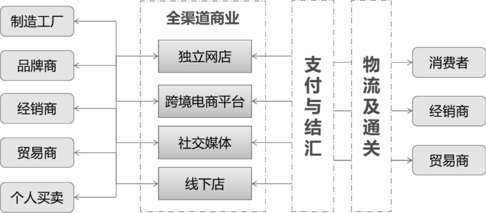
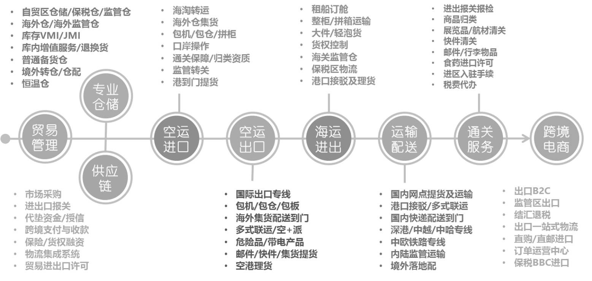
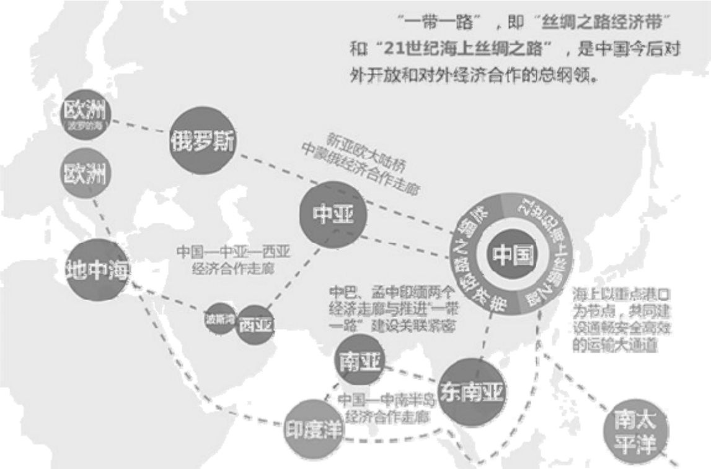

# 跨境电商与国际物流：机遇、模式及运作

## 孙韬 著

全书围绕“Shopping Globally, Shipping Locally（全球买卖，递送全球）”这个中心主题，介绍了“跨境贸易电子商务”即跨境电商的发展历程及火爆现状，对跨境电商的概念范畴及国家政策利好从不同视角进行了分析，并从跨境出口、跨境进口及供应链、海外仓、国际物流、跨境创新等不同章节介绍了当前行业的热点问题，解析了各种进出口市场机遇及业务模式，让读者较为全面和深入地了解外贸零售、海淘代购、跨境物流、跨境支付、通关税费及配套服务等领域的具体运作。尤为着重阐释了“国际物流”如何助力跨境电商的发展。

## 自序

跨境电商和国内电商在产品属性、供应链、支付、通关、物流等方面都有显著差异，尤其是跨境物流，交付难于交易，周期长、成本占比高、流程复杂，风吹草动都将直接影响电商运作。随着全球和区域自由贸易的深度推进，全球物流业的发展经历了深刻的变革并获得了越来越多的关注。物流像是电商的军备竞赛，“Fast Shipping”成为境外买家的最佳评价，电子商务不仅带动了快递业的爆发，还促进了传统物流向“可视、可控、可量化”的智能化提升，中国物流业将展现强劲的发展潜力。诸如，跨境试点、通关模式、外贸营销、进口供应链、跨境支付等话题深处行业潜水区，以及算得上年度热词的“海外仓”亦分别予以呈现。

跨境电商带来了更多的市场新机遇，得物流者得电商、得电商者得互联网。“隔行如隔山、望山跑死马”，在极具动态的新行业中没有太多历史规律可循，文中参考引用的内容，进一步了解则大有裨益。本书的主题正如其名，全球买卖、递送全球即未来之趋势，商品供给全球化、物流体验本地化。

## 前言

看久了国内互联网市场BAT三国酣战，淘系、京东各占两极，而跨境电商时局未定、风云再起，出口电商平台正从春秋五霸迈向战国群雄，进口纷争之乱象更像五代十国，异军突起的新晋领袖是闯王进京还是清兵入关仍待时日，兵马未动粮草先行，支付、供应链、营销、物流等隔岸观火大发战争财。全球电商，带头大哥**Amazon一骑绝尘、既卖商品又掌控供应链及物流**，Alibaba东方一霸何惧四方，楚汉相争指日重现，谁会一统江湖？跨境电商，可谓故事异彩纷呈。2016年热点中，跨境进口“四八新政”一夜惊魂、行业波澜跌宕，很多人感叹“猜中了开头却没猜中结尾”。这里要先扪心自问一下对贸易有多懂，跨境电商不是说要完全背离贸易的本质，当然仍要坚信经济学原理，只要国内需求还在，供给还在境外，生意就会有，跨境仍在。浴火重生，请继续站在这风口中。本书行文结构以贸易进出口为主要划分，但对于一些平台或区域的分析，关、检、税、汇等与跨境贸易密切的口岸运作，或多或少两者都谈及。**海外仓**本属国际物流的组成，由于比较热门、重要，所以单做介绍。

（1）出口。中国跨境电商起于跨境B2C出口，不避讳地说应源自**去eBay卖货**。本章围绕如何做进行展开，细数各路跨境电商平台、点评主流市场。早期跨境出口就像捡钱，如今FBA稳居头条，新进来的小卖家还想如前辈那样随便直邮几个小包赚美元愈发困难。本章还全面介绍了选品、支付结汇、退税、营销及物流线路等内容。

（2）进口。跨境的“火”烧起来是靠一阵鲁莽的进口“风”，政策红利、资本追捧、市场激进，以及买手代购、海淘转运、直购直邮、保税进口、试点口岸、供应链等，都成了各路“玩家”言之必提的内容。消费者切实获得了好处，但市场培育期一过，政策有点手起刀落，本书深度解读后自然豁然开朗。

（3）海外仓。出口贴近消费市场、进口贴近采购市场、运作贴近物流枢纽，进口备货仓或海淘转运集货仓相对简单，这里主要谈及海外仓在出口领域的作用。很多海外仓运营企业在这个领域摸爬滚打了好几年，并不为人们熟知。海外仓在重点国家的选址和布局大同小异，库内作业值得探讨，**应用技术缩减成本**是未来的重要课题。

（4）国际物流。跨境电商选题范围很大，单讲“国际物流”这个主题，主要是鉴于物流及通关问题已经成为跨境电商的命门，在过度竞争之下，物流成为真真切切的第三利润源。特此畅谈一下笔者从事的行业，尤其是快递市场及其国际化发展趋势。中国电子商务之所以引领世界，得益于能够向更多消费者提供更多商品及其物流体系。

（5）跨境创新。这是一个金戈铁马、豪杰辈出的年代，地球村电商、全球供应链，跨境电商行业的创业者星光灼灼、具有声名，跨境电商相关的上下游市场同样活跃，企业应该抓住这些契机，围绕新兴的跨境数字化消费，梳理思路，赢得先机，行动起来。

### 第1章 跨境行业综述

跨境电商作为一种被国家认可的贸易通道，跨境进口可以满足境内消费者全球化的需求，并合法地纳入监管与统计。目前，跨境电商占外贸进出口的比重大约是17%，其中又有90%是B2B模式，**跨境零售部分只占外贸进出口的3%左右**（张周平，中国电子商务研究中心，2015—2016年中国出口跨境电子商务发展报告，http://www.100ec.cn/ ，2016-8-10）。跨境电商的快速发展和“碎片化”特点，对人民币这种新兴的国际货币提供了一次良好的国际化机遇，但交易的虚拟化增加了获取税收证据的难度，国际避税问题突出，查验走私与侵权问题剧增，也是当前面临的一些新情况。

#### 1.1 跨境概念

跨境电商，即“跨境贸易电子商务”，国际上流行的说法叫Cross-border eCommerce，特指跨境网络零售，如外贸小额批发及2C类。所谓跨境，就是交易主体分属于不同“关境”，包括进出口，借助互联网达成交易、进行支付结算，并采用快件、包裹等方式通过国际物流将商品送达消费者手中的交易过程，是一种国际商业活动。从严格意义上说，跨境零售是贸易的组成。跨境消费者中也会含有一部分碎片化小额买卖的B类商家用户，现实中这种B类商家和C类个人消费者很难区分。通常，从海关角度来说，跨境电商等同于在网上进行小包的买卖，主要是针对消费者。**传统进出口B2B货物只能销售给进口商，需要签订传统的外贸购销合同，准备箱单、纸质发票、报关单等纸质单证，不属于跨境电商范畴**。跨境电商将传统贸易流程数字化、网络化、碎片化，购买特点以小批量、多批次、单笔交易金额小为主，包括直接交易和相关服务，即“产品+服务”，可按进出口方向、交易模式、平台运营方、服务类型等角度分类。新的全渠道（Omni-Channel）零售是指通过跨越实体和线上多购物渠道，随时随地始终连接，实现无缝的购物体验，**因为面临来自整合独立线上和实体店铺的政策风险和物流业挑战**，所以它一直被视为零售业最难以捉摸的“圣杯”。

跨境电商流程示意

##### 1.1.1　跨境电商行业范畴

电子商务概念的内涵与外延非常宽泛，跨境电商也类似，是一个空间很大但极度分散的行业，在国际贸易环节中只要涉及到电子商务应用都可以纳入这个范畴。在WTO框架下，纯粹电子交易适用于GATS服务贸易规则，而通过跨境运输运送至购买人所在地，则归入货物贸易范畴，属于关税及贸易GATT协定，因此跨境电商面临不少模糊的贸易监管。

广义的跨境电子商务

跨境贸易在线交易（一般口径）：跨境电商B2C（狭义，跨境贸易在线零售）、跨境电商B2B（线上撮合线下成交/线上成交/小额批发）   
跨境电商相关服务：供应链、物流、通关、支付、结汇、运营、推广、公共平台、法务等。

跨境电子商务将贸易活动重组为跨境一体的电子商务生态，是“通过互联网达成进出口的2B/2C信息交换、交易等应用，以及与这些应用关联的各类服务和环境”。跨境电商包括四个方面，一是**信息和交易**相关的各类2B/2C进出口应用；二是**平台**，主要是各类围绕应用的平台（电子商务平台、供需信息平台、交易平台、供应链平台、信用平台）；三是**基础服务**（物流、支付、贸易通关、检测验货等）和**衍生服务**（代运营、咨询培训、翻译、旺铺、法务等），服务参与者可以包含平台商，也可以包含服务提供商、参与者，还可以包含接入的监管机构及其相关企事业单位（监管便利化服务）；四是**环境**，主要涉及国家环境（文化、市场、法律差异）、技术环境（如移动互联网、云计算等）、贸易规则/监管/政策环境（关、检、税、进出口管制政策等）。

分析跨境电商的产业链，相关经营主体包括电商平台、境外买家、外贸卖家、生厂商/制造商、跨境支付、收汇结算、国际物流、运营服务等生态方，涉及的各类在线商业活动则包括货物的电子贸易、在线客户服务、数据信用、电子资金划拨、电子货运单证、物流跟踪等内容。跨境电商企业也有多种类型，如综合电商平台、B2B信息服务平台、品牌电商、直营B2C类、返利导购网站、供应链服务、微商买手等；第三方服务企业，包括IT、营销、代运营、店铺装修、人员培训、法律咨询等围绕跨境电商交易之外的一系列相关服务，这部分服务在跨境电商的在线服务市场中非常活跃；外贸综合服务商或跨境物流综合服务商，这又是一类包括物流、支付、融资、清关、保险等线下服务体系的贸易中间服务商。

##### 1.1.2　跨境电商发展历程

跨境电商本质能消除国际商品供给不对称，电商口碑化营销方式利于商家塑造品牌，提升商品国际竞争力。据预测，2020年全球跨境B2C电商交易额将达到9940亿美元，惠及全球9.43亿消费者，其中以中国为核心的亚太地区以53.6%的新增交易额贡献度位居首位，有望成为全球最大的跨境B2C消费市场（埃森哲、阿里研究院，全球跨境B2C电商市场展望：数字化消费重塑商业全球化，2015年6月）。从互联网商业模式角度来说，跨境电商共经历了几个发展阶段，实现从信息服务、在线交易、全产业链服务，到政策推动的产业转型，这些阶段不是断层的，而是持续交叉的。市场规模进一步扩大，产业链分工进一步细化并取得快速发展，显示出大型工厂上线、平台B类买家成规模、外贸服务商加入和移动用户量剧增四个特征，主要平台模式也由C2C、B2C向B2B、M2B模式转变，批发商买家的中大额交易成为平台主要订单。

**跨境电商发展历程**

2005年之前，萌芽期：   
各国都处于推动境内电商发展阶段，跨境电商配套服务不完善，消费者体验欠佳，外贸B2B是绝对主导。   
出口贸易形式，网上黄页展示的外贸信息服务，电商平台尚不涉及在线交易环节。   
进口海淘主要以留学生代购及边境口岸“蚂蚁搬家”方式。   
境配套服务，如订单、物流、清关、货代、支付等停留在传统外贸层面。   
敦煌网2004年成立，小额外贸B2B线上交易模式开始被行业认知。

2006~2012年，探索期：   
随着2006年eBay退出中国并展开全球外贸服务，大卖家兰亭、环球易购、有棵树、大龙网、米兰网、纵腾、炽昂等先后成立。   
2007年淘宝网“全球购”上线，2008年“毒奶粉”事件成为海淘代购及物流转运发展的导火索，2009年深港“一签多行”政策实施，加速代购及水货入境。   
2010年，阿里巴巴集团成立速卖通，拓展跨境B2C在线交易；进口直邮持续火爆，海关针对个人物品行邮税大幅调整。   
2012年年底，发改委和海关总署在郑州召开动员大会，开启跨境电商城市试点。

2013~2019年，发展期：   
海关通关服务试点开启，“沪杭甬郑渝+广深”，首批形成5+2格局，促进海淘阳光化，大批电商如考拉、蜜芽、聚美等涉足保税进口。   
2013年外贸B2C兰亭集势IPO纽交所成为跨境首股，同年Wish转型跨境电商平台，迅速成为业内一极。   
以2014年海关总署56/57号文为代表，之后两年间各级政府密集出台几十个跨境政策，涉及外贸、跨境支付、结汇退税、物流及海外仓等，国内物流企业纷纷在境外设点。   
资本热度不减，百事泰、傲基、赛维等十多家跨境电商在新三板挂牌。   
杭州跨境模式受推，2016年年初第二批12个跨境试点城市获批；4月针对跨境电商保税进口的新政实施，继续完善税收及监管手段。 

2020年以后，成熟期：   
跨境电商配套政策、电子化监管模式趋于稳定，跨境电商公共平台作用完善。   
全球邮政推进邮件电子化通关，2021年中欧世贸项目“欧盟海关代码”，便利小件包裹跨境物流。   
进口商品多渠道、多模式趋于均衡，消费者权益得到保障。   
各大跨境电商平台提供一站式外贸供应链服务。   
为全球更大范围提供多地区、多语种的外贸在线零售。

在萌芽期，全球跨境网购的需求较弱，消费习惯尚未形成，行业配套服务不完善，消费者体验差，行业发展较缓慢，包括到后来，淘宝网“全球购”等涉足跨境时期，进口仍一直不温不火，产品质量参差不齐。直至政策规范化、海淘阳光化才使得跨境进口电商发展迅速。在探索期，行业各方促进了成熟商业模式的出现，电商高效的信息传播和可视化的商品展示便于吸引海外客户，一大批外贸电商在此期间壮大。在发展期，在市场需求旺盛、政策支持的双重利好下，市场中主流厂商逐步确立并开始进行市场推广。国家发改委在2012年年末推出了“1137号文”，由海关总署主导，跨境电商通关服务试点拉开序幕。2014年是跨境电商的起航点，海关总署56/57号文确定了跨境电商专属的监管代码，以及对进口“三单对碰”的监管流程。随后，政府多次宣导和政策支持，各行各业对跨境电商领域的关注和投资热潮被唤醒。确切地说，行业各个环节的商业模式被认知，各类玩家纷纷入局，促成2015年网购保税模式爆发。国内外电商巨头、传统零售企业、非电商零售企业、外贸商及物流商等都切入了跨境电商行业。2016年进入政策调整期，一方面国务院决定放开跨境电商综合试验区，继续扩大试点；另一方面针对税收和监管，出台相应的跨境电商零售进口税及通关新政策。强化出口是国家层面的重要出发点，电商会自发地不断提升用户体验度，继而增强海外客户黏度。跨境电商再出发，形成外贸制高点。

##### 1.1.3　跨境电商运作模式

**特殊区域出口**，出口卖家采用境内关外的备货模式，先将货品整批运送到海关监管区，及时获得退税，接到订单后，再进行发运配送。如果将这个备货直接发至目的国的仓库，这就是海外仓。在前端的跨国B2B清关过程中，既可以是贸易形势，也可以是跨境新监管通道。**线上化B2B出口**，国内外两端都是商家，大部分交易仍在线下完成、自行交付，相对于消费，这种商家间的交付环节更复杂、链条更长，双方签约后，涉及银行、税务、关务、商检等环节服务，要自行安排结算及物流，通常不算做跨境电商。进口方面，各试点城市充分发挥海关特殊监管区域的功能和优势，拓展**网购保税进口**和**直购进口**两种新监管通道。**保税备货**是海外商家将货物运送到国内试点城市的保税区仓库，然后通过进口平台实现向消费者的交易，再从保税区出关寄送。**直购直邮**，则是货物直接从境外以包裹形式通关入境，但这不同于过去的邮件或快件，监管条件完全不同。**海淘转运，包括代购**，通过个人行邮或携带的方式发到国内消费者手中，都可以看做是一种C2C模式，是传统的个人物流“擦边球”通关，无法逾越规模化困境。在跨境进口发展早期具有很强的灵活性，不同监管渠道交叉运作有较多灰色地带，如今模式日趋规范。

|运作视角|出口|进口|
|:--:|:--:|:--:|
|供应分销|B2B批发贸易|B2B一般贸易|
||C2C小卖家直销|B2C电商直销|
||B2C商家直销|C2C海淘代购|
||M2C工厂直销|B2B2C电商保税|
|||境外供应链直采|
|物流通关|邮政直邮|邮政直邮|
||商业快递|商业快递|
||物流专线|集货转运|
||海外仓|跨境直购进口|
||空海运+派送|跨境保税进口|
||监管区集货|贸易完税进口|
|运营服务|独立B2C网站|自营线上零售|
||跨境平台开店|第三方平台|
||分销代发货|导购返利|
||外贸批发|O2O体验店|
|||微商/分销/代发|

贝索斯的飞轮理论中再三强调追求用户体验，但是追求极致用户体验及这三个正反馈模式飞轮的本质核心又是什么？是GMV交易额。使用低价运营策略，大幅拉高业务增长，极致的物流体验增加用户流量，客户量引来卖家入驻，从而提升广告收入及服务收费，庞大的收入保障了其持续的低价销售和品类扩张。阿里不卖实物，卖的是流量，殊途同归。对跨境电商全渠道商业零售转型的几点启示是：关注新世代消费群、占领品类和场景制高点、多渠道融合拓展、客户获取与互动、全渠道品类规划、新产品快速引进、供应商合作管理、供应链精益运营、物流及配送服务等。

##### 1.1.4　国际物流概述

跨境物流费用占了跨境电商总成本的20%～30%。小订单、多频次订单日渐增多，根据万国邮联统计，全球跨境包裹数量从2006年以来，处于高速增长趋势，占全球总包裹数量的比例也在不断增加。

在2015年，我国跨境电商出口轻小件包裹约10亿件，如果粗算物流环节成本占比为25%，那么2015年这部分跨境B2C物流的市场规模已达1196亿，而且未来几年将保持35%以上年复合增速。

跨境物流递送涉及环节较多，包括国内外的仓储、运输、配送及海关等，以及整合订单管理、库存管理、配送管理及运输管理。因此，跨境物流全程服务可分为三部分，一是支持B2B较大额业务为主的海运拼箱及空运等业务；二是支持跨境小包快递等业务；三是外贸服务，围绕贸易过程中的验厂、检测验货、跟单等环节，以及一般的通关、货代业务等展开。目前，这部分服务主要是线下贸易服务商服务跨境电商买、卖家，有些还进入了线上服务市场。

随着“电商+贸易”的业务模式变化，尤其是与外贸综合服务及金融增值服务结合后，跨境物流涵盖的范围被无限放大，物流企业通常需要具备几个主要能力，一是国际运输，如货代、仓位、专线、保险等，以对货源和服务质量进行把控；二是清关、资质及口岸对接；三是技术平台，如电商集成、状态可视、过程可控；四是境外操作能力，如海外仓、传统零售的跨境货代、海外采购及供应链；五是跨境保税操作能力，如保税区入驻、保税仓运营；六是国内派送及目的国落地配合合作，提供低价、高效与增值服务。

目前，满足跨境电商的国际物流模式有：**邮政包裹、商业快递、专线物流、保税仓和海外仓**等模式。物流模式的多样性使得商家在选择时可以着重考虑产品特点、物流成本和时效稳定性。跨境电商商品种类繁多、小批量、多频次，体积重量差别很大，不同品类所需运输和仓储解决方案各异，跨境物流要实现一站式、门到门的服务，尤其需要做到国际段和国内段物流的有效衔接。跨境物流的发展仍滞后于电商市场的要求，货物积压、延误或丢失破损等问题突出，海量分散的订单下仓储体系不完善，面对客户多样化和复杂化的需求不能高效解决。还有一些国家当地的物流系统不是很发达，缺少国外的物流分配中心，导致消费者体验较差，配送时间长，包裹无法全程跟踪，退换货不方便，出现清关障碍等问题。

#### 1.2　宏观环境与政策

中国互联网经济占GDP的比重已超过欧美，但中国小微企业对GDP的贡献率为35%～40%，它们也是就业和创新的重要来源，而在德国，小微企业的GDP贡献率达52%，墨西哥为54%，法国为58%，意大利高达67%。查验侵权行为的难度加大，通过网络跨地域、跨国界销售侵犯知识产权物品的违法行为目前不断出现，对外贸易核销监管难、外汇收支性质归属难。在网络直销模式下，个人涉外贸易经营无登记、无备案、无报关、无核销，直接通过个人外币卡账户结算，游离于跨境贸易物流和资金流监管体系之外。在新形势下，受全球范围内经济持续疲软、外需不振等因素影响，叠加国内要素成本上升、人民币升值及产品结构低端化等因素影响，我国传统的外贸优势逐步丧失。在外贸形势不断恶化的背景下，政策部门接连部署跨境电商出口业务规范，试图从政策面为出口业务注入源头活水，促进外贸转型升级。

##### 1.2.1　经济贸易环境

全球范围的经济持续低迷，欧、美、日增长乏力；依赖资源出口型国家，如委内瑞拉、俄罗斯、巴西等甚至陷入衰退；饱受战乱的第三世界国家，经济一直萎缩。在危机之下外贸受阻，我国中小企业纷纷寻找新的产品推广销售途径和交易渠道，电子商务以其低成本、高效率的特点进行网上产品推广销售和撮合交易，成为中小企业转型的首选。据数据统计，大宗商品价格走低、外需不振，2015年我国进出口“双降”趋势进一步延续，而基于跨境电子商务零售的外贸规模却不断扩大，**2015年我国进口跨境电商行业交易规模预计约7600亿元，同比增长43%，出口零售交易额在外贸电商中占比由2010年的2%上升至8%。五年来的交易额年均增速CAGR为35%，2016年交易规模有望超1万亿元，同期传统进出口贸易总额年均增速跌入冰点，跨境电商将成为我国外贸的新增长点**。

当前，我国外贸发展存在的困难依然持续。据海关统计，2015年，我国货物贸易进出口总值为24.59万亿元人民币，比2014年下降7%，其中，出口下降1.8%，进口下降13.2%。纺织品、服装、箱包、鞋类、玩具、家具、塑料制品等7大类劳动密集型产品出口总值2.93万亿元，下降1.7%，占出口总值的20.7%。例如，与欧盟、日本双边贸易分别下降7.2%和9.9%。根据商务部数据，2014年我国跨境电商企业已经超过了20万家，平台企业超过5000家。2016年外贸又比2015年整体下降0.9%，出口下降2%，发达市场的贸易保护有抬头趋势，加之汇率失衡，未来形势仍然严峻，消费需求驱动下进口略增。

过去五年，我国进出口总值增幅甚微，但跨境电商的交易额却增长了200%，可谓逆势增长。近年来，中国互联网经济在GDP中占比持续攀升，2014年达到7%，超过美国，成为全球第一大电子商务市场；2018年中国电商市场规模有望占据全球一半的电商市场。上述因素，加上中国作为第一大贸易国及快速增长的中产阶级和市场消费能力，都将为中国保持在全球跨境电商发展上的领先优势奠定坚实基础。据统计，2005—2010年间私人消费对GDP增长贡献率为32%，而这个数字在2010—2015年间攀升至41%，成为拉动中国经济发展的重要力量。中国消费市场的“新三驾马车”分别是：上层中产及富裕阶层的消费者、新世代消费者和网络购物。当今世界贸易环境正发生复杂的变化，世界经济缓慢复苏、发展分化，贸易保护、国际贸易格局和多边贸易规则酝酿深刻调整。近来，欧美谋划制定新的国际贸易规则，重握国际贸易的主导权，通过TPP和TTIP助推经济复苏，以分享亚太地区新兴经济体的增长红利，增加对这个地区的出口导向，重塑国际贸易格局。因此，要积极把握宏观战略导向，**跨境电商是大势所趋，并创造了国际物流的巨大发展机遇。人民币在国内越来越不值钱，在国外反而越来越值钱，这对于跨境电商来说是双重绞杀**。

##### 1.2.2　跨境电商的瓶颈

除了外部因素，跨境电商起步这些年也遇到了一些“成长的烦恼”，简单来说就是进出两旺、内外“双拥”：需求拥戴、通道拥挤。**主要是结汇退税、海关监管、查验征税等政策导向，以及商品侵权、交易纠纷、国际物流与通关等方面的问题**。一方面，主要靠商业力量去布局和推进，例如支付收款、侵权纠纷、海外仓、跨境配送等，这些影响市场发展的“运作瓶颈”，只要行业保持稳步增长，越来越多的资本和参与者加入，资源投入、模式创新、跨国合作等方式都会从不同角度逐步改善每个环节。另一方面，更大的不确定性则依赖于政府和法规政策。解决小包货物和零散订单的监管是一个全球性难题，观察旺季各国海关及邮政的积压就知道了。**传统少量的2C类到个人的包裹或快件，各国进出监管大同小异，电子化程度不高，几乎很少针对自然人的报关和贸易监管，对大宗贸易也没有什么影响，国际贸易历经几百年规则演变也已成熟，一切相安无事**。但跨境电商爆发后，全球小件包裹一路飙升，可谓量变引起质变，B2B贸易曾扮演的全球供应链中间角色被B2C侵蚀，个人物品和贸易货物的差异在缩小甚至难以辨别，如果简单地让电子商务绕过传统贸易规则，必然引发外汇、税收、许可、知识产权等一系列问题。当政府试图新旧手段并用或是去探索新政时，行业发展过速，“**政策跟不上市场、市场跟不上需求**”，消费者一端已怨声连连。**从通关方式看，一般贸易，由于海关采取信用分级、分类通关、无纸化通关等便利措施，各项政策完善，通关效率比较高；而跨境电商B2C模式成交的商品以快件或邮件方式通关，按现行针对个人物品的非贸易性质管理，实际已经突破了传统非贸物品的范畴**。说到底，**跨境电商还没有绕开贸易壁垒**，如果世界真的“天下大同”，那么做跨境电商岂不是跟国内做电商一样容易了。

出口方面，**B2C直邮销往国外个人的出口商品，电商成交和结汇、报关、商检、退税等环节无法连通，拖累效率**。例如，由于产品订单零星，单笔交易金额较小，且通过跨国快递或航空邮件递送，达不到海关报关价值，或很难拿到海关正式报关单，所以出口时大多不报关，海关仅对其进行上机检验和随机抽检，无法按照经常项目联网核查，且交易物品从全国各地海关属地出境，无法实现单货相符。而没有海关的出关数据记录，外汇管理部门就无法验证货物真实出口，也就无法实现外贸核销和结汇，政府少了一块贸易统计，而卖家也就无法按常规途径结汇退税。到了境外，各国海关对小额贸易监管也很复杂和困难，小件征税、侵权抽检、走私查验等工作量加重，通关效率低。

进口方面，国内居民对于跨境网购涉及的热点商品的需求强烈，而**B2B和B2C适用于不同税率，但终端的小商户和个人难以区分**，在不同交易模式下，国内市场“境外化”，传统监管方式难以满足税费认定，部分电商存在逃漏税问题。脱离贸易税，大规模行邮进口影响贸易公平，冲击国内市场，政府在税收收入方面获利甚少。如海外购中，一些企业或个人伪报物品品名、夹藏、伪造购物小票，利用晚间进行通关，试图逃避关税，还有的利用分散到各地邮寄的方法，防止批量邮寄产生联号而招致海关怀疑以此避税。同样，跨境贸易的双方分属两国，小包裹给商检工作也带来了极大挑战，检验检疫机构难以全面获取商品和交易等数据，监管查验不足便会直接到达消费者手中，查验侵权行为的难度加大，用户退换货权益难以保证。这些都还需要管理部门权衡考虑，研究建立配套制度和高效手段。

此外，**由于跨国交易没有地域限制，出现售后服务质量差、交易欺诈和网络隐私权等问题，有些消费者很难进行维权**，卖家也可能因为买家的收货欺诈而遭受退款或重发的损失。这涉及了跨境电商的法律管辖问题，面对不同国家的客户、商家和平台，网购纠纷的责任界定对于卖家或买家权益保护方面还有争议。这些年互联网创业最流行的说法是“哪里有问题、哪里就有机会”，监管的模糊阶段，正是市场野蛮生长的初级阶段，政策时不时来点利好之风。随着政策日益明朗、平台扮演强势规则管理者、物流业提供全程追溯等措施的到位，上述问题确实在渐渐消融。

##### 1.2.3　政策红利

国内电商的蓬勃发展，离不开相当一段时间的宽松监管，而跨境电商对政策依赖度更高，尤其是进口，可以说是政府主动“搭台”的助推。针对制约跨境电商发展的问题，自2013年起，各级政府下发的促进外贸发展的相关文件中，均涉及跨境电商便利化措施，并作为一个常态事项，列入国务院对国际贸易的例行指导文件中。重磅政策文件接连出台，也刺激了配套措施的快速落地。在市场自由化下，基于“胡萝卜+大棒”的政策安排可以成为政府监管制度创新的权衡方案，在有限垄断与竞争、激励与税收、权威与市场中实现动态平衡有序。各级政府迅速出台相关产业扶持政策，包括建立适应电子商务进出口的新型海关监管、检验监管模式，实施相适应的税收政策。2015年以来，政策导向开始有所侧重，如B2B模式成主流、降低出口查验率、推动扶持企业走出去建“海外仓”。李克强总理要求“部署促进跨境电子商务健康快速发展，推动开放型经济发展升级”：一是优化通关流程，对跨境电商出口商品简化归类，实施经营主体和商品备案管理，对进出口商品采取集中申报、查验、放行和24小时收单等便利措施；二是落实跨境电商零售出口货物退免税政策，鼓励开展跨境电子支付，推进跨境外汇支付试点，支持境内银行卡清算机构拓展境外业务；三是鼓励外贸综合服务企业为跨境电商提供通关、仓储、融资等服务，引导企业规范经营；四是鼓励跨境电子商务零售出口企业通过海外仓、体验店等拓展营销渠道，培育自有品牌和自建平台，促进外贸提速放量增效。

|发布机构和日期|政策文件|核心内容|
|:--|:--|:--|
|商务部2011.10|《“十二五”电子商务发展指导意见》|支持跨境电子商务平台建设，鼓励中小企业应用跨境电子商务平台拓展海外市场，减少渠道环节，树立中国品牌形象|
|商务部2012.03|《关于利用电子商务平台开展对外贸易的若干意见》|鼓励电子商务平台通过自建或合作方式，首次提出建设“单一电子窗口”平台，整合配套服务，实现“一站式”贸易|
|国务院2013.07|《关于促进进出口稳定增长调结构的若干意见》|研究以跨境电商方式出口（B2C、B2B等）所遇到的海关监管、退税、检验、外汇收支、统计等问题，完善相关政策、抓紧试点。|
|国务院2013.08|《关于实施支持跨境电子商务零售出口有关政策的意见》|建立新型海关、检验监管模式并进行专项统计，支付、结汇、退税及信用体系建设等方面提供扶持，并在5个试点城市实行。|
|质检总局2013.11|《关于支持跨境电子商务零售出口指导意见》|创新电子商务出口产品监管模式，实施集中申报、集中查验、集中放行的便利措施。|
|财政、国税2014.01|《关于跨境电子商务零售出口税收政策的通知》|电商出口退（免）税至少满足：企业有税务登记、取得出口货物报关单、合法有效的进货凭证；第三方平台不适用，突破不大。|
|国税总局2014.02|《关于外贸综合服务企业出口货物退（免）税有关问题的公告》|明确外贸综合服务企业以自营方式出口国内生产企业与境外单位或个人签约的出口货物，可按自营出口的规定申报退（免）税。|
|海关总署2014.03|《关于跨境贸易电子商务服务试点网购保税进口模式有关问题的通知》|明确保税进口的海关操作细节，负面清单、企业备案、行邮税、购买限额限量及海关统计等内容，具有很强的指导性与实操性。|
|国务院2014.05|《关于支持外贸稳定增长的若干意见》|提出进一步加强进口，鼓励企业在海外设立批发展示中心、商品市场、专卖店、海外仓等各类国际营销网络。|
|海关总署2014.07|《海关总署公告56号（关于跨境贸易电子商务进出境货物、物品有关监管事宜的公告）》《海关总署公告57号（关于增列海关监管方式代码的公告）》|海关增列监管代码“9610，跨境贸易电子商务”及“1210，保税跨境贸易电子商务”：确切地说，“9610集货模式”将入境包裹纳入监管，从政策层面明确了对跨境电商的监管框架：“1210备货模式”规定了货物和物品的监管条件、监管方法，严格区别了两者之间的进出境的报关待遇，也是对跨境电商进出口试点的总结。|
|外汇管理局2015.01|《支付机构跨境电子商务外汇支付业务试点指导意见》|提出“开展支付机构跨境外汇支付业务试点”，明确跨境外汇支付管理办法，网购单笔交易限额由1万美元提高至5万美元。|
|国务院2015.07|《关于加快培育外贸竞争新优势的若干意见》|培育一批跨境电子商务平台和外贸综合服务企业，鼓励“海外仓”等模式，融入境外零售体系，加快培育外贸品牌等。|
|国务院2015.04|《关于改进口岸工作支持外贸发展的若干意见》|按照公平竞争原则开展并扩大跨境电商进口业务；降低进口产品关税试点、税制改革和恢复增设口岸免税店的相关政策。|
|商务部2015.05|《“互联网+流通”行动计划》|创建60个国家级电子商务示范基地，推动建设100个电子商务海外仓，促进跨境电商发展，加快电商海外营销渠道建设。|
|质检总局2015.05|《关于进一步发挥检验检疫职能作用促进跨境电商发展的意见》|构建跨境电子商务风险监控体系、质量追溯系统，对跨境电子商务商品实行全申报管理，出境按“集中申报、集中办理”放行手续，入境实行“集中申报、检查放行”等。|
|海关总署2015.05|《关于调整跨境贸易电子商务监管海关作业时间和通关时限要求有关事宜的通知》|对跨境电商实行365天24小时保持服务在线，为跨境电商办结海关手续，并在周六日仍照常审核发挥等。|
|国务院2015.06|《关于促进跨境电子商务健康快速发展的指导意见》|协同推进通关、商检、结汇、退税等环节“单一窗口”综合服务体系建设，优化海关及商检监管政策措施，规范进出口税收、完善支付结算、提供财政金融支持、扩大跨境综合试点。|
|财关税2016.04|《关于跨境电子商务零售进口税收政策的通知》《跨境电子商务零售进口商品清单》|跨境电子商务零售进口商品按照货物征收关税和进口环节增值税、消费税，单次交易限值两千元，个人年度交易限值两万元。进口商品必须符合正面清单并提供“通关单”，取消原负面清单模式。|
|海关总署2016.12|《海关总署公告2016第75号（关于增列海关监管当时代码的公告）》|增列海关监管码“1239”，简称“保税电商A”，适用于非试点城市，但需通关单及遵循正面清单，意味着跨境进口保税开始普及。|

自改革开放开始，试验试点已成为我国政策务实的重要实践方法。2009年以来，国务院及多部委联合分批确定了北、上、广、深、杭等53个城市为“国家电子商务示范城市”，2012年年底又确定上海、重庆、宁波、郑州、杭州5个城市开展跨境电子商务试点，后逐步推广至深圳等十余个城市。2015年3月，杭州跨境电商综合试验区获批，标志着跨境电商政策红利释放和运作模式的成熟，继而2016年国务院又批复天津等12个城市综合试验区。2013—2016年政策红利“窗口期”，政府层面一直在释放跨境贸易利好，针对以快件或邮件方式通关的跨境贸易电子商务存在的问题，由海关总署组织服务试点，至2015年年底验收及2016年4月新政推出，总结出几个方面创新及经验。

一是探索适应跨境电商发展的管理制度，建立进口阳光跨境网购渠道，从产业中长期布局，清理“灰色”入境，平衡进口税，产品追溯与监管规范，消费者权益保障，引导境外消费回流，倒逼国内产业发展升级，给予跨境电商税收上的优惠政策，通过企业和商品备案认证企业资质，对商品范围进行限定；二是通关模式创新，通过三单自动比对，实现分类通关、快速验放，降低海关通关压力成本，广州率先推出了“清单核放、汇总申报”的通关政策；三是技术手段创新，依托电子口岸协调优势，实现与电商、支付、物流等企业的业务协同及数据共享，通过多方系统对接，实现信息及时共享，通过无纸化申报和随附单据电子化，对交易、支付、物流和申报数据的交叉核对，提升监管效率和严密性。

产业政策往往都存在自上而下又自下而上反复修正的过程，不同时期的政策有明显的层级性。通常是某个市场先于政策，表现出独特的成长前景，政府希望培育这样的产业机遇。例如跨境，国务院确定总体方向，商务部和发改委等做计划指引，财、税、汇及海关总署等部委做顶层设计，各省商务厅、经贸委及属地海关等推进模式落地，实际执行过程要接触到城市级的商贸主管部门、口岸或监管区的管委会、区内海关及商检、保税区经营者等。因此，产业早期方向性的政策，往往会被解读成千人千面，操作层面不甚规范统一。如“外贸国六条”曾明确积极扩大商品进口，增加进口贴息资金规模，但在市场草莽成长和“浑水摸鱼”一段时间后，政府势必要再出新规以“校正”。市场赖以运作的规则基础，一旦随政策发生变化，连锁反应将远超预期。显然，不仅跨境电商，很多新兴行业都有这样的经历。经验证明，在市场经济及全球化趋势下，国家层面制定具有可持续的、制度性的产业政策，要好过短期倾向性扶持，而地方政府抛出的实惠，对于招商引资而言效果却立等可见。目前，政策的操作层面还有要细化的，出口无票免征还未大范围试行，退税门槛高，出口后免于征税，国税和外管有待突破，出口报关的商品编码没有简化归类、工作量大；各试点城市监管不统一，不仅造成“窗口”重复建设，而且增加企业对接成本；快件、邮件方式通关的跨境电商，还未很好地纳入贸易统计；跨境进口的达摩克利斯之剑“正面清单”仍悬而未决。

##### 1.2.4　跨境电商“一带一路”

回到2013年跨境电商“元年”，适逢习总书记提出“一带一路”即“丝绸之路经济带”和“21世纪海上丝绸之路”的远瞻构想，市场发展与国家战略契合一致，通过双多边机制、区域合作平台探索国际合作及全球治理新模式。2015年国务院正式发布“一带一路”具体愿景与行动，强调消除贸易壁垒，大力发展电商平台。共建“一带一路”旨在促进经济要素有序自由流动、资源高效配置和市场深度融合，共同打造开放、包容、均衡、普惠的区域经济合作架构，维护全球自由贸易体系和开放型世界经济，缓冲TPP及TTIP带来的贸易壁垒风险，推动区域中各国的自贸协定谈判，有利于我国建设国际经济、金融、贸易、航运中心，掌控国际贸易主导权、定价权和资源配置权。“一带一路”主要包括新亚欧陆桥经济带、中蒙俄经济带、中国—南亚—西亚经济带、海上丝绸之路经济带，沿线总人口约44亿，经济总量约21万亿美元，分别约占全球的63%和29%。从国外需求看，相关国家和我国经济互补性强，各沿线发展呈现较大的差异，洲际铁路运输线建成，运输时间和成本大降，有利于突破跨境电商发展的物流瓶颈。

从产业发展看，跨境电商涵盖营销、支付、物流和金融服务的完整产业链，把投资和贸易有机结合起来，以投资带动贸易发展，积极同沿线国家和地区共同商建自贸区，加强信息互换、监管互认、执法互助的海关合作，降低非关税壁垒，共同提高技术性贸易措施透明度，提高贸易自由化和便利化水平。

###### 1.北线，中国（东三省）—蒙古国—俄罗斯—北欧（波罗的海沿岸）

蒙古国人口约300万，人口少、电商体量小，网民约占总人口七成，年轻人是网购主要群体，性价比高的日用品是网购的重点商品。蒙古国物流配送体系尚可，其自2011年起实行户户通邮政，乌兰巴托等市内递送服务开始发展，基本能够满足网购配送需求，目前“中俄蒙跨境经济合作区”三方已签约。俄罗斯是跨境必争之地，规模可观、增速很快，我国网店在俄罗斯跨境电商中的份额超过2/3，占据主导，后文有详述。在北欧，电商在瑞典、芬兰、挪威、丹麦四国稳步增长，近年保持两位数增长，例如，跨境电商占瑞典网购额的三成，**速卖通曾称，其在瑞典的在线购物应用中已经排到了第一**。

###### 2.中线，中国—中亚—西亚及中东—中欧—西欧

中亚五个“斯坦”国，发展相对落后，生活所需品严重依赖进口，网购算是刚刚萌芽，由于信息不透明和贸易水平落后，市场上存在严重的价差，电子商务的发展和渗透可以有效地解决这个问题。网络能够触及到传统进口市场无法满足的人群，包括女性（穆斯林禁忌）、小企业和乡村。据悉，哈萨克斯坦的B2C网站chocolife.me和吉尔吉斯斯坦B2B网站prodsklad.kg比较活跃，但还没有像样的纯电商网店。由于信用卡使用限制，网络支付存在很大风险，货到付款是目前主要的支付方式。但借助移动互联和对外开放政策，跨境电商必将有重大改变。

西亚及中东，跨境电商正在爆发。中东电商市场从2011年的70亿美元到2015年突破150亿美元，年均增幅近20%。中东地区各国电商渗透率较高，阿联酋为46%，沙特为25%，科威特为35%，阿联酋是该地区最大的B2C电商市场。物流主要是汽运，支付约八成是货到付款。而以土耳其为首的西亚国家在电子商务方面的发展也值得关注，据悉土耳其7700万的人口中，网民比重超一半。

中欧包括德国、波兰、捷克及瑞士等8个国家，**德国是龙头，也是欧洲电商市场增长的强大引擎，目前电商行业规模在500亿欧元**。西欧，做跨境电商绝不可错过**英国**，2016年网络零售占英国总零售额的比例将从2010年的13.5%上升至23%，总值超过2000亿欧元。**法国**的电商发展也不逊色，势头要赶超德国。

###### 3.南线，中国—东南亚—南亚—东非—南欧（地中海沿岸）

东南亚是全球B2C电商发展第二快的市场，**印尼、菲律宾、新加坡、马来西亚**等国家电商发展势头强劲，紧随中美脚步，这里将迎来电子商务的黄金时代。目前，这里网购仅占全部零售的2%，阿里、京东等中国电商巨头也潜入了东南亚，**印尼电商网站林立，竞争也愈发激烈**。物流体系相对健全，邮政和快递公司提供到门的递送，马来西亚、新加坡及越南等国的邮政小包在国际上还名噪一时。南亚，就看印度。纵观“金砖四国”，印度网民数仅次于中国，随着无线网络的接入及智能手机的普及，印度电商市场到2025年可以达到2220亿美元的规模。各大电商抢占市场，投资、融资、并购、扩大规模的步伐，**并不是因为印度的电商发展水平很高，而是因为其具有发展潜力**。

非洲，由于线下零售商店非常分散，没有大型商场，且产成品的匮乏，目前正处于一个经济高速发展的阶段，2015年17个非洲国家GDP增长5%以上。到2020年，52%以上的非洲人将有自由购买的能力，而这些群体会成为国际商品的主力消费群体，这是一个年轻的电商市场。2016年非洲移动用户数将突破10亿大关，智能手机和新一代网络的普及，将驱动非洲移动电商的快速发展。其中，很多中资外贸企业在**肯尼亚**。

南欧，大多数国家为发达国家，对3C、服装、家居及户外用品的需求量较大。**意大利**拥有4000多万网民，电商规模约为300亿欧元，增长率在10%左右，网购很普遍。而在**西班牙**，互联网及智能手机普及率达到70%，网络消费者超过1500万，电商市场的年增长率达20%，超过50%的网购消费者进行跨境消费，占商务交易总额的44.2%。**西语系市场**不容小觑，我国很多外贸电商都专门针对这个市场。

跨境电商成为新时期我国深化国内改革和对外开放的新窗口，通过打造一条“网上丝绸之路”，促进我国与“一带一路”国家的贸易往来和中小企业发展，增进各国企业和人民之间的互信合作和共同发展。而国家层面的协调，通过与相关国家推进跨境电子商务规则、条约的研究和制定工作，包括跨境电商通关服务相关的配套管理制度和标准规范、邮件快件通关商检的监管模式、产品质量的安全监管和溯源机制等，健全跨境电商国际合作机制，进一步促进跨境电商的国际拓展。在各种双边、多边谈判中，也考虑了我国跨境电商发展的实际问题，帮助国内企业处理跨境电商贸易纠纷。

##### 1.2.5　互联网+外贸

“大众创业、万众创新”与“互联网+”行动计划在全国遍地开花，电子商务已不仅是虚拟经济，更是数字化的实体经济。百花齐放的互联网创业群体，“中国梦”迎来“众创、众享、众智”的时代。跨境电商是“互联网+外贸”的具体创新形式，为各种创新产品和服务创造了平台，提高了中小企业出口能力，降低了行业进入门槛，使得他们成为“小微跨国企业”；让我国消费者轻松、便捷地获得多样化的世界各地商品，满足群众对高质量消费品的诉求，也激活了一批最具创新精神的企业的成长，并帮助市场机制和有效竞争的形成。政府之所以选择跨境电商作为外贸转型升级的突破口，主要是出于贸易模式、技术提升及产品特征等方面的综合考量。跨境电商的发展有利于优化外贸产业链，帮助传统外贸企业转型升级，帮助创业创新和中小微企业快速进入外贸市场，捕捉市场新变化，打造更多国际品牌。

根据世贸组织的报告，国际贸易的基础就是规则，是建立信任的保障。跨境电商，让中国更好地参与到国际经贸治理中，参与到更多的数字商务市场中。过去，中国在整个经济贸易活动中经常陷入被动的局面，不能在复杂的国际经贸中掌握主动。信息经济下的“制造大国”更加国际化，开放互联的环境有利于用更低的成本覆盖更多的目标客户，让中国制造直接面向更充分的市场化竞争。另外，跨境电商为小企业和消费者迎来“普惠贸易”时代。互联网的蓬勃发展带来的商业模式、产品及市场结构的变化，使得国际贸易出现了新机遇和转型。消费者、企业和更多在传统贸易中的弱势群体都可以参与到国际贸易中来，获得更优质的资源、服务和多种多样的渠道，国际市场信息更加透明，贸易流程也更加方便。“普惠贸易”又称包容性贸易，是指各个阶层的贸易主体，尤其是贸易弱势群体能够参与到贸易中来的服务，其核心是有效、全方位地为社会所有阶层和群体提供贸易服务。我国正因为具有互联网技术和制造业基地的优势，才抢得先机与美国一道成为全球跨境电商中心。

跨境电商实现了小订单与小需求的对接，符合消费模式转换的新特点，满足了多元化需求。中国消费升级和高性价比制造业输出，“全球采购、全球销售、全球消费”！学者看到议题，创业者看到商机，“互联网+外贸”使我国对外贸易及进出口相关产业快速创新融合，跨境支付、外贸服务、物流网络等创业机遇成为对外贸易及口岸经济增长的新动力。

#### 1.3　趋势与探索

跨境电商具有开放、高效、便利、进入门槛低等优势，它借助互联网技术实现商品和服务的跨境交易，冲破了各国进口许可的障碍，使国际贸易走向无国界贸易。中国跨境电商增长的动力将保持强劲，跨境出口是贸易的扁平化，处于全球价值链下游的OEM工厂和处于贸易弱势的小微企业聚集起来，拓宽了进入国际市场的路径，围绕品牌化、本地化、供应链等趋势，加快全球运营进程；当地方试点政策及口岸流程趋于统一完善，进出口跨境电商通道将更为顺畅，带动产业和就业发展，满足居民需求。

跨境电商发展的五大推动力：   
1.消费升级。网购用户持续高增；进口商品质量和价差优势；国内中产阶级消费需求。   
2.政策支持。跨境电商全面试点行业监管日趋成熟；政府拉动跨境电商；风险资本和创业氛围。   
3.产业基础。外贸中小企业500万家，占贸易总额60%；世界的制造业基地；通关及国际物流条件改善。   
4.技术进步。互联网及移动技术带动；电子商务领域创新突破；新奇特产品开发设计；C2B/C2M需求拉动柔性生产。   
5.信用保障。电商平台发挥聚合效应；跨境支付体系日益成熟；在线交易衍生更多金融服务。   

##### 1.消费全球化

经济学里强调需求决定市场，跨境电商的产生就是跟全球大众的需求有关，网购已经成为全球性的消费习惯。我国传统中低端消费品制造能力非常大，供给严重过剩，但同类高品质消费品却供给不足，跨境电商为这部分需求涌向海外提供了渠道。我国外贸政策一直是“奖出限入”，多关注出口，出口可以带动投资、就业、拉动GDP。在消费带动的经济增长新结构中，进口市场将不被忽略，以进带出，通过大量引进高端产品，来倒逼中国制造产业升级。我国中产阶级的人数在未来20年将从2.3亿人增加到6.3亿人，在历史上出现一个庞大的消费者人群，他们愿意购买物美且价格适中的商品，青睐国际品牌的产品价值，出于对产品质量安全性的担忧避开选择本土品牌。

电子商务实现“外需+WTO”及“内需+互联网”

需求驱动市场，传统外贸业态下滑。订单碎片化、去渠道化、消费者对产品种类的需求，以及随着互联网的发展，国与国之间的商品价格进一步透明。通过跨境网购，消费者发现在国外平台购买的商品即使加上运费和关税也比海外品牌在国内直销的价格便宜，平台售卖的商品种类齐全，商品品质普遍优良。互联网的应用及其交易的自动化可以使企业用更低的成本满足更多元小众市场和定制产品的需求。例如，**亚马逊正在全世界范围内进行翻译工作**，这意味着也许再过一段时间，当消费者进入亚马逊网站，就可以通过普通的搜索界面看到美国、日本、韩国亚马逊的价格。那么，全球品牌的价格策略就会被这样一个翻译工作全盘打破，国与国之间的汇率汇差会在一个互联网页面上全盘衡量比较，消费者能够在全世界范围内用同一种语言去比较商品价格。简单的一个翻译工作，未来可能给行业带来的革命是致命性的。

##### 2.产业升级转型

在十多年的发展历程中，网商从整个社会边缘逐渐迈向主流，网商的主体逐渐转变为主流行业的主流厂商，网商创造财富的能力不断得到增强并通过各种渠道为大众所认可，网上经商的企业和个人取得了不平凡的业绩。当汇率、劳动力、环境优势都不再具备时，中国外贸过去低质量、低价格的道路走不下去了，与此同时，大部分跨境电商企业还未涉及品牌化建设。**如果把产品做好，让好的产品在各渠道出售，就会发现可以不用去做渠道了，专注做上游产品和供应链即可**。出口卖家基于网络虚拟货架将产品推向全球市场，直接获得消费者的需求，更加精准决策其全球化的供应链策略，升级产品设计制造。同时，线下交付的物流和售后服务的生态合作网络，伴随着跨境业务流程实现全球布局。跨境进口形式更加灵活和阳光化，在资本推动、商品品质、消费观念、商家推广等因素作用下，在创造就业机会、提高商业效率、消费者实惠、以进带出等方面，对消费经济的影响也非常显著。

##### 3.跨境运营全球化

跨境电商契合了“互联网+、自贸区、一路一带、亚投行”等国家战略的行动方向，借助互联网这个行之有效的“无边界”交流、合作及交易平台，为中国制造和出口贸易建立更大范围的宽松环境和国际舞台，助推了中国的全球化进程。互联网带来的商业模式、产品及市场结构的变化，使得国际贸易出现了新机遇和转型。但在新模式下，跨境电商还面临很多成长障碍，例如**清关报税体系不成熟、全程物流时效体验差、售后服务和退换货不保障、供应链不稳定等问题**。同时，消费者可以直接与全球的商户沟通，参与到国际贸易中来，并且获得更加多样化的产品和服务，实现全球性的消费。但是**在线交易容易，产品交付难，而全程服务更难**。跨境电商所涉及的三个核心即产品、运营、渠道，都需要企业运作得更加全球化、本地化，境外直采、海外仓出口都是基于更加贴近消费者的。跨境电商是全球消费市场的渠道和未来：消费需求潜力巨大，海外商品认知提升、海外品牌认知度提高，既是消费者的福利，也是企业品牌建立与全球化运作的契机，并对国家的国际收支平衡、维护汇率与经济稳定大有裨益。

##### 4.资本驱动市场

电商大佬都将跨境电商相关的国际版块提升至战略位置，奔赴海外或全球布点；创业公司纷纷加紧融资步伐屯粮备战，一线的公司仍争相融资扩张，迅速崛起；**海外电商试水国内市场，利用国际化品牌优势也来试图分一杯羹**；物流及供应链服务商纷纷发挥自身行业优势，不断畅通流程，为行业发展保驾护航。在资本支持下，各路“玩家”棋逢对手，大佬小弟面对新兴市场都要从头摸索，竞争又共生，共同培育市场，向无量前途进军。各地政府扶持政策出台的节奏更加频繁，跨境电商所面临的支付、物流、报关报检等障碍正在逐步消除，国内外需求不断增加，市场正进入加速通道。在跨境网络交易及服务生态中，平台提供商居于核心位置，形成了自身对整个生态系统的巨大影响力，而各类基于平台的服务商同样迎来资本的热捧，他们对于交易的高效和顺利实现具有重要作用，持续不断的服务质量提升与运营优化，将增加平台对于买卖双方的黏性，产业生态更为完善，各环节协同发展。

##### 5.泛红的蓝海

世界是蓝海，中国总是红海。跨境电商早期的蓝海市场让不少人在其中捞了一桶金，再好的蓝海也经不起船多，中国人多、做电商的多、做外贸的多、做跨境电商的也多，如今已不如当初那般轻松，行业洗牌总不绝于耳，一些领域翻为红海。**如今的淘宝网，人人都可以开店，但不见得人人都能卖出去东西**，每个分类都存在几个寡头，大品牌获得大部分流量，具有个人特色的小品牌或者个性化品牌或特殊品牌占据一席之地，小杂货卖家奄奄一息，可以说开店容易、其他免谈。跨境电商曾火爆到“商必言跨境”的程度，从政策到市场，从商家到消费者，从电商巨头到创业公司都想在跨境电商领域有所作为。但最火热的跨境电商也快要成围城，进口交易已经沦落成跟国内电商几乎无二；出口的一些热销且利润空间较大的产品，众多跨境商家都在销售，行业内甚至出现恶劣的价格战；进口试点城市在没放开前，保税仓常常处于爆仓状态，大批综试区放开后，各地必将涌现众多的保税仓和供应链服务企业，保税物流服务市场将趋于平淡。**电商追根究底还是零售**，抛开**供应链能力**来讲，零售的根本在于**驾驭商品的组合，需要销售基因和运营技巧**，线上电商**看似模式很轻，但其对IT能力、供应链资源、营销手段等要求颇高**。

### 第2章　出口

最初，跨境电商出口起步于中小卖家在eBay上向国外消费者出售和邮寄低廉的中国制造商品，发展近十年来，这类纯粹的2C跨境零售出口已略具规模。这个市场究竟有多大？市面上很多行业研究估算太粗略。根据eBay财报，2015年GMV是800亿美元，结合其Top1000卖家中来自中国30%的占比；再算上超级卖家，如有棵树、傲基等业绩披露，各渠道销售占比，企业独立站总的贡献不足一成，Amazon、eBay、Aliexpress、Wish四大平台仍是主流，像DX和跨境通这样做到销售额几亿美元的少之又少；而四大平台中速卖通和Wish其实体量偏小，新兴Lazada、Cdiscount及Jet等比例甚微。这样综合估算下来，**目前跨境零售出口合计应该不超过700亿美元**。

传统外贸与跨境电商对比

||传统外贸|跨境电商|
|:--|:--:|:--:|
|生产模式|大批量、少频次|小批量、高频次|
|销售模式|产品展会+多级分销|线上撮合+B2C|
|物流模式|整批集装、长时间|包裹化、快速高效|
|支付模式|传统支付、订单拉动|线上支付，数据+信用|
|企业形态|大企业+代工工厂|小而美+研、产、销|

当然，市场发展不能只看眼前的基盘，跨境电商的成长性是惊人的、前景是诱人的，大量中国卖家已蜂拥而至。国内电商中淘系、京东两家独大，而跨境电商发展多年，除了亚马逊似乎已有苗头自成一极，整体依旧处于群雄混战状态。或早或晚加入的，都还面临很多共同的行业难题。这也意味着如果诸障得除，有政策红利、供需两旺、资本涌入、物流及支付配套完善等多重因素驱动，市场仍将继续决堤放量，**跨境贸易领域有产生巨头的空间**。但是，**电商领域的成功已不能寄希望于“赶早集”，大量商家涌入、产品同质化，跨境上半场已很快进入白热化状态，未来是品牌、运营、海外仓等因素的叠加。因此，既要研究宏观政策、中观模式，又要探讨微观运作**。

#### 2.1　外贸环境

传统贸易内忧外患：出口优势减弱、外需市场不景气、市场信息不及时、贸易链条长、升值及外汇压力、转型升级困难、劳动力成本上升、供给过剩竞争加剧、利润空间小、抗风险能力偏低。

近年来全球贸易疲软，各国保守派的“逆全球化”势头给中国出口带来挑战，外需不振、**外资及制造业向东南亚迁移**、印度暗中崛起，在这样的复杂时代背景下，我国外贸传统竞争优势正在减弱，新的竞争优势尚未形成，正处于“青黄不接”阶段，产业发展面临发达国家和其他发展中国家的“双头挤压”，跨境电商的发展对推动我国外贸转型升级意义重大。从当前困境看，市场订单不足、利润空间变小、产品价值低端，这是困扰外贸企业发展的三大难题，也是外贸结构调整的关键。跨境电商的灵活性，恰好击中了传统制造业和外贸的痛点，企业借助这种新商业模式，扩展国际市场需求信息来源，建立互联网在线销售渠道，外贸链更加扁平化、减少中间环节，自主掌握营销渠道及需求反馈，降低交易成本及运营复杂度，有利于企业创建自主品牌，摆脱价值链低端的困境。跨境电商有望重塑未来全球经济贸易商业形态，创造互联网时代的国际经贸新规则。为此，在政策面上，深化区域通关改革、加大通关作业无纸化、优化监管查验机制、加快电子口岸建设等便利化措施全面展开。而当企业在着力延伸品牌化、线上B2B、产品多元化、新兴市场、移动商务等热点时，应对贸易摩擦、内外贸结合及精益化运营的挑战也愈发突出。

##### 2.1.1　重塑全球供应链

跨境电商推动了全球价值创造要素重组，帮助传统外贸企业实现转型升级。一方面，缩短中间供应链，将节省下来的成本用于增加企业的研发投入、创建品牌、提升质量、完善营销和售后；另一方面，在当前全球贸易“小批量、高频次、碎片化”的背景下，推动生产制造企业实现“数据化、在线化”，直接掌握大量真实的国外消费者数据和国际市场需求，通过“产销消”（生产—销售—消费）对接，运用C2B定制模式和建立柔性化的生产供应链，实现智能化生产和产业转型升级，优化供应链，省去中间商，降低成本。当然，**转型并不是指工厂都直接转型做电商，这并不适合所有的企业，把产品交给电商与传统分销没太大差异**。传统生产型转型更多的是**设备升级、产品设计的演进，可以更多地采取工厂和跨境电商合作的方式**，毕竟跨境企业有更多的经验和资源，可以帮助工厂更快地把产品推销出去，**跨境电商也是一种线上贸易分销**。

||小包裹（0~200USD）|中小订单（200~3-5万USD）|大贸订单（百万美元以上）|
|:--:|:--:|:--:|:--:|
|对象|国外终端C|**国外零售商B**|国外进口商、批发商|
|趋势|增长迅速|**增长高速**|疲软、下滑|
|体量|1%~3%（100亿~300亿USD）|10%~20%（1500亿~2000亿USD）|>80%（1.2万亿USD）|
|问题|售后不好、大市场模式、包裹走私问题、不能退税|交量成本高、交量效率低、收款困难、退税不便|订单碎片化、趋势明显、市场被分割|
|市场|平台商及自营商|小额外贸、外贸服务公司|信息平台商、展会及其他线下渠道|

资料来源：刘挺翔，“跨境电子商务发展”，大龙网，2015年5月；本文整理 外贸订单市场分布与趋势

在传统的国际贸易中，中小微企业抵抗国际市场风险的能力较差，在供应商选择范围、贸易渠道、贸易谈判上都难以与大企业相抗衡，在竞争中往往处于劣势。互联网的出现及其带来的商业模式的创新，如平台的出现、平台信用体系的建立，使得中小企业可以通过网络与全球的贸易商联系，与大企业站在相同的平台上进行竞争，甚至个体商户也可以参与到国际贸易中来，人们可以直接通过网络购买所需要的国外产品，国际贸易的覆盖面更加广泛，贸易秩序也更加公平。在传统外贸条件下，出口商品需要通过层层供应链才能到达消费者手上，制造商的利润被多重环节稀释；而在跨境电商模式下，国际贸易供应链更加扁平，一些中间环节被弱化甚至被替代，这部分转移出来的成本变为运营、平台费用及消费者优惠。尤其是中小微企业，其借助跨境电商平台参与全球贸易，直接面对客户，构建自己的贸易网。但客观地说，当所有的中间商让位于信息服务商时，交易成本攀升，基于信息资源的垄断也不容忽视，信息的成本并不比传统生产要素的成本低，很多跨境卖家何尝不是中间商。

传统外贸：品牌工厂/OEM工厂 -> 出口商 -> 进口商 -> 批发商 -> 零售商 -> 消费者   
外贸B2B及小额批发：品牌工厂/OEM工厂 -> 批发商/卖家 -> 零售商 -> 消费者   
外贸B2C：品牌工厂/OEM工厂 -> 跨境卖家 -> 消费者  

跨境电商帮助“中国制造”利润回归

当前，跨境电商正在引发全球经济贸易的巨大变革，大幅减少和消除国与国之间的贸易成本和障碍，使国际贸易逐步走向无国界贸易，同时催生出符合未来互联网时代发展要求的国际经贸新规则。一些主要国家更是在世界贸易组织、区域经贸合作和自贸区等机制谈判中，意图影响和主导国际电子商务规则的制订和发展。例如，欧盟提出要实施“单一数字市场战略”，TPP中设定了单独而详细的《电子商务》章节。在巩固“中国制造”地位的同时，提升处于“微笑曲线”两端的设计、研发、营销等能力，加快技术、品牌、服务出口，实现向“中国创造”的转型升级。

##### 2.1.2　延伸普惠贸易

##### 2.1.3　全球贸易便利化

#### 2.2　如何做外贸出口电商

##### 2.2.1　外贸出口电商模式

##### 2.2.2　国内地区分布

##### 2.2.3　学习超级大卖家

#### 2.3　线上B2B业务

##### 2.3.1　线上B2B业务发展阶段

##### 2.3.2　跨境B2B市场

##### 2.3.3　平台措施

##### 2.3.4　外贸综合服务

#### 2.4　跨境B2C出口主流市场

##### 2.4.1　地区拓展的考虑因素

##### 2.4.2　美国及北美

##### 2.4.3　英国

##### 2.4.4　德国

##### 2.4.5　俄罗斯及俄语市场

##### 2.4.6　巴西及拉美

##### 2.4.7　东南亚

##### 2.4.8　印度

##### 2.4.9　中东

##### 2.4.10　非洲

##### 2.4.11　澳大利亚

##### 2.4.12　日本

#### 2.5　选品SKU

#### 2.5.1　跟卖“跨境一片红”

#### 2.5.2　自建商标与品牌

#### 2.5.3　定价与差异化

#### 2.6　多平台运营

#### 2.6.1　eBay

#### 2.6.2　Amazon

#### 2.6.3　速卖通Aliexpress

#### 2.6.4　Wish

#### 2.6.5　敦煌网

#### 2.6.6　海外本土电商平台

#### 2.6.7　独立网店

#### 2.7　网络营销

#### 2.7.1　海外营销推广方法

#### 2.7.2　网络广告

#### 2.7.3　邮件营销

#### 2.7.4　搜索引擎

#### 2.7.5　平台营销

#### 2.7.6　社交媒体

#### 2.7.7　其他

#### 2.8　运营及供应链管理

#### 2.8.1　外贸ERP管理

#### 2.8.2　本地化运营

#### 2.8.3　人才与管理

#### 2.8.4　申报及退税

#### 2.9　跨境支付结算

#### 2.9.1　跨境支付政策

#### 2.9.2　购汇付汇

#### 2.9.3　收款与结汇

#### 2.9.4　外贸B2B支付与收款

#### 2.9.5　海外本地支付

#### 2.9.6　跨境电商收款

#### 2.10　出口物流模式

#### 2.10.1　物流痛点及选择

#### 2.10.2　邮政包裹

#### 2.10.3　商业快递

#### 2.10.4　专线与集货仓

#### 2.10.5　中欧国际班列

#### 2.10.6　境外配送

#### 2.10.7　特殊区域出口

#### 2.10.8　退货

#### 2.11　出口市场风险管理

#### 2.11.1　知识产权

#### 2.11.2　海关查验与扣货

#### 2.11.3　关税及VAT

#### 2.11.4　电商欺诈

#### 2.12　趋势展望

#### 第3章　进口

#### 3.1　跨境进口的驱动力

#### 3.1.1　需求驱动

#### 3.1.2　政策驱动

#### 3.1.3　什么值得买

#### 3.2　进口2C主流模式

#### 3.2.1　完税直销

#### 3.2.2　海淘及转运

#### 3.2.3　代购与海外买手

#### 3.2.4　海外电商B2C直邮

#### 3.2.5　自营B2C模式

#### 3.2.6　平台招商

#### 3.2.7　返利导购

#### 3.2.8　跨境电商的其他参与者

#### 3.2.9　跨境电商O2O

#### 3.2.10　进口跨境营销机遇

#### 3.3　进口电商格局

#### 3.3.1　先行者：买手大军

#### 3.3.2　探路者：独立自营

#### 3.3.3　领跑者：境外平台与品牌

#### 3.3.4　主导者：零售与平台

#### 3.3.5　颠覆者：创业帮派

#### 3.3.6　谁会是赢家

#### 3.4　进口通关便利化

#### 3.4.1　海关及进口查验

#### 3.4.2　进口通关模式

#### 3.4.3　跨境电商新流程

#### 3.4.4　行邮税如何计算

#### 3.4.5　跨境进口税详解

#### 3.4.6　检验检疫与正面清单

#### 3.4.7　进关“无间道”

#### 3.5　物流渠道

#### 3.5.1　邮政国际邮件

#### 3.5.2　商业快件直邮

#### 3.5.3　集货与转运

#### 3.5.4　海外仓与香港仓

#### 3.5.5　保税仓

#### 3.6　进口供应链

#### 3.6.1 “全球扫货”的问题

#### 3.6.2　供应链模式

#### 3.6.3　跨境供应链金融

#### 3.6.4　谁是“链主”

#### 3.7　跨境进口试点城市

#### 3.7.1　保税区

#### 3.7.2　上海“跨境通”

#### 3.7.3　重庆“e点即成”

#### 3.7.4　宁波“跨境购”

#### 3.7.5　郑州“e贸易”

#### 3.7.6　广州“状元谷”

#### 3.7.7　杭州“跨境一步达”

#### 3.7.8　平潭/福州“融达通”

#### 3.7.9　深圳

#### 3.7.10　天津

#### 3.7.11　跨境电商综合试验区

#### 3.7.12　跨境电子产业园

#### 3.8　行业动向总结

#### 第4章　海外仓

#### 4.1　市场前景

#### 4.1.1　卖全球的优势

#### 4.1.2　哪些适合海外仓

#### 4.1.3　海外仓要注意的事项

#### 4.2　海外仓运作

#### 4.2.1　自建或第三方

#### 4.2.2　海外仓选址

#### 4.2.3　边贸及边境仓

#### 4.2.4　运营成本

#### 4.2.5　海外仓流程

#### 4.3　海外仓库内管理

#### 4.3.1　库内规划组织

#### 4.3.2　SKU的重要性

#### 4.3.3　入库管理

#### 4.3.4　订单处理

#### 4.3.5　库存管理方法

#### 4.3.6　海外仓计费

#### 4.3.7　绩效管理

#### 4.4　海外仓技术

#### 4.4.1　海外仓系统

#### 4.4.2　仓储自动化

#### 4.5　海外仓趋势

#### 第5章　国际物流

#### 5.1　物流业及其国际化路径

#### 5.1.1　国家政策

#### 5.1.2　行业划分

#### 5.1.3　全球贸易物流网

#### 5.1.4　跨境物流

#### 5.1.5　货运代理

#### 5.1.6　综合物流

#### 5.2　全球快递市场

#### 5.2.1　发达市场概览

#### 5.2.2　全球邮政网络

#### 5.2.3　DHL欧洲快递王

#### 5.2.4　FedEx敢为人先

#### 5.2.5　UPS硕大无朋

#### 5.2.6　国内快递

#### 5.2.7　国内快递国际化布局

#### 5.2.8　国内快递的国际化风险

#### 5.2.9　互联网+物流

#### 5.3　趋势和启示

#### 第6章　跨境创新

#### 6.1　投资热点

#### 6.2　互联网＋新经济

#### 6.3　组织管理新特征

#### 6.4　跨境电商服务生态

#### 6.5　技术与数据

#### 6.6　跨境电商的机会

#### 结语及致谢

#### 行业资讯参考

