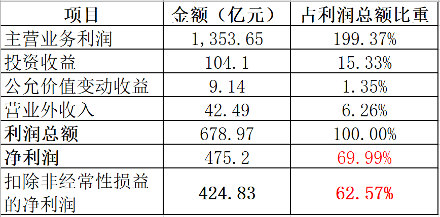
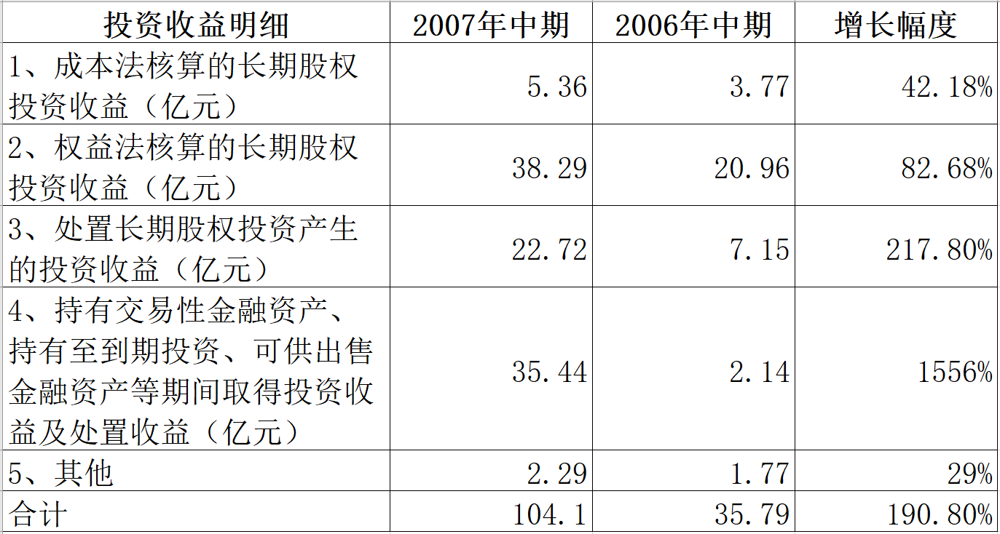
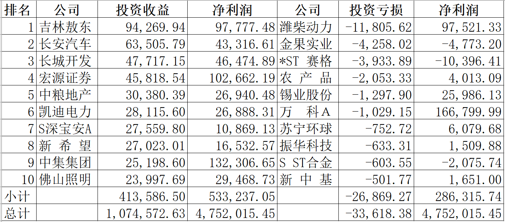
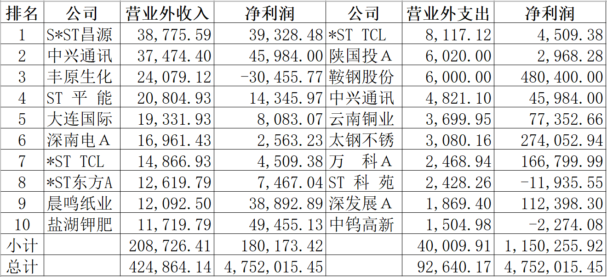
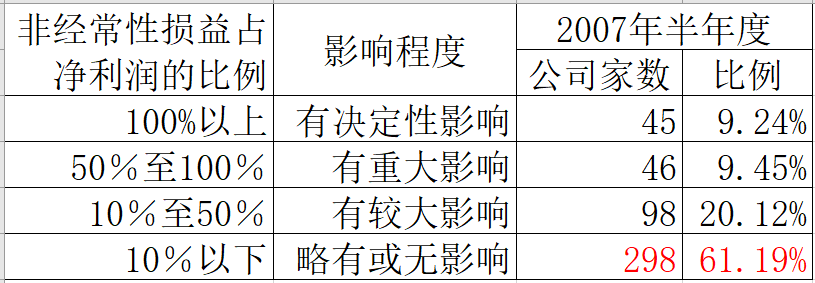
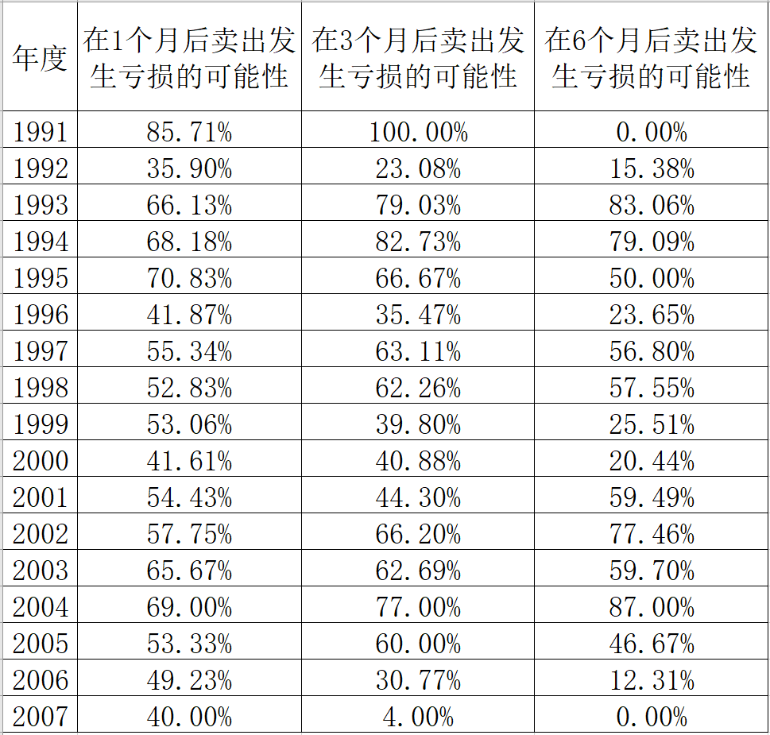
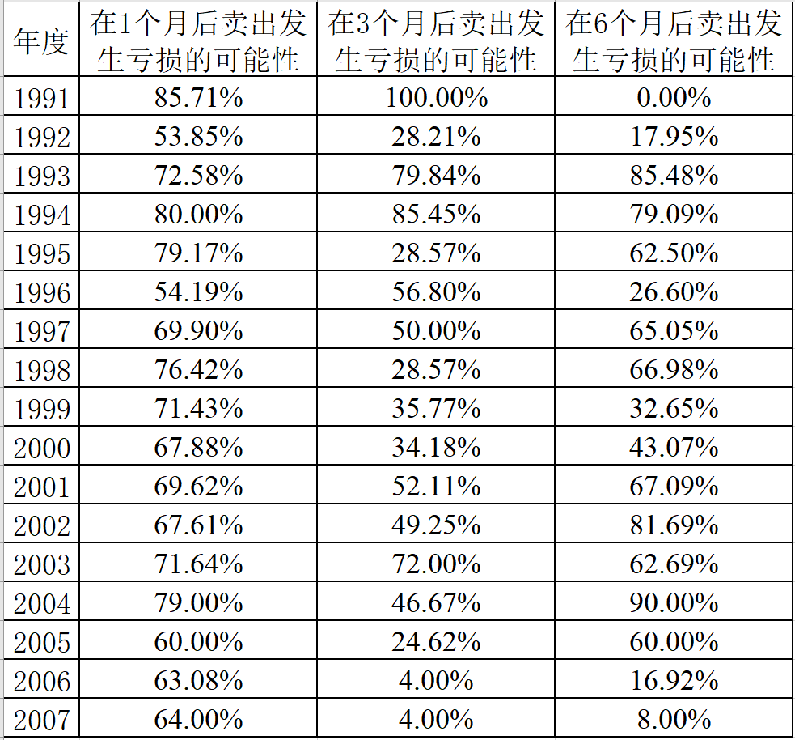

# 投资者教育文章汇编

## 投资者风险教育文章汇编

### 一、投资者如何判断上市公司公告中的价值和风险

上市公司公告是指公司董事会对公司生产经营、财务状况、经营成果、并购重组等所有对公司股票价格可能产生较大影响事项的公开正式披露的报告。由于上市公司对公告的真实、准确、完整、及时、公平性负有法律责任，随着监管力度的加大，总体来说，上市公司公告中一般不会存在明显的虚假、误导或遗漏。

非正式公告是指没有按上市公司信息披露规则进行披露的消息，或者指小道消息、传闻，由于非正式公告不是上市公司依法通过正规途径或渠道披露的信息，其真实可靠性没有保障，一些消息甚至成为庄家用以欺骗散户、操纵股价的工具。

因此，投资者应把上市公司公告作为主要的信息来源，加以仔细阅读和分析。那么，投资者如何读懂上市公司公告呢？

#### 一、“三步法”读公告

第一步，初步浏览公告内容。投资者应关注那些可能对公司资产、负债、权益和经营成果产生重要影响，可能对股价产生较大影响的公告。如重大投资、合作、资产重组、兼并收购、股权转让公告、经营业绩增长、公司遭受重大损失、公司减资、合并、分立、解散及申请破产、重大诉讼、分红方案、股票状态变化等等，投资者大体对公告的内容属利好、利平还是利空大致有个判断。

第二步，详细分析公告细节。投资者可以从以下几方面详细分析：

1、公告说明事项的具体情况，该事项的背景等。上市公司以前发生过类似事项吗？    
2、该事项的进展情况，真实性如何？是已发生的，还是意向性的，其执行是否有其它前置条件或不确定性？    
3、该事项对公司的影响如何，发生影响的时间是现在还是未来？如果上市公司以前发生过类似事项，那么当时发生了多大影响？    
4、是否有承诺事项，对未来会有什么影响？承诺事项有保证措施吗？    
5、澄清了哪些传闻、研究报告、媒体报道等？    
6、该事项存在哪些风险？

第三步，全面了解上市公司。投资者可查阅上市公司最近的年报、半年报、季报，一方面关注上市公司的经营业绩、分红方案、业绩预告等信息，另外还要关注3个问题：“资金从哪来？货往哪销？谁在管理？”

普通投资者所想要了解和研究的主要信息往往集中在年报的会计资料和业务资料、董事会报告、财务报告三部分。

会计数据和业务数据摘要提供了上市公司报告期内的诸如主营业务收入、净利润、每股净资产、每股经营活动产生的现金流量净额等基本的财务数据和指标。

董事会报告陈述了报告期内公司经营情况、财务状况、分红方案、投资情况、业绩预告等基本信息。

财务报告则包括审计报告及资产负债表、损益表，现金流量表三大会计报表等内容。

抓住了这些要点，投资者就可对上市公司基本情况有较完整的印象和大致的了解。

#### 二、判断公告信息的影响

普通投资者往往希望获取公告信息后直接来判断股价的走势。一个比较简单的办法就是看公告中“该事项对公司的影响”部分的描述，这是公司对此事项的“官方”认识，但有些公告并没有披露“该事项对公司的影响”，投资者就要经常有意识地去分析，以便从蛛丝马迹中发现新的市场机会或者公司的风险。

1、财务影响和非财务影响。财务影响是能新增多少收入和利润、提高多少净资产等等。非财务影响比如会计师更换、管理层的变更、大股东的变动、公司获得国家部门认证等等。非财务影响是无形的，经常被投资者忽视。

2、短期影响和长期影响。投资者不但要分析短期影响，还要兼顾长期影响。如A公司卖出一个子公司70%股权获利2亿元，而这个子公司是其主要经营性资产，短期来说，卖股权获利是好事，但长期来看，A公司失去了主要经营性资产，如果没有新增利润点，那么公司相当于卖掉了“生蛋母鸡”，不见得是好事。

再比如，收购兼并是上市公司最常用的扩张方式，一个公司往往通过收购兼并来拓展新产品市场份额，或进入其他经营领域。这种重组方式的特点之一就是被收购兼并方生产及经营现状影响较大，磨合期较长，因而见效可能较慢。资产置换是另一种常见和见效较快的重组方式，就是用公司的“劣质”资产交换外部优质资产，由于是采取整体置换形式，因而公司资产质量得以迅速提高，收益也可立竿见影。

3、一次影响和多次影响。投资者需分清一次影响还是多次影响。例如B公司2006年度收到政府补贴6000万元，公告里写的是“为支持公司发展，特给与公司一次性政府补贴6000万元”，再查查公司年报，发现公司2004年、2005年已连续两连亏，2006年的政府补贴很明显是保证公告不被暂停上市之举，是一次性行为，今后可能很难再得到政府补贴了。再如C公司收到2006年度政府技改项目补贴5000万元，它是今后几年都有的，显然是多次影响，利好程度就高得多。

4、直接影响和间接影响。同一事项的直接影响比间接影响的力度要大很多。例如D公司参股E证券公司5%，E证券公司刚获得创新类券商资格。获得创新券商资格对E证券公司就是直接影响，对D公司就是间接影响了。

5、历史影响和现实影响。

如果上市公司以前发生过类似事项，投资者就可“以史鉴今”，分析以前类似事项的在当时的影响，就可大致推测出现实影响了。

需特别注意的是，事项对公司股票价格的影响是投资者自行判断的，与公司无关。公司也不会对股票价格的走势进行判断。

#### 三、莫忽视风险因素

上市公司公告往往对披露事项作出风险提示，但可惜的是，许多投资者盲目追求利好效应，“思涨心切”，有意、无意地忽视风险因素，甚至明知有风险，也不予理会。

例如 F公司公告了与某外国大公司合作投资的事项，被投资者视为重大利好。但很多投资者没有继续分析该事项的风险因素，如投资协议最后未经商务部批准导致合作失败的风险；随着时间的推移，上市公司经营业绩如果不象当初预期的那么好，而面临经营业绩下降的风险；法律方面风险等等。

再例如G公司公告了承接境外巨额的工程建设订单事项，仔细分析下，可以分析出其中蕴含的风险极大。如该订单是真实的吗？即使订单是真实的，订单可实现性有多大？最终订单带给公司的收益能有多少？收益稳定吗？收益实现了，能收到工程款吗？海外订单受当地社会、经济环境、政策影响的风险有多大？以前有类似公司承接大单后续发生过风险吗？

#### 四、谨慎使用各种研究报告，勿轻信传言。

一般而言，研究报告是分析师通过研究上市公司公开信息，加上分析师行业研究，实现上市公司价值发现、价值重估。遗憾的是，近期一种不良的风气正在一些研究报告中蔓延，过多的主观臆断和大胆猜测、甚至传言出现在报告中。

例如某券商对 H公司的研究报告中公司主营产品VB2价格从240元/公斤上涨至340元/公斤的说法，在没有依据的情况下大胆猜测“公司2007年业绩为0.77元，至未来4个季度的业绩1.1元”，对投资者造成误导。另外，已经有证券分析师由于在网站上连续发布不实信息，导致相关公司股价大幅波动，被证监会立案查处。

对于各种传言、媒体上的不实报道，上市公司也会及时做出澄清，投资者应正面理解澄清公告内容。据不完全统计，今年以来深市发布的针对股价异动公告的澄清公告共102份，而经上市公司承认部分属实的仅20余份，占比不到20%，也就是说，传言的真实性极低。所以，投资者不要根据传言进行逆向推理和任意猜测。

要想读懂上市公司公告，投资者还需苦练基本功，学习行业知识和经济、法律、证券知识，才能从公告中发现有价值的信息或者上市公司存在的风险。

### 二、投资者如何防范公司风险

#### 一、如何防范*ST和ST公司股票风险

在公司股票简称前冠以“*ST”字样，意味着该公司股票被实行警示存在终止上市风险的特别处理；在公司股票简称前冠以“ST”字样，意味着该公司股票被实行其他特别处理。

上市公司股票被实行特别处理最常见的原因就是公司财务状况出现异常，这在一定程度上说明了此类公司财务状况不理想，资产质量较差，持续经营能力存在较大不确定性。而公司一旦在规定期限内没有消除上述情形，则将暂停上市。在公司股票暂停上市期间，投资者将无法买卖该公司股票。若最终出现终止上市情形，公司股票将进入代办股份转让系统，股票价格有可能大幅下跌。

通过以上介绍，投资者可以了解到，\*ST和ST股票的投资风险比正常股票要高，可为什么市场上仍有众多投资者热衷于投资此类股票呢？实际上由于\*ST和ST股票价格较低，市场传闻较多，不少投资者抱着一种捡便宜的投机心态，缺乏应有的风险意识，轻信传闻，跟风炒作，使得\*ST和ST股票价格扶摇直上，反而成为市场上的“香饽饽”。\*ST和ST股票之所以能成为市场疯狂炒作的对象，其原因就在于层出不穷的各式“题材”——资产重组、借壳上市、大股东变更等。尽管少数\*ST和ST公司资产重组成功，公司发生了实质性变化，但不少\*ST和ST公司因经营不善，最终仍未能逃脱退市的厄运。因此，我们建议投资者在选择\*ST和ST股票前重点关注以下几点：（1）公司股票被实行特别处理的原因；（2）市场传闻的真实性，公司是否就市场传闻发布过澄清公告；（3）如市场传闻确属实，对公司盈利能力和持续发展能力能否产生重大影响，这种影响需要多长时间体现，不确定性有多大。

#### 二、如何看待上市公司违规受罚的影响

上市公司违规行为主要包括：1.信息披露违规，包括未及时、公平地履行信息披露义务，以及信息披露内容尤其是财务信息存在虚假记载、误导性陈述或重大遗漏；2.决策审批程序违规，对重大对外投资、收购或出售资产、关联交易、对外担保、募集资金使用等重大事项未按规定履行审批程序，侵害投资者利益；3.内幕交易和操纵市场。

对于违规受处罚的上市公司，投资者需重点防范以下几方面的风险：

1．诚信风险

规范运作水平和诚信建设质量，是上市公司能否健康持续发展的重要决定因素。上市公司作为公众公司，信用缺失可能会导致投资者直接“用脚投票”，因为对于受到过处罚的上市公司，投资者需承担额外的诚信风险。在判断公司经营业绩是否真实，大股东和管理层是否侵害上市公司和中小投资者的利益时，投资者需尤为谨慎。

2．退市风险

中小企业板上市公司如在二十四个月内受到证券交易所公开谴责两次，将实施退市风险警示；如果在其后十二个月内再次受到证券交易所公开谴责，暂停上市；其后十二个月内再次受到本所公开谴责，终止上市。需要提醒投资者注意的是，目前仅中小企业板上市公司受到证券交易所公开谴责将面临退市风险，主板公司没有此类规定。

3．再融资受限

根据有关规定，上市公司现任董事、监事和高级管理人员如果在一定时间内受到过中国证监会的行政处罚或证券交易所的公开谴责，会影响该公司的融资计划。

近期就有一家上市公司，原本公开发行股票方案已经公司董事会和股东大会审议通过，并向证监会递交了申请材料，后因公司及其董事长受到证券交易所公开谴责，不符合公开发行证券的条件，只得撤回了公开发行股票的申请。尽管公司主营业务发展势头较好，但由于公司及其董事长的违规行为，直接导致公司短期内借助资本市场平台发展壮大的愿望落空，因此，对于投资者而言，在做出决策前应充分考虑到这方面的影响。

#### 三、如何分析业绩大幅波动公司风险

每年市场上都会出现部分上市公司业绩大幅波动的情况，随着经营业绩的大幅波动，公司股票价格也大幅变化。对于这类公司，投资者难免会产生疑问：为什么公司的业绩会一夜之间变化这么大？上市公司的盈利能力发生了根本性的改变吗？

总体而言，上市公司业绩大幅波动的原因可以大致分为以下几类：1.国家宏观政策调整，包括税收、反倾销等相关政策调整；2.资产重组或并购行为；3.产品价格大幅波动；4.原材料价格大幅波动；5.产能扩张或大面积停产；6.一次性的非经常性损益；7.比较基数较小。一般来说，前两类因素对公司的影响将是较长期的，而产品价格大幅波动、原材料价格大幅波动等因素对公司的影响则是相对短期的。当然，因不同公司的情况千差万别，不能一概而论。投资者需重点关注公司业绩大幅波动的具体原因，分析公司业绩的大幅增长或下降能否持续改变公司的盈利能力，判断公司股价的上涨或下跌是否合理反映了公司经营业绩和盈利能力的变化，而不是被公司业绩和股价的短期走势所迷惑，盲目做出投资决策。

例如某上市公司自2004年起由于产能过剩，公司经营业绩大幅下滑，到2006年初公司已陷入低谷。但2006年下半年以来，公司所处行业逐渐复苏，国内外市场需求逐渐扩大，公司经营业绩剧增。公司股票价格随之一路飙升，从2007年初的13.28元最高涨到4月底的69.00元（复权后），市盈率最高达164倍，股价涨幅高达420％，而同期相关指数涨幅仅为72％。

对于该公司而言，因产品价格大幅上涨，导致公司今年业绩大幅增长，公司股票短期内出现一定的上涨是合理的。然而，公司处于一个市场竞争较为充分的行业，随着原材料价格的上涨和行业产能的进一步扩张，公司产品价格长期在高位徘徊的可能性并不大，而且过高的股价涨幅，可能已透支了公司未来几年业绩的增长。在这种情况下，投资者一定要理性看待公司业绩大幅增长，认真分析其原因和影响，避免盲目追涨，跟风炒作，造成不必要的损失。

### 三、辨别是非，理性对待上市公司“做多”

股改和2006年市场反转以来，我国深沪市场上市公司或大股东“做多”上市公司的现象较为普遍。从手段上看，有的是合规并具有实质性内容的，有的则是不当、甚至违规并包含虚假成分的；从效应上看，有的是长期发挥作用的，有的仅仅具有短期“题材”炒作的意义。上市公司或大股东“做多”可能隐含增加股份、做高股价、未来高价套现的动机，可能导致市场或个股暴涨暴跌的风险。投资者要辨别是非，理性对待和正确看待大股东、上市公司及其高管“做多”上市公司行为。

#### 一、做多上市公司的主要表现

股改后大股东、上市公司及其高管积极“做多”上市公司，主要表现在以下几个方面：

1．整体上市。2000年以前上市的公司，大都是按计划额度发行上市的公司，发行额度较少，上市家数较多。为不超过发行额度，许多企业只是分拆其中部分资产上市。股改以来，许多大股东基于增加上市股份或做优做强上市公司的考虑，在具备资产和资产整合条件下，提出了整体上市的计划，即将集团公司的大部分资产按照一定的折股比例装进控股的上市公司，上市公司成了原集团公司的经营主体，原集团公司更多地体现为一个控股性公司。

2．增资扩股。股改以来，在可能的条件下，较多上市公司提出了定向增发、配股的计划；一些大股东为适应或主导上市公司增资扩股的需要，采取了向上市公司大量注入资产的方式。

3．资金清欠。过去，一些大股东凭借控股地位和与上市公司关联交易的有利条件，长期占用或拖欠上市公司资金。为提高上市公司质量，管理层出台了限期清欠上市公司资金占用的措施，并将其与上市公司股改联系起来。一些大股东通过以资抵债、以股抵债、以债抵债等方式解决占用上市公司资金问题，取得了一定的成效，这些上市公司基本面发生了积极的变化。

4．并购重组。主要方式有：一些大股东通过资产置换的方式重组绩差上市公司，一些有资产、资金实力的投资者通过借壳上市的方式重组绩差上市公司，一些战略投资者则通过受让部分股权参与上市公司经营管理。

5．做高业绩。20世纪90年代中后期，我国上市公司群体曾经出现过净资产收益率集中分布在10%的反常现象，其背后的原因是当时配股和增发所要求的10%净资产收益率的标准。从已披露的上市公司2006年报看，净利润增长超过50%的上市公司大量出现，这和“10%现象”一样是反常的，不排除一些上市公司进行了做高业绩的可能性。例如。某上市公司就通过大幅度降低准备金计提的方式使2006年业绩出现超过300%的增长。如按2005年的计提标准，其2006年业绩增长则不足50%。

6．高送转股本。从已公布的2006年上市公司分配预案来看，高比例送股或转增股本创历史最高水平，较多上市公司提出了10送转5股以上的分配预案，其中10送转10股的也为数不少。例如，某上市公司在2006年中期10转增10股的基础上，2007年初又实施10送转10股的分配方案。该分配方案实施后，该上市公司2007年的总股本将比2006年5月增长4倍以上，而同期业绩只增长100%。

#### 二、做多上市公司的主要动机

股改后我国资本市场为什么会普遍出现大股东、上市公司及其高管“做多”上市公司的现象，可能与其行为动机有关。

1．做优做强上市公司。股改消除了我国资本市场发展的根本性制度障碍，构建了上市公司不同股东之间相关的利益基础，为上市公司做优做强创造了有利的市场条件，上市公司及其高管、大股东做优做强上市公司的积极性空前高涨。这可能是上市公司及其大股东“做多”上市公司的动机之一。

2．增持上市公司股份。股改后，原国有股、法人股可以有条件地上市流通，从而可以按市场价格估值，极大地提高了原国有股、法人股股东增持上市公司股份的积极性。大股东推动集团公司整体上市、上市公司增资扩股，在很大程度上可能是基于增持上市公司股份的考虑。

3．增加上市公司控股比例。我国有一定数量的上市公司股权较为分散，大股东持股比例未能达到绝对控股或相对控股的要求，股改对价后进一步降低了这些大股东的持股比例。与此同时，股改后我国资本市场市场化程度显著提高，上市公司并购的可能性大为提高。基于增加上市公司控股比例的考虑，一些大股东采取了积极推动上市公司增资扩股的策略，大量向上市公司注入资产或认购上市公司定向增发的股份。

4．做高股价。不管是基于未来上市公司股份套现的需要，还是将上市公司股份作为抵押、担保标的的考虑，做高上市公司股价对大股东和拥有上市公司股份的高管都是极为有利的。上市公司及其大股东做高业绩、高送转股本等都可能包含着做高上市公司股价、未来高价套现的动机。

#### 三、做多上市公司的主要后果

大股东、上市公司及其高管不同的“做多”上市公司行为，后果可能差别很大。

1．合规的、长期发挥作用的“做多”可能产生提高上市公司质量、促进资本市场发展的效果。只要整体上市的资产、大股东以资增股的资产、置换重组上市公司的资产都是优质资产并且作价公平合理，只要上市公司高比例送转股本有足够的业绩支持和成长性支撑，这些“做多”上市公司的做法是有利于提高上市公司质量从而有利于资本市场发展的。

2．违规的、仅仅具有短期“题材”炒作意义的“做多”可能导致暴涨暴跌的风险。股权分置改革基本完成后，深沪市场在面临着日益增加的“小非”、“大非”上市流通压力的情况下出现持续性、大幅上涨的局面，影响因素较多，既有国民经济快速发展、人民币升值、流动性过剩的因素，也有上市公司治理优化、业绩总体提升的因素，但不能说与大股东、上市公司及其高管积极“做多”上市公司没有关系。有的个股暴涨，主要是 “做多”上市公司的市场反应。一旦这种“做多”上市公司的行为不能持续、效益不能凸现，并且出现“大非”现实的上市流通压力时，市场可能出现暴跌的风险。

### 四、投资者如何对待上市公司重要股东股份变动

今年以来，上市公司大股东或实际控制人，公司董事、监事、高管等重要股东大量增、减持公司股份等情形不断出现。中小投资者应当密切关注并科学分析他们的增、减持行为，以防范风险，作出正确的投资决策。

#### 一、上市公司重要股东股份变动日趋频繁

据统计，我国A股市场2007年前三季度重要股东二级市场股份增持量为54233.6963万股，股份减持量高达440184.7812万股；其中减持数量创下了历史新高。见下表：

A股市场重要股东二级市场交易情况表

|项目|增持股份数（万股）|减持股份数（万股）|交易总量（万股）|
|:--|:--:|:--:|:--:|
|2005前三季度|90026.1678|4224.1918|94250.3596|
|2006前三季度|658434.6748|33202.8758|691637.5506|
|2007前三季度|54233.6963|440184.7812|494418.4775|

注：数据为已公告的二级市场股份变动情况。           资料来源：wind统计

#### 二、上市公司重要股东股份变动的动机

1．套现：绝大多数上市公司重要股东股份减持的动机是为了套现。鉴于市场行情的持续走好，许多公司股价涨幅较大，随着限售股份的陆续解禁，一些公司的大股东、高管趁机大量抛售股份，收回投资落袋为安。如某公司部分限售流通股自2007年8月9日起可以上市流通，然而自8月20日开始，在短短一个月的时间里，该公司6名持有解禁股票的高管中，就有5名多次减持，共计减持超过621万股，套现金额近1亿元。

2．不当逐利：一是当上市公司有重大资产重组、资产注入、定向增发等重大利好消息或利空消息时，公司的大股东、董事、监事、高管人员等就有可能利用与中小投资者信息不对称的优势，在重大利好或利空消息对外发布前提早买入或卖出公司股份，以获取高额收益。如某公司在2006年11月8日举行董事会，决定定向增发7000万股，而该公司董事长、总经理的证券账户显示于2006年11月7日即董事会的前一天买入了该公司的股份；又如，某公司于2007年8月发布了关于2007年半年度报告的更正公告，更正后的净利润比更正前有所减少，该公司的控股股东在公告前一天出售了所持公司股票，该股东因此受到了监管部门的处罚。

3．影响股价：个别上市公司出于一些特别目的，大股东及董事、监事、高管等可能会利用市场误导投资者，通过增持或者减持行为来达到拉升或者打压股价的目的。

#### 三、如何了解重要股东的股份变动信息

1．关注上市公司的日常信息披露

根据《证券法》、《上市公司收购管理办法》等法律法规，上市公司大股东的股份变动均需及时履行信息披露义务，而且，本所出台的《中小企业板上市公司控股股东、实际控制人行为指引》、《股权分置改革工作备忘录第16号----解除限售》(以下简称《备忘录》)中对大股东股份变动也提出了进一步的要求，要求上市公司控股股东和实际控制人在减持前执行预披露制度。《备忘录》中规定如果控股股东（或实际控制人）计划减持解禁股，并于第一笔减持起六个月内减持数量达到5%以上的，控股股东（或实际控制人）将于第一次减持前两个交易日内通过上市公司对外披露出售提示性公告。因此，投资者可在上市公司指定的信息披露媒体上关注有关股份变动的公告，即时进行分析和做出判断。

2．关注本所网站“诚信档案”栏目

投资者除了通过上市公司的日常公告披露来关注重要股东的股份变动外，还可以通过本所网站即时了解到上市公司董、监、高的股票买卖信息。本所网站主页面上就有一个“诚信档案”的栏目，投资者在栏目里面可以看到本所主板及中小板上市公司董事、监事、高管及相关人员持有本公司股份变动情况以及本所对上市公司大股东及董事、监事、高管违规买卖股票的监管与处分记录。

#### 四、如何对待重要股东股份变动

1．谨慎关注重要股东的“减持”行为

一般来讲，上市公司大股东的大量减持以及公司董事、监事和高管大量、集中抛售公司股票的行为，可以反映出他们对公司当前估值的看法和态度，一是认为市场估值过高；二是对公司的发展前景不看好，信心不足。

作为谨慎的投资者，此时就应该密切关注公司大股东以及董事、监事和高管的减持频度、减持价格和减持数量，将他们减持的信息与公司的具体情况结合起来，对公司的基本面进行分析，谨慎判断公司的投资价值。

2．理性对待重要股东的“增持”行为

一些上市公司大股东以及董事、监事和高管看好公司的发展前景，大股东不断向公司注入资产或认购公司定向增发的股份，增持公司股份。同时，随着公司股权激励计划的实施，一些公司董事、监事和高管也不断增持公司股份。投资者往往十分追捧，此类股票的股价受此影响也不断走高。

实际上，上市公司在发展过程中始终存在着不确定性和市场风险，大股东以及董事、监事和高管增持股份不等于确保公司未来的发展前景，因此，投资者一定要理性对待，保持头脑冷静，客观、理性对待他们的“增持”行为，千万不要盲目跟风。

### 五、谨防异常波动股票的投资风险

今年以来，上市公司股价异常波动大幅上升，大部分由不确定性重大事项泄密、信息披露不及时、不实传闻、误导性的研究报告等引起。投资者应当密切关注这一现象，谨防投资风险。

#### 一、股价异常波动数量大幅增长

按《深圳证券交易所交易规则》所列示股价异常波动的标准进行统计，今年以来股价异动的公司数、次数都呈现大幅增长态势。在深市主板上市公司中，2006年1-9月股价异动公司数为188家，异动次数为406次；2007年1-9月股价异动公司数为271家，异动次数为846次。与去年同期相比，股价异动公司数增长44.15％，而异动次数增长108.37％，比去年同期增长超过1倍。

#### 二、异常波动股票的风险不容忽视

（一）绩差股往往是股价异常波动的主角

据统计，2007年1-9月ST、\*ST类公司股价异动公司数为76家，占28.04％；但异动次数却高达430次，占比为50.83％（见表1）可见ST、\*ST类公司股价异动次数更为频繁。另外，在所有异常波动的股票中，异动次数达8次以上的公司有29家，其中23家公司为ST、*ST类公司，占比达79.31％，这些公司业绩均较差，投资风险较大。

表1 深市主板上市公司股价异动情况统计分析

|异动公司类型|股价异动公司数（公司数）|异动公司数占比（％）|股价异动次数（次数）|异动次数占比（％）|
|:--|:--:|:--:|:--:|:--:|
|ST、*ST类公司|76|28.04%|430|50.83%|
|非ST、*ST类公司|195|71.96%|416|49.17%|
|合计|271|100.00%|846|100.00%|

注：数据为根据深市主板上市公司统计，统计期间：2007年1-9月

（二）股价异常波动的主要原因——“概念”炒作

引起股价异动的原因主要是公司存在资产重组、债务重组、借壳上市、注入资产、整体上市等概念及预期，公司基本面在异动期间均没有实质变化，投资者的期望更多是对公司未来重组成功后基本面的改观。但值得投资者注意的是，此类题材股目前的基本面较差，且不少公司存在退市风险，一般来说公司债权债务关系、股权关系等都极其复杂，重组成功与否存在较大的不确定性。一旦最终重组失败，往往是公司被退市，投资者将会遭受重大损失。

（三）部分股价异动起因于目的性、倾向性的研究报告及传闻

资本市场是各种利益主体博弈的场所，为了牟取不当利益，一些带有目的性或倾向性的研究报告、传闻时常流入市场。此类研究报告、传闻绝大多数都最终被证实是虚假、误导性信息，投资者不加分析地利用此类信息，盲目跟风炒作，往往被某种利益主体所利用，遭受极大的损失。在一些情况下，上市公司资产重组、债务重组等概念可能仅是一种传闻，连上市公司自身都没有确切消息，但仅凭借这种传闻，公司股价可能就被连续炒作，出现异常波动，投资风险极大。

（四）部分股价异动公司存在违法违规行为

随着股改基本完成，全流通时代即将到来。为配合限售股份的解禁上市流通、相关人员的内幕交易等，部分上市公司可能会利用重大事项泄密、信息披露不及时等违法手段配合相关人员牟取利益，从而引发股价异常波动。由于存在严重的信息不对称，投资于此类股票的中小投资者往往是主要受害对象。

#### 三、异常波动股票投资的风险防范

（一）分析公司基本面，注重公司生产经营情况的实质变动

无风不起浪，公司股价出现异动往往是公司在某方面出现变化的反映，投资者此时不应当盲目追涨杀跌，应认真分析公司基本面的变化，关注公司实质性的生产经营情况是否变动、是否存在可能对未来业绩产生重要影响的事项，通过自己的认真分析后作出投资决策，不轻信各种传闻。

（二）仔细阅读和分析上市公司公告

上市公司公告是上市公司董事会对公司生产经营、财务状况、经营成果、并购重组等所有对公司股价可能产生较大影响事项的公开正式披露的报告，是上市公司“官方”的信息披露，公司要对该信息披露承担法律责任。投资者应当将上市公司公告作为主要的信息来源，进行仔细阅读及分析。

股价出现异常波动，公司都需要发布股价异常波动公告，投资者可以结合股价异动前的相关公告对公司进行分析，重点关注相关公告中“对公司产生影响”及“披露事项风险提示”部分，认真分析该重要事项是否就是引起股价异动的原因，该重要事项对公司可能产生的财务影响、长短期影响等。

（三）审慎对待相关研究报告

市场上存在较多针对个股的各种研究报告，研究机构具有专业分析、信息资源等优势，因而研究报告是不少投资者获取相关信息的主要途径。但也有部分研究报告带有某种目的性、倾向性，轻信此种研究报告往往会对投资者的投资决策形成误导。投资者应当审慎对待研究报告，同时苦练内功，认真学习财务、经济、法律、证券等知识，只有掌握一些基本的专业知识，投资者才能从研究报告中筛选有用的信息，避免被具有目的性、倾向性的研究报告误导。

（四）警惕异常波动的*ST和ST类公司

\*ST和ST类公司股价异动的次数较为频繁，主要是存在各种炒作题材——资产重组、债务重组、借壳、股东注资等。虽然有一些\*ST和ST公司资产重组成功，基本面发生实质性变化，但不少\*ST和ST公司却财务状况持续恶化，最终未能逃脱退市的厄运。因此，在投资异常波动的*ST、ST类公司时，投资者应当认真分析上市公司股票被实行特别处理的原因，实施特别处理后公司主营业务、财务状况改善情况，公司针对市场传闻的相关公告等。如公司确实存在重组事项，应对重组情况进行具体分析，关注有关重组的难度和不确定性以及重组对公司未来盈利能力和持续发展能力的影响，做一个理性的投资者。

### 六、投资者如何防范证券交易风险

#### 一、选择合适的证券公司

目前可以接受投资者交易委托的证券公司超过上百家，然而各家证券公司在交易硬件设施、佣金收费、投资者教育、咨询服务等方面不尽相同，投资者在选择证券公司时除了比较不同证券公司的收费标准以外，还应注意以下两个方面，一是证券公司的交易系统等硬件设施是否满足交易需求；二是证券公司的研究能力以及投资者教育等方面的服务质量是否过关。

一般研究力量雄厚、投资者服务到位的证券公司，能更好地为投资者提供交易指引，但目前仍有部分证券公司营业部缺乏服务意识、投资者教育工作力度不足，导致客户利益受损，前期媒体报道的30多名投资者因对高度价外大冶特钢权证行权而蒙受损失的事件，一方面是投资者对新兴交易品种不够理解，另一方面则是由于某些证券公司营业部缺乏投资者教育工作而引起的。因此，投资者在选择证券公司时，应综合各方面因素多加比较，不能光看证券公司佣金水平高低。

#### 二、熟悉不同的竞价交易方式

证券竞价交易分为集合竞价和连续竞价两种方式，不同竞价方式对投资者买卖指令的撮合方式不一样。其中集合竞价是指对一段时间内接受的投资者买卖指令一次性集中撮合的竞价方式，分为开盘集合竞价时段（每个交易日9:15-9:25）和收盘集合竞价时段（每个交易日14:57-15:00）；而连续竞价是指对投资者买卖指令进行逐笔连续撮合的竞价方式，其交易时段是从每个交易日早上9:30－11:30，下午13:00－14:57。

#### 三、合理、有效地进行委托

1．按规定的价格最小变动单位和申报数量进行委托。不同的证券交易采用不同的申报价格最小单位和申报数量。以股票为例，按规定股票申报价格的最小变动单位是0.01元，投资者只能按“分”进行委托，如委托价格为“厘”，则委托无效；同时，买入股票必须以100股或其整数倍进行委托，如买入股票委托存在不足100股的，委托也同样无效。

2．在涨跌幅限制内进行委托。对于非首日上市的股票、基金交易，交易所实行价格涨跌幅限制，涨跌幅比例为10%,其中ST等股票的价格涨跌幅比例为5%。投资者买卖有价格涨跌幅限制的证券，应当在证券的价格涨跌幅限制以内委托，如某只股票前一日收盘价为10元，那么投资者应当在9元至11元之间进行委托，超过该范围的都为无效委托。

3．在中小板股票的有效竞价范围内进行委托。为防止中小板股票价格大幅波动，在涨跌幅限制的基础上，交易所还对非上市首日的中小板股票的连续竞价期间设置了3％的有效竞价范围。投资者买卖中小板股票，为了保证委托及时成交，应当在有效竞价范围内进行委托，如某只中小板股票最近成交价是10元，那么投资者应当在9.7元至10.3元之间委托，才能保证委托及时进入竞价。对于超出有效竞价范围的投资者委托，将暂存于交易主机中，只有当交易价格波动使其进入有效竞价范围是，交易主机才会允许其参与竞价。

4．合理运用不同的委托方式。目前投资者可以在深市采用限价委托和市价委托两种方式进行交易，其中市价委托还分为对手方最优价格委托等五种。不同的委托方式具有不同交易效率和成交效果，采用限价委托，委托成交价格明确，但委托需要根据当时市场情况确定能否成交；与限价申报方式相比，市价委托可以保证委托及时成交，有利于提高委托成交效率，但其成交价格无法事前预知，存在一定的不确定性，尤其在证券价格波动剧烈时，市价委托成交价格的不确定风险较大，媒体曾报道的某权证以一厘钱价格成交的事件，就是由于投资者没有合理运用市价委托所致。

#### 四、关注交易公开信息

交易公开信息是交易所为了提高市场透明度，及时、有效向投资者揭示市场风险的工具。目前交易所公布的交易公开信息分为单日交易公开信息和交易异常波动公开信息两种，其中单日交易公开信息针对日收盘价格涨跌幅偏离值达到±7％等情况进行披露，而交易异常波动公开信息则是针对连续三个交易日内收盘价格偏离值累计达到±20％等属于交易异常波动的情况进行披露，两者程度不同。投资者应及时关注交易公开信息内容，并进行理性分析，谨慎投资。

需要指出的是，涨跌幅偏离值不是简单把单只证券若干天涨跌幅比例进行累加，而是考虑了当天大市升跌情况的因素，把单只证券涨跌幅与对应分类指数涨跌幅加以比较，得出的更为准确、科学的指标。

#### 五、善用证券公司的研究报告

证券公司研究报告一般是证券公司专业研究分析人员经过实地调研和专业分析的结果，但由于部分研究报告会受到研究人员能力水平和个人主观倾向的影响，投资者应在自我独立分析的基础上，善用证券公司研究报告，对于那些进行过多的主观臆断和大胆猜测的报告，投资者尤其要注意。以某券商对西飞国际的研究报告为例，“飞机制造业的龙头”、“呈现爆炸式成长态势”等极具煽动性的文字频频出现在报告中，在没有依据的情况下猜测“集团所有国际转包业务资产都注入西飞国际，或者将飞机总装资产整合到西飞国际”，而这些说法都遭到了该上市公司的澄清和反驳。对于这类研究报告，投资者应再三考证，以免受到误导。

### 七、投资者如何防范股票上市首日交易风险

#### 一、上市首日交易风险不可低估                         

1.新股上市首日交易风险

受传统“炒新”思维的影响，加之上市首日交易无涨跌幅限制，近年来盲目跟风炒作上市首日“新股”，已成为投资者参与股票市场交易面临的一大风险因素，不少投资者因此高位“套牢”，低位“割肉”，损失较大。

案例一：

中小板“首八只”首日过热后，大多数股票连续两个交易日跌停，其中“大族激光”首日开盘不到3秒钟，就创出了48元的高价，421.74％的涨幅，随后两周连续下跌，最低跌至24元，跌幅达50％，首日创出的48元高价,将首日买入的投资者整整“套牢”了两年。

案例二：

“中工国际”上市首日下午1时50分左右股价开始飙升，不到半个小时股价由17元涨至50元，最终以31.97元收盘，较发行价上涨了332％。随后，“中工国际”连续6个交易日跌停，重新跌回17元左右。在50元附近买入的投资者遭受的损失最高达到66％。事隔一年，经历了市场的牛市行情，“中工国际”的价格最高也仅有35.80元，仍远低于上市首日的高价。

据统计，2006年6月恢复新股发行上市以来，深沪两市新发上市的112只新股中，有44只股票上市首日的最高价是其上市后一个月的最高价，占比39.28％。换句话说，近四成的新股，投资者在上市首日追高买入，将至少“套牢”一个月。其中，深市“得润电子”、“德美化工”、“同洲电子”和沪市“大同煤业”、“中国银行”等新股“套牢”的时间更长达半年之久。由此看来，新股高开低走的情况可谓比比皆是，投资者对其交易风险不可低估。

2.其他类型首日交易风险

其他类似的情况还有暂停上市恢复上市首日、股改方案实施后复牌交易首日以及增发股票上市首日等情况。由于同样没有涨跌幅限制，其“暴涨暴跌”的交易风险也同样存在，不得不防。

案例三：

2007年3月29日深市恢复上市股票“ST仁和”以10.11元开盘后，最高涨至14.99元，涨幅达986.23％，随后连续三个交易日跌停。

案例四：

2007年4月13日沪市股改方案实施复牌股票“*ST长控”，上午 10:40股价从42元左右大幅飙升，最高达85元，涨幅1083.8%，上交所对其实施了盘中紧急停牌。随后，该股连续13个交易日跌停，股价最低跌至34.98元，较最高价85元跌幅高达60％，跟风买入的投资者遭受了巨大的损失。

因此，充分了解、重视股票上市首日交易风险，并积极采取措施予以防范，投资者才能在新股的交易中最大程度地规避风险，获取更安全的投资收益。

#### 二、防范首日交易风险的“四大招数”

招数一：研读公告，了解公司基本情况

新股的价值评估和市场定价受公司业绩、净资产、成长性、行业定位和市场状况等多种因素影响。投资者仔细阅读招股说明书、上市公司相关公告、报告，可以获得最直接、最可靠的信息，据此对公司经营业绩、行业特点、发展前景和潜在风险进行分析，就能做到心中有数。有条件的投资者还可参加或关注公司“路演”，上市公司在发行新股时一般会举办网上路演等推介活动，公司管理层和保荐机构等中介机构将直接面对投资者，介绍公司的现状和发展前景，并回答投资者的问题，投资者可借此机会了解公司的相关情况，感受公司管理层的素质，有机会还可针对关心的问题进行提问。

招数二：参考专业机构的估值分析意见

如果投资者获取信息渠道较少，或自己专业分析能力有限，综合参考专业机构对新股上市交易的估值定价分析，也不失为一个明智之举。无论是新发上市还是暂停恢复上市的股票，在上市交易之前，均有一批专业的证券公司和投资咨询公司根据上市公司的行业特点、经营业绩、盈利能力、发展潜力以及板块对比、市场状况等，对公司股票上市后的定价区间进行分析和预测。投资者可通过阅读《证券时报》、《中国证券报》和《上海证券报》等证券报刊或查询相关网站，便可掌握专业机构普遍认可的一个相对合理的定价范围区间，减少买卖的盲目性。

招数三：关注交易所的风险提示和临时停牌公告

为了保护投资者的合法权益 ，最大限度地防范和控制上市首日的过度炒作风险，深交所分别制订和颁布了《关于加强中小企业板股票上市首日交易风险控制的通知》和《关于加强恢复上市和股改方案实施复牌首日股票交易风险控制的通知》，针对上市首日股票建立了以“盘中涨幅与开盘涨幅之差”为指标的临时停牌风险控制机制。对每只上市首日的股票都在上午开盘前通过深交所网站、交易系统等渠道发布风险提示，告知当日将实施的风险控制措施。

同时，深交所对上市首日股票都实施了重点监控，当盘中股价出现异常波动或过度投机时，将根据相关规则对股票实施临时停牌，其目的是警示交易风险,冷静过热气氛,警告异常行为。投资者参与股票上市首日的交易，一定要及时关注交易所发布的风险提示和临时停牌公告，及时了解市场风险状况，避免遭受不必要的损失。

招数四： 理性投资，切忌盲目跟风

虽有“一夜暴富”的神话，但无数的案例也告诉我们“暴涨必有暴跌”，对待一时的狂热，若不能理智的判断，盲目跟风，最终结果很可能是火中取栗，损失惨重。那么，什么情况可能是出现了过度炒作甚至狂热呢？当股价已远高于专业机构普遍估值的上限值甚至极限值时，当交易所对股票交易实施临时停牌和发布风险提示时，投资者就应当冷静思考，审慎交易，或者暂停观望，不贪，不慌，不躁，才能在控制风险的基础上把握更大的投资机遇。

### 八、大股东、管理层如何防范防止违规买卖股票的风险

编者按：2007年以来股票市场持续火爆，上市公司管理层及大股东短线交易、禁止期买卖、超卖股份等违规交易行为频频曝光。虽然有部分人员恶意违规，但从一线监管的情况看，也有一些违规是缘于对规则的不了解。本期文章对这部分特殊投资者详解有关法律法规，敬请留意。

#### 一、大股东买卖股份须知

根据《证券法》的规定，持有上市公司股份百分之五以上的股东，将其持有的该公司的股份在买入后六个月内卖出，或者在卖出后六个月内又买入，由此所得收益归该公司所有。

对于多次买卖的短线交易，有关规则作了最严格的限定，即：对于多次买入的，以最后一次买入的时间作为六个月卖出禁止期的起算点；对于多次卖出的，以最后一次卖出的时间作为六个月买入禁止期的起算点。

短线交易违规案例：

A公司大股东在股份获得流通权后，于2007年3-4月间陆续减持公司股份600万股，但4月末又买入本公司股份100万股。尽管公司声称上述行为系经手人员误操作所致，但此行为已经构成短线交易，所得收益应划归上市公司所有。

#### 二、董事、监事、高级管理人员买卖股份须知

（一）持股申报及股份转让

根据《公司法》的规定，此类人员应当向公司申报所持有的本公司的股票及其变动情况，在任职期间每年转让的股票不得超过其所持有本公司股票总数的百分之二十五。

1.个人信息申报

有关规则规定，此类人员应在下列时点或期间内委托上市公司通过证券交易所网站申报其个人信息：

(1)新上市公司的董事、监事和高级管理人员在公司申请股票初始登记时；    
(2)新任董事、监事在股东大会(或职工代表大会)通过其任职事项、新任高级管理人员在董事会通过其任职事项后2个交易日内；    
(3)现任董事、监事和高级管理人员在其已申报的个人信息发生变化后的2个交易日内；    
(4)现任董事、监事和高级管理人员在离任后2个交易日内；    
(5)证券交易所要求的其他时间。

2.可转让股份数量的计算方法

在当年没有新增股份的情况下，上市公司董事、监事和高级管理人员可转让本公司股份数量=上年末持有股份数量X25%。

对当年新增股份的处理，有关规则分两种情况区别对待：因送红股、转增股本等形式进行权益分派导致所持股票增加的，可同比例增加当年可减持的数量。因其他原因新增股票的，新增无限售条件股票当年可转让25%，新增有限售条件股票不能转让，但计入次年可转让股票基数。

对当年可转让未转让的股份，有关规则规定应当计入当年末其所持有本公司股份的总数，该总数作为次年可转让股份的计算基数。

计算举例：

B公司某高管2006年末持有本公司股票50000股，2007年1月新增买入本公司股票10000股，根据规定，其2007年可转让本公司股票为（50000+10000）X25%=15000股；假设该高管在2007年末卖出本公司股票5000股，则2008年可转让股份数量为（60000-5000）X25%=13750股。

超卖股份违规案例

C公司高管于2006年8月上任，未向交易所及结算公司申报个人资料，未申请将其所持本公司20000股股份进行锁定，2007年5月该高管将股份全部出售，此行为属于超卖行为，其转让股份超过了上年末所持股份的25%。

（二）短线交易的规定

《证券法》第47条规定，此类人员将其持有的该公司的股份在买入后六个月内卖出，或者在卖出后六个月内又买入，由此所得收益归该公司所有，公司董事会应当收回其所得收益。

短线交易违规案例：

D公司高管，于2006年10月-2007年3月间分次买入本公司股份20000股，于2007年6月1日卖出5000股，此行为构成短线交易，因为其最后一次买入时间2007年3月，至卖出时间2007年6月不足六个月，所得收益应划归上市公司所有。

（三）对交易禁止期的规定

为避免此类人员利用信息优势进行内幕交易，牟取不当利益，有关规则明确设定了其买卖本公司股票的禁止期。包括：

（1）上市公司定期报告公告前三十日内；

（2）上市公司业绩预告、业绩快报公告前十日内；

（3）自可能对本公司股票交易价格产生重大影响的重大事项发生之日或在决策过程中，至依法披露后二个交易日内；

（4）证券交易所规定的其他期间。

禁止期交易违规案例：

E公司2007年3月23日刊登了重大投资的董事会决议公告，拟投资2亿元参股某券商，监察信息显示，该公司某董事于3月21日买入本公司股票20000股，此行为属于禁止期交易，涉嫌内幕交易。

（四）其他转让股票受限的情形

除了任期内减持比例、短线交易和交易禁止期的限制外，有关法规还规定了以下情形此类人员不得转让其所持股票：

（1）公司股票上市交易之日起一年内；

（2）董事、监事和高级管理人员离职后半年内；

（3）董事、监事和高级管理人员承诺一定期限内不转让并在该期间内的；

（4）法律、法规、中国证监会和证券交易所相关规定的其他情形的。

#### 三、管理层亲属持股的披露问题

有关规则还要求此类人员应当确保下列自然人、法人或其他组织不发生因获知内幕信息而买卖本公司股份及其衍生品种的行为：

（1）上市公司董事、监事、高级管理人员的配偶、父母、子女、兄弟姐妹；（2）上市公司董事、监事、高级管理人员控制的法人或其他组织；

（3）上市公司的证券事务代表及其配偶、父母、子女、兄弟姐妹；

（4）中国证监会、深交所或上市公司根据实质重于形式的原则认定的其他与上市公司或上市公司董事、监事、高级管理人员有特殊关系，可能获知内幕信息的自然人、法人或其他组织。

上述自然人、法人或其他组织买卖本公司股份及其衍生品种的，应在买卖行为发生的2个交易日内，通过上市公司董事会向深交所申报，并在深交所指定网站进行公告。

#### 四、如何避免违规买卖股份行为的发生

首先，在买卖本公司股票及其衍生品种前，应知悉《公司法》、《证券法》以及各种规则、指引中关于此类投资者股份持有及转让的规定，避免发生短线交易、内幕交易等违法、违规行为；同时应避免误操作行为的发生。

其次，应当在规定时限内委托公司及时向深交所和结算公司申报其个人身份信息，申请锁定其所持本公司股份，这样可以有效地避免超卖行为的发生。

再次，在买卖本公司股票及其衍生品种前，应当将其买卖计划以书面方式通知董事会秘书，董事会秘书应当核查上市公司信息披露及重大事项等进展情况，避免发生禁止期交易的行为。

最后，董秘应牵头做好本公司董事、监事、高级管理人员、公司大股东股份管理的宣传教育工作，提醒本公司大股东和管理层知法、守法，规范交易；同时还应负责做好本公司董事、监事和高级管理人员个人信息的申报工作。

### 九、投资者如何防范违法违规交易风险

证券交易中，大部分违法违规行为属投资者恶意所为，但从一线监管情况看，也有一些违法违规行为是缘于投资者对法律、法规、规则的不了解。因此，投资者有必要认真学习有关知识，充分了解在交易中可以做什么、不可以做什么。

#### 利用他人账户进行证券交易是违法行为

投资者应当以实名证券账户进行证券交易。证券账户包括股东账户和资金账户。非法利用他人账户，是严重扰乱证券市场管理秩序的行为，分为两类：一类是个人非法利用他人账户；另一类是法人非法利用他人账户。

个人非法利用他人账户，主要表现为借用他人身份证开户买卖证券。此类账户为个人非实名账户，必须清理、规范。

法人非法利用他人账户，是我国《证券法》禁止的行为。法人非法利用他人账户从事证券交易，法人出借自己或者他人的证券账户，将会受到法律的严厉制裁。

案例：2005年12月至2006年2月，某公司利用多个个人股东账户和以个人名义开列的资金账户买卖“杭萧钢构”。中国证监会认定，该公司的行为违反了《证券法》第80条“禁止法人非法利用他人账户从事证券交易”的规定，构成了《证券法》第208条“法人以他人名义设立账户或者利用他人账户买卖证券”的行为。中国证监会依法对该公司作出了没收违法所得并处罚款、对相关人员给予警告并处罚款的决定。

#### 切勿进行市场操纵

市场操纵是我国《证券法》禁止的交易行为。《证券法》第77条列举了以下几种常见的市场操纵行为：一是集中资金优势、持股优势或者利用信息优势联合或者连续买卖；二是与他人串通，以事先约定的时间、价格和方式相互进行证券交易；三是在自己实际控制的账户之间进行证券交易。

案例：2000年9月至2003年8月，辛某某、刘某等人利用自己及其控制的1000多个股东账户，使用大量资金集中买卖“基金汉鼎”，影响证券交易价格，最大持仓比例达63％；这些账户之间还发生不转移所有权的自买自卖。中国证监会认定辛某某等人的行为构成市场操纵，依法对其实施市场禁入。

另外，《证券法》第77条规定禁止“以其他手段操纵证券市场”，近几年来，随着市场形势的转变，市场操纵也出现了一些新的变化。新的市场操纵类型主要有：

1．抢帽子交易操纵。指证券公司、证券咨询机构、专业中介机构及其工作人员，先行买卖或者持有相关证券，然后对该证券或其发行人、上市公司公开做出评价、预测或者投资建议，以便通过期待的市场波动取得经济上利益的行为。近期监管部门正在调查联合证券分析师宋某某买卖自己推荐的广济药业股票，该案涉嫌“抢帽子交易操纵”。

2．虚假申报操纵。指行为人作出不以成交为目的的频繁申报和撤消申报，误导其他投资者的行为。市场俗称的“涨停板敢死队”所惯用的操作手法之一就是虚假申报。

3．尾市交易操纵。指行为人在即将收市时，通过拉抬、打压或锁定手段，操纵证券收市价格的行为。

此外，还有蛊惑交易操纵、特定时间的价格或价值操纵等市场操纵类型。总之，行为人只要采取不正当手段，故意影响证券交易价格或者证券交易量，就属于操纵证券市场的行为。对操纵者，轻者受到行政处罚，情节严重、构成犯罪的，将受到刑事追究。

#### 千万别碰内幕交易“高压线”

我国《证券法》第73条规定，禁止证券交易内幕信息的知情人和非法获取内幕信息的人利用内幕信息从事证券交易活动。

1．根据《证券法》第74条的规定，内幕信息的知情人主要包括发行人及其控股的公司、持有公司股份超过5％以上的股东及其实际控制人的董事、监事和高管，还包括证券监管机构、发行和交易管理机构、保荐人、承销商、证券交易所、证券登记结算机构和证券服务机构的相关人员。

案例：2001年4月某公司原高管人员陈某某在参加公司有关资产置换会议后，即以其配偶和他人名义账户买入本公司股票，两天后公司公布了有关资产置换的决定。中国证监会认定陈某某的交易行为构成内幕交易，将其移送司法机关。陈某某受到了刑事处罚。

2．非法获取内幕信息的人利用内幕信息从事证券交易活动，也构成内幕交易。许多投资者认为，自己不属于《证券法》第74条规定的证券交易内幕信息的知情人，不会涉及内幕交易问题。其实，非法获取内幕信息的人包括的范围很广，采用各种不正当手段获取内幕信息的人，基本上都在其中。比如，某上市公司董事会秘书将内幕信息泄露给李某，那么，李某就是非法获取内幕信息的人员。此外，采用打听、骗取、套取、偷听、监听或者私下交易等手段获取内幕信息的人，也属于这一类人员。在市场上，部分投资者热衷于到处打听内幕信息并以所谓的内幕信息来进行证券交易，对此，要特别提醒投资者，千万不要去碰内幕交易“高压线”。

#### 对违法违规交易切勿抱侥幸心理

一些投资者认为，只要自己行为隐蔽，其违法违规交易就只有“天知”、“地知”、“我知”。在此，我们提醒这些投资者，对违法违规交易不要抱存侥幸心理。

交易所都依法设立了市场监察系统，对证券交易进行实时监控。只要出现异常交易，市场监察系统就会自动报警；涉嫌违法违规的异常交易行为将被重点监控。根据深、沪两所《交易规则》的规定，被重点监控的异常交易行为多达13种，诸如：在重大信息披露前大量买入或者卖出相关证券；在关联账户之间大量或者频繁进行互为对手方的交易；大笔申报、连续申报或者密集申报；频繁申报或撤销申报；巨额申报；在一段时期内进行大量且连续的交易；在同一价位或者相近价位大量或者频繁进行回转交易；大量或者频繁进行高买低卖交易；进行与自身公开发布的投资分析、预测或建议相背离的证券交易；等等。因此，只要出现异常交易，交易所将会及时发现、及时处理、及时上报证监会查处。

### 十、投资者如何管理自身交易行为

近期，本所发布了《会员客户交易行为管理指引》（下称“指引”），服务中心接到许多投资者的来电询问。为此，我们邀请会员部有关负责人回答了投资者普遍关心的问题，希望引起广大投资者的重视。

#### 1．《指引》与投资者有关系吗？有何重要性？

答：《指引》对投资者非常重要，它以维护市场公平交易秩序，保护投资者的合法权益为目的，其最终关注对象是投资者。《指引》规定了会员（券商）对客户（投资者）交易行为承担一定的管理职责，这就意味着，投资者的交易行为不是完全不受约束的自主行为。投资者了解《指引》的内容，有助于配合券商的管理，避免不必要的风险。

#### 2．投资者应了解《指引》的哪些规定？

答：投资者需要了解的规定包括：

（1）开户时，营业部人员有义务当面向投资者解释证券交易委托协议的条款，提示证券交易风险，在投资者充分了解委托协议内容，并书面签署文件确认知晓证券投资风险后，开户过程才算完成。

（2）券商在提供权证等高风险产品或业务的交易服务之前，有责任向投资者详细讲解和揭示其中所包含的特殊风险，并要求投资者书面签署相关风险揭示文件。对于个别产品，为避免不具备风险承受能力或证券投资经验不足的客户招致损失，券商也可以设定一定的参与条件。

（3）当交易所发布新的交易及相关规则时，券商有义务通过各种途径向客户进行宣传，投资者可以在证券公司营业场所、网站等地方查阅到这些规则及其相关材料，熟悉和了解交易规则。一些紧急和重要的信息，证券公司也会通过交易系统、短信等方式及时传递。

（4）券商如果发现投资者违规使用账户，或交易行为引起市场价格异常变化受到交易所警示时，会及时与客户联系，作为客户应当积极配合证券公司的要求。

#### 3．投资者采取哪些措施可以保护自身利益？

答：投资者在开户时应仔细阅读证券交易委托协议，明确自身在参与证券交易方面的权利和义务，对于不熟悉的条款，要求营业部的客服人员当面解释，如果发现个别条款可能影响自身权益，应及时沟通，及时解决，避免日后发生纠纷。

另外，投资者在参与高风险产品或新业务的交易之前，有权利要求券商的客服人员（或相关咨询人员）详细讲解该产品或业务的交易特性和特殊风险，并充分考虑自身的资产状况和风险承受能力，再决定是否参与。

#### 4．投资者如何避免被交易所限制交易？

答：当前个别投资者为追逐投机利润，采用虚假申报、频繁挂大单参与连续涨跌停证券的交易等，引起股价大幅异常波动，但自己可能并没有意识到交易行为已属违规。在受到证券公司的警示后，这些投资者应当及时纠正交易行为，消除对市场的不良影响。如果投资者不听劝告，其行为对市场交易活动造成严重影响，交易所将会对其账户采取限制交易措施，届时，投资者将可能遭受不必要的损失。

如果投资者多次违规交易，券商基于自身声誉和品牌的考虑，也可能主动要求与投资者解除证券交易委托关系。有些投资者存在侥幸心理，以为换一家券商可以继续违规操作。实际上，无论他换到哪里，交易行为都会受到同样的监管，而且，一旦被一家券商解除委托关系，也可能被其他券商拒绝。在《指引》三要求下，所有的券商都会以同样的方式处理客户的违规交易。这些投资者最终会成为“不受欢迎”的人，而被拒绝进入证券市场。

### 十一、了解配股新规 警惕配股骗局

日前，深圳某高校的陈老师险些上了骗子的当，差一点被某非法中介以折扣价“为即将在深圳上市的企业配股”为名骗去4万多元。因此，投资者应对配股的相关知识有一定了解，慎防被骗。现结合证监会发布的《上市公司证券发行管理办法》及本所最近发布的《上市公司配股业务指南》，提醒投资者注意相关规则的变化，以保护自身的合法权益。

#### 一、正确了解配股的概念

配股是指上市公司在获得必要的批准后，向其现有股东提出配股建议，使现有股东可按其持有上市公司的股份比例认购配股股份的行为。配股是上市公司发行新股的方式之一。市场上简称的“配股”与“增发”统称上市公司向社会公开发行新股，向原股东配售股票称“配股”，向全体社会公众发售股票称“增发”，投资者以现金认购新股，同股同价。 

因此，配股是已上市公司的行为，对于案例中的“即将在深圳上市”的公司，是不能向投资者配股的。就算是公司首次公开发行新股，也应当同股同价，不存在“折扣价”的问题。另外，投资者在申购前必须先开户，通过在开户的证券营业部进行申购，不能仅以与几个业务人员签订合同的方式配股。

#### 二、投资者配股注意事项

1．配股可能失败，余款须返还

以往配股采用券商包销的方式进行，配股不会因认购率不足而失败。但新规规定：配股应采用代销的方式进行，代销期限届满，原股东认购股票的数量未达到拟配售数量百分之七十的，发行人应当按照发行价并加算银行同期存款利息，在公司恢复交易首日返还已经认购的股东。因此，投资者应在公司股权登记日后的第七日查询自己的资金账户，以确定是否成功配股。

2．错过配股缴款期不能补缴款

配股缴款是有时间限制的。股权登记日为R日的话，配股缴款期就是R+1—R+5日，过期不候。因此投资者要记住缴款时间，错过后，您将遭到“除权”损失。深市配股代码为“08*\*\**”，配股简称为“**A1配”。另外，根据新规，配股缴款时，如投资者在多个证券营业部开户并持有该公司股票的，应到各个相应的营业部进行配股认购。

3．可以重复申购

投资者在配股缴款时可以多次申报，可以撤单。因此，要注意这与首次发行新股申购有较大的区别。新股申购只能申购一次，并且不能撤单，新股申购中重复申购除第一次有效外，其他均无效。

4．除权日与获配股份上市日不一致

与以往券商包销不同，配股涉及认购率的问题。因此，如配股发行成功，是按实际配股认购比例除权的。除权日为股票恢复交易日，即R＋7日。随后，上市公司或其保荐机构会向交易所办理配股上市申请相关手续，获配股份将在申请之日起四日内上市。刊登股份变动及配股上市公告，在公告里披露获配股份上市日。可见，除权日与获配股份上市日是不一致的。

5．配股、新股申购不收手续费

根据两个交易所的规定，配股发行不向投资者收取手续费，申购新股也不收取手续费、印花税、过户费等费用。投资者应慎防以各种借口收取配股、新股申购费用的行为。

### 十二、投资者应避免七种异常交易行为

今年以来，深市股票异动次数较去年同期有大幅增长，市场呈现交易愈活跃、异常波动愈频繁的特点。为了防范市场风险，引导投资者合规交易，《证券法》、《交易规则》等有关法律法规明确界定了可能影响证券交易价格或者证券交易量的异常交易行为，我们将此归纳为七大类，以便投资者了解和掌握。

一是与涉嫌内幕交易有关的交易行为。这是当前重点监管的涉嫌违规行为，主要有两种异动形式，一种是上市公司发布业绩大幅增长、定向增发、资产注入、重大投资等重大事项前，股价异动，且存在账户集中交易的情况；另一种是伴随着市场各种传闻，一些本身具有关联关系或与上市公司、大股东存在关联特征的账户集中买入。

二是约定交易，也就是市场俗称的对敲、对倒。如果存在关联关系或疑似关联的证券账户之间，大量或者频繁进行互为对手方的交易，那么这种交易行为就涉嫌约定交易操纵。历史上已经查处的操纵案，如“亿安科技”、“中科创业”、“德隆系”等股票的交易中就大量存在这种违规行为。

三是虚假申报。主要指通过频繁申报或撤销申报影响证券交易价格。比如，一些“涨停板敢死队”在股票涨停板价位反复申报、撤销申报的行为，就涉嫌虚假申报误导市场、影响股价。

四是拉抬、打压。主要指通过大笔申报、连续申报、高价或低价申报，造成大幅上涨或下跌。比较典型的例子是一些短线大户为了维护股价在尾市进行拉抬股价。

五是连续集中交易。主要指一些可能存在关联关系的账户在一段时期内进行大量且连续的交易。

六是异常回转交易。主要指在权证等可进行Ｔ＋０回转交易的证券交易中，大量、频繁在相近价位进行回转交易，导致证券价格大幅波动。

七是非理性交易。主要有两种情形：一是盲目听信博客、股吧等媒体所谓“专家”的推荐，跟从买入，导致股价异动，自己也蒙受损失；二是在证券价格大幅波动时，盲目追高杀跌，频繁交易。

### 十三、投资者如何防范证券投资中的法律风险（一）

#### 一、不要借用他人身份证开户买卖股票

根据我国《证券法》和《证券登记规则》的规定，投资者应以本人的名义开立证券账户和进行证券买卖，否则其权利难以受到法律的保护。然而，目前许多投资者由于没有充分意识到其中的法律风险，借用他人身份证开户买卖股票。

具体而言，借用他人身份证开户买卖股票的法律风险主要表现在以下三方面：

1．出借人因个人债务涉及诉讼或者涉嫌刑事犯罪时，司法机关可能会冻结、拍卖或者变卖登记在出借人证券账户下的实际属于借用人的股票。

2．出借人可能会将登记在其证券账户下实际属于借用人的股票出质给银行等主体或者用作其他用途。

3．根据有关政策规定，符合条件的被处置风险证券公司个人债权由国家予以收购，但是严格要求名实相符，即机构以个人名义开立账户的及个人以机构名义开立账户的，均不纳入收购范围，而且集资单位还要承担相应的责任，投资者可能因此造成不必要的经济损失。

因此，我们要特别提醒投资者，不要借用他人身份证开户买卖股票，以避免不必要的法律风险。此外，目前证券公司为实施证券交易结算资金第三方存管，正在进行证券账户清理，已经借用他人身份证开户的投资者要充分利用这次机会，及时清理、规范自己的证券账户。

#### 二、借钱炒股要谨慎

目前，受股市赚钱效应的吸引，一些投资者通过借高利贷、抵押或者典当贷款等方式融资炒股，而融资炒股同样存在巨大的法律风险。

首先，一些投资者不惜借高利贷炒股，这些贷款利息高得离谱，有的年息甚至超过了40%。这种借贷行为有可能突破最高人民法院《关于人民法院审理借贷案件的若干意见》的界限，不受法律保护，一旦一方违约，就容易引发诉讼。此外，部分高利贷放贷者可能涉及“黑社会”，借贷者未及时还贷可能还有人身安全之忧。

其次，一些投资者将自己的房产抵押贷款入市，这种做法首先就为政策所不允许，银监会前不久发布的《关于进一步防范银行业金融机构与证券公司业务往来相关风险的通知》规定，禁止信贷资金被挪用入市。如果无法还款，投资者将不得不面对抵押房产被拍卖而流离失所的窘境。

最后，一些投资者通过承诺在一定期限内给出资人还本付息回报的行为，向亲朋好友集资进入股市。一旦集资炒股亏损，无法兑现当初的承诺，可能引发法律诉讼，使亲戚朋友反目成仇。倘若涉及面广、金额大，达到一定程度则有可能演变成非法集资，进而受到法律的制裁。

因此，投资者应该根据自己的财力合理决定投资金额，千万不可以赌的心态入市，更不要融资或以不法手段筹集资金入市。

#### 三、不要轻信“荐股软件”

当前，各种各样的“荐股软件”如雨后春笋般涌现。这些以销售“荐股软件”为名，从事非法咨询活动的机构的基本做法是：以开发专业证券资讯产品为名，通过报纸、电台、网站、现场营销等方式，销售“荐股软件”。他们首先是夸大软件功能，宣传其软件超越一般的股票软件功能，具有自动选股、测算买卖点等特殊功能。股民只要按照操盘线指示，每天按荐股软件给出的买入卖出等信号，就能轻松炒股，包赚不赔。这些软件使用有一定的期限，投资者购买软件后，只能用一段时间，如三个月、半年，费用几千元到几万元不等，超期使用需要另外付费。此外，购买软件前，投资者不能查验软件功能。软件分为各种等级，声称购买高级版、至尊版软件后，有专门的老师指导实盘操作。他们定期在各大城市免费召开软件介绍会、咨询会，吸引广大投资者参加。多以招收异地客户为主。这些机构总部通常设在沿海发达地区，在全国各大城市设立了所谓的分公司、办事处，招收异地客户，一有风吹草动，则消失得无影无踪。

任何保证包赚不赔的“荐股软件”，任何承诺投资收益的咨询活动，都是骗人的把戏，投资者很有可能因此遭受损失。因此，请投资者一定要提高警惕，不要购买和使用这类承诺包赚不赔的“荐股软件”，小心上当受骗。

#### 四、切勿购买非法发行的“原始股”

目前，非法兜售“原始股”非常猖獗，不少挑战者中招受损。非法兜售“原始股”的主要形式为：1、编造公司即将在境内外上市或股票发行获得政府批准等虚假信息，诱骗社会公众购买所谓“原始股”。2、非法中介机构以“投资咨询机构”、“产权经纪公司”、“外国资本公司或投资公司驻华代表处”的名义，未经法定机关批准，向社会公众非法买卖或代理买卖未上市公司股票。

按照《非法金融机构和非法金融业务活动取缔办法》的规定，投资者从个人和非法机构手里购买未上市公司股票等行为均属参与非法金融业务活动，不受法律法规的保护。因参与非法金融业务活动受到的损失，由参与者自行承担。

因此，投资者要增强风险意识，在合法的证券经营场所和机构依法认购和转让股票，切勿购买非法发行的“原始股”。同时，发现违法违规情形应及时向证券监管、公安、工商等部门投诉举报，及时减少和挽回损失。

#### 五、谨防海外非法基金传销式诈骗

随着国内基金投资的财富效应持续升温，近期，一些不法分子和不法机构在互联网上设立网站，向投资者兜售子虚乌有的“海外基金”，这些不法分子和不法机构案件以“高额回报”、“下线返利”等方式蛊惑人心，当资金累积到一定程度后，犯罪嫌疑人即关闭网站，将钱席卷一空，逃之夭夭。

目前，中国证监会从没有批准过任何境外基金在中国销售，对于“瑞士共同基金”这种所谓的“ 境外基金” 一旦出了问题，将不受《 证券法》 保护，投资者资金也很难得到安全保证。因此，投资者应拒绝购买这种基金。投资者买卖证券投资基金，应通过相关招募说明书或公告明示的银行、证券公司等有代销资格的机构以及基金公司直销中心办理。

### 十四、投资者如何防范证券投资中的法律风险（二）

#### 一、切勿轻信“炒股博客”

当前，各种各样的“炒股博客”如雨后春笋般涌现，不少财经网站还设有各路开博者的炒股文章，并按点击量排名。大多数“炒股博客”都是以“昨日大盘指数上涨多少多少，符合自己的判断”为开场白，随后便推荐个股，甚至说出目标价和时间，每天都有更新，有时候盘中也会更新。投资者如果盲目跟随“炒股博客”炒股的话，会存在以下几方面的法律风险：

1．“炒股博客”的博主大都未取得证券、期货投资咨询从业资格，或者虽然取得证券投资咨询从业资格，但是未在证券、期货投资咨询机构工作，按《证券、期货投资咨询管理暂行办法》第十二条规定，其通过“炒股博客”荐股的行为属于非法证券投资咨询行为，投资者盲目跟随“炒股博客”炒股，其权益难以得到法律的保护。

2．“炒股博客”可能成为“庄家”操纵市场的工具，如果股民盲目把从“炒股博客”上获取的所谓“专家意见”当成投资依据，只会大大增加投资风险，并有可能血本无归，最后往往成为那些别有用心者获取不正当利益的“祭品”。

#### 二、委托民间私募基金炒股要谨慎

不少新股民对股票一窍不通，就产生委托民间私募基金炒股的想法。民间私募基金常常以咨询公司、顾问公司、投资公司、理财工作室甚至个人名义，以委托理财方式为其提供服务。

投资者通过民间私募基金炒股的法律风险主要表现在以下几个方面：一是民间私募基金本身并不是合法的金融机构，或不是完全合法的受托集合理财机构，其业务主体资格存在瑕疵。二是民间私募基金与投资者之间签订的管理合同或其他类似投资协议，往往存在保证本金安全、保证收益率等不受法律保护的条款。三是部分不良私募基金或基金经理暗箱操作、过度交易、对倒操作、老鼠仓等侵权、违约或者违背善良管理人义务的行为，这都将严重侵害投资者利益。

因此，我们提醒投资者，委托民间私募基金炒股要谨慎，要从以下几个方面防范法律风险：首先，要尽量选择组织机构正规固定、内部控制完严密完善、专业、诚信、有实力、业绩优秀的民间私募基金与基金经理。其次，投资者在签订委托投资合同时，应尽量详细约定自己的权利、限定私募基金的义务，同时注意避免法律不予保护的条款。即使是熟人之间，也要签署完备的书面协议。最后，要加强账户及密码管理，投资者委托炒股时，最好通过自己的证券账户买卖股票，且只将股票交易密码告知私募基金经理，其他银行密码、证券公司密码等密码自己妥善保存。

#### 三、不要私自直接买卖港股

目前，不少内地居民通过多种渠道私自买卖港股，“民间QDII”大有愈演愈烈之势。

据了解，内地居民私自直接买卖港股的方式主要有两种。一是内地居民利用“自由行”等机会到香港开立港股证券交易账户,投资港股。二是由证券公司协助开立港股证券交易账户进行投资。这些证券公司一般都是在内地设立代表处的香港券商,或者在香港拥有机构的内地证券公司。

然而，投资者在看到投资港股巨大的收益面前，往往忽视了其中蕴含的法律风险。

1．根据我国有关法律规定，除商业银行和基金管理公司发行的QDII(合格的境内机构投资者)产品和经过国家外汇管理局批准的特殊情况外，无论是个人投资者还是机构投资者都不允许私自直接买卖港股。内地居民通过境内券商、其他非法经营机构或境外证券机构的境内代表处开立境外证券账户和证券交易都属于非法行为，不受国内法律保护。

2．中国证监会曾在2002年发出通知叫停非法炒卖港股的行为。证监会强调，禁止各证券公司、咨询机构以介绍、引导、组织等各种形式进行港股的代理和咨询业务，隐瞒不报或不立即纠正的，一经查实，证监会将依据《证券法》严厉处罚。此外，根据《外国证券类机构驻华代表机构管理办法》的规定，境外证券机构在国内设立的代表处不能在境内从事开立境外证券账户、代理境外证券交易等经营性业务。

3．鉴于目前国家外汇管理局在结汇方面的严格管制，内地居民想将手中的外汇资金直接投资于港股并适时“回归”，就不得不多番借用“地下通道”，人为增加资金周转环节，而这些中间环节的任一个出了问题，无疑都会给投资者造成重大损失，同时还可能会因为违反外汇管理法律而受到行政处罚。

4．香港券商大小不等，难免“鱼龙混杂”，有些小券商甚至随时可能破产，或将内地投资者资金挪用、卷走。一旦发生法律纠纷，投资者只能到香港去起诉香港券商。而内地投资者到香港去打官司，难度和成本都非常大。

基于上述，我们郑重提醒内地投资者，在现有的法律框架下，应通过合法途径（QDII）进行港股投资，不要私自直接买卖港股，以避免不必要的法律风险和可能发生的经济损失。

#### 四、谨防非法证券投资咨询机构诈骗

近期股市行情火爆，有些非法证券投资咨询机构趁机对投资者实施诈骗活动。

深圳有关执法机构近期联合查处了罗湖和福田两区8家非法证券投资咨询公司的非法经营行为。这些公司未取得中国证监会核准颁发的相关资格，却通过电话、电视和网络等方式大肆向全国各地做广告，宣称推出了新的理财方式，会员无须缴纳会员费，只要将自己的资金帐户、证券帐户及交易密码告知公司的业务员，公司就可代会员进行股票买卖，联合坐庄，保证每年100%或者更高的收益，盈利后按约定的比例收取咨询费用。有的公司已发展了上百户会员，涉案资金从40多万元到500多万元不等。

深圳某某投资顾问有限公司就采用上述方式骗取了全国各地不少投资者的资金帐户、证券帐户及密码，总额数百万元。该公司取得投资者的资金帐户、证券帐户和密码后，会以对坐庄个股保密为由，立即修改密码，然后将账户中的股票全部卖出，或将资金全部转走。

天下没有免费的午餐，我们提醒投资者千万不要轻信上述非法证券投资咨询机构的“美丽”谎言，增强风险意识，谨防上当受骗。

### 十五、投资者如何防范权证投资风险

#### 一、权证投资的风险类型

由于权证在我国证券市场中属于相对新生的交易产品，不少投资者对权证的潜在风险了解并不透彻，甚至部分投资者简单地认为，权证投资只需看资金动向，只要有大资金买入，就可放心参与。实际上，正因为这些投资者的误解和部分资金的不良动机，导致权证投资的风险进一步加大。那么，权证投资究竟存在哪些风险呢？投资者有必要在投资权证前对此作充分的了解。

一般来说，权证投资主要存在以下几种风险：

1．价格剧烈波动的风险

权证是一种带有杠杆效应的证券产品，何以言此？《权证管理暂行办法》中规定，权证跌幅价格＝权证前一日收盘价格－(标的证券前一日收盘价－标的证券当日跌幅价格)×125%×行权比例，依此式可推出，权证跌幅＝10％×125%×行权比例×（标的证券前一日收盘价／权证前一日收盘价）。一般来说，行权比例为1，标的证券的价格远高于权证价格，所以，权证跌幅一般都会大于10%。例如， T-1日权证的收盘价是2元，标的股票的收盘价是10元。T日，标的股票跌停至9元，如果权证也跌停，则权证的跌幅将达到10%×125%×1×（10／2）=62.5%，该权证投资者的最大损失将达到股票投资损失的6.25倍。

2．价外风险

按权证的内在价值，权证分为价内权证和价外权证，内在价值大于零的为价内权证，内在价值为零即无行权可能的为价外权证。对于认购权证而言，价内权证指行权价格与行权费用之和低于标的证券结算价格；对于认沽权证而言，则指行权费用与标的证券结算价格之和低于权证行权价格。例如，钾肥认沽权证将于2007年6月25日进入行权期，行权价为15.1元，截至2007年5月31日收盘，盐湖钾肥收报41.18元，权证当日最高达6.5元, 盐湖钾肥至少跌至8.6元（=15.1-6.5），权证才可能行权，显然这种可能性极小，因而钾肥认沽权证行权的可能性极小。

在权证内在价值为0的情况下，尤其是临近行权期时，投资价外权证的风险非常大。例如，万科认沽权证的最后一个交易日，权证全日单边下跌，最终跌幅达95%，倒数第二个交易日的跌幅达44.44%，部分投资者的损失超过100万元。

3．T+0风险

权证交易实行T+0交易，因为可以当天买卖，蕴含的投机气氛更浓，权证单个交易日可以被来回买卖N次，导致投资者对于资金动向及买卖市场实况更加难以判断，市场风险因而进一步加大。例如，某些炒作权证的短线资金大量交易、频繁回转，而导致散户盲目跟风以至于亏损。

4．行权风险

目前，一部分投资者由于对权证的行权原理不太熟悉，未及时对价内权证行权或者对价外权证误行权，导致了巨大的损失。例如，有1661万份包钢价内认购权证未及时行权，投资者为此损失了5735万元；38060份大冶特钢价外认沽权利误行权，投资者为此损失了20.63万元。

5．市价委托风险

除以上风险外，权证交易中还存在因市价委托方式导致的风险，虽然出现这种风险的概率很低，但投资者也应加以注意。例如，2007年2月28日，投资者A以市价委托卖出收盘价0.699元的海尔认沽权证82万份（实际成交价为每份0.001元），56万变成820元，损失惨重。

由于权证的涨跌幅区间巨大，因此，投资者在买卖权证时，务请注意谨慎使用市价委托方式，以避免造成不必要的损失。

#### 二、如何充分阅知权证风险的相关信息

投资者意识到权证投资的上述风险类型仅仅是一方面，更重要的是要学会判断某只权证投资中的风险有多大。如何判断呢？关键应该关注权证的所有公告信息和风险提示，其中包括上市公司的公告和交易所的风险提示，并在此基础上掌握基本的分析方法。

1．仔细阅读上市公司关于权证的相关公告

上市公司关于权证的公告包括权证上市公告书、权证上市首日开盘参考价、调整行权价格公告、到期风险提示性公告等。为了充分了解某权证的风险，投资者首先应熟悉掌握权证上市公告书中行权价、行权比例、有效期等信息。上市公司会在权证到期前三个月开始刊登到期风险提示性公告，且越临近行权期，到期风险提示性公告的披露频率越高。因此，投资者进行权证投资时，首先应了解该权证是否临近行权期，如果是，则应仔细阅读到期风险提示性公告。

到期风险提示公告中揭示了内在价值，溢价率等指标，投资者基本可以依据这些数据作出投资决策。例如，万科于2006 年8 月15日的公告中明确指出当时权证的理论价值已经为0.000 元，投资者可以依此分析离行权日8月29日不足几日，不应再盲目买入。9月2日的公告中明确又指出：投资者如果行权，则相当于以每股3.638 元的价格卖出万科A 股股票，其股票每股将直接损失3.132元。如果所有投资者均阅读该公告，则不会出现仍有15953份权证行权，白白遭受损失的结果。

2．关注交易所关于权证交易的风险提示

除上市公司公告外，交易所为加强风险提示，还会在权证临近行权时向全市场发布风险提示，及时向市场警示风险，同时还设置了基于权证价格涨幅或上涨金额的风险提示和临时停牌机制，及时向市场传递监管信息，加大投资者爆炒的市场风险和监管风险。

例如，2006年8月16日和8月28日深交所两次向全市场发布《关于“万科HRP1”权证的风险提示》，2007年5月29日钾肥认沽权证全天上涨最大幅度达到了326.54%，被深圳证券交易所实施临时停牌，投资者无疑可以从交易所的信息中读取到权证投资的风险信号。

除了仔细阅读权证投资的相关信息，投资者还应掌握风险分析的基本工具，如权证内在价值的计算工具等。投资者可参阅万德资讯网等推出的权证理论价格计算器，通过输入相关的参数, 轻松方便地自动计算各类认购权证和认沽权证即定市场条件下的理论价格。当然，投资者还应尽可能熟悉掌握权证的相关知识，以便正确更好地防范相关投资风险。

### 十六、盲目炒权证，投资者损失惨重

近年来，“一夜暴富”、“炒权证可以轻松致富”、“炒权证赚多赔少”等错误说法，在网络博客、论坛里大量流传，一些投资者尤其是中小投资者没有真正了解权证交易蕴含的风险，盲目听信跟从，跳进权证炒作“陷阱”，遭受了惨重损失。在此，我们力图通过权证交易盈亏账户的分析，帮助投资者了解深市权证交易的真实情况。

#### 炒权证可以轻松致富吗？答案是否定的

一些投资者认为，权证实行T＋0回转交易制度，当天买入的权证当天可以卖出，因此只要把握好节奏，炒作权证可以轻松赚钱；尤其是深度价外的认沽权证，由于价格低、杠杆比例高，获利更加容易。

数据显示，事实并非如此。

以“万科认沽权证”为例：整个交易期参与账户：68.40万；亏损比例：56%；亏损金额：20.52亿元；户均亏损0.54万元（其中2个账户的亏损在500万元以上）。

#### 认沽权证大幅上涨时，仍然容易遭受损失

5月30日至6月15日，认沽权证出现一波炒作， “钾肥”、“华菱”、“五粮”、“中集”平均上涨463.73%。但参与交易的96.94万户

中亏损比例仍达 36%；亏损金额20.75亿元，户均亏损约0.60万元（其中最大账户亏损约840万元）。

#### 过度炒作后大幅下跌，投资者损失更为惨重

6月18日至7月20日 “华菱”、“五粮”、“中集”三只权证平均下跌62.09%，投资者损失更为惨重，期间参与交易的93.21万个账户中有70%亏损，亏损金额72.71亿元，户均亏损1.11万元（其中最大账户亏损1246万元）。

据统计，5月30日至7月20日，参与深市4只认沽权证炒作的账户共有135.34万个，其中99.95%是个人投资者，在个人投资者中，成交金额在10万元－100万元、10万元以下的中小投资者占88.12%，这些中小投资者中有近六成亏损，户均亏损0.43万元。

#### 世上没有什么救世主，也不存在所谓的“义庄”

 6月22日是“钾肥认沽权证”的最后交易日，该权证最后以0.107元报收，价格没有归零。当日，某著名财富网上一自称钾肥权证“庄家”的网民在论坛上发帖，声称要拿出自己一半的利润解救亏损者，并宣称“钾肥认沽权证”价格不归零是其所为。一时间网络等媒体纷纷宣传该网民的“义举”，并将其称为“义庄”。

真有所谓的“义庄”吗？据统计，在“钾肥认沽权证”最后交易日收盘集合竞价期间，该权证以0.107元成交了1166万份，期间有488个账户参与买入，买入账户分布在南京、广州、长沙等143个不同的城市和地区。其中买入20万份以上的账户有10个，合计买入807万份，占期间总买入量的69%；买入量最大的账户，期间买入400万份，全日买入500万份，该账户权证历史交易获利约28万元，当日亏损54万元；买入量第二大的账户，买入100万份，之前从未交易过权证。据了解，上述10个账户在集合竞价期间买入量较大的原因主要是不知道6月22日是“钾肥认沽权证”的最后交易日，个别账户是被他人盗用买入的。

从“钾肥认沽权证”最后交易日全日的交易情况看，共有6.19万个账户参与买入，买入并持有到期的有1.10万个账户，其中有近六成是2007年4月1日后开设的新账户，有九成账户持股市值在6万元以下，当日买入并持有到期的投资者实际上大多是新开户的中小投资者；这些账户合计亏损3460万元，户均亏损约0.31万元，其中亏损最大的账户亏损79.20万元。

事实证明“钾肥认沽权证”交易中根本不存在所谓的“义庄”，对此不甚了解、盲目跟风炒作的中小投资者损失重大。“庄”没有所谓的“义”和“善”，投资者切勿轻信网络博客、论坛上所谓的“义庄”、“专家意见”。

#### 价外认沽权证实际是废纸一张，盲目炒作要不得

价外认沽权证最终必然归零，投资者之间的交易是“零和”交易，也就是说，一部分投资者的获利来自于另一部分投资者的亏损，认沽权证并没有创造额外的价值。投资者盲目参与炒作，是一种“对赌”行为，也是“博傻”行为。

### 十七、三只权证进入行权期 投资者要理性行权

11月19日起，深市有“侨城HQC1”和“深发SFC1”两只认购权证和“中集ZYP1”一只认沽权证进入行权期。除了“深发SFC1”在12月21日前可以边行权边交易外，其余两只权证（“侨城HQC1”和“中集ZYP1”）均已停止交易，只能行权，最后行权日期均为11月23日（本周五）。

按照相关权证发行上市公告书，行权期结束后，未行权的权证均将予以注销，被注销的权证对持有人而言就会分文不值，即使是具有较大价值的价内权证，持有人要想获利也必须通过行权获得。这是权证跟股票的一个重要的差别。个别投资者将权证作为一个长期投资产品长期持有，而不关注存续期是完全错误的，一旦错过行权期将给自己带来无谓的损失，这在以往的权证市场有过惨痛的教训。因此，投资者必须高度关注权证行权期，理性判断，慎重选择是否行权。

#### 一、“侨城HQC1”持有人本周五收市前要抓紧行权

按照“侨城HQC1”发行上市公告书，“侨城HQC1”持有人每持有1份“侨城HQC1”就可以以6.92元的价格从上市公司购买1份华侨城A的股票。而如果同期在二级市场购买华侨城A的股票的话，成交价均在每股50元以上，其中的价差是非常大的。另外，“侨城HQC1”持有人如果错过最后行权日收市之前行权的机会，将会因权证存续期满，而面临所持权证被注销的后果，也就是说，每份“侨城HQC1”的价值会由行权期间每份50元以上立刻化为零。因此，“侨城HQC1”持有人一定要在最后行权日（本周五）收市之前行权。

在鞍钢认购权证上，投资者曾经因为没有及时行权遭受过巨大损失。“鞍钢JTC1”认购权证在最后行权日2006 年12 月5 日收市后有2,496,189 份未成功行权，因存续期满，按约定被注销。按照2006 年12 月5 日鞍钢股份的收市价8.87元/股计算，持有人总计损失达1368.91万元。

#### 二、“中集ZYP1”持有人不应该选择行权

对于深度价外认沽权证，持有人不应该选择行权。目前处于行权期的“中集ZYP1”认沽权证就属于此类。如果行权，则意味着每行使1份认沽权证赋予的权利就必须将其持有的1.37股中集集团无限售条件的流通股股票，以每股7.302元的价格出售给“中集ZYP1”认沽权证的发行人——中远太平洋有限公司。而同期，二级市场中集集团A股的卖出价格最低在22元以上。显然，“中集ZYP1”认沽权证持有人如果选择行权将使自己面临巨大损失。

由于对权证行权的利弊认识不足，对深度价外认沽权证行权而造成损失在权证市场上已有先例。2006 年8 月29 日，“万科HRP1” 认沽权证进入行权期，行权价为3.638 元，行权比例为1：1。在2006 年8 月29 日至2006 年9月4 日的五个交易日内，共有15,953 份“万科HRP1”行权。由于行权期间二级市场万科A股最低成交价格在6.64元以上，与假设不行权而是选择当时在二级市场出售万科A股相比，前述“万科HRP1”认沽权证持有人每行使一份认沽权证赋予的权利，就损失超过3元，累计行权损失金额大于47859元。

#### 三、“深发SFC1”持有人可进一步分析后再择机行权。

“深发SFC1”与“侨城HQC1”的不同之处在于，“深发SFC1”的行权期长达一个月，而且在12月21日前，“深发SFC1”是可以继续交易的。目前“深发SFC1”处于微幅负溢价状态，投资者可以根据其正股深发展A的走势在行权期间择机行权。“深发SFC1”的最后交易日为12月21日，最后行权期为12月28日。当“深发SFC1”在12月24日停止交易后至最后行权日12月28日前，持有人怎么判断自己是否应该行权可以比照本文前面对“侨城HQC1”的分析。如果届时深发展A的价格高于“深发SFC1”行权价19元，则投资者应该在12月28日收市前选择行权。

据统计，截至21日仍有部分侨城权证尚未行权，我们再次提醒 “侨城HQC1” 持有人抓紧行权，同时，还要注意在行权前，一定要在自己的资金账户中存有足够的资金。

### 十八、投资者如何防范基金投资风险

#### 一、基金投资风险的主要类型

（一）缺乏正确认识的风险

投资者由于对基金缺乏必要的认知，对基金投资产生了很多误解：

1．把基金投资当储蓄。很多投资者把原来养老防病的预防性储蓄存款或购买国债的钱全部都用来购买基金，甚至于从银行贷款买基金，误以为基金就是高收益的储蓄。其实基金是一种有风险的证券投资，与几乎零风险的储蓄完全不同。

2．高估基金投资收益。由于近两年股市持续上涨，基金平均收益率达到100%以上，其中不少股票型基金的回报率超过200%。投资者由此将当前的火爆行情当做常态看待，认为购买基金包赚不赔，忽视了风险。         

3．偏好买净值低的基金。很多投资者认为基金净值高就是价格贵，上涨空间小，偏好买净值低的便宜基金，甚至有些投资者非一元基金不买。事实上，基金净值的含义与股票价格不同，基金净值代表相应时点上基金资产的总市值扣除负债后的余额，反映了单位基金资产的真实价值。投资基金收益的高低与买入时基金净值高低并无直接关系，真正决定投资者收益的是其持有期间基金的净值增长率，而净值增长率则主要是由市场情况及基金管理人的投资管理能力所决定的。

4．用炒股票的方式炒基金。很多投资者把基金当股票一样操作，采用“低买高卖”的方式获取短期收益，结果不仅获利不大，还因为频繁的申购赎回影响了基金的投资运作和业绩。其实基金投资是一个长期的渐进过程，基金的净值会随着市场的波动而波动，它的投资收益不可能一步到位，作为基金投资者应树立长期投资的习惯和理念。

（二）基金收益风险。

收益风险主要来自于以下三个方面：

1．市场风险。投资者购买基金，相对于购买股票而言，由于能有效地分散投资和利用专家优势，可能对控制风险有利，但其收益风险依然存在。分散投资虽能在一定程度上消除来自于个别公司的非系统风险，但市场的系统风险却无法消除。

2．基金公司管理能力的风险。基金管理者相对于其他普通投资者而言，在风险管理方面确实有某些优势，如基金能较好地认识风险的性质、来源和种类，能较准确地度量风险并通常能够按照自己的投资目标和风险承受能力构造有效的证券组合，在市场变动的情况下，及时地对投资组合进行更新，从而将基金资产风险控制在预定的范围内。但是，基金管理人由于在知识水平、管理经验、信息渠道和处理技巧等方面的差异，其管理能力也有所不同。

3．基金份额不稳定的风险。基金按照募集资金的规模，制定相应的投资计划，并制定一定的中长期投资目标。其前提是基金份额能够保持相应的稳定。当基金管理人管理和运作的基金发生巨额赎回，足以影响到基金的流动性时，不得不迫使基金管理人做出降低股票仓位的决定，从而被动地调整投资组合，影响既定的投资计划，使基金投资者的收益受到影响。

（三）上市基金的价格波动风险

目前在交易所上市的基金品种有封闭式基金、LOF、ETF等，这些基金除具有普通证券投资基金的固有投资风险外，投资者通过场内交易基金还可能因为市场供求关系的影响而面临交易价格大幅波动的风险。

LOF作为在交易所上市的开放式基金，由于其场内申购、赎回与买卖之间存在时间差（场内申购的份额两天后可卖出，场内买入的份额第二天可赎回），在短期市场供求失衡的情况下，LOF交易价格可能会发生大幅波动、偏离基金份额净值的情况，投资者在这种情况下通过二级市场买卖LOF存在较大的价格波动风险。

例如，南方高增长基金在2006年11月23日刊登分红公告后，由于基金在分红期间暂停申购和跨系统转托管，投资者只能通过场内买入的方式获取基金份额，部分投资者在未了解基金价格与净值关系的情况下盲目买入，造成二级市场连续三个交易日涨停，11月27日最高价与当日基金份额净值相比溢价幅度达37.25％，随后几日，二级市场价格在LOF运作机制的作用下逐步回归到基金份额净值附近，部分在大幅溢价时追高买入的投资者损失惨重。

#### 二、如何防范基金投资风险

（一）认真学习基金基础知识，树立正确的基金投资理念。目前，我国基金市场规模迅速膨胀，基金创新品种层出不穷，投资者参与基金投资，应及时学习各项基金基础知识，更新知识结构，树立长期投资基金的正确理念，增强投资基金的风险意识，做到防患于未然。

（二）根据自身风险偏好选择投资基金。目前国内投资基金的类别丰富，无疑增加了投资者的选择机会。投资者应对各类基金的风险有明确认识。风险偏好较高的投资者可以选择投资股票型基金、混合型基金等高风险基金，风险偏好较低的投资者可以选择投资保本基金、债券型基金等低风险产品。

（三）密切关注基金净值，理性投资

基金净值代表了基金的真实价值，投资者无论投资哪种基金都应该密切关注基金净值的变化。特别是投资LOF时，基金净值尤为重要，由于LOF同时具备申购、赎回和二级市场买卖两种交易方式，场内交易价格必然与基金份额净值密切相关，不应该因为分红、拆分、暂停申购等基金日常业务与基金份额净值产生较大偏差，因此投资者应通过基金管理人网站或交易行情系统密切关注基金份额净值，当LOF二级市场交易价格大幅偏离基金份额净值时，注意理性投资，回避风险。

（四）仔细阅读基金公告，全面了解基金信息

基金公告信息包括招募说明书、上市交易公告书、定期公告以及分红公告等临时公告，投资者应该通过指定证券报刊或网站认真阅读基金公告，全面了解基金情况。对LOF等上市基金，为充分向投资者提示风险，当基金场内交易价格连续发生较大波动时，基金管理人会发布交易价格异常波动公告等风险提示公告，投资者应及时阅读基金公告，获取风险提示信息，谨慎投资。

### 十九、深市股票业绩高增长背后的理性思考

根据已披露的2006年报，深市主板490家上市公司2006年度业绩实现了大幅增长。不过，在公司业绩大幅增长、股价节节攀升的“和谐股市图”中，我们发现了一个不和谐的现象———同近期股价动辙两三倍的上涨相比，业绩增长幅度显得较小。仔细考察深市主板公司2006年报，不难发现业绩大幅增长背后的隐忧。在当前的大牛市下，这些隐忧往往被投资者“有意或无意”忽略，即使管理层多次强调和提醒也无济于事。

而中小企业板方面，随着2007年沪深指数的大幅上涨，上市公司业绩迅速增长的同时，股票估值水平也迅速提高。截至2007年5月29日，中小企业板指数已由2005年7月6日的千点涨到近五千点，涨幅达400%，2007年前五个月以来涨幅近100%。上市公司盈利大幅增长似乎成为股价飞涨的正当理由，但此时投资者更需要对年报背后的问题进行冷静分析。

#### 一、主板公司分析

根据已披露的2006年报，深市主板490家上市公司2006年度业绩实现了大幅增长。其中，主营业务收入12442.17亿元，同比增长19.15%；主营业务利润2025.33亿元，同比增长23.61%；净利润484.49亿元，同比增长228.59%；扣除非经常性损益后的净利润422亿元，同比增长217.20%；每股收益0.21元，同比增长191.02%；净资产收益率8.25%，同比提高了5.34个百分点。深市主板公司2006年业绩的大幅增长，与我国良好的宏观经济背景密不可分，更是股权分置改革、占用资金清欠、股权激励等资本市场重大基础性制度建设完成或取得重要进展的直接后果。上市公司业绩是股市上涨的基石，深市主板公司2006年业绩的大幅增长客观上成为近年来股市巨幅上涨的重要原因。

##### 并非所有公司的业绩都大幅增长

这是深市主板公司2006年报的显著特征，对当前股市“鸡犬升天”的普涨格局、以及“越垃圾越涨”的反常现象具有重要的警示意义。具体来说：一是各行业业绩分化加剧。在整体业绩高速增长的同时，传播与文化产业、信息技术业由于市场竞争激烈、相关公司缺乏核心技术竞争力，已连续两年整体亏损。其中，传播与文化产业以平均每股亏损0.185元列深市主板各行业末位，信息技术业平均每股亏损0.124元列倒数第二位。相比之下，采掘业公司每股收益为0.543元，继续保持各行业首位，金融保险业公司以0.409元的每股收益从2005年度的第六位跃居第二位。盈利行业与亏损行业之间的业绩差距非常明显，表明深市主板公司行业业绩分化进一步加剧。二是利润贡献集中度高。2006年度净利润金额前二十名的公司贡献利润301.10亿元，同比增长72.27%，占深市主板净利润合计数的62.15%。很高的利润贡献集中度一方面表明大盘蓝筹股公司已成为提升深市整体业绩的基石，另一方面也暗示着大部分公司贡献利润不多，很大程度上“凑数”而已。三是部分公司业绩下降。2006年度仍有133家公司业绩较上年存在不同程度的下降，合计下降金额达115.83亿元。四是巨损大户日趋集中。S、ST、\*ST和暂停上市几类公司总体均亏损，其中S股公司110家整体亏损39.04亿元，平均每股亏损0.11元；ST公司19家整体亏损8.34亿元，平均每股亏损0.14元；*ST公司59家整体亏损30.81亿元，平均每股亏损0.206元，暂停上市公司13家整体亏损2.31亿元，平均每股亏损0.081元。

##### 业绩大幅增长包括不少短期因素

必须注意到，2006年业绩大幅增长与不少短期因素有关，而这些短期因素的影响往往是一次性的，难以持久。一是非经常性收益比重上升。2006年深市主板公司的非经常性收益为62.49亿元，同比增长了333.88%，占净利润的比重也由2005年的9.77%提高到12.90%，说明非经常性收益对深市主板公司业绩的影响程度提高，盈利质量有所下降。二是三项费用非正常下降。2006年度深市主板公司营业费用、管理费用、财务费用分别增长10.17%、1.39%和25.94%，增幅均较小，其中管理费用增幅明显与收入、利润增幅不匹配，而财务费用在央行未来连续加息的预期下极可能逐年上升。三是盈余管理明显。2006年度八项资产减值准备计提较上年计提数减少58.32亿元，但转出数较上年增加了67.62亿元，因此，不排除部分公司利用坏账准备等资产减值准备冲回等方式调节利润的可能。

##### 业绩大幅度增长能否持续尚存疑问

如此大幅度的业绩增长能否持续也是备受关注的问题。2006年深市主板公司年报表明，影响业绩持续大幅度增长的不利因素也在不断涌现。例如，虽然2006年度深市主板公司主营业务收入和利润取得了较大幅度的增长，但是从主营业务利润与净利润的比值来看，2006年度该比值由2005年的11.11下降到4.18，反映出主营业务对净利润的影响程度减弱，非主营因素对公司业绩影响增强。又如，部分蓝筹公司主要收益来源于参股券商等证券金融类上市公司的投资收益，扣除该部分收益后其主业业绩并无增长，由于证券业经营的周期性特点，其高增长在一定程度上不具有可持续性。

股市涨跌历史表明，尽管投资者信心、资金充裕程度等因素能在短期或中期影响股市涨跌，但长期来看，最终决定股市涨跌的只有上市公司业绩。在深市主板公司2006年业绩大幅增长的同时，股指上涨更为迅速，5月初深市A股平均市盈率已突破40倍，远远高于周边市场（香港不到20倍，日本和印度25倍左右）。在此，笔者不无担忧地指出，促使股指在一年半时间内上涨三倍的上市公司业绩基础并没有像想象的那样坚实，种种隐忧都会不同程度地削弱公司业绩增长的可持续性，使之无法支撑如此高的股价。一旦业绩增长没有预期那样好，如此快速的股指上涨就将成为“建立在沙滩上的美丽大厦”。从这个角度看，投资者应对当前股市保持清醒头脑，时时刻刻关注上市公司业绩变化情况。

#### 二、中小企业板公司分析

经过三年的发展，中小企业板初具规模，上市公司数量达到130多家，市场总市值逼近5000亿元，并已成为多层次市场的重要组成部分。2006年，中小企业板133家上市公司（含2007年上市的31家公司）平均实现主营业务收入近10亿元，平均实现净利润6151万元，与2005年相比分别增加了25.91%和23.19%，超过同期GDP增长率的两倍。

随着2007年沪深指数的大幅上涨，中小企业板上市公司业绩迅速增长的同时，股票估值水平也迅速提高。截至2007年5月29日，中小企业板指数已由2005年7月6日的千点涨到近五千点，涨幅达400%，2007年前五个月以来涨幅近100%。上市公司盈利大幅增长似乎成为股价飞涨的正当理由，但此时投资者更需要对年报背后的问题进行冷静分析。

##### 整体业绩增长的理性思考

目前中小板公司成长性已出现分化，既有业绩快速增长的苏宁电器，也有由于原材料价格持续上涨等因素，业绩连续下滑的公司。数据显示，2006年，中小板公司中有1家公司连续三年净利润下降幅度超过20%，另有8家公司净利润连续两年下降幅度超过20%。如果我们将苏宁电器等10家2006年净利润年度增长率大于100%的公司剔除的话，余下的124家中小板公司2006年净利润年度平均增长率仅为9.6%。由此可见，中小企业板整体的业绩增长主要是由少数几家高成长的龙头企业贡献的，大多数企业的成长性仅与GDP增长水平相当，没有体现出超常的增长。

中小板上市公司业绩的行业分化也很明显。2006年，制造业中小板上市公司业绩成长最为突出，其中机械仪表、电子、金属非金属等细分行业的净利润年度平均增幅分别为32%、33%和41%。这些公司具有较强的产品创新能力，主营业务突出，很多公司在所处细分行业的市场份额名列前茅，这使得这些抗风险能力强，能够保持业绩持续增长；而部分制造业公司由于过于依赖单一产品，面临着发展空间有限、技术泄密、新产品新技术替代等方面的风险，导致公司业绩大幅波动，加上原材料价格大幅上涨等方面的风险，反而造成净利润大幅下降；另外，一些垄断性较强或投入产出周期较长的公司，在行业中仅处于第二、第三梯队，既面临着跨国公司加大国内市场渗透力度的压力，又面临着新兴企业在中低端市场的低成本压力。如果不能提升自身的行业地位和竞争优势，其成长性将会受到较大负面影响。

##### 业绩增长前景的理性思考

分析发现，中小板上市公司成长性优势存在减弱的可能。截至2007年4月27日上市的133家中小板公司2006年净利润平均年度增幅（较2005年，下同）高达23.19%，显著高于以往两年的平均年度增幅水平。但其中2004年上市的38家公司，2006年净利润平均年度增幅仅为8.53%，有13家公司出现净利润下滑（这38家公司2005年净利润平均年度增幅为11.6%，仅有9家净利润下降）；2005年上市的12家公司，2006年净利润平均年度增幅也仅为9.39%；而2006年上市的52家公司，当年净利润平均增幅则为27.06%；2007年上市的31家公司，2006年净利润平均增幅则高达32.34%。由此可见，在2006年中小板上市公司的净利润增长中存在新股和次新股业绩大幅增长的因素，尽管中小企业板上市公司还远远没有达到以往主板市场“一年富，二年穷，三年四年ST”的困境，但上市时间较早公司出现的成长放缓迹象确实值得关注。

另一方面，中小板公司业绩增长已经落后于股本增长。随着企业规模和业绩的不断提高，股本扩张的要求也渐趋强烈，对于中小板公司而言，转增和送股无疑成为公司扩股的最好方式。不过值得关注的是，高送转在使得股本扩张的同时，每股收益也难免被稀释，因此业绩增长能否跟上股本扩张也成为衡量中小板上市公司成长性的重要指标。以2004年上市的38家公司为例，2004～2006年的股本扩张比例平均值为169%，而2004～2006年的净利润增长平均值仅为30%，这也直接导致这39家公司平均每股摊薄收益从2004年的0.46元下降为2006年的0.37元。

##### 股价合理性的理性思考

按照2006年报计算，目前中小企业板加权平均市盈率为56.15倍。133家上市公司中，98家市盈率超过50倍，其中有52家超过70倍，22家超过100倍，只有一家公司市盈率低于30倍。从市盈率水平看，无论与海外成熟市场相比，还是与海外高成长股票相比，中小板的估值都偏高。

在美国证券市场近200年历史中，经历了第一次、第二次工业革命、信息技术革命等改变人类发展历史的重大社会进步，道琼斯指数成分股的平均市盈率仅16倍，香港恒生指数的历史平均市盈率为15倍，NASDAQ100指数加权平均市盈率为37.68倍，KOSDAQ指数加权平均市盈率为30.31倍，台湾OTC指数加权平均市盈率为27.5倍。

成长性市盈率(PEG)是评价成长型企业的一个指标，对于中小企业板这样成长性较高的企业具有一定的参考价值。PEG衡量股票的市盈率与企业盈利增长的匹配程度，通常认为PEG为1比较合理。目前我国中小企业板的平均PEG为2.4，即股票估值明显超过其成长性。

最近一年多以来，中国证券市场吸引了全球的目光，同时也引来了许多从未涉足股市的普通投资者。2007年以来，整体上市、资本注入、资产重组等题材成为市场的热点。然而，上市公司的业绩增长才是所有题材最终的归宿，否则这一切都注定将成为海市蜃楼。密切关注上市公司的未来发展，保持头脑清醒，冷静评估投资的风险和收益，目前对投资者更尤为重要。 

### 二十、谨防业绩增长背后隐藏的泡沫性因素——深市主板2007年半年报分析

截至2007年8月31日 ，深市主板488家上市公司除S*ST兰宝之外全部披露了半年度报告。分析表明，尽管2007年上半年深市主板上市公司总体业绩实现了跳跃性增长，但投资者仍需警惕业绩剧增背后隐藏的泡沫性因素，谨慎开展理性投资。

#### 一、中报业绩实现跳跃性增长

统计表明，深市主板487家已披露半年报的上市公司2007年上半年加权平均每股收益0.195元，与去年同期相比增长83.53％；扣除非经常性损益后加权平均每股收益0.174元，同比增长78.91％；加权平均净资产收益率7.41％，同比提高了3.05个百分点。实现营业收入7545.19 亿元，同比增长28％；实现营业利润645.74亿元，同比增长91.31％；实现净利润475.20亿元，同比增长 99.23％； 487家上市公司中387家上市公司实现盈利，占比79.47%。潍柴动力、吉林敖东、S*ST昌源每股收益分别达到1.87元、1.70 元和 1.34元，夺得每股收益前三名。

#### 二、大盘蓝筹股利润贡献率高

大盘蓝筹股公司利润贡献率高。净利润金额前三十名的公司贡献净利润274.68亿元，同比增长77.23%，占深市主板净利润总额的 57.80%。而上年同期深市主板净利润前三十名的公司净利润总额仅165.98亿元。大盘蓝筹股公司利润贡献率高进一步提高说明大盘蓝筹股公司已成为提升深市主板整体业绩的中流砥柱。

#### 三、金融、有色金属、采掘业及房地产表现突出

分行业来看，金融、有色金属、采掘业和房地产行业的业绩增长最为突出。在流动性过剩和上市公司业绩持续增长等因素的共同作用下，银行、券商等金融业公司业绩突飞猛进, 加权平均每股收益达0.53元，宏源证券、深发展上半年净利润分别增长了1983.17%和 117%，每股收益分别达到0.70 元和0.54 元；有色金属业、采掘业景气度持续上升，行业公司加权平均每股收益达0.39元、0.37元；随着城市化进程的加快以及住房消费的升级，房地产上市公司业绩增长强劲，行业加权平均每股收益达0.25元，其中万科净利润达到了   16.68亿元，同比增长31.28％，招商地产净利润4.17亿元，同比增长158.94%。

#### 四、上市公司通过再融资快速发展

2007上半年深市主板有38家上市公司提出非公开发行方案，共拟发行新股81.49亿股，拟募集资金602.02亿元；已实施非公开发行的公司有14家，涉及新股23.84亿股，共募集资金139.27亿元。

除了非公开发行外，深市主板还有19家公司提出了公开增发、配股、可转债等公开发行方案。其中，万科等8家公司公告了公开增发方案，涉及发行新股17.36万股，拟募集资金212.2亿元；3家公司公告了配股方案，涉及新增股份60.78亿股； 5家公司提出了可转债方案，拟募集资金36.6亿元，此外，还有3家公司提出了发行可分离交易的可转债方案，拟募集资金37.8亿元，同时拟发行权证2.31亿份。

#### 五、上市公司整体上市意愿强烈

目前深市主板已有455家公司完成了股改或进入股改程序。股权分置改革的完成使得上市公司大股东进入了市值管理时代，大股东通过资产注入等方式实现股权增值的意愿大大加强。2007年上半年，深市主板上市公司有11家拟通过非公开发行实现整体上市，非公开发行涉及以资产认购股份的金额达到367.52亿元。其中，6家实现整体上市或优质资产注入，以资产认购股份共103.67亿元。

#### 六、公司并购重组行为日趋频繁

2007年上半年，深市主板有60家公司发生了股权收购和权益变动83次，其中发生股权收购8次，权益变动74次，此外高盛旗下的罗特克斯公司还对双汇发展实施了全面要约。143家公司发生资产收购、出售和置换行为，资产重组金额合计达到242.53亿元，占重组公司净资产合计的14.59%。并购重组行为的加剧优化了深市主板上市公司的资产和股权结构，有力推动了上市公司做优做强。

在看到上市公司业绩大幅提升等有利因素的同时，我们也应当看到业绩增长泡沫等不利因素的影响，具体来讲主要包括以下几个方面：

#### 一、投资收益对业绩贡献度过高

从深市主板公司2007年上半年利润总额结构来看，深市主板公司共实现利润总额678.97亿元。其中，投资收益104.10亿元、公允价值变动损益9.14亿元和营业外收入42.49亿元，对利润总额贡献的比例分别为15.33%、1.35%和6.26%。与2006年半年度相比，公司主营业务对其利润总额的贡献率下降了27.32％，而投资收益则大幅上升，对利润的贡献率上升幅度高达50.19％，公允价值变动损益也增长了50%。

从每股利润分拆后各项指标的情况来看也不乐观，每股主营业务利润和每股营业利润分别增长25.62％和70.39%，增长幅度低于每股收益，而来自非主业的每股投资收益却增幅高达159％，每股公允价值变动收益增长158.66%，说明2007年上半年上市公司每股收益大幅提升与投资收益、公允价值变动收益增长密切相关，上市公司盈利增长的持续性值得怀疑。

#### 二、现金流增长滞后于账面利润增长

2007年上半年，深市主板公司加权平均每股经营活动产生现金流量净额为0.25元，与去年同期相比，经营性现金流量的增幅仅为41.22％，大大低于加权平均每股收益的增幅83.53％，每股经营性现金流增长比例与账面利润增长比例不甚匹配。这也从另一个侧面说明，深市主板公司利润增长有相当一部分是来自于新会计准则实施后账面利润的增长，主营业务增长带来的现金流增长相对滞后。

#### 三、股指涨幅远高于业绩增幅

2007年上半年，社会资金源源不断地流入A股市场，导致深市主板各股指均大幅上涨，其中深市成指由2006年7月1 日4301点上升到近日最高18128点，涨幅达321%，远超上市公司营业收入、净利润的28%、109%的增幅。深市主板目前加权平均动态市盈率已达42倍，而同为亚洲新兴资本市场的香港地区平均市盈率仅为15倍，韩国仅为10倍，新加坡为13倍，印度为25倍。

#### 四、绩差公司、亏损公司境况不容乐观

2007年上半年仍有138家公司业绩较上年存在不同程度的下降，合计下降金额达34.52亿元。尚有100家公司发生亏损，整体亏损14.16亿元，平均每股亏损0.10元。ST科苑、S＊ST化二、帝贤B每股亏损0.96元、0.49元和0.44元，位列每股收益亏损前三名。14家ST公司整体亏损2.73亿元，平均每股亏损0.08元；36家*ST公司整体亏损9.42亿元，平均每股亏损0.11元，15家暂停上市公司整体亏损3.33亿元，平均每股亏损0.10元。

#### 五、业绩增长同时分配稀少

尽管2007年上半年深市主板公司每股收益实现了83.53％的快速增长，但上市公司的利润分配却十分稀少。487家公司中有481家半年报推出不分配利润的方案，仅有2家公司单独分派现金，2家公司推出转增方案，2家公司推出派现金及送红股方案。

#### 六、公司治理工作任重道远

截止目前，深市主板370家公司披露了自查报告和整改计划，共有4555项制度文件上网接受评议，共有3836人次、对247 家公司作出了评议。上市公司在自查中确实发现了不少问题，主要包括：大股东“一股独大”；大股东资金占用；董事会下设各专业委员会作用没有充分发挥；公司的投资者关系、中长期激励机制不够完善；内部管理体系、风险控制管理需完善；存在同业竞争、关联交易过多等等，这表明完善公司治理仍然任重道远。

#### 七、股改、清欠“钉子户”有待解决

2007上半年，深市主板公司又有37家公司实施完成了股改工作，7家公司进入股改程序，占未完成股改公司总数的45%。截止目前，深市主板已完成及进入股改程序公司455家，占总数的95.79%,市值占比98.65%。未进入股改程序公司尚有22家,如S\*ST海纳存在资金占用、违规担保、股权冻结、司法诉讼等诸多问题，S\*ST华塑存在股权之争，S*ST星美非流通股股东处于司法拍卖状态，在一定期间内也难以进入股改程序。

清欠工作基本完成，但仍有部分公司存在占用问题。湖北迈亚、*ST丹化等公司新增占用资金7.31亿元，市场影响恶劣。而S三九等“占用大户”仍然没有完全解决资金占用。另外还可能存在隐藏占用、边还边占、还旧占新、期间占用等问题。如何根本解决资金占用，建立杜绝占用的公司治理结构，仍是今后监管工作面临的重大难题。

在此次半年报审查过程中，深交所对上市公司执行新会计准则的情况进行了严格审查。半年报审查期间，深交所共发出各类问询函 48份、关注函63份、监管函21份，约见谈话14次,撰写半年报质疑报告45份，半年报审查小结147份，工作请示与汇报34份，日常监管留痕71次。深交所将在根据半年报事后审查的结果，对信息披露违法违规的上市公司和相关责任人予以严肃处罚。

### 二十一、深市主板上市公司2007年中报盈利结构分析

深市主板478家公司已披露的2007年中报显示，主营业务对深市主板上市公司的利润贡献比率有所下降，相比之下，投资收益等非主营因素占净利润超过两成，这从一定程度暴露了上市公司业绩增长的不稳定性。本文旨在分析深市主板公司的盈利结构，从而客观评价上市公司盈利增长的可持续性。

#### 一、深市主板公司中报盈利总体分析

（一）深市主板公司业绩大幅增长

在国民经济快速发展、人民币持续保持升值强势、证券市场解决股权分置和资金占用两大顽症的大背景下，2007年上半年深市主板公司的盈利能力实现跳跃性增长，加权平均每股收益0.195元，与去年同期相比增长83.53％。每股净资产、净资产收益率和总资产收益率比上年同期分别增长7.56％、70%及66%；亏损公司数量有减少之势，亏损面缩小8.55个百分点。

表1： 深市主板上市公司近年中报业绩 

（二）深市公司中报利润结构分析

从表2的数据来看，深市公司2007年半年度共实现利润总额678.97亿元。其中，投资收益104.10亿元、公允价值变动损益9.14亿元和营业外收入42.49亿元对利润贡献的比例分别为15.33%、1.35%和6.26%，合计占利润总额比例的22.94%。而海外成熟市场中上市公司的上述收益占利润的比例一般低于10%，相比之下，深市主板上市公司投资收益等项目占利润的比例显得过高。

表2：深市主板2007年中报利润结构表

（三）利润构成年度间比较

表3的数据表明，深市主板上市公司2004年、2005年及2006年中报的主营业务利润占利润总额的比例逐年增加，2006年中报该比例高达285.54％，但在2007年上半年该比例急剧下降为199.37％，这反映出2007年深市主板上市公司中报主营业务对利润的影响程度减弱。同时投资收益、营业外收入的指标则逐年增长，2007年增长幅度尤其突出，说明非主营因素对公司业绩影响增强。

表3：利润构成情况年度比较                       单位：亿元

（四）每股收益的结构性分析

在总股本扩张23.84％的前提下，深市主板上市公司2007年中报加权平均的每股收益仍然比2006年同期增长82.53%，实现了每股收益0.195元。

然而仔细分析表4中的每股收益构成，我们却不难发现背后隐藏的问题：首先，每股公允价值变动收益、每股投资收益和每股营业外收入的合计为0.0638元，占每股收益的比例为32.7%，比2006年中期上升了0.0348元，对总体经营业绩的贡献较大；其次，每股主营业务利润和每股营业利润分别增长25.33％和70.39%，增长幅度低于每股收益；再次，来自非主业的每股投资收益却增幅高达159.01％，每股公允价值变动收益增长158.73%。

表4：2007年半年度深市公司每股收益变动分析表

以上分析表明2007年半年度上市公司每股收益大幅提升与投资收益、公允价值变动收益的增长密切相关。如果上市公司盈利过分依赖股价上升而非核心业务的增长，一旦股市回落，将令不少公司盈利受到影响。

#### 二、影响中报业绩增长的因素分析

（一）投资收益分析

根据新会计准则，上市公司投资于其他上市公司股权对业绩影响取决于上市公司对于相关股权投资的分类，如果确认为交易性金融资产，则公允价值的变动体现在净利润中；如果确认为可供出售金融资产，公允价值的变动体现在资本公积中。如果确认为长期股权投资，又可以分为成本法和权益法两种计量方式。权益法下，可以根据被投资企业的净利润相应确认投资收益，而在成本法下，则只能在被投资企业宣告分派利润时相应确认投资收益。

新的会计制度的实施导致深市主板公司投资收益发生了急剧的增长。统计表明，2007年中报487家公司实现投资收益104.10亿元，同比增长190.8%。投资收益占净利润的比重达到21.9%，这意味着，上市公司每股0.195元的收益中，有4分钱来自投资收益。

再进一步分析投资收益的构成（见表5）可以看出，深市主板公司迅速增长的投资收益主要来自两部分：（1）权益法核算的长期股权投资收益以及处置长期股权投资产生的投资收益，上述投资收益合计达到61.01亿元，占投资收益的比重为58.6％；（2）持有交易性金融资产、持有至到期投资、可供出售金融资产等期间取得投资收益及处置收益，上述投资收益高达35.44亿元，较上年同期增长了1556%，占投资收益比重达34%。

表5：投资收益明细分析表

表6统计了深市公司2007年中报投资收益前10名公司投资收益情况，上述前十名的公司合计投资收益为41.36亿元，占深市公司投资收益合计的38.5％。以吉林敖东为例，该公司2007年半年度实现投资收益9.42亿元，占净利润的96.4％。

表6：投资收益及投资亏损最大的十家公司排名

（二）金融资产分析

新会计准则规定可供出售金融资产以公允价值计价，其变动计入所有者权益。截至6月30日，深市主板公司可供出售金融资产118.03亿元，如股市出现震荡将有可能影响上市公司所有者权益的波动。

按新准则的规定，如上市公司将其所持有其他上市公司的股票归属于交易性金融资产，则应当以公允价值计价，其变动计入公允价值变动收益。截至6月30日，深市主板上市公司交易性金融资产达到49.27亿元，因此股票市值变化将影响净利润。由于公允价值变动收益属于未实现的浮动盈利，如占上市公司利润总额比重过大，持股市值变化将引发净利润大幅波动。

上市公司持有可供出售金融资产118.03亿元是交易性金融资产的2.4倍，说明大多数公司倾向于将持有的其他公司的股权作为可供出售金融资产处理，当出售该部分股票时，原计入所有者权益的公允价者变动部分将转出，计入投资收益。因此投资收益和公允价值变动与上市公司减持意愿、交叉持股的数量及股市未来的走势相关，不难看出，此次中报的投资收益中，有不少是来自出售其他上市公司股权形成的。

（三）营业外收支分析

从表7我们可以看出，营业外收入前10名的上市公司合计高达20.8亿元，是前10名公司的营业外支出合计的5.2倍，其营业外收支净额表现为收益，共计33.23亿，说明营业外收入是非经常性收益的重要来源。

根根新会计准则的规定，债务重组收益计入营业外收入，值得关注的是，该收益是一次性的收益，并不会给公司带来实际的现金流入， S*ST昌源因债务重组增加了3.89亿元的收益；中兴通讯营业外收入同比增长65.03%，主要由于收到软件产品增值税退税收入3.23亿元；丰原生化说明营业外收入主要来自2007年应取得的燃料乙醇中央财政补贴为2.37亿元。

表7：营业外收支排名表                           单位：万元

（四）公允价值变动损益分析

交易性金融资产公允价值损益与股价走势有密切关系，出于谨慎考虑，多数上市公司并没有将持有的其他公司股权作为交易性金融资产计量，因此2007年中报反映出来的公允价值变动净损益只有9.14亿元，占利润总额的1.35%%。我们关注到，公允价值变动收益前十名上市公司共获得公允价值变动收益9.03亿元，占深市公司公允价值变动收益84％，同时前十名上市公司公允价值变动损失合计1.58亿元，占公允价值变动损失的97.9%%，说明公允价值变动净损益对部分公司的业绩影响非常重大。

表8：公允价值变动损益排名表                       单位：万元

#### 三、非经常性损益的情况分析

（一）非经常性损益大幅上涨

2007年2月，为了结合新会计准则中相关规定的变化，证监会对非经常性损益做出了相应修订，非经常性损益项目在此次修订后增至15项，其中新增5项，剔除4项。

按照新的分类办法，深市主板上市478家公司2007年中报非经常性损益高达51亿元，而2006中报仅为12.07亿元。如果以每股非经常性损益的指标来衡量，2007年深市主板公司每股非经常性损益高达0.0207元，远高于2006年中报的0.0098元及2005年中报的0.0168元。非经常性损益大幅增加也从另一个侧面说明了上市公司盈利的质量存在一定的隐患。

表9： 非经常性损益总体状况年度比较                    单位：元

（二）部分公司依靠非经常性损益获取利润

表10的统计表明， 2007年上半年深市主板有91家公司（占18.6%）的非经常性损益占净利润的比例超过50%，98家公司（占20.12％）的非经常性损益占净利润的比例为10％至50%之间，上述公司盈利能力的可持续性令人担忧。

表10：深市主板公司非经常性损益占净利润的比例

注：非经常性损益占净利润的比例＝│非经常性损益/净利润│比例＝公司家数/当年上市公司总数

（三）非经常性损益较大的公司排名

深市主板337家发生非经常性收益的公司中，S*ST昌源收益最多，高达3.99亿元，主要为实施债务重组导致债务收益增加；其次是长城开发，其非经常性收益达到3.67亿元，主要为出售所持有的中信证券股权所获得投资收益；第三为中粮地产，收益达2.4亿元，主要为出售子公司深圳新安湖实业有限公司55.2％股份的收益。337家公司发生的非经常性收益总和约为55.3亿元，其中前10名公司发生的非经常性收益占全部的41.32%。

表11：非经常性收益及损失排名表                         单位：万元

#### 四、结论

通过上述分析，我们可以初步得出以下结论：

1、深市主板上市公司2007年中报主营业务利润绝对额的确发生了快速增长。导致中报主营业务快速增长的重要原因在于：股改完成后，大股东及高管人员的利益开始与股票市值挂钩，大股东不断将优质资产通过配股、增发、整体上市等方式注入上市公司。随着大股东资产注入的过程逐步完成，上述主营业务的快速增长将告一段落。

2、尽管深市主板上市公司2007年中报主营业务利润的绝对金额发生了大幅增加，主营业务利润对整体利润的贡献比例却明显下降，非主营业务利润的增长对本次中报的增长起到了较大的作用。

3、非主营因素对利润贡献的影响主要来自投资收益、营业外收入及公允价值变动等三个方面，此外深市主板公司2007年中报非经常性损益也发生了快速增长，这反映出深市主板上市公司中报利润增长受新会计准则变动影响较大。

4、由于股价上涨带来上市公司交叉持股及短线证券投资的收益以及房价上涨带来上市公司投资性房地产的价值升值可能通过公允价值的重估直接计入当期损益，而上述利润可能由于日后的股价及房价的下跌变成亏损而拖累上市公司未来的利润增长，新会计准则实施后，上市公司利润的波动性加大。

5、历史表明，尽管投资者信心、资金充裕程度等因素能在短期或中期影响股市涨跌，但长期来看，最终决定股市涨跌的只有上市公司业绩，投资者应保持头脑清醒，更加注重上市公司主营业务收入的增长及持续性，从而理性投资。

### 二十二、投资者应警惕追买连续涨停股票的风险

我国证券市场中的许多投资者具有追涨杀跌的心理，总认为这样做赚多赔少。在投资界，一些投资者认为连续涨停可能预示着大的上涨趋势，于是对连续涨停股票采取积极追买的策略，一旦涨停打开，这些投资者争着抢入。通过统计研究，我们发现投资者的这种追买策略存在着较大的风险，不能掉以轻心。

我们利用深沪市场连续涨停股票的全部样本对追买连续涨停股票的风险进行了研究，即将1996年12月16日实施涨停板制度以来深沪股市所有上市公司发生的连续涨停事件作为样本。

连续涨停事件是指股价在连续3个或以上的交易日以涨停价收盘。在统计连续涨停事件时，我们将停牌且没有交易的交易日剔除（如对星期二停牌一天的股票，将星期一和星期三看作是连续的两个交易日），只对有交易量的交易日进行统计。

由于ST股票和非ST股票的涨跌停板制度有差异，我们对ST股票和非ST股票分别进行了统计。

深沪两市股票发生连续3次涨停的次数有1804次，其中，非ST股票有605次，ST股票有1199次。各连续涨停事件发生次数分布见说明。

说明：各连续涨停事件发生次数分布（1996.12~2007.9）

为深入分析追买连续涨停股票的风险，我们假设投资者按如下模式进行投资：投资者以连续涨停打开当天的开盘价买入，持有一段时间再以开盘价卖出。其中，连续涨停打开当天是指股价在当天以非涨停价收盘但前若干交易日均以涨停价收盘。

上述模式基本上包括了大部分专门追买连续涨停股票的投资者的操作模式，但可能漏掉了那些在连续涨停中间打开而买入的情况。相比于追买连续涨停股票来说，在连续涨停中间打开而买入对投资者可能更有利。但我们认为漏掉的部分基本上不影响我们的研究结论，这是因为：    
（1）一般投资者很难在这种情况下买到足够的股份；    
（2）市场是否已经彻底打开在当时并不确定，这种不确定性也是投资者要面对的一种风险。因此，能以连续涨停中间打开价买入的股票占总量的比例应该很小。

一般来说，在一个公认的牛市和熊市交替出现的市场走势周期中研究以上风险问题往往更具有客观性。为此，我们从三个时段来研究投资者追买连续涨停股票存在的风险。

第一个时段是自1996年12月16日实施涨跌停板制度以来到2007年9月18日。该阶段包括了自涨跌停板制度实施以来的全部统计样本，包括两个牛市和一个熊市；

第二个时段是自1996年12月16日实施涨跌停板制度以来到2005年5月31日，上证指数从1996年12月16日的1000点到2005年5月31日的1061点。这段时间股市形成了一个相对完整的周期；

第三个阶段是从2005年6月1日到2007年9月18日，股价从1039点上涨到了5425点。这段时间市场处于单边上升时期。

下面我们将分别叙述这三个时段中，投资者按照上述模式操作并持有一段时间卖出后而发生亏损的可能性。

表1：假设投资者以连续涨停打开当天的开盘价买入并持有一段时间后卖出而发生亏损的可能性（1996.12~2007.9，包括两个牛市和一个熊市）

注1：本表分别用20、60、120个交易日近似代替1个月、3个月、6个月。表中的亏损可能性是用按假定模式投资发生亏损的股票个数占样本股票个数的比例来代替。    
注2：以1996.12为起点是因为深沪股市自1996年12月16日开始实施涨停板制度。

#### 一、在涨停板制度实施以来的整个区间（1996.12~2007.9，包括两个牛市和一个熊市），假定投资者以连续涨停打开当天的开盘价买入并持有一段时间后卖出而发生亏损的可能性分析

从表1中可以看出，投资者按照上述模式投资并持有一段时间后卖出而发生亏损的可能性较大，其中，

对非ST股票：    
若投资者按上述模式操作并在1个月后卖出，发生亏损的可能性为64.5%；    
若投资者按上述模式操作并在3个月后卖出，发生亏损的可能性为66%；    
若投资者按上述模式操作并在6个月后卖出，发生亏损的可能性为56.8%。

对ST股票：    
若投资者按上述模式操作并在1个月后卖出，发生亏损的可能性为52.8%；    
若投资者按上述模式操作并在3个月后卖出，发生亏损的可能性为50%；    
若投资者按上述模式操作并在6个月后卖出，发生亏损的可能性为42%。

为了检验上述结论是否具有稳定性，我们同样将连续涨停事件分成“连续涨停3天”、“连续涨停4天”、“连续涨停5天或以上”三类，然后分别统计在每一类事件下，投资者按照上述投资模式操作并持有一段时间后卖出而发生亏损的可能性。

表2：假设投资者在连续涨停打开当天买入并持有一段时间后卖出而发生亏损的可能性（假设买入价和卖出价均为开盘价，时间区间为1996.12~2007.9，包括两个牛市和一个熊市）

注1：本表分别用20、60、120个交易日近似代替1个月、3个月、6个月。表中的亏损可能性用按假定模式投资发生亏损的股票个数占样本股票个数的比例来代替。    
注2：以1996.12为起点是因为深沪股市自1996年12月16日开始实施涨停板制度。

表2列出了结果，我们发现，

对非ST股票：    
以打开当天开盘价追买“连续涨停3天”的股票，并在1个月后卖出而发生亏损的可能性为64.9%；    
以打开当天开盘价追买“连续涨停4天”的股票，并在1个月后卖出而发生亏损的可能性为66.7%；    
以打开当天开盘价追买“连续涨停5天或以上”的股票，并在1个月后卖出而发生亏损的可能性为59.7%。

对ST股票：    
以打开当天开盘价追买“连续涨停3天”的股票，并在1个月后卖出而发生亏损的可能性为50.5%；    
以打开当天开盘价追买“连续涨停4天”的股票，并在1个月后卖出而发生亏损的可能性为56.3%；    
以打开当天开盘价追买“连续涨停5天或以上”的股票，并在1个月后卖出而发生亏损的可能性为53.5%。

#### 二、在一个完整的牛市和熊市市场周期中（1996.12~2005.5），假设投资者以连续涨停打开当天的开盘价买入并持有一段时间后卖出而发生亏损的可能性分析

从表1中可以看出，投资者按上述模式买入并持有一段时间后卖出而发生亏损的可能性明显高于包含两个牛市和一个熊市的1996.12~2007.9区间，其中，

对非ST股票：    
若投资者按上述模式操作并在1个月后卖出，发生亏损的可能性为70%；    
若投资者按上述模式操作并在3个月后卖出，发生亏损的可能性为73.5%；    
若投资者按上述模式操作并在6个月后卖出，发生亏损的可能性为71%。

对ST股票：    
若投资者按上述模式操作并在1个月后卖出，发生亏损的可能性为60.7%；    
若投资者按上述模式操作并在3个月后卖出，发生亏损的可能性为58.4%；    
若投资者按上述模式操作并在6个月后卖出，发生亏损的可能性为45.7%。

为了检验上述结论是否具有稳定性，我们同样将连续涨停事件分成“连续涨停3天”、“连续涨停4天”、“连续涨停5天或以上”三类，然后分别统计在每一类事件下，投资者按照上述投资模式操作并持有一段时间后卖出而发生亏损的可能性。

表3：假设投资者在连续涨停打开当天买入并持有一段时间后卖出而发生亏损的可能性（假设买入价和卖出价均为开盘价，时间区间为1996.12~2005.5，包括一个牛市和一个熊市）

注1：本表分别用20、60、120个交易日近似代替1个月、3个月、6个月。表中的亏损可能性是用按假定模式投资发生亏损的股票个数占样本股票个数的比例来代替。    
注2：以1996.12为起点是因为深沪股市自1996年12月16日开始实施涨停板制度。

表3列出了结果，我们发现，

对非ST股票：    
以打开当天开盘价追买“连续涨停3天”的股票，并在1个月后卖出而发生亏损的可能性为68.4%；    
以打开当天开盘价追买“连续涨停4天”的股票，并在1个月后卖出而发生亏损的可能性为70.8%；    
以打开当天开盘价追买“连续涨停5天或以上”的股票，并在1个月后卖出而发生亏损的可能性为71%。

对ST股票：    
以打开当天开盘价追买“连续涨停3天”的股票，并在1个月后卖出而发生亏损的可能性为59.7%；    
以打开当天开盘价追买“连续涨停4天”的股票，并在1个月后卖出而发生亏损的可能性为62.5%；    
以打开当天开盘价追买“连续涨停5天或以上”的股票，并在1个月后卖出而发生亏损的可能性为60.7%。

#### 三、在单边上升的牛市阶段（2005.6~2007.9），假设投资者以连续涨停打开当天的开盘价买入并持有一段时间后卖出而发生亏损的可能性分析

2005.6.1~2007.9.18期间，大盘处于上升通道中，从表1中可以看出，投资者按上述模式买入并持有一段时间后卖出而发生亏损的可能性明显低于包含两个牛市和一个熊市的1996.12~2007.9区间，但仍然较大，其中，

对非ST股票：    
若投资者按上述模式操作并在1个月后卖出，发生亏损的可能性为57.8%；    
若投资者按上述模式操作并在3个月后卖出，发生亏损的可能性为57.4%；    
若投资者按上述模式操作并在6个月后卖出，发生亏损的可能性为40%。

对ST股票：    
若投资者按上述模式操作并在1个月后卖出，发生亏损的可能性为46.9%；    
若投资者按上述模式操作并在3个月后卖出，发生亏损的可能性为44.4%；    
若投资者按上述模式操作并在6个月后卖出，发生亏损的可能性为31%。

为了检验上述结论是否具有稳定性，我们同样将连续涨停事件分成“连续涨停3天”、“连续涨停4天”、“连续涨停5天或以上”三类，然后分别统计在每一类事件下，投资者按照上述投资模式操作并持有一段时间后卖出而发生亏损的可能性。

表4：假设投资者在连续涨停打开当天买入并持有一段时间后卖出而发生亏损的可能性（假设买入价和卖出价均为开盘价，时间区间为2005.6~2007.9，市场处于一个牛市中）

注1：本表分别用20、60、120个交易日近似代替1个月、3个月、6个月。表中的亏损可能性用按假定模式投资发生亏损的股票个数占样本股票个数的比例来代替。    
注2：以1996.12为起点是因为深沪股市自1996年12月16日开始实施涨停板制度。

表4列出了结果，我们发现，

对非ST股票：    
以打开当天开盘价追买“连续涨停3天”的股票，并在1个月后卖出而发生亏损的可能性为60.5%；    
以打开当天开盘价追买“连续涨停4天”的股票，并在1个月后卖出而发生亏损的可能性为58.8%；    
以打开当天开盘价追买“连续涨停5天或以上”的股票，并在1个月后卖出而发生亏损的可能性为44.8%。

对ST股票：    
以打开当天开盘价追买“连续涨停3天”的股票，并在1个月后卖出而发生亏损的可能性为43%；    
以打开当天开盘价追买“连续涨停4天”的股票，并在1个月后卖出而发生亏损的可能性为52%；    
以打开当天开盘价追买“连续涨停5天或以上”的股票，并在1个月后卖出而发生亏损的可能性为48.8%。

与1996.12~2005.5区间相比，在2005.6~2007.9区间，以上各类事件下投资者按照上市模式投资发生亏损的可能性明显要低，这可能这段时期市场处于持续走强的牛市有关。

通过以上详细的分析，我们发现投资者追买连续涨停股票存在着相当的风险，自涨跌停板制度实施以来，追买连续涨停的非ST股票并持有一段时间后卖出而发生亏损的可能性超过60%，追买连续涨停的ST股票并持有一段时间后卖出而发生亏损的可能性超过50%，这些应引起投资者的充分注意。

### 二十三、投资者应注意追买新上市股票存在的风险

通过一级市场申购股票然后在上市首日卖出被大部分投资者看作是只赚不赔的买卖，但能申购到股票的只是少数。于是一些没有申购到的投资者转而热衷于在新股上市首日或在尽量短的时间内从二级市场买入股票并持有。他们认为买入刚上市的股票获得的收益虽然比不上申购新股获得的收益，但也是一种风险较小而且能够获得较稳定收益的方式。其实这样做存在着相当的风险，并不是一些投资者认为的那样存在着较小的风险，投资者应引起注意。

为了说明这一点，我们对投资者的这种行为模式存在的风险进行了研究。由于难以对“在新股上市首日或在尽量短的时间内从二级市场买入股票并持有”中的“尽量短的时间” 清楚地进行界定，我们采取了一种简化的方式，即对投资者在新股上市首日买入存在的风险进行了研究。这种简化同样能够基本上说明以上问题。

为了分析投资者在上市首日买入股票存在的风险，我们假定投资者按两种投资模式进行操作。在此基础上，我们分析按照这两种模式投资发生亏损的可能性。

模式1：在新股上市首日以开盘价买入并持有一段时间后以开盘价卖出；    
模式2：在新股上市首日以最高价买入并持有一段时间后以最高价卖出。

我们以截止到2007年9月26日的深沪两市所有的A股上市公司共1496家作为样本。对这些上市公司，我们假定投资者在上市首日分别按模式1、模式2买入并持有一段时间后卖出，然后计算发生亏损的股票数量占样本总数的比例，以此作为发生亏损可能性的度量。在这里，“持有一段时间”分别假定为1个月、3个月、6个月。（分别用20、60、120个交易日作为1、3、6个月的替代。）

统计结果发现，投资者按照模式1、模式2购买的股票，在持有一段时间卖出后发生亏损的可能性一般都超过50%，具体情况如下：

若投资者按模式1操作并在1个月后卖出，那么发生亏损的可能性为54.4%；若投资者按模式1操作并在3个月后卖出，那么发生亏损的可能性为55.2%；若投资者按模式1操作并在6个月后卖出，那么发生亏损的可能性为49.8%；

若投资者按模式2操作并在1个月后卖出，那么发生亏损的可能性为68.7%；若投资者按模式2操作并在3个月后卖出，那么发生亏损的可能性为63.5%；

若投资者按模式2操作并在6个月后卖出，那么发生亏损的可能性为56.5%。

为了更直观地看出投资者按照以上两种模式操作发生亏损的可能性，我们以1991.1~2007.9期间的各年度为单位，按照上述方法统计了各年度投资者按两种投资模式操作发生亏损的可能性。

另外，为了和大盘进行比较，我们以上证综合指数作为大盘的代表，将各年度的上证综合指数、以年度为单位统计的按上述两种模式操作发生亏损的可能性绘在一张图上。

对模式1（即在新股上市首日以开盘价买入并持有一段时间后以开盘价卖出）这种情况，图1给出了投资者在各年度按照模式1操作并持有1个月后卖出发生亏损的可能性与上证综合指数的比较。

表1给出了投资者在各年度按照模式1操作并分别持有1个月、3个月、6个月后卖出发生亏损的可能性。

图1：各年度在新股上市首日买入并在1个月后卖出发生亏损的可能性与上证综合指数比较（假设买入和卖出价均为开盘价，时间区间为1991.1~2007.9）

注1：图的上部分为上证综合指数，图的下部分为以深沪各年度所有新上市公司为样本计算的亏损可能性，其中亏损可能性用按假定模式投资发生亏损的股票个数占样本股票个数的比例来代替。

表1：假设各年度在新股上市首日买入并持有一段时间后卖出发生亏损的可能性（假设买入和卖出价均为开盘价，时间区间为1991.1~2007.9）

注：本表分别用20、60、120个交易日近似代替1个月、3个月、6个月。

从图1可以看出一个大致的趋势：无论市场处于熊市还是牛市，投资者按上述模式1操作并在1个月后卖出发生亏损的可能性都相当大，但在熊市卖出发生亏损的可能性要比在牛市大。

将表1中在各年度持有1个月后卖出发生亏损的可能性与前一年度进行比较，得到亏损可能性的变化，同时将各年度的上证综合指数和前一年度进行比较，得到上证综合指数的变化。我们发现：在1992~2007年间的16个年度中，亏损可能性的变化方向与大盘指数的变化方向相反的年度有11个。

将表1中在各年度持有3个月后卖出发生亏损的可能性与同期的上证综合指数进行比较，我们发现：在1992~2007年间的16个年度中，亏损可能性的变化方向与大盘指数的变化方向相反的年度有9个。

将表1中在各年度持有6个月后卖出发生亏损的可能性与同期的上证综合指数进行比较，我们发现：在1992~2007年间的16个年度中，亏损可能性的变化方向与大盘指数的变化方向相反的年度有10个。

通过以上比较，我们发现，亏损可能性的变化方向与同期上证综合指数的变化方向在大部分年度都不一致：当市场向熊市发展时，发生亏损的可能性增加，而当市场向牛市发展时，发生亏损的可能性减小但仍然较大（从表1可看出）。

对模式2（即在新股上市首日以开盘价买入并持有一段时间后以开盘价卖出）这种情况，图2给出了投资者在各年度按照模式2操作并持有1个月后卖出发生亏损的可能性与上证综合指数的比较。

表2给出了投资者在各年度按照模式2操作并分别持有1个月、3个月、6个月后卖出发生亏损的可能性。

图2：各年度在新股上市首日买入并在1个月后卖出发生亏损的可能性与上证综合指数比较（假设买入和卖出价均为最高价，时间区间为1991.1~2007.9）

注1：图的上部分为上证综合指数，图的下部分为以深沪各年度所有新上市公司为样本计算的亏损可能性，其中亏损可能性用按假定模式投资发生亏损的股票个数占样本股票个数的比例来代替。

表2：假设各年度在新股上市首日买入并持有一段时间后卖出发生亏损的可能性（假设买入和卖出价均为最高价，时间区间为1991.1~2007.9）

注：本表分别用20、60、120个交易日近似代替1个月、3个月、6个月。

从图2我们仍然可以得出类似于图1的结论：无论市场处于熊市还是牛市，投资者按上述模式2操作并在1个月后卖出发生亏损的可能性都相当大（超过50%）。但在熊市卖出发生亏损的可能性要比在牛市大。 

将表2中在各年度持有1个月后卖出发生亏损的可能性与前一年度进行比较，得到亏损可能性的变化，同时将各年度的上证综合指数和前一年度进行比较，得到上证综合指数的变化。我们发现：在1992~2007年间的16个年度中，与上一年度相比的亏损可能性变化方向与大盘指数的变化方向相反的年度有11个。

将表2中在各年度持有3个月后卖出发生亏损的可能性与同期的上证综合指数进行比较，我们发现：在1992~2007年间的16个年度中，亏损可能性的变化方向与大盘指数的变化方向相反的年度有7个。

将表2中在各年度持有6个月后卖出发生亏损的可能性与同期的上证综合指数进行比较，我们发现：在1992~2007年间的16个年度中，亏损可能性的变化方向与大盘指数的变化方向相反的年度有10个。

这样，我们从表2也发现了与表1同样的结论：市场向熊市发展时，发生亏损的可能性增加，而当市场向牛市发展时，发生亏损的可能性减小但仍然较大（从表2可看出）。

通过以上分析我们可以看出，追捧刚上市的新股存在着相当的风险，从1991~2007年我国股市的情况来看，投资者在上市首日购买股票并持有一段时间卖出发生亏损的可能性超过50%，应该引起投资者的足够注意。

## 投资者教育文章汇编(2009)

## 