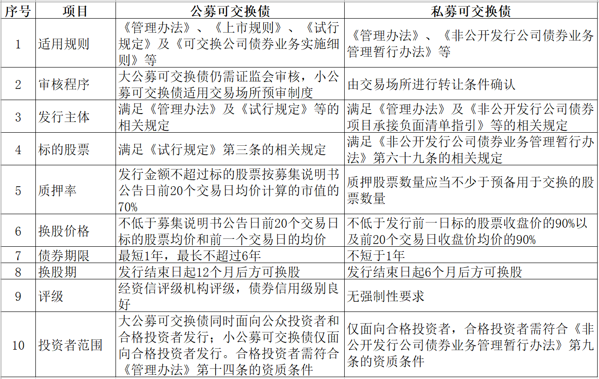
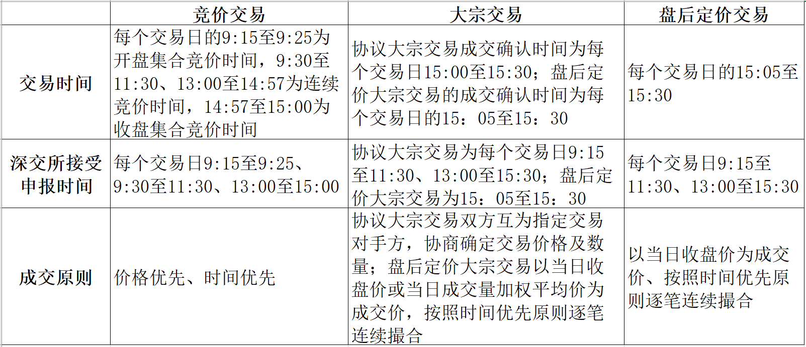

# 证券学院

## 规则解读

### 01. 关于《深圳证券交易所股票上市规则（2014年修订）》、《深圳证券交易所创业板股票上市规则（2014年修订）》修订部分的解读

为贯彻党的十八届四中全会“依法治国”的精神，以法治思维推进资本市场改革，为资本市场营造透明、良好的法治环境，深交所将“推进依法治市，构建科学透明的业务规则体系”作为一年一度的“12.4”法制宣传日活动的主题。

今年10月修订的《深圳证券交易所股票上市规则（2014年修订）》、《深圳证券交易所创业板股票上市规则（2014年修订）》已于2014年11月16日开始施行，本次修订的主要内容包括健全上市公司主动退市制度、细化重大违法公司强制退市制度、丰富强制退市指标、完善退市配套制度、完善重新上市制度。为帮助上市公司、市场中介机构及投资者等市场主体更好的理解规则，现对修订部分作以下解读：

#### 一、问：上市公司主动退市的方式有哪些？

上市公司基于保证公司控制权、实现发展战略等多种考量，可能认为不再需要维持在深交所的上市地位。为尊重上市公司的意思自治，修订后的《上市规则》新增了以下两种主动退市途径：

（1）上市公司股东大会决议主动撤回其股票在本所上市交易、并决定不再在交易所交易；    
（2）上市公司股东大会决议主动撤回其股票在本所上市交易，并转而申请在其他交易场所交易或转让；

原《上市规则》的五种主动退市途径在修订后继续保留：

（3）上市公司股东大会决议解散；    
（4）上市公司因新设合并或者吸收合并，不再具有独立主体资格并被注销；    
（5）上市公司以终止公司股票上市为目的向公司所有股东发出回购全部股份或者部分股份的要约，导致公司股本总额、股权分布等发生变化不再具备上市条件；    
（6）上市公司股东以终止公司股票上市为目的，向公司所有其他股东发出收购全部股份或者部分股份的要约，导致公司股本总额、股权分布等发生变化不再具备上市条件；    
（7）上市公司股东以外的其他收购人以终止公司股票上市为目的，向公司所有股东发出收购全部股份或者部分股份的要约，导致公司股本总额、股权分布等发生变化不再具备上市条件。

#### 二、问：上市公司主动退市的程序有哪些环节？

（一）为保障投资者的知情权，发出股东大会通知前公司应履行下列义务并充分披露：

（1）上市公司应当披露主动退市方案、退市原因及退市后的发展战略，包括并购重组安排、经营发展计划、股份转让安排、重新上市安排、异议股东保护的专项说明等；

（2）独立董事应当充分征询中小投资者，即除上市公司的董事、监事、高级管理人员、单独或者合计持有上市公司5%以上股份的股东以外的其他股东意见，并在此基础上发表独立意见；

（3）上市公司应当聘请财务顾问为主动退市提供专业服务，并发表专业意见。

（二）停牌。上市公司拟决定其股票不再在本所交易，或者转而申请在其他交易场所交易或者转让的主动退市情形，上市公司股票及其衍生品种自股东大会股权登记日的次一交易日起停牌。

（三）股东大会投票。股东大会实施“双2/3”的表决机制，以保障中小投资者的决策权。退市决定不仅须经出席会议的股东所持表决权的2/3以上，且须经出席会议的中小投资者，即除上市公司的董事、监事、高级管理人员、单独或者合计持有上市公司5%以上股份的股东以外的其他股东所持表决权的2/3以上通过。

（四）股东大会审议结果的披露。股东大会审议通过主动退市决议后应及时披露决议情况。公司可以在股东大会决议后的十五个交易日内向本所提交主动终止上市的书面申请。如果上市公司主动退市决议未获股东大会审议通过，其股票及其衍生品种自公司股东大会决议公告当日起复牌。

（五）交易所受理退市申请。规定期限内提出主动退市申请的，本所将在收到申请后五个交易日内作出是否受理的决定并通知公司。公司应当在收到是否受理其申请的决定后，及时披露决定的有关情况并提示其股票可能终止上市的风险。

（六）交易所审核。本所上市委员会对公司股票终止上市的申请进行审议，作出独立的专业判断并形成审核意见。主要从以下两个方面进行审核：1、审查主动退市内部决策程序和信息披露的合规性；2、从投资者角度，重点审查投资者权益是否得到有效保护。审查主动退市公司对异议股东回购请求权、现金选择权等投资者保护措施是否作出具体安排；审查主动退市公司是否对其退市后的股份转让作出具体安排，保护退市后投资者的交易权。

（七）交易所审核期限。本所将在受理公司申请后的十五个交易日内，依据上市委员会意见作出是否同意公司股票终止上市申请的决定。本所将在作出同意公司股票终止上市决定后两个交易日内通知公司，并于两个交易日内发布相关公告。

#### 三、问：重大违法强制退市包含哪些情形？

本次修订新增“欺诈发行”和“重大信息披露违法”两种重大违法强制退市的情形。

欺诈发行，是指因公司IPO申请、披露文件存在虚假记载、误导性陈述或者重大遗漏，导致以下严重后果：1、不符合发行条件的发行人骗取了发行核准，受到中国证监会行政处罚；2、虽符合IPO发行条件，但对新股发行定价产生了实质性影响，受到中国证监会行政处罚；3、因涉嫌欺诈发行罪被中国证监会依法移送公安机关。

重大信息披露违法，是指上市公司因信息披露文件存在虚假记载、误导性陈述或者重大遗漏，导致以下严重后果：1、受到中国证监会行政处罚，并且因违法行为性质恶劣、情节严重、市场影响重大，在行政处罚决定书中被认定构成重大违法行为；2、因涉嫌违规披露、不披露重要信息罪被中国证监会依法移送公安机关。

#### 四、问：重大违法强制退市制度如何保障投资者的合法权益？

充分揭示风险、保证投资者交易权利。公司因涉嫌重大违法被中国证监会立案稽查，公司应当每月披露一次风险提示公告，说明立案稽查的情况进展，充分揭示可能存在的退市风险。深交所可视情况要求公司增加风险提示公告的披露次数。

为给予投资者必要的交易机会，在公司公告收到中国证监会行政处罚决定书或因涉嫌犯罪被依法移送公安机关后，再继续交易30个交易日后暂停上市。期间，深交所将对主板、中小企业板公司股票实行退市风险警示（*ST）处理。

#### 五、如何减轻因“错案”导致上市公司的合法权益受损？

出现下列情形之一的，深交所将在收到相关决定或裁判文书起的五个交易日内，作出撤销对公司股票暂停上市的决定，公司可随后提出恢复上市的申请：1、中国证监会行政处罚决定依法被撤销，且中国证监会不能以重大违法为由重新对公司作出行政处罚决定；2、因对违法行为性质的认定发生根本性变化，中国证监会依法变更原行政处罚决定；3、公安机关决定不予立案或者撤销案件，且证监会不能以重大违法为由对公司作出行政处罚决定的；4、人民检察院作出不起诉决定，且证监会不能以重大违法为由对公司作出行政处罚决定的；5、司法机关作出无罪判决或者免于刑事处罚，且证监会不能以重大违法为由对公司作出行政处罚决定的。

若前述1至5项情形发生在深交所作出终止公司股票上市交易决定后的，公司可以向深交所提出恢复其股票正常交易的申请。

#### 六、问：针对重大违法强制退市情形，深交所新增哪些措施以保护投资者利益？

（一）强化信息披露要求，及时揭示风险。本次修订，对重大违法公司相应的信息披露义务作出明确规定，包括：信息披露时点、公告内容要求、停复牌程序以及对投资者风险提示的特别要求等。

（二）强化投资者损失赔偿要求。对于重大违法强制退市公司，在恢复上市和重新上市申请条件上，明确要求相关责任主体应当对民事赔偿责任做出妥善安排。

（三）增加限制相关主体股份减持行为的规定。本次修订强化违规责任追究，要求上市公司董事、监事、高级管理人员、控股股东、实际控制人、持有上市公司首次公开发行股票前已发行股份的股东、重组方及其一致行动人、上市公司购买资产对应经营实体的股份或者股权持有人，以及持有法律、行政法规、部门规章、规范性文件和深交所规定的限售股的股东或者其他自愿承诺股份限售的股东，应当遵守其作出的公开承诺，如上市公司因首次公开发行股票、发行新股、构成借壳上市的重大资产重组的申请或者相关披露文件存在虚假记载、误导性陈述或者重大遗漏被证监会立案稽查的，暂停转让其拥有权益的公司股份。

#### 七、问：重大违法暂停上市后申请恢复上市的条件有哪些？

（一）全面纠正违法行为。重大信息披露违法行为所涉事项已进行补充披露或更正公告、已补充履行相关决策程序、损失已获得弥补、可能引发的与公司相关的风险因素已消除。

（二）撤换有关责任人员。已撤换被中国证监会依法移送公安机关立案调查的人员、被中国证监会行政处罚的有关人员、被法院判决有罪的有关人员，以及本所认定的对重大信息披露违法行为负有重要责任的其他人员

（三）对民事赔偿责任作出妥善安排。判决或和解已执行完毕；未达成和解的，已按预计最高索赔金额计提赔偿基金，并将足额资金划入基金专户存储；公司的控股股东及其实际控制人或第三方已承诺：将对赔偿基金不足或未予赔偿的部分代为赔付。

#### 八、问：新增哪些不满足交易标准的强制退市指标？

根据《退市意见》要求，本次将在本所《上市规则》增加最低股东人数退市指标，进一步动态反映上市公司的股权分布状况：

（一）主板上市公司连续二十个交易日（不含公司股票全天停牌的交易日、不含公司首次公开发行股票上市之日起的前二十个交易日）股东人数低于2000人的，中小企业板上市公司连续二十个交易日（不含公司股票全天停牌的交易日、不含公司首次公开发行股票上市之日起的前二十个交易日）股东人数低于1000人的，本所对其公司股票终止上市。

（二）主板上市公司出现连续十个交易日股东人数低于2000人的，中小企业板上市公司出现连续十个交易日股东人数低于1000人的，应当在次一交易日发布公司股票可能被终止上市的风险提示公告，其后每个交易日披露一次，直至最低股东人数的情形消除或者本所作出公司股票终止上市的决定。

#### 九、创业板公司退市公司是否适能申请重新上市？

创业板公司退市公司不能申请重新上市，创业板自设立起即无重新上市制度，本次修订未做改变。

#### 十、问：重新上市申请条件有何变化？

鉴于上市公司借壳条件已与IPO等同，为了保证市场准入门槛的一致性，本次以比照IPO条件为原则，对重新上市申请条件进行了修订，修改了以下两个条件：

（一）公司最近三个会计年度的财务会计报告未被出具保留意见、无法表示意见或者否定意见的审计报告；

（二）公司最近三个会计年度经审计的净利润均为正值且累计超过三千万元（净利润以扣除非经常性损益前后较低者为计算依据）；

新增与现金流量、主营业务、董监高变化与任职条件、实际控制人相关的五个条件：

（三）公司最近三个会计年度经营活动产生的现金流量净额累计超过五千万元；或者公司最近三个会计年度营业收入累计超过三亿元；

（四）公司最近三年主营业务未发生重大变化；

（五）公司最近三年董事、高级管理人员未发生重大变化；

（六）公司最近三年实际控制人未发生变更；

（七）公司董事、监事、高级管理人员具备法律、行政法规、部门规章、规范性文件、深交所有关规定及公司章程规定的任职资格，且不存在影响其任职的情形。

#### 十一、问：深交所重新上市审核过程中关注哪些内容？

除《股票上市规则》规定的重新上市基本条件外，深交所还将对公司以下情况予以重点关注：

（一）公司是否符合国家产业政策和环境保护、土地管理、反垄断等法律、行政法规等有关规定；

（二）公司与控股股东、实际控制人及其关联人在人员、资产、财务、机构和业务等方面是否保持独立，是否存在严重影响公司独立性或者显失公允的关联交易或者同业竞争，公司的资产权属是否清晰；

（三）退市后实施的重大资产重组、破产重整等事项是否合法合规；

（四）公司的股权结构是否清晰，主要股东所持股份变动情况及其股权是否存在瑕疵；

（五）退市整理期间及退市后，公司是否因涉嫌内幕交易、市场操纵等被中国证监会立案调查或者司法机关立案侦查；

（六）公司最近三年内是否受过刑事处罚、行政处罚、证券交易所纪律处分等。

#### 十二、问：已退市公司是否适用新的重新上市规则？

为稳定市场预期，对于本次修订后的《股票上市规则》发布前，即2014年11月16日前已退市的公司，如在新规则施行后的36个月内申请重新上市的，仍适用深交所《股票上市规则（2012年修订）》规定的重新上市条件。

此外，深交所《股票上市规则（2012年修订）》第14.4.1条第二款第（九）项规定“公司在申请重新上市前进行重大资产重组且实际控制人发生变更的，须符合中国证监会规定的借壳上市条件”。

#### 十三、问：是否颁布有关重新上市与退市整理期的具体规定？

深交所已于2014年10月19日就《深圳证券交易所退市公司重新上市实施办法》（2014年修订）（以下简称《重新上市实施办法》）和《深圳证券交易所退市整理期业务特别规定》（2014年修订）（以下简称《退市整理期特别规定》）向社会公开征求意见，公开征求意见结束后，将公布上述规则。

《退市整理期特别规定》正在公开征求意见阶段，以下问题的解答以正式发布的《退市整理期业务特别规定（2014年修订）》为准，敬请留意。

#### 十四、问：为什么要设立退市整理期？

目的是为投资者提供必要的交易机会，充分释放风险。深交所做出上市公司股票终止上市决定后五个交易日届满的次一交易日起，公司股票进入退市整理板交易三十个交易日。期限届满后，深交所将对公司股票予以摘牌。

#### 十五、问：主动退市公司可否适用退市整理期？

《上市规则》明确规定主动退市公司不适用退市整理期。主动退市是股东自治的结果，相关主体已对主动退市过程中的异议股东权益保护、退市后的去向等作出了妥善安排。因此，修订后的《退市整理期业务特别规定》明确，强制退市公司必须进入退市整理期，主动退市公司不适用退市整理期的相关规定。

#### 十六、问：退市整理期间对投资者资格是否有特别规定？

修订后的《退市整理期特别规定（2014年修订）》规定，投资者在签订风险揭示书基础上，参与退市整理期股票交易还应具备以下条件：（一）两年以上股票交易经验；（二）其证券资产总额不低于人民币50万元。

#### 十七、除上述投资者适当性措施外，深交所还采取了哪些措施确保充分揭示退市风险？

退市整理期制度设计上，主要遵循既给予投资者交易机会，又对参与整理期股票交易的投资者进行必要警示的原则，除采取投资者适当性管理措施外，还采取了以下措施防范恶意炒作，化解退市风险。

（一）证券简称后缀加“退”字，行情另板揭示；

（二）强化退市风险提示性公告的披露要求。公司前二十五个交易日，每五个交易日披露一次退市风险提示性公告，最后五个交易日每日披露一次，深交所有权视情况要求公司调整披露频率；

（三）充分提示最后交易日。退市整理期期间，要求公司在所有公告中以“特别提示”方式披露“最后交易日”、“剩余交易日”，充分揭示终止上市风险；

（四）严格进行二级市场交易监控，每日交易信息向市场公开。

有关“退市整理期”股票的日涨跌幅、行情揭示、公开信息等具体事项请查阅深交所《股票交易规则》和《退市整理期业务特别规定》。

#### 十八、问：退市整理期可否筹划重组？

为了防止不法之徒利用重组等重大信息进行恶意炒作，保护投资者的合法权益，深交所规定，退市整理期间，公司不得筹划或者实施重大资产重组等重大事项。

特别提示：本退市制度解读仅供上市公司、中介机构、投资者等市场主体参考，具体业务请按照正式公布的业务规则办理。

### 02. 债市新规解读系列之一：公司债券发行上市审核新政策

时间：2015-11-02

今年年初，证监会发布了《公司债券发行与交易管理办法》（下称“《管理办法》”），对原《公司债券发行试点办法》的内容和形式进行全面升级。为配合《管理办法》的实施，交易所也对《公司债券上市规则》进行了相应修订，并出台了《公司债券上市预审核工作流程》，对公开发行公司债券（下称“公司债券”）的发行及上市等相关工作进行规范。新规则颁布以来，不仅发行主体由上市公司扩大至所有公司制法人，债券类别细分为同时面向公众投资者和合格投资者发行的公司债券（下称“大公募债券”）和仅面向合格投资者发行的公司债券（下称“小公募债券”），发行及上市审核程序、审核方式、信息披露、持有人保护机制、中介机构职责及责任以及投资者适当性管理等方面也发生了重大变化（信息披露及持有保护机制将在后续系列文章中进行详细介绍）。

#### 发行及上市审核程序发生了哪些变化？

一是新增了“小公募预审核”程序，取消发审委制度。

根据《管理办法》的规定，小公募债券的发行及上市申请不再直接由证监会核准，而是先由交易所进行预审核。证监会以交易所的预审核意见为基础履行简易核准程序，一般不超过十个工作日。

从预审核工作流程的特点来看，首先是环节少，分为受理、审核、反馈、决定等环节，取消了发审会。

其次是时限短，交易所内部一般程序的预审核工作时间总计不超过二十个工作日，包括受理时限（二个工作日）、审核时限（十个工作日）、决定时限（五个工作日）和封卷时限（三个工作日）。具体来说，交易所收到申请材料后应于二个工作日内进行齐备性审核并决定是否受理；自受理之日起，审核人员应当在十个工作日内对申请材料审核完毕，并召开反馈会议、确定需向发行人出具的书面反馈意见；自收到发行人最后一次反馈意见回复后，交易所应当在五个工作日内召开审核专家会议，讨论并形成公司债券预审核结果，审核结果分为“通过”、“未通过”及“有条件通过”；审核结果为“通过”的，交易所应于收到申请原件后三个工作日内完成封卷，并向发行人出具预审意见函。

再次是程序灵活，对于资质优良且信息披露完备的申请材料可以按照简易流程进行预审核工作，如：对于已成功发行并上市后拟再次发行且发行人基本面无重大变化的申请材料。为进一步提供便利，就通过预审核的“小公募债券”项目，发行人还可以直接在交易所办理证监会行政许可申请受理及领取行政许可批文。

第四是过程透明，预审核申请材料的接收、意见反馈、反馈意见回复、预审核决定等均通过固定收益品种业务专区“公司债上市预审核申请”栏目进行，实现全流程电子化。主承销商仅需通过登录该业务专区，即可完成材料提交、补充材料、查收反馈意见等相关工作，并可实时查询项目进展状态。审核流程每一环节的进度及审核结果均对外披露，接受社会公众监督。

除“小公募预审核”程序外，发行及上市制度中的另一项重大变化是在上市申请环节取消了上市推荐人和上市委审议制度，只要申请材料完备，符合上市条件，交易所受理申请后将在五个交易日内作出同意上市决定。

#### 审核方式发生哪些变化？

在“小公募债券”预审核方式及内容上，主要是从申请材料齐备性、发行上市条件合法性、信息披露完整性以及特殊行业规范性四方面进行审核。根据市场化原则，审核重点仍然是信息披露，即需满足齐备性、一致性和可理解性的要求，除法定发行条件外，审核人员并不对发行人的经营风险、盈利能力进行实质审核，但发行人应当在募集说明书就可能影响投资人决策的重大事项进行充分披露。

#### 中介机构应承担哪些职责？

《公司债券上市预审核工作流程》明确规定，发行人、承销机构及相关中介机构应当对其所出具的公司债券发行及上市申请材料的真实性、准确性、完整性和及时性负责，并承担相应法律责任，其制作、出具的文件不得有虚假记载、误导性陈述或者重大遗漏。《公司债券上市规则（2015修订）》也规定，为债券发行、上市、交易提供服务的专业机构及其相关人员应当严格遵守执业规范和职业道德及自律监管规则，勤勉尽责、诚实守信，按规定和约定履行义务。

同时《公司债券上市规则（2015修订）》还进一步规定，发行人公告的文件存在虚假记载、误导性陈述或者重大遗漏，致使投资者遭受损失的，发行人应当承担赔偿责任；发行人的董事、监事、高级管理人员和其他直接责任人员以及承销机构，应当与发行人承担连带赔偿责任，但是能够证明自己没有过错的除外；除承销机构以外的专业机构及其直接责任人员应当就其负有责任的部分承担赔偿责任，但是能够证明自己没有过错的除外。就上述职责与责任，中介机构还应当在申请材料中进行声明和承诺。

#### 投资者应如何投资？

《管理办法》将公司债券投资者分为公众投资者和合格投资者，合格投资者包括：金融机构、金融机构发行的理财产品、净资产不低于1000万的企事业法人和合伙企业、QFII和RQFII、社保年金、金融资产不低于300万的个人投资者以及经证监会认可的其他合格投资者。同时，《管理办法》将公司债券划分为大公募债券和小公募债券，大公募债券需满足条件的包括：最近三年无债务违约或者延迟支付本息的事实、最近三个会计年度实现的年均可分配利润不少于债券一年利息的1.5倍以及债券信用评级需达到AAA级。需要注意的是，满足大公募债券条件的债券也可以选择仅面向合格投资者发行，从而成为小公募债券。

对公众投资者而言，其仅能投资大公募债券。小公募债券仅面向合格投资者发行有利于防止高风险债券过度暴露于风险承担能力较差的个人投资者，避免投资者承受超出其承受能力的损失。近年来债券违约事件不绝于耳，投资者必须打破刚性兑付的习惯性思维，特别是对高利率的公司债券，很可能伴随着高风险，应当引起投资者高度重视。

总之，投资者在进行公司债券投资时，要保持理性的投资观念，审慎选择投资类型，充分关注债券发行文件中的风险提示，警惕投资风险。

### 03. 债市新规解读系列之二：公开发行公司债券分类及投资者适当性管理

时间：2015-11-02

证监会《公司债券发行与交易管理办法》（以下简称“《管理办法》”）根据投资者的风险识别和承担能力，将投资者划分为公众投资者和合格投资者；根据公司债券的资信状况及发行对象，将其分为公众投资者和合格投资者均可投资的“大公募”债券以及仅合格投资者可交易的“小公募”债券。在此基础上，交易所在《深圳证券交易所公司债券上市规则（2015年修订）》（以下简称“《上市规则》”）中制订了相应的条款，建立了公司债券的分类及投资者适当性管理制度。

#### 根据新《上市规则》，公司债券是如何分类管理的？

根据新《上市规则》的规定，按照其要求发行并上市的公司债券，分为“大公募”债券及“小公募”债券。“大公募”债券资信情况较好，要求较高，首先是信用评级高，需达到AAA级；其次是发行人近三年不得有债务违约或者延迟支付本息的情况；再次要求发行人近三年的年均可分配利润不少于债券一年利息的1.5倍。鉴于“大公募”债券门槛较高，这类债券是允许公众投资者及合格投资者都参与投交易的。

不符合以上条件的均属于“小公募”债券，仅允许合格投资者参与交易；但“大公募”债券如果选择仅面向合格投资者发行的话，也可以“自愿”成为“小公募”债券。此外，“大公募”债券存续期间如发生债券信用评级下调至低于AAA级，或者发行人发生债务违约、延迟支付本息、其他可能对债券还本付息产生重大影响的事件的，将被降板为“小公募”债券。由“大公募”降板为“小公募”的公司债券，公众投资者不能再买入，降板前持有的份额可以选择卖出或持有到期。

公司债券除了根据债券资信和发行对象划分为“大”、“小”公募进行分类管理外，“大公募”债券和“小公募”债券的交易方式也有所区别。“大公募”债券可以同时采取集合竞价和协议交易方式（即“双边挂牌”方式），公众投资者参与此类债券交易有较好的流通性。“小公募”债券只有同时符合“债券信用评级AA级及以上”，“发行人最近一期末的资产负债率不高于75%，或者最近一期末的净资产不低于5亿元人民币”，“近三年的年均可分配利润不少于债券一年利息的1.5倍”等条件，方可采取集合竞价和协议交易方式；其中任何一个条件不能达到的，则仅可采取协议交易方式（即“单边挂牌”方式）。

#### 存量公司债券是否也按“大公募”、“小公募”进行分类管理？

根据《深圳证券交易所公司债券上市规则（2012年修订）》发行并上市的存量公司债券主要分为双边挂牌未实行风险警示债券、风险警示债券及单边挂牌债券三类，新《上市规则》的发布通知对存量债券的过渡衔接安排作出了详细说明。一是存量单边挂牌债券在其存续期间不作任何调整，仍按现有方式进行交易且不实行投资者适当性管理。二是存量风险警示债券在新《上市规则》发布施行之日直接划归为“小公募”债券，恢复简称并仅由合格投资者参与交易，公众投资者不得买入，已持有该类债券的公众投资者仅可卖出或持有到期，但维持原挂牌方式。三是存量双边挂牌未实行风险警示债券，存续期间将按现有方式进行交易，即参照“大公募”债券管理，但如果发行人发生（1）信用等级下调，如主体评级或债项评级为AA-级以下（含），或主体评级为AA级且评级展望为负面；（2）年报亏损；（3）重大违法违规等任何一种情形的，将“降板”为“小公募”债券：

需要特别提示的是，以上所述存量双边挂牌未实行风险警示债券，其降板条件与按照新《上市规则》上市的“大公募”债券的降板条件不同，投资者应予以明确区分。为方便投资者辨识该类存量债券，深交所官网（WWW.SZSE.CN）的“综合协议交易平台/固定收益信息平台”—“业务栏目” 中将定期公布其清单。

#### 深交所对公众投资者和合格投资者是如何管理的？投资者将如何获得合格投资者资格？

《管理办法》规定，合格投资者包括：金融机构、金融机构发行的理财产品、净资产不低于1000万的企事业法人和合伙企业、QFII和RQFII、社保年金、金融资产不低于300万的个人投资者以及经证监会认可的其他合格投资者。根据新《上市规则》，合格投资者的甄别及投资者适当性管理的职责由交易所会员单位履行。

具体而言，会员单位应在甄别投资者资质条件后，与符合条件的投资者签订《风险揭示书》，并为其开通交易权限。在开通交易权限的当日，会员单位应将符合资质条件的合格投资者名单报备到交易所，由交易所对名单中的合格投资者交易情况进行管理。如未报备的投资者存在交易情形的，交易所将督促会员单位对相关情况进行核实并及时取消不符合合格投资者条件的账户的交易权限。

投资者申请合格投资者资格应向所在会员单位提交符合《管理办法》规定的资质条件的证明，与所在会员单位签订《风险揭示书》，在投资时应对所投资债券的资质具有充分的认识并自行承担相应的投资风险。

#### 公司债券降板为 “小公募”时投资者将如何交易？

公司债券触发降板条件时，发行人应当进行公告，向投资者充分披露其债券降板的情况及投资者适当性安排调整的时间。会员单位在收到本所发出调整通知后，应对相应的投资者进行交易权限控制。公众投资者将不能再买入“小公募”债券，原持有的债券仅能卖出或持有到期。投资者应关注投资债券的公告，充分注意投资风险。

### 04. 债市新规解读系列之三：公开发行公司债券投资者权益保护机制解读

时间：2015-11-02

近期，根据中国证监会《公司债券发行与交易管理办法》（以下简称“《管理办法》”）及其他有关规定，深交所发布了《深圳证券交易所公司债券上市规则（2015年修订）》（以下简称“《上市规则》”），《上市规则》专设章节规定债券持有人权益保护制度，建立了“偿债保障义务与措施制度”、“债券受托管理人制度”、“债券持有人会议制度”三重投资者权益保护机制，明确发行人和增信机构的偿债保障义务，强化受托管理人在债券持有人权益保护中的重要地位及信息披露要求，细化债券持有人会议召开情形、程序及决议约束力。具体情况如下：

#### 债券偿债保障义务与措施有哪些？

债券一旦发行之后，发行人便有义务按时履行回售、利率调整、分期偿还、还本付息等法定或约定义务。发行人如果出现无法按时还本付息的情况，增信机构等应当按照募集说明书及相关协议的约定及时向债券投资者履行偿付义务，承销机构、受托管理人应当协助投资者维护相关权利。

此外，《管理办法》规定发行人可以采取内外部增信机制等偿债保障措施，用于提高偿债能力，包括第三方担保、商业保险、资产抵押或质押担保、限制发行人债务及对外担保规模、限制发行人对外投资规模、限制发行人向第三方出售或抵押主要资产、设置债券回售条款等，这些措施均有利于保障投资者的利益。

#### 受托管理人的义务及职责是什么？

根据《管理办法》、《上市规则》的规定，债券发行人有义务为债券投资者聘请受托管理人，受托管理人由债券发行的承销机构或其他经中国证监会认可的机构担任，并且还应该是中国证券业协会的会员。相关机构一旦成为受托管理人，就应勤勉尽责，公正履行受托管理职责，保护债券投资者的利益。

在债券存续期内，受托管理人要持续关注发行人的还本付息能力以及担保等增信措施的有效性，监督发行人募集资金的使用情况，持续督导发行人履行信息披露义务，处理债券持有人与发行人之间的谈判或者诉讼事务。受托管理人在每年6月30日前要向投资者出具上一年度的受托管理事务报告，必要时应出具临时受托管理报告。受托管理人预计发行人不能偿还债务时，可要求发行人追加担保，并可以依法申请法定机关采取财产保全措施。

当发行人信息披露文件存在虚假记载、误导性陈述或者重大遗漏，致使投资者遭受损失的，或者债券出现违约情形或风险的，受托管理人要及时通过召开债券持有人会议等方式征集债券持有人的意见，并勤勉尽责、及时有效地采取相关措施，例如，与发行人、担保人及其他责任主体进行谈判，提起民事诉讼、申请仲裁、参与重组或者破产的法律程序等。

#### 债券持有人会议的规则与作用是什么？

发行人要在债券募集说明书中约定债券持有人会议的规则，规则的设定应当有利于保护债券持有人利益，明确债券持有人会议行使权利的范围，以及债券持有人会议的召集、通知、决策机制和其他重要事项。

债券存续期间，出现相关情况时，受托管理人应当及时召集债券持有人会议，例如发行人拟变更债券募集说明书的约定，拟修改债券持有人会议规则，拟变更债券受托管理人或者受托管理协议的主要内容，发行人不能按期支付本息，发行人减资、合并、分立、解散或者申请破产，增信机构和增信措施发生重大变化等。受托管理人应当召集却未召集债券持有人会议时，发行人、单独或者合计持有本期债券总额10%以上的债券持有人有权自行召集债券持有人会议。

债券持有人会议通过的决议，对所有债券持有人均有同等约束力。受托管理人依据债券持有人会议决议行事的结果由全体债券持有人承担。债券持有人会议应当有书面会议记录，会议记录由出席会议的受托管理人或者召集人代表和见证律师签名，受托管理人或者召集人应当在债券持有人会议表决截止日次一交易日披露会议决议公告。

### 05. 债市新规解读系列之四：公开发行公司债券信息披露及停复牌制度解读

时间：2015-11-02

为保护投资者利益，实现市场的公正公平，证监会近期公布实施的《公司债券发行与交易管理办法》（以下简称“《管理办法》”）中，对信息披露所涉及的财务信息、募集资金用途、评级、重大事项等重点环节强化了监管要求。在此基础上，交易所在《深圳证券交易所公司债券上市规则（2015年修订）》（以下简称“《上市规则》”）中制订了相应的条款，建立了公开发行公司债券的信息披露制度。同时，为确保信息披露的及时与公平，《上市规则》还就停牌、复牌等事项做出了规定。具体情况如下：

#### 相较旧版《上市规则》，信息披露制度有哪些优化？

新版《上市规则》基于信息披露公平、准确的原则性要求，进一步优化和规范债券信息披露制度，体现以信息披露为核心的监管原则。一是强化信息披露及时性要求，如出现信息披露不及时不充分的情况，为保障债券持有人的合法权益，交易所可采取主动停牌等措施直至相关情形消失；二是信息披露义务人不再局限于发行人及其董事、监事和高级管理人员。发行人及其董事、监事、高级管理人员、控股股东、实际控制人以及承销机构、资信评级机构、受托管理人、会计师事务所、资产评估机构、律师事务所等专业机构及其相关人员均为信息披露义务人，并增加信息披露联络人制度；三是完善信息披露程序、原则及方式等，增加暂缓、豁免及自愿披露规定；四是规范定期报告和临时报告披露要求，明确重大事项公告和跟踪评级报告的披露情形、时间等规定，提高信息披露的透明度。

#### 信息披露的基本原则有哪些？

信息披露文件是投资者了解发行人经营状况并做出投资决策的重要载体，因此根据《管理办法》、《上市规则》的规定，发行人应当及时、公平地向投资者披露信息，并保证所披露的信息真实、准确、完整，不得有虚假记载、误导性陈述或者重大遗漏。

同时，信息披露文件所涉及的相关中介机构应具有相关业务资格认证，并对所出具的募集说明书、审计报告、法律意见书、资产评估报告、信用评级报告等文件的真实性、准确性、完整性和及时性负责，并承担相应法律责任。

为保证信息披露的公平性，信息披露义务人应当同时向全体投资者披露，不得提前向任何单位和个人披露、透露或者泄漏。信息披露知情人在信息正式披露前，应当确保将该信息的知情者控制在最小范围内，在公告前不得透露和泄漏其内容，不得进行内幕交易、操纵市场等不正当行为。

#### 信息披露的内容有哪些？

发行人应当披露的信息包括定期报告和临时报告，以确保在债券存续期内投资人可持续掌握其生产经营状况及偿债能力。

定期报告包括年度报告和中期报告，分别应于每一会计年度结束之日起四个月内及每一会计年度的上半年结束之日起二个月内披露。定期报告包括但不限于发行人的经营状况、财务报告、募集资金使用情况、信用跟踪评级情况、增信措施变化等，发行人应当确保定期报告按时披露，并充分说明是否存在影响债券偿付本息能力的情形及其他风险。

临时报告是指按照相关规定发布的除定期报告以外的公告。一般在债券存续期内，发行人如果发生可能影响其偿债能力或者债券价格的重大事项，信息披露义务人应当立即公告，告知全体投资者发生影响投资决策的重大变化事件的起因、目前的状态和可能产生的后果等，如后续产生对发行人偿债能力有较大影响的进展或者变化也应及时披露。另外，付息或本金兑付、调整票面利率、回售及赎回选择权、信用跟踪评级等事项，发行人均会在募集说明书约定的时限内进行信息披露。

#### 信息披露的渠道有哪些？

为保障债券持有人的信息知情权，提升债券市场服务水平，目前信息披露的渠道由互联网及证监会指定报刊相结合，以便社会公众及时有效地获取相关内容。发行人在其他公共媒体发布重大信息的时间不得先于指定媒体，在指定媒体上公告之前不得以新闻发布或者答记者问等任何其他方式透露、泄漏未公开重大信息。

#### 停牌、复牌制度如何加强债券持有人权益保护？

为保障信息披露的公平性原则，保护债券持有人合法权益，维护债券市场稳定，在新版《上市规则》中优化了债券停复牌的相关规定，增加了发行人申请和本所视情况主动停复牌等内容，保障了所有投资者的信息知情权。具体来看停牌操作有以下三种情形：

发行人应当申请停牌情形：在债券存续期内，如信息披露涉及应当披露却存在不确定因素且预计难以保密的，或者在按规定披露前已经泄漏的重大信息，或者媒体出现发行人尚未披露的信息，并可能或者已经导致对债券持有人利益有重大影响的情形时，发行人应当立即向交易所申请停牌，直至按规定披露后复牌。

发行人可以申请停牌情形：评级信息披露前或《上市规则》中未有明确规定的可以以合理理由申请。

本所视情况主动停牌情形：如发行人出现影响其偿债能力或者债券价格的重大事项，不能按时还本付息，失去发行人有效信息来源，未按照相关规定申请停牌等情形时，交易所可对其债券主动实施停牌，直至上述情况消除后复牌。

### 06. 债市新规解读系列之五：非公开发行公司债券提供转让新政策

时间：2015-11-02

今年5月，为配合证监会《公司债券发行与交易管理办法》（下称“《管理办法》”）的实施，交易所在现有私募品种相关规则的基础上制定了《非公开发行公司债券业务管理暂行办法》（下称“《管理暂行办法》”），不仅发行主体由中小微型企业扩大至所有公司制法人，对非公开发行公司债券（以下简称“私募债券”）转让程序、投资者适当性管理、信息披露、持有人保护机制等方面也予以规范，形成全面系统的私募债券业务规则。

#### 《管理暂行办法》制度设计要点？

首先，为全面规范私募债券转让行为，提高交易所业务规则的整体性和系统性，本次是在整合现有私募品种规则基础上，形成的系统性私募债券业务规则体系。因此，《管理暂行办法》规范的债券品种包括私募债券（含中小企业私募债券）、可交换私募债券、并购重组私募债券、证券公司次级债券及证券公司短期公司债券等，并专设章节从产品设计与信息披露等方面对可交换私募债券等特殊私募品种提出规范性要求。

其次，简化转让程序、提高转让效率是本次规则的亮点之一。其主要体现在将交易所转让核对程序前置，在发行前由发行人提交转让条件确认申请，交易所将在十个交易日内对私募债券是否符合转让条件进行预判，以明确转让预期，加快转让流程。在发行完成并办理完毕债券登记托管手续后，发行人再提交转让服务申请材料，交易所将在五个交易日内作出是否同意转让的决定。为提高效率，交易所也搭建了一套全电子化的操作平台，从材料提交、补充、反馈、决定的每一环节均可在固定收益品种业务专区中实时查询并接受公众监督。至此，交易所私募债券的核对效率远超证券市场上相关债券类产品。

同时，本次制度设计结合其私募债券的产品特点，充分体现出市场化与风险防控并重的原则。在市场化机制安排上，一是降低私募债券发行转让门槛，不设发行人财务指标等量化条件；二是交易所转让核对的关注点是信息披露完备性，并不对发行人经营能力、债券投资风险进行实质性判断；三是存续期不对定期报告和评级报告作强制性披露要求，仅需在募集说明书中进行约定；四是允许采用非标准化产品设计，债券期限、还本付息方式、选择权条款、增信措施等可以在募集说明书中灵活自由选择。在风险防控方面，一是采取投资者适当性管理，限制个人投资者参与私募债券投资，仅允许具有一定风险识别、管理和承受能力的机构投资者参与，并同次债券的投资者人数限制在200人内；二是强化受托管理人和债券持有人会议制度安排，全面规范受托管理人职责及持有人会议程序，最大化保护持有人合法权益；三是完善信息披露监管，规范信息披露原则与披露要求，进一步体现以信息披露为核心的监管理念；四是优化私募债券停复牌规定，维护市场稳定，防范异常交易行为。

#### 投资者权益保护措施主要包括哪些内容？

《管理暂行办法》专设章节建立了一般权益保护措施、债券受托管理人及持有人会议制度三重权益保护机制，并新增规范发行人、承销机构及相关中介机构对私募债券转让申请材料及相关公告应承担的职责。

根据《管理办法》的规定，一般权益保护措施中增加了募集资金专户的设立要求，且与偿债保障金专户可以为同一账户，用于兑息、兑付资金归集和募集资金接收、存储及划转。同时，为提高偿债保障资金归集的合理性和执行效率，放宽了专户中偿债资金归集的时间要求，要求在付息日五个交易日前将应付利息存入专户，在到期日十个交易日前将应付本息的20%和到期日二个交易日前将应付本息全额存入专户，用于偿债资金管理。

同时，从持续关注发行人等主体资信状况、监督募集说明书约定义务履行情况、代表持有人参与相关法律程序等八个方面归纳总结了受托管理人基本职责，并重新规范了债券持有人会议召集、决策及信息披露等重要程序安排。

对于发行人公告文件存在虚假记载、误导性陈述或者重大遗漏并致使投资者遭受损失时，《管理暂行办法》新增规定：发行人应当承担赔偿责任；发行人的董事、监事、高级管理人员和其他直接责任人员以及承销机构，应当与发行人承担连带赔偿责任，除承销机构以外的专业机构及其直接责任人员应当就其负有责任的部分承担赔偿责任，但是能够证明自己没有过错的除外。

#### 信息披露内容主要包括哪些？

结合实践监管经验，《管理暂行办法》强化了信息披露真实、准确、完整、公平、及时性要求，进一步优化和规范私募债券信息披露制度。

鉴于私募债券面向合格投资者发行的特点，其信息披露仅要求在固定收益品种业务专区或者以交易所认可的其他方式向合格投资者非公开披露。同时，考虑到实际业务的复杂性，新增赋予了发行人等信息披露义务人申请豁免披露、暂缓披露以及自愿披露的权利。

在信息披露内容上，遵循市场化的原则，发行人定期报告、评级报告披露与否由当事人在募集说明书中进行约定，出现债券派息、到期兑付、回售、赎回、利率调整、分期偿还等业务前，由发行人及时披露相关业务提示公告。同时，要求受托管理人应当建立对发行人的定期跟踪机制，每年至少披露一次受托管理事务报告，并针对私募债券出现的重大事项，及时督促发行人披露重大事项公告。

#### 哪些投资者可以参与私募债券投资？应当如何参与？

交易所对私募债券的发行及转让实行投资者适当性管理，合格投资者包括：金融机构、金融机构发行的理财产品、净资产不低于1000万的企事业法人和合伙企业、QFII和RQFII、社保年金以及经证监会认可的其他合格投资者。个人投资者不能参与私募债券买卖，但发行人的董事、监事、高级管理人员及持股5%以上的股东，不受合格投资者范围的限制，可以参与本公司发行私募债券的认购和转让。

上述合格投资者如希望参与私募债券认购和转让，需要向其开立证券账户的证券公司申请开通合格投资者认购及交易权限，证券公司将核实投资者提交材料的真实性，全面评估投资者对私募债券的风险识别和承受能力，并与其签署风险认知书后，开通相关权限并向交易所进行报备。但对于直接持有或者租用交易所交易单元的合格投资者可以豁免权限开通申请，将直接成为合格投资者。

中小企业私募债试点以来，整体运行平稳，但部分发行人违约事件也逐步浮现，投资者应当打破刚性兑付的习惯性思维，审慎选择投资类型，对于“高风险、高收益”的私募债券应当做好充分的风险识别和管理工作，警惕投资风险。对于出现违约风险的私募债券，投资者应当保持理性的态度，采用市场化和法制化的途径维护自身合法权益。

#### 可交换私募债券发行转让要求有哪些？

可交换私募债券是一种股债结合型产品，在转让程序、投资者适当性管理及权益保护机制等方面与普通私募债券一致，并允许发行人将所持有的上市公司A股股份用于债券增信，依据约定的条件和期限允许投资者将持有的私募债券与上市公司股份进行交换。因该产品嵌入换股期权、以上市公司股票作质押，故为发行人提供了一种成本更低的融资工具，同时也可满足不同投资者的投资需求。

对于预备用于交换的股票，《管理暂行办法》要求发行前为本次债券办理质押手续且不得存在其他权利瑕疵、换股期内不得存在限售情形且质押股票数量也不少于预备用于交换的股票数量；换股期自发行结束之日起六个月后开始、换股价格不低于发行日前一个交易日可交换股票收盘价的90%以及前20个交易日收盘价均价的90%，其他具体换股期限、换股价格及价格调整和修正机制、质押比例、追加担保机制等事项由当事人在募集说明书中协商约定。对于存续期内因预备用于交换的股票发生司法冻结或股票数量不足等导致投资者换股失败的，由发行人承担所有责任。

在换股规则安排上，投资者T日转入可交换私募债券，T日可申报换股，换股所得股票T+1日可用，最大化提高可交换私募债券的流动性，降低发行人融资成本。

### 07. 债市新规解读系列之六：公开发行可交换公司债券业务规则解读

时间：2015-11-02

《公司债券发行与交易管理办法》（下称“《管理办法》”）的出台，进一步明确了可交换公司债券的法律地位，明确了上市公司及股票公开转让的非上市公众公司股东可以发行附可交换成上市公司或非上市公司股票条款的公司债券（下称“可交换债”）。作为股债结合的创新品种，可交换债的主要特点是以上市公司股票质押的方式为债券增信，并内嵌投资者换股的权利。按发行方式划分，可交换债可以分为公开发行的可交换债（下称“公募可交换债”）和非公开发行的可交换债（下称“私募可交换债”），公募可交换债又可以按发行对象的不同细分为同时面向公众投资者和合格投资者发行的公募可交换债（下称“大公募可交换债”）和仅面向合格投资者发行的公募可交换债（下称“小公募可交换债”）。与一般公司债券相比，除了产品设计外，可交换债在发行及上市条件和信息披露义务方面亦有较大不同，本文将主要对公募可交换债相关规则进行介绍，私募可交换债相关介绍详见《债市新规解读系列之五：非公开发行公司债券提供转让新政策》。

#### 公募可交换债适用的规则主要有哪些？

除《管理办法》外，公募可交换债适用的规则还包括《上市公司股东发行可交换公司债券试行规定》（下称“《试行规定》”）和交易所《可交换公司债券业务实施细则》、《公司债券上市规则（2015年修订）》（下称“《上市规则》”）等规则。其中，《管理办法》规定的公开发行公司债券的法定条件是公募可交换债发行的基本条件，《管理办法》对交易与转让、承销管理、信息披露、持有人保护等方面的基本规定也适用于公募可交换债。而《试行规定》进一步明确了公募可交换债的发行人、标的股票、换股期、质押股票数量等应满足的要求，《可交换公司债券业务实施细则》则对公募可交换债的上市申请、信息披露、换股、赎回、回售以及停复牌等作出了具体规定，未作规定的可以参照适用《上市规则》。

#### 发行公募可交换债的发行人需满足那些条件？

根据《管理办法》和《试行规定》，发行公募可交换债应当满足的条件包括净资产条件（不少于人民币3亿元）、负债条件（累计债券余额不超过最近一期净资产的40%）、利润条件（最近三个会计年度实现的年均可分配利润不少于１年利息）评级条件（债券信用级别良好）等。同时，发行人必须不存在不得发行公司债券的情形，包括不存在最近三十六个月内公司财务会计文件有虚假记载或其他重大违约行为、对已发行的公司债券或者其他债务有违约或者延迟支付本息的事实且仍处于继续状态等等。可见，与一般公司债券相比较，可交换债主要是净资产条件要求高一些。

此外，《试行规定》还规定，公募可交换债的发行总额不得超过预备用于交换的股票按募集说明书公告日前20个交易日均价计算的市值的70%），还应当将预备用于交换的股票须设定为担保物。

#### 发行公募可交换债券标的股票需满足那些条件？

根据《试行规定》第三条的规定，预备用于交换的上市公司股票应当符合三个条件，一是该上市公司最近一期末的净资产不低于人民币15亿元或者最近3个会计年度加权平均净资产收益率平均不低于6%；二是用于交换的股票在提出发行申请时应当为无限售条件股份，且股东在约定的换股期间转让该部分股票不违反其对上市公司或者其他股东的承诺；三是用于交换的股票在本次可交换债发行前，不存在被查封、扣押、冻结等财产权利被限制的情形，也不存在权属争议或者依法不得转让或设定担保的其他情形。

#### 公募可交换债发行及上市审核程序发生了哪些变化？

小公募可交换债属于仅面向合格投资者公开发行公司债券范畴，根据《管理办法》的规定，其发行及上市申请由交易所进行预审核，证监会以交易所的预审核意见为基础履行简易行政许可核准程序。预审核环节，交易所内部工作时间总计不超过20个工作日，具体流程可参见我所《公司债券上市预审核工作流程》。对于债券信用评级达到AAA且选择同时面向公众投资者和合格投资者发行的大公募可交换债，仍需提交证监会核准，适用证监会《公开发行公司债券审核工作流程》，审核环节主要有受理、审核、反馈、行政许可决议和期后事项。

#### 公募可交换债信息披露及停复牌相关规定有哪些？

发行人应当按照《管理办法》、《可交换公司债券业务实施细则》以及《上市规则》的有关规定履行信息披露义务，并指定专项联络人负责信息披露义务。就定期报告而言，报告内容除需满足交易所公司债券的信息披露有关规定以外，还应当包括换股价格历次调整或修正情况、累计换股情况、期末预备用于交换的股票市值与可交换债券余额的比例等。预备用于交换的股票发生涉及换股价格调整的事项如发行新股、送股等或出现重大不利变化时，发行人还应当及时履行临时信息披露义务。

此外，如果发行人是上市公司股东，还应当按照《上市公司收购管理办法》、《股票上市规则》、《创业板股票上市规则》等有关规定，及时履行上市公司信息披露义务人关于股份质押、股份变动等方面的信息披露义务。

公募可交换债券的停复牌、暂停上市、恢复上市或者终止上市，参照适用《上市规则》相关规定，与一般公司债券基本无异。需要注意的是，公募可交换债券上市期间，预备用于交换的股票停复牌的，交易所可视情况对可交换债券实施停复牌；预备用于交换的股票出现司法冻结、扣划或者其他权利瑕疵影响投资者换股权利的，发行人应当向交易所申请可交换债停牌。发行人未及时申请的，交易所可视情况对可交换债进行停牌。

#### 公募可交换债和私募可交换债主要区别有哪些？

公募可交换债和私募可交换债在适用规则、审核程序、发行条件、换股条款等方面有一定差异，主要区别如下表所示：

### 08. 关于《交易规则》等业务规则修订的问题解答

编者按：深交所于2016年修订了《交易规则》、《基金交易和申购赎回实施细则》、《网络投票实施细则》、《网络身份认证业务指引》等业务规则，为便于投资者理解，现对部分内容进行专题解读，敬请关注。

1、问：与原规则相比，《深圳证券交易所交易规则（2016年修订）》（以下简称“《交易规则（2016年修订）》”）的修订内容主要包括哪些？

答：与原规则相比，《交易规则（2016年修订）》的修订内容主要包括四个方面：一是深交所交易主机9:25-9:30期间不再接受竞价交易申报；二是债券质押式回购和组合订单不再采用协议大宗交易方式；三是债券协议大宗交易实行实时成交确认和行情揭示；四是证券处于临时停牌期间或停牌至收市的，深交所不再接受其协议大宗交易申报。

2、问：按照《交易规则（2016年修订）》，深交所交易主机接受投资者申报的时间有何变化？

答：按照修订后的规则，深交所交易主机在9:25-9:30期间不再接受竞价交易申报，包括买卖申报和撤销申报，改变了原来该期间接受申报但暂时不进行处理的模式。修订后，减少了因深沪两市交易机制的差异给投资者带来的不便。

3、问：按照《交易规则（2016年修订）》，深交所协议大宗交易的规定有何变化？

答：从交易情况看，债券回购和组合订单近十年未发生过任何协议大宗交易，缺乏市场需求，因此本次规则做出调整。按照修订后的规则，可以进行协议大宗交易的证券交易条件有两方面的变化：一是债券质押式回购交易不再采用协议大宗交易方式；二是协议大宗交易取消多只A股、多只基金、多只债券的组合订单方式。

4、问：按照《交易规则（2016年修订）》，债券协议大宗交易的成交确认模式有什么变化？

答：自2012年起，公司债券协议大宗交易已实行实时成交确认，但国债、企业债等其他公开发行债券品种实行盘后确认模式，成交确认时间为15:00至15:30。规则修订后，所有债券品种协议大宗交易均实行实时成交确认，成交确认时间为9:15至11:30、13:00至15:30，即交易双方提交买卖申报后，深交所交易主机实时进行匹配处理，并反馈成交回报等信息，提高了所有公开发行债券的交易效率。

5、问：按照修订后的业务规则，如果某只证券被实施临时停牌，那么该证券的协议大宗交易和转融通出借交易是否受到影响？

答：会受到影响。按照《交易规则（2016年修订）》和修订后的《深圳证券交易所转融通证券出借交易实施办法（试行）》，如果某只证券竞价交易被实施临时停牌，临时停牌期间，深交所不接受其协议大宗交易和转融通出借交易申报，但可以撤销申报，解决了目前临时停牌期间，证券竞价交易与协议大宗交易、转融通出借交易处理不一致的问题。

6、问：与原规则相比，《深圳证券交易所证券投资基金交易和申购赎回实施细则（2016年修订）》的修订内容主要包括哪些？

答：与原规则相比，修订后的《深圳证券交易所证券投资基金交易和申购赎回实施细则》主要根据《交易规则（2016年修订）》的修订内容，同步进行调整。本次修订内容主要包括两个方面：一是深交所交易主机9:25-9:30期间不再接受基金竞价交易申报；二是多只基金的组合订单不再采用协议大宗交易方式。

7、问：是否所有证券公司交易客户端的网络投票系统都提供了网络投票专用界面？如不是，操作上有何差别？

答：目前，大部分证券公司为投资者提供了网络投票专用界面，只有少数证券公司仍然提供买委托式的投票界面。

通过网络投票专用界面进行投票的操作步骤如下：

（1）登录证券公司交易客户端选择网络投票相关栏目；    
（2）选择所要参加投票的上市公司股东大会的投票界面；    
（3）对相应的议题选择“同意”、“反对”或“弃权”；对累积投票议案则填写选举票数。

如通过证券公司交易客户端提供的买委托式投票界面进行投票，投资者需向证券公司营业部咨询具体的投票操作方法。

### 09. 上市公司流通股协议转让业务常见问题解答之一

时间：2016-11-07

编者按：为方便各市场参与人了解深市流通股协议转让业务办理的概览，本专栏专题解读上市公司流通股协议转让业务常见问题，敬请投资者留意。本问题解答并非深交所业务规则，流通股协议转让的办理应当按照相关法律法规及深交所相关业务规则进行。

1、问：上市公司流通股协议转让必须在证券交易所进行吗？

答：是的。根据《上市公司流通股协议转让业务办理暂行规则》第二条的规定，上市公司流通股协议转让必须在证券交易所进行，由上海证券交易所、深圳证券交易所和中国证券登记结算有限责任公司集中统一办理。

2、问：本所受理的上市公司流通股协议转让申请有哪些情形？

答：根据《上市公司流通股协议转让业务办理暂行规则》第三条及《深圳证券交易所上市公司股份协议转让业务办理指引》第四条规定，上市公司流通股股份转让涉及下列情形之一的，本所予以受理：（1）与上市公司收购及股东权益变动相关的股份转让；（2）转让双方存在实际控制关系，或者均受同一控制人所控制的；（3）外国投资者战略投资上市公司所涉及的股份转让；（4）法律法规及中国证监会认定的其他情形。收回股权分置改革中的垫付股份、行政划转上市公司股份等情形，亦可比照《上市公司流通股协议转让业务办理暂行规则》向本所提出确认申请。

除上述情形外的申请，本所不予受理。

3、问：如何办理因继承、赠与、依法进行的财产分割、法人资格丧失涉及的上市公司流通股过户？

答：申请人应当按照《证券非交易过户业务实施细则（适用继承、赠与、依法进行的财产分割、法人资格丧失等情形）》（中国结算发字\[2011]194号）办理，不需要经过证券交易所对问题所述情形进行完备性核对。

4、问：《深圳证券交易所上市公司股份协议转让业务办理指引》第四条所称“股东权益变动”是指达到多少比例？

答：该指引所称“股东权益变动”，是指转让股份数量达到上市公司总股本的5%或者以上。其中，“上市公司总股本”，是指上市公司境内外发行股份的总数。

5、问：如何提交材料证明转让双方存在实际控制关系或者受同一实际控制人控制？

答：申请人应当前往相关工商登记管理机关打印转让双方的工商信息查询单，查询单需要加盖该工商登记管理机关业务专用章，本所根据工商信息查询单显示的持股情况进行判断，或者提交由工商登记管理机关出具证明转让双方存在实际控制关系或者受同一实际控制人控制的证明文件。同时，还需提交律师和律师事务所就转让双方是否存在实际控制关系或者受同一实际控制人控制出具的法律意见书。

### 10. 上市公司流通股协议转让业务常见问题解答之二

时间：2016-12-12

1、问：外国投资者通过协议转让方式取得A股流通股，是否需要经商务部审批？

答：根据《外国投资者对上市公司战略投资管理办法》（商务部、证监会、国税总局、工商总局、外管局 [2005]28号令）第八条的规定，外国投资者通过协议转让方式取得A股流通股，需要经商务部审批。

2、问：办理协议转让时，受让方是否可以为多人？

答：可以。同时，根据《深圳证券交易所上市公司股份协议转让业务办理指引》第五条规定，上市公司控股股东和持股5%以上股东通过协议转让方式向多个受让方减持股份的，单个受让方的受让比例不得低于5%；转让双方存在实际控制关系、均受同一控制人所控制或者法律法规等另有规定的除外。

3、问：符合股份协议转让受理情形之一的，申请办理协议转让时，应当符合哪些条件？

答： 根据《深圳证券交易所上市公司股份协议转让业务办理指引》第六条的规定，上市公司股份转让应当符合以下要求：

（一）转让协议依法生效；

（二）协议双方为自然人或者依法设立并有效存续的法人、其他组织；

（三）协议双方自然人本人、法定代表人、负责人或者其合法授权的代表向本所提出履行协议的申请；

（四）拟转让股份的性质为无限售条件流通股，法律、行政法规、部门规章、规范性文件及本所业务规则另有规定的除外；

（五）依法须经行政审批方可进行的股份转让，已经获得有关部门的批准；

（六）转让双方须披露相关信息的，已经依法合规履行信息披露义务；

（七）转让双方须申请豁免要约收购的，已经取得豁免；

（八）中国证监会以及本所规定的其他要求。

4、问：虽属于《上市公司流通股协议转让业务办理暂行规则》第三条及《深圳证券交易所上市公司股份协议转让业务办理指引》第四条规定的受理情形，但存在哪些情形，本所对股份转让申请不予受理？

答： 根据《深圳证券交易所上市公司股份协议转让业务办理指引》第七条规定，存在以下情形之一的，本所对股份转让申请不予受理：

（一）拟转让的股份已被质押且质权人未出具书面同意函；

（二）拟转让的股份存在尚未了结的诉讼、仲裁或者其他争议或者被司法冻结等权利受限情形；

（三）本次转让存在中国证监会《上市公司大股东、董监高减持股份的若干规定》规定的不得减持的情形；

（四）违反股份转让双方作出的相关承诺；

（五）本次转让可能导致规避股份限售相关规定；

（六）本次转让可能构成短线交易或者其他违反法律法规的情形；

（七）本所认定的其他情形。

### 11. 上市公司流通股协议转让业务常见问题解答之三

时间：2016-11-21

1、问：本所对于上市公司股份协议转让价格范围是否有要求？

答：有。根据《深圳证券交易所上市公司股份协议转让业务办理指引》第八条规定，上市公司股份协议转让价格范围下限比照大宗交易的规定执行，法律法规、部门规章、规范性文件及本所业务规则等另有规定的除外。

2、问：国有主体所持上市公司股份协议转让是否有特殊规定？

答：有。国有主体行政划转或者协议转让上市公司股份应当遵守《国有股东转让所持上市公司股份管理暂行办法》（国务院国资委、证监会令第19号）、《金融企业国有资产转让管理办法》（财政部令第54号）等国有资产管理的相关规定，确定协议转让价格并根据规定履行报批程序。

3、问：协议转让方为国有股东时，是否需要提交收款证明？

答：需要。根据《国有股东转让所持上市公司股份管理暂行办法》（国务院国资委、证监会令第19号）第二十四条的规定，国有股东应及时收取上市公司股份转让价款。拟受让方以现金支付股份转让价款的，国有股东应在股份转让协议签订后五个工作日内收取不低于转让收入30％的保证金，其余价款应在股份过户前全部结清。在全部转让价款支付完毕或者交由转让双方共同认可的第三方妥善保管前，不得办理转让股份的过户登记手续。

如协议转让双方均为国有性质，且股份转让不以现金为对价，则提交相关书面情况说明和双方均同意办理股权过户的文件。

4、问：协议转让方或者受让方一方或者双方为自然人的，股份转让协议和委托代办书需要注意的事项？

（1）股份转让协议应当经过公证，由公证机关对自然人签名进行公证。境内自然人亲自前来本所提交申请的除外。

（2）自然人转让属于夫妻共同财产的股份的，应当提交经公证的配偶同意本次转让的说明。

（3）自然人委托他人前来办理确认手续的，应当提供经公证的委托代办书，委托代办书应当写明转让涉及的股数和转让对手方。

5、问：本所出具的关于协议转让的确认意见书是否有有效期？

答：有。本所出具确认意见书的有效期为六十日。申请人逾期未前往结算公司办理过户登记的，应当重新提交申请。

### 12. 上市公司流通股协议转让业务常见问题解答之四

时间：2016-11-28

1、问：境外主体的身份证明文件、授权委托书以及授权人有权授权的证明文件需要符合哪些要求？

答：（1）外国（地区）申请人提交的文件，需要经过我国驻该国使、领馆认证，或者履行我国与该所在国订立的有关条约中规定的身份证明手续。如投资者所在国（地区）与我国无外交关系，其提供的文件，需要经该国（地区）外交机构或者其授权机构和我国有外交关系国家驻该国（地区）使、领馆认证后，再办理我国驻该第三国使、领馆认证。

（2）香港地区申请人提交的文件，应当经我国司法部委托的香港公证人公证，并盖有中国法律服务（香港）有限公司转递香港公证文书专用章。

（3）澳门地区申请人提交的文件，应当经澳门政府公证部门或者我国司法部委托的公证人公证，并经中国法律服务（澳门）公司加盖核验章。

（4）台湾地区申请人提交的文件，应当经台湾地区的公证部门公证，并由台湾海峡交流基金会按照1993年《海峡两岸公证书使用查证协议》寄送公证书副本。台湾申请人还应当提交接收台湾公证书的内地公证协会出具的公证书正本与台湾海峡交流基金会寄送该会的副本一致的核对证明。

2、问：公司董事、监事、高级管理人员自公司股票上市交易之日起一年内或者在其离职后半年内，可否通过协议转让的方式转让其所持有的本公司股份？

答：不可以。根据《公司法》第一百四十一条的规定，公司董事、监事、高级管理人员自公司股票上市交易之日起一年内或者在其离职后半年内，不得转让其所持有的本公司股份。该条规定既包括不得通过证券交易所交易系统减持，也包括不得进行协议转让。

3、问：本所对申请人办理上市公司流通股协议转让的收费标准是多少？

答：本所分别向转让双方按照成交金额的0.0487‰（A股、B股）收取；没有成交金额或者成交金额低于面值的，按照所转让股份的票面值收取。对于每笔转让的单个出让方和受让方，收取交易经手费的上限均为10万元人民币。

4、问：申请人向本所提交上市公司流通股协议转让申请，本所受理后，相关协议内容发生重大变更的，可否就同一转让事项再次提交申请？

答：申请人向本所提交上市公司流通股协议转让申请，本所受理后，相关协议内容发生重大变更的，申请人可于首次提交申请日三十日后再次向本所提交上市公司流通股协议转让确认申请。

### 13. 《深圳证券交易所融资融券交易实施细则》解读（一）

时间：2016-12-05

编者按：从本期开始，我们将以问答的方式陆续解读《深圳证券交易所融资融券交易实施细则》，以帮助投资者更全面地把握所需的基本知识点，望投资者密切关注。

#### 一、什么是融资融券交易

融资融券交易，又称信用交易，是指投资者向具有深圳证券交易所会员资格的证券公司提供担保物，借入资金买入证券或借入证券并卖出的行为。

与现有证券现货交易模式相比较，投资者可以通过向证券公司融资融券，扩大交易筹码，具有一定的财务杠杆效应。

#### 二、什么投资者可以参与融资融券交易？

根据中国证监会《证券公司融资融券管理办法》（以下简称“《管理办法》”）的规定，投资者参与融资融券交易前，证券公司应当了解该投资者的身份、财产与收入状况、证券投资经验和风险偏好、诚信合规记录等情况。对于未按照要求提供有关情况、从事证券交易不足半年、缺乏风险承担能力、最近20个交易日日均证券类资产低于50万元或者有重大违约记录的投资者，以及本公司的股东、关联人，证券公司不得向其融资、融券。上述股东不包括仅持有上市证券公司5%以下流通股的股东。专业机构投资者参与融资、融券，可不受从事证券交易时间、证券类资产的条件限制。

#### 三、什么证券公司可以开展融资融券业务？

根据《管理办法》的规定，只有经证监会批准的证券公司，方可开展融资融券业务。未经证监会批准，任何证券公司不得向客户融资、融券，也不得为客户与客户、客户与他人之间的融资融券活动提供任何便利和服务。

#### 四、投资者进行融资融券交易前，应做什么准备工作？

投资者向证券公司融资、融券前，应当按照《管理办法》等有关规定与证券公司签订融资融券合同以及融资融券交易风险揭示书，并委托证券公司为其开立信用证券账户和信用资金账户。

#### 五、融资融券交易申报内容具体包括哪些？

融资融券交易申报分为融资买入申报和融券卖出申报两种。融资买入申报内容应当包括：①投资者信用证券账号；②融资融券交易专用交易单元代码；③标的证券代码；④买入数量；⑤买入价格（市价申报除外）；⑥“融资”标识；⑦交易所要求的其他内容。

融券卖出申报内容应当包括：①投资者信用证券账号；②融资融券交易专用交易单元代码；③标的证券代码；④卖出数量；⑤卖出价格；⑥“融券”标识；⑦交易所要求的其他内容。其中，上述融资买入、融券卖出的申报数量应当为100股（份）或其整数倍。

#### 六、投资者如何了结融资交易？

投资者融资买入证券后，可以通过直接还款或卖券还款的方式偿还融入资金。投资者以直接还款方式偿还融入资金的，按照其与证券公司之间的约定办理；以卖券还款偿还融入资金的，投资者通过其信用证券账户委托证券公司卖出证券，结算时投资者卖出证券所得资金直接划转至证券公司融资专用账户。

需要指出的是，投资者卖出信用证券账户内融资买入尚未了结合约的证券所得价款，应当优先偿还其融资欠款。

#### 七、融券卖出申报价格有什么限制？

为了防范市场操纵风险，投资者融券卖出的申报价格不得低于该证券的最近成交价；如该证券当天还没有产生成交的，融券卖出申报价格不得低于前收盘价。融券卖出申报价格低于上述价格的，交易主机视其为无效申报，自动撤销。投资者在融券期间卖出通过其所有或控制的证券账户所持有与其融入证券相同证券的，其卖出该证券的价格也应当满足不低于最近成交价的要求，但超出融券数量的部分除外。

#### 八、投资者如何了结融券交易？

投资者融券卖出后，可以通过直接还券或买券还券的方式偿还融入证券。投资者以直接还券方式偿还融入证券的，按照其与证券公司之间约定，以及交易所指定登记结算机构的有关规定办理。以买券还券偿还融入证券的，投资者通过其信用证券账户委托证券公司买入证券，结算时登记结算机构直接将投资者买入的证券划转至证券公司融券专用证券账户。

投资者采用买券还券方式偿还融入证券时，其买券还券申报内容应当包括：①投资者信用证券账号、②融资融券交易专用交易单元代码、③标的证券代码、④买入数量、⑤买入价格（市价申报除外）、⑥“融券”标识、⑦交易所要求的其他内容。需要指出的是，未了结相关融券交易前，投资者融券卖出所得资金除以下用途外，不得另作他用，包括：①买券还券；②偿还融资融券交易相关利息、费用或融券交易相关权益现金补偿；③买入或申购证券公司现金管理产品、货币市场基金以及本所认可的其他高流动性证券；④证监会及本所规定的其他用途。

#### 九、融资融券期限最长是多少？是否可以展期？

为了控制信用风险，证券公司与投资者约定的融资、融券合约期限自客户实际使用资金或证券之日起开始计算，最长不得超过六个月。合约到期前，会员可以根据投资者的申请为其办理展期，每次展期的期限最长不得超过六个月。证券公司在为投资者办理合约展期前，须对投资者的信用状况、负债情况、维持担保比例水平等进行评估。

#### 十、投资者信用证券账户有何限制？

投资者信用证券账户不得用于买入或转入除可充抵保证金证券范围以外的证券，也不得用于参与定向增发、股票交易型开放式基金和债券交易型开放式基金申购及赎回、债券回购等。

### 14. 《深圳证券交易所融资融券交易实施细则》解读（二）

时间：2016-12-12

#### 一、什么证券品种可以作为融资买入、融券卖出的标的证券？

在深圳证券交易所上市交易的符合《深圳证券交易所融资融券交易实施细则》相关规定的股票、证券投资基金、债券和其他证券，经交易所认可，都可以作为融资买入、融券卖出的标的证券。

#### 二、投资者可以融资买入、融券卖出的标的证券具体包括哪些？

目前，交易所按照“从严到宽、从少到多、逐步扩大”的原则，从符合条件的证券范围内，审核、选取并确定可作为标的证券的名单，并向市场公布。同时，证券公司须根据自身业务经营、上市公司财务、规范运作和标的证券交易等情况，对标的证券进行风险识别和差异化管理，自行确定标的证券名单，但其自行确定的标的证券名单不得超出交易所公布的标的证券范围。因此，投资者融资买入、融券卖出的标的证券必须在交易所公布的标的证券范围内，同时也必须在证券公司自行确定的标的证券名单上。

#### 三、证券出现被调出标的证券范围等情况时，投资者如何处理相关融资融券关系？

证券被调整出标的证券范围的，在调整实施前未了结的融资融券关系仍然有效，投资者可以选择在到期日了结相关融资融券关系，也可以根据其与证券公司的约定选择提前了结融资融券关系。标的证券暂停交易，且恢复交易日在融资融券债务到期日之后的，融资融券的期限可以顺延，顺延的具体期限由投资者与证券公司自行约定。

#### 四、证券公司为什么要求投资者在融资融券交易前提交保证金？

为了控制信用风险，证券公司向投资者融资、融券前，应当事先向投资者收取一定比例的保证金。保证金可以是现金，也可以以证券充抵。

投资者提交的保证金以及投资者融资买入的全部证券和融券卖出所得的全部价款，整体作为投资者对证券公司融资融券所生债务的担保物。

#### 五、什么证券品种可以充抵保证金？

保证金可以以交易所上市交易的股票、证券投资基金、债券，货币市场基金、证券公司现金管理产品及交易所认可的其他证券充抵。

#### 六、投资者可以提交证券公司充抵保证金的证券具体包括哪些？

目前，交易所将遵循审慎原则，审核、选取并确定可充抵保证金证券的名单，并向市场公布。同时，证券公司可以根据自身业务经营情况、市场状况以及客户资信等因素，自行确定可充抵保证金证券名单，但其自行确定的名单不得超出本所公布的可充抵保证金证券范围。因此，投资者向证券公司提交充抵保证金的证券必须在交易所公布的可充抵保证金证券范围内，同时也必须在证券公司自行确定的可充抵保证金证券名单上。

#### 七、以证券充抵保证金时，如何计算保证金金额？

投资者以现金作为保证金时，可以全额计入保证金金额；以证券充抵保证金时，应当以证券市值或净值按交易所规定的下列折算率进行折算：

（一）深证100指数成份股股票的折算率最高不超过70%，非深证100指数成份股股票的折算率最高不超过65%；

（二）交易型开放式基金折算率最高不超过90%；

（三）证券公司现金管理产品、货币市场基金、国债折算率最高不超过95%；

（四）被实行风险警示、暂停上市或进入退市整理期的证券，静态市盈率在300倍以上或负数的A股股票，以及权证的折算率为0%；

（五）其他上市证券投资基金和债券折算率最高不超过80%。

需要指出的是，证券公司可以在不高于上述标准的基础上，根据证券流动性、波动性等指标自行确定各类充抵保证金证券不同的折算率。

举个简单的例子，如果某投资者信用账户内有100元现金和100元市值的证券A，假设证券A的折算率为70%。那么，该投资者信用账户内的保证金金额为170元（100元现金×100%+100元市值×70%）。

### 15. 《深圳证券交易所融资融券交易实施细则》解读（三）

时间：2016-12-19

#### 一、什么是保证金比例？

保证金比例是指投资者交付的保证金与融资、融券交易金额的比例，具体分为融资保证金比例和融券保证金比例。 保证金比例用于控制投资者初始资金的放大倍数，投资进行的每一笔融资、融券交易交付的保证金都要满足保证金比例要求。在投资者保证金金额一定的情况下，保证金比例越高，证券公司向投资者融资、融券的规模就越少，财务杠杆效应越低。

#### 二、什么是融资保证金比例？

融资保证金比例是指投资者融资买入证券时交付的保证金与融资交易金额的比例。其计算公式为：

融资保证金比例＝保证金/（融资买入证券数量×买入价格）×100%

#### 三、投资者融资买入时，融资保证金比例具体如何规定？

根据《融资融券交易实施细则》，投资者融资买入证券时，融资保证金比例不得低于100%。证券公司在不超过上述交易所规定比例的基础上，可以根据融资买入标的证券在计算保证金金额时所适用的折算率标准，自行确定相关融资保证金比例。

例如，假设某投资者信用账户中有100元保证金可用余额，保证金比例为100%，则该投资者理论上可融资买入100元市值（100元保证金÷100%）的证券。

#### 四、什么是融券保证金比例？

融券保证金比例是指投资者融券卖出时交付的保证金与融券交易金额的比例。其计算公式为： 融券保证金比例＝保证金/（融券卖出证券数量×卖出价格）×100%

#### 五、投资者融券卖出时，融券保证金比例具体如何规定？

根据《融资融券交易实施细则》，投资者融券卖出时，融券保证金比例不得低于50%。证券公司在不超过上述交易所规定比例的基础上，可以根据融券卖出标的证券在计算保证金金额时所适用的折算率标准，自行确定相关融券保证金比例。例如，某投资者信用账户中有100元保证金可用余额，保证金比例为50%，则该投资者理论上可融券卖出200元市值（100元保证金÷50%）的证券。

#### 六、什么是保证金可用余额？

保证金可用余额是指投资者用于充抵保证金的现金、证券市值及融资融券交易产生的浮盈经折算后形成的保证金总额，减去投资者未了结融资融券交易已用保证金及相关利息、费用的余额。

#### 七、保证金可用余额如何计算？

投资者进行每一笔融资买入或融券卖出时所使用的保证金应以其保证金可用余额为限。其计算公式为： 保证金可用余额＝现金+∑（充抵保证金的证券市值×折算率）+∑［（融资买入证券市值－融资买入金额）×折算率］＋∑［（融券卖出金额－融券卖出证券市值）×折算率］－∑融券卖出金额－∑融资买入证券金额×融资保证金比例－∑融券卖出证券市值×融券保证金比例－利息及费用

其中，折算率是指融资买入、融券卖出证券对应的折算率，当融资买入证券市值低于融资买入金额或融券卖出证券市值高于融券卖出金额时，折算率按100％计算。

#### 八、什么是维持担保比例？

维持担保比例是指客户担保物价值与其融资融券债务之间的比例。其计算公式为：  维持担保比例=（现金+信用证券账户内证券市值总和）/(融资买入金额+融券卖出证券数量×当前市价＋利息及费用总和)

#### 九、投资者信用账户维持担保比例应满足什么规定？

根据《融资融券交易实施细则》，投资者信用账户维持担保比例不得低于130%。证券公司在不低于上述规定比例的基础上，可以根据客户资信状况等因素，自行确定维持担保比例的最低标准。

#### 十、投资者信用账户维持担保比例低于规定标准时，证券公司将采取什么措施？

当投资者维持担保比例低于130%时，证券公司应当通知投资者在约定的期限内追加担保物，投资者经证券公司认可后，可以提交除可充抵保证金证券外的其他证券、不动产、股权等资产作为追加的担保物。投资者未能按期交足担保物或者到期未偿还融资融券债务的，证券公司将按约定处分其担保物。

#### 十一、投资者可不可以提取保证金？

当投资者维持担保比例超过300%时，投资者可以提取保证金可用余额中的现金或充抵保证金的证券部分，但提取后维持担保比例不得低于300%。

### 16. 《深圳证券交易所融资融券交易实施细则》解读（四）

时间：2016-12-26

#### 一、融资融券交易公开信息披露包括什么内容？

交易所在每个交易日开市前，根据证券公司在前一交易日报送的数据汇总，向市场公布以下信息：

（一）前一交易日单只标的证券融资融券交易信息，包括融资买入额、融资余额、融券卖出量、融券余量等信息；

（二）前一交易日市场融资融券交易总量信息。

#### 二、融资融券交易规模有何限制？

为了防范市场过度波动风险，《融资融券交易实施细则》对单只证券的融资融券规模进行了以下限制：

（一）单只标的证券的融资余额、信用账户担保物市值占该证券上市可流通市值的比例均达到25%时，交易所可以在次一交易日暂停其融资买入；当其融资余额或信用账户担保物市值占该证券上市可流通市值的比例降低至20%以下时，交易所可以在次一交易日恢复其融资买入；

（二）单只标的证券的融券余量达到该证券上市可流通量的25%时，交易所可以在次一交易日暂停其融券卖出；当其融券余量降低至20%以下时，交易所可以在次一交易日恢复其融券卖出。

#### 三、融资融券交易出现异常时，交易所可以采取什么监管措施？

为了防范市场操纵风险，交易所对市场融资融券交易进行监控。当融资融券交易出现异常时，交易所可视情况采取以下措施并向市场公布： （一）调整标的证券标准或范围；（二）调整可充抵保证金有价证券的折算率； （三）调整融资、融券保证金比例；  （四）调整维持担保比例； （五）暂停特定标的证券的融资买入或融券卖出交易；  （六）暂停整个市场的融资买入或融券卖出交易；（七）交易所认为必要的其他措施。

#### 四、融资融券交易存在异常交易行为的，交易所可以采取什么监管措施？

交易所对投资者融资融券交易进行实时监控，当融资融券交易存在异常交易行为的, 交易所可以视情形采取限制相关信用证券账户交易等措施。

#### 五、持有普通证券账户和信用证券账户的投资者如何履行信息报告、披露等义务？

投资者及其一致行动人通过普通证券账户和信用证券账户持有一家上市公司股票或其权益的数量，合计达到有关法律、行政法规、部门规章及交易所有关业务规则规定的比例时，应当依法履行相应的信息报告、披露或者要约收购义务。

#### 六、投资者信用证券账户有关分红、派息、配股等权益如何处理？

投资者信用证券账户内证券的分红、派息、配股等权益处理，按照《证券公司融资融券业务管理办法》、登记结算公司有关规定以及证券公司与投资者之间约定办理。

### 17. 《深圳证券交易所分级基金业务管理指引》解读（一）

时间：2017-04-11

编者按：《深圳证券交易所分级基金业务管理指引》将于2017年5月1日起施行。投资者应关注该规则施行后参与分级基金相关业务权限的变化，合理安排相关交易，避免由此而产生的风险。为帮助投资者更全面地理解、把握规则内容，充分了解规则实施后可能对分级基金投资产生的影响，本栏目对规则的主要内容进行解读，敬请关注。

为规范分级基金投资者适当性管理，切实维护投资者合法权益，经中国证监会批准，深圳证券交易所于2016年11月25日发布了《深圳证券交易所分级基金业务管理指引》（以下简称“《指引》”）。2017年5月1日起，《指引》将正式实施。《指引》在总结近年来分级基金管理运作经验的基础上，进一步完善了投资者适当性管理制度，规范了分级基金份额折算、投资者教育与风险警示等工作，是贯彻依法监管、从严监管、全面监管、更加重视和防范市场各类风险、切实推进基金市场稳定健康发展的一项重要制度安排。

#### 《指引》主要包括哪些内容？

《指引》主要内容包括：一是投资者适当性管理方面，满足30万元证券类资产门槛条件、通过综合评估并签署《分级基金投资风险揭示书》的个人和一般机构投资者可申请开通分级基金子份额买入和基础份额分拆的权限。二是风险警示措施方面，发生下折算的B类份额在折算基准日基金简称前冠以“*”标识；对可能或已经发生下折算且B类份额溢价较高的分级基金，基金管理人应发布风险提示公告，会员应按照交易所要求及时向投资者提示风险。三是投资者教育方面，基金管理人和会员应充分揭示分级基金的投资风险，加强投资者教育，妥善处理相关矛盾纠纷。四是投资者责任和义务方面，投资者应遵循买者自负的原则，配合会员提供投资者适当性管理相关证明材料并对其真实性、准确性和合法性负责。此外，《指引》进一步明确了分级基金折算业务流程，便于投资者准确了解分级基金的折算机制。

需要强调的是，《指引》正式实施后，未开通权限的投资者将不能进行分级基金子份额买入和基础份额分拆操作，但仍可自主选择继续持有或者卖出之前持有的分级基金份额。

#### 投资者开通分级基金相关权限需要满足什么条件？具体怎么操作？

根据《指引》规定，个人及一般机构投资者需要满足以下条件方可申请开通权限：1. 申请权限开通前20个交易日名下日均证券类资产不低于人民币30万元； 2. 综合评估风险认知与承受能力，了解分级基金产品特性和风险； 3. 开户证券公司营业部现场书面签署《风险揭示书》； 4.不存在法律、行政法规、部门规章、规范性文件和业务规则禁止或者限制参与分级基金交易的情形。“证券类资产”包括以该投资者名义开立的证券账户及资金账户内的资产，不包括该投资者通过融资融券交易融入的资金和证券。

个人及一般机构投资者申请开通权限的流程如下：1. 投资者通过致电证券公司或在客户端查询是否满足证券类资产门槛； 2. 投资者接受证券公司开展的风险认知和承受能力评估； 3. 投资者携带身份证前往就近的开户证券公司营业部，证券公司现场对投资者揭示相关风险，投资者现场签署《风险揭示书》。

投资者应关注证券公司发布的通知、公告、短信、微信等信息，或致电证券公司，了解投资者权限开通时间的具体安排。

### 18. 《深圳证券交易所分级基金业务管理指引》解读（二）

时间：2017-04-18

编者按：深圳证券交易所（以下简称“本所”）于2016年11月25日发布了《深圳证券交易所分级基金业务管理指引》（以下简称“《指引》”）。《指引》将于2017年5月1日起施行。投资者应关注《指引》施行后投资分级基金相关业务权限的变化，合理安排交易，避免由此而产生的风险。本栏目主要对《指引》的实施安排、《指引》施行后投资者权限的变化、投资者权限开通及应满足的条件等方面进行专题解答，敬请关注。

#### 1、《指引》在实施上是如何安排的?

答：经中国证监会批准，本所于2016年11月25日发布了《指引》，自2017年5月1日起施行。

为确保市场各方做好充分准备及市场交易正常进行，《指引》从发布到正式实施预留了5个月左右的过渡期。证券公司应于2017年2月25日前完成相关业务和技术准备工作，包括制定投资者适当性管理工作制度和操作流程，根据《指引》所附必备条款制定《分级基金投资风险揭示书》，进行相关技术系统改造及测试等。在完成相关业务和技术准备工作后，各会员单位可为符合《指引》规定条件的投资者开通分级基金相关权限。

#### 2、《指引》施行后，分级基金存量投资者将会受到哪些影响？

答：《指引》施行后，未开通权限的投资者将不能进行分级基金子份额买入和基础份额分拆操作；投资者已持有分级基金子份额，但未开通分级基金相关权限的，可以自主选择继续持有或者卖出当前持有的分级基金份额。投资者应关注《指引》施行后参与分级基金相关业务权限的变化，合理安排相关交易，避免由此而产生的风险。

《指引》施行后投资者交易及分拆合并权限的变化

#### 3、证券公司何时可为投资者开通相关权限？

答：证券公司完成技术改造后，可为符合要求的投资者开通分级基金相关权限。

投资者应关注证券公司发布的相关通知、公告等信息，了解其为投资者开通权限的时间安排、开通方式等，并至所在证券公司营业部申请开通分级基金相关权限。

#### 4、投资者参与分级基金相关业务应注意哪些事项？

答：投资者参与分级基金相关业务应当遵循买者自负的原则，根据自身风险承受能力，审慎决定是否参与分级基金交易及相关业务。投资者在参与分级基金相关业务前，应认真阅读相关法律法规、业务规则及基金合同、招募说明书等文件，了解分级基金特有的规则、所投资的分级基金产品和自身风险承受能力，自主判断基金的投资价值，自主做出投资决策，自行承担投资风险。

#### 5、个人和一般机构投资者如何申请开通分级基金相关权限？

答：个人及一般机构投资者向证券公司申请开通分级基金的子份额买入和基础份额分拆权限的，应满足下列规定：

（1）符合《指引》规定的条件：申请开通权限前20个交易日日均证券类资产不低于人民币30万元，且不存在法律、行政法规、部门规章、规范性文件和业务规则禁止或者限制参与分级基金交易的情形。

（2）证券公司进行综合评估：证券公司应了解投资者身份、财产与收入状况、证券投资知识与经验、风险偏好、投资目标等信息，对投资者是否符合《指引》规定的条件进行核查，综合评估其风险认知与承受能力，并向符合条件、通过评估的投资者详细介绍分级基金产品特性和充分揭示分级基金相关风险。

（3）书面签署风险揭示书：对于符合《指引》规定条件且在营业部现场以书面方式签署《分级基金投资风险揭示书》的投资者，证券公司可为其开通分级基金相关权限。

### 19. 网络投票及网络服务身份认证常见问题解答之一

时间：2017-12-01

编者按：从本期开始，我们将以问答的方式陆续解读《深圳证券交易所上市公司股东大会网络投票实施细则（2017年修订）》，以帮助投资者更全面地把握所需的基本知识点，望投资者密切关注。

#### 1、问：上市公司股东大会现场会议是否必须在交易日召开？

答：根据《深圳证券交易所上市公司股东大会网络投票实施细则（2017年修订）》的规定，上市公司股东大会现场会议应当在本所交易日召开。

#### 2、问：上市公司通过深交所网络投票系统为股东提供网络投票服务的，是否需要签订服务协议？

答：需要。本所授权下属公司深圳证券信息有限公司（以下简称：信息公司）接受上市公司委托，提供股东大会网络投票服务。上市公司通过本所网络投票系统为股东提供网络投票服务的，应当与信息公司签订服务协议。

#### 3、问：优先股网络投票有无专门的代码区间及简称？

答：有。优先股网络投票代码区间为369601～369899，其中，主板优先股投票代码区间为369601～369699，中小企业板优先股投票代码区间为369701～369799，创业板优先股投票代码区间为369801～369899，具体的投票代码需由上市公司向深交所确认；优先股网络投票的简称为“XX优投”。 

#### 4、问：投资者如何通过本所交易系统进行网络投票？

答：投资者通过本所交易系统投票，需登录证券公司交易客户端，在证券公司提供的网络投票功能下进行投票。

目前，大部分证券公司为投资者提供了网络投票专用界面，只有少数证券公司仍然提供买委托式的投票界面。

通过网络投票专用界面进行投票的操作步骤如下：

（1）登录证券公司交易客户端选择网络投票相关栏目；    
（2）选择所要参加投票的上市公司股东大会的投票界面；    
（3）对相应的议题选择“同意”、“反对”或“弃权”；对累积投票议案则填写选举票数。

如通过证券公司交易客户端提供的买委托式投票界面进行投票，投资者需向证券公司营业部咨询具体的投票操作方法。

### 20. 网络投票及网络服务身份认证常见问题解答之二

时间：2017-12-01

#### 1、问：上市公司在股东大会通知中，应对网络投票的哪些事项作出说明？

答：上市公司在股东大会通知中，应当对网络投票的投票代码、投票简称、投票时间、投票提案、提案类型等有关事项作出明确说明。

#### 2、问：哪种类型的投资者或证券账户不得通过交易系统投票？受托人应如何填报委托人的委托情况？

答： 合格境外机构投资者（QFII）、证券公司客户信用交易担保证券账户、中国证券金融股份有限公司转融通担保证券账户、约定购回式交易专用证券账户、B股境外代理人、持有深股通股票的香港中央结算有限公司等集合类账户持有人，应当通过互联网投票系统投票，不得通过交易系统投票。

受托人应当根据委托人（实际持有人）的委托情况汇总填报受托股份数量，同时对每一议案汇总填报委托人对各类表决意见对应的股份数量。

#### 3、问：股东对非累积投票提案如何进行表决？

答：对于非累积投票提案，股东应当明确发表同意、反对或者弃权意见。

#### 4、问：股东对累积投票提案应如何表决？

答： 对于累积投票提案，股东每持有一股即拥有与每个提案组下应选董事或者监事人数相同的选举票数。股东拥有的选举票数，可以集中投给一名候选人，也可以投给数名候选人。股东应当以每个提案组的选举票数为限进行投票，股东所投选举票数超过其拥有选举票数的，或者在差额选举中投票超过应选人数的，其对该提案组所投的选举票不视为有效投票。

股东通过多个股东账户持有上市公司相同类别股份的，其所拥有的选举票数，按照该股东拥有的所有股东账户下的相同类别股份数量合并计算。股东使用持有该上市公司相同类别股份的任一股东账户投票时，应当以其拥有的所有股东账户下全部相同类别股份对应的选举票数为限进行投票。股东通过多个股东账户分别投票的，以第一次有效投票结果记录的选举票数为准。

### 21. 网络投票及网络服务身份认证常见问题解答之三

时间：2017-12-01

#### 1、问：优先股股东的投票票数是如何进行计算的？

答：对于优先股股东的投票情况，网络投票系统仅对原始投票数据进行计票。对于恢复表决权的优先股股东，其表决结果由上市公司在原始计票数据的基础上进行比例折算。

#### 2、问：债券持有人的网络投票有无专门的投票代码？

答：《深圳证券交易所上市公司股东大会网络投票实施细则（2017年修订）》将债券等固定收益产品与优先股的投票代码区间进行了区分，债券等固定收益产品持有人的网络投票代码区间为369501～369599，简称为“XX债投”。

#### 3、问：个人投资者通过什么方式进行身份认证？可以通过数字证书的方式进行身份认证吗？

答：根据《深圳证券交易所投资者网络服务身份认证业务指引（2016年修订）》的规定，个人投资者仅可通过服务密码方式进行身份认证，不能通过数字证书的方式进行身份认证。

#### 4、问：投资者如何申请网络投票的服务密码？

答： 根据《深圳证券交易所投资者网络服务身份认证业务指引（2016年修订）》的规定,投资者申请网络投票的服务密码，应当先在互联网投票平台“深交所密码服务专区”注册，再通过本所交易系统激活服务密码。

投资者在“深交所密码服务专区”填写相关信息并设置服务密码，如果注册成功，系统将返回一个校验号码。校验号码的有效期为七日。

投资者通过本所交易系统激活服务密码的，需登录证券公司交易客户端，在密码激活服务功能下填报校验号码。服务密码可以在提交五分钟后成功激活。

#### 5、问：投资者遗忘服务密码的，应如何挂失？

答： 根据《深圳证券交易所投资者网络服务身份认证业务指引（2016年修订）》的规定，投资者遗忘服务密码的，可以通过证券公司交易客户端，在密码挂失服务功能下申报挂失，五分钟后原服务密码正式注销，注销后投资者方可重新申领服务密码。

### 22. 深交所投教丨了解单市场债券ETF的质押式回购交易业务

时间：2020-01-02

为促进单市场债券交易型开放式基金（以下简称“债券ETF”）市场健康发展，更好满足投资者的投资交易需求，2019年12月20日，深交所发布《关于单市场债券交易型开放式基金进行质押式回购交易有关事项的通知》（以下简称“《通知》”），明确单市场债券ETF质押式回购相关要求。那么，什么是单市场债券ETF？参与债券ETF质押式回购交易需要注意哪些事项？让我们一起来看看吧！

#### 1．什么是单市场债券ETF？

单市场债券ETF是指所跟踪债券指数成份证券全部为深交所上市债券的ETF。深交所已上市的单市场债券ETF包括嘉实国债ETF（基金代码：159926）、鹏华5年地债ETF（基金代码：159972），投资者可通过相关基金管理人网站了解这些债券ETF的详细情况。

根据《深圳证券交易所交易规则》的规定，债券ETF实行当日回转交易，即当日买入的债券ETF份额当日可以卖出。

#### 2．哪些债券ETF可以进行质押式回购交易?

中国证券登记结算有限责任公司(以下简称“中国结算”)在《质押式回购资格准入标准及标准券折扣系数取值业务指引（2017年修订版）》中规定可用于回购质押的债券ETF准入标准。中国结算官网（http://www.chinaclear.cn/）每天都会发布可用于回购质押的债券ETF品种和其适用的标准券折算率，深交所官网（http://www.szse.cn/）也会转载（查询路径：信息披露—债券信息—标准券折算率），投资者可以通过上述网站查询相关信息。

深交所已上市的嘉实国债ETF（基金代码：159926）、鹏华5年地债ETF（基金代码：159972）都可以进行质押式回购交易。

#### 3．投资者如何参与债券ETF的质押式回购交易业务？

根据《通知》，可用于回购质押的债券ETF纳入现有债券质押式回购质押库。因此，投资者可以比照债券质押式回购交易参与债券ETF质押式回购交易。投资者应重点关注以下事项：

（1）融资方应当在回购申报前，通过深交所交易系统向中国结算申报提交相应的可用于回购质押的债券ETF品种作为质押券；    
（2）投资者当日买入或申购的债券ETF份额，当日可申报进入回购质押库；    
（3）投资者当日申报出库的债券ETF份额，当日可以卖出或者赎回。

### 23. 新版《深圳证券交易所创业板投资者适当性管理实施办法》解读

时间：2020-04-28

编者按：2020年4月27日，《深圳证券交易所创业板投资者适当性管理实施办法（2020年修订）》（以下简称《实施办法》）及《深圳证券交易所创业板投资风险揭示书必备条款》（以下简称《必备条款》）正式发布，并于4月28日起实施，对创业板投资者适当性作出新的安排。为此，深交所投教中心推出问答解读，帮助投资者进一步了解创业板投资者适当性管理新规。敬请投资者密切关注。

#### 1.《实施办法》实施前已开通创业板交易权限的投资者（以下简称存量投资者），在创业板实施注册制之后，是否可以继续参与创业板股票交易？

答：存量投资者可以继续参与创业板股票交易，不受影响。存量普通投资者不必急于签署新的《创业板投资风险揭示书》，根据所在证券公司的通知，在注册制下创业板新股发行申购、交易前签署即可。

#### 2.哪些投资者属于普通投资者？

答：根据中国证监会《证券期货投资者适当性管理办法》规定，投资者分为普通投资者和专业投资者。专业投资者的定义可详见中国证监会《证券期货投资者适当性管理办法》第八条，专业投资者之外的投资者为普通投资者。

#### 3.《实施办法》实施后，新申请开通创业板交易权限的个人投资者，应当符合哪些适当性条件？

答：新申请开通创业板交易权限的个人投资者应当符合《实施办法》规定的以下条件：

一是申请权限开通前20个交易日证券账户及资金账户内的资产日均不低于人民币10万元（不包括该投资者通过融资融券融入的资金和证券）；

二是参与证券交易24个月以上。

#### 4.新申请开通创业板交易权限的投资者，能否采用非现场方式签署风险揭示书，开通交易权限？

答：新开通创业板交易权限的投资者，可以以纸面或电子方式签署《创业板投资风险揭示书》，开通交易权限。在所在证券公司技术系统准备期间，通过纸面方式签署《创业板投资风险揭示书》，可以非现场，也可以现场办理。具体办理流程请咨询证券公司。

#### 5.创业板投资者适当性管理适用的范围包括哪些业务？

答：创业板股票、存托凭证的申购、交易，创业板上市公司发行的可转债转股，以创业板股票为换股标的的可交债换股，需适用创业板投资者适当性管理要求。

#### 6.《实施办法》中规定的个人投资者适当性条件中，有关证券账户及资金账户内的资产应当如何认定？

答：关于证券账户及资金账户内的资产，具体认定标准如下：

一是可用于计算个人投资者资产的证券账户，应为中国结算开立的证券账户，以及投资者在证券公司开立的账户。中国结算开立的账户包括A股账户、B股账户、封闭式基金账户、开放式基金账户、衍生品合约账户及中国结算根据业务需要设立的其他证券账户。可用于计算投资者资产的资金账户，包括客户交易结算资金账户、股票期权保证金账户等。

二是中国结算开立的证券账户内的下列资产可计入投资者资产：股票，包括A股、B股、优先股、通过港股通买入的港股和全国中小企业股份转让系统挂牌股票；存托凭证；公募基金份额；债券；资产支持证券；资产管理计划份额；股票期权合约，其中权利仓合约按照结算价计增资产，义务仓合约按照结算价计减资产；回购类资产，包括债券质押式回购逆回购、质押式报价回购；深交所认定的其他证券资产。

三是投资者在证券公司开立的账户的下列资产可计入投资者资产：公募基金份额、私募基金份额、银行理财产品、贵金属资产、场外衍生品资产等。

四是资金账户内的下列资产可计入投资者资产：客户交易结算资金账户内的交易结算资金；股票期权保证金账户内的交易结算资金，包括义务仓对应的保证金；深交所认定的其他资金资产。

五是计算各类融资类业务相关资产时，应按照净资产计算，不包括融入的证券和资金。

#### 7.《实施办法》中规定的个人投资者适当性条件中，有关证券交易经验应当如何认定？

答：关于证券交易经验，认定标准如下：个人投资者参与A股、B股、存托凭证和全国中小企业股份转让系统挂牌股票交易的，均可计入其参与证券交易的时间。相关交易经历自投资者本人一码通下任一证券账户在深圳证券交易所、上海证券交易所及全国中小企业股份转让系统发生首次交易起算。首次交易日期可通过证券公司向中国结算查询。

#### 8.哪些投资者需要签署新的《创业板投资风险揭示书》？

答：本所根据创业板改革并试点注册制情况对《必备条款》内容进行了修订，证券公司应当据此制定新的《创业板投资风险揭示书》。

根据《实施办法》规定，两类投资者必须签署新的《创业板投资风险揭示书》：一是符合条件的新增普通投资者；二是希望参与注册制下创业板股票发行申购、交易的存量投资者中的普通投资者。

专业投资者无需签署《创业板投资风险揭示书》。

#### 9.投资者签署风险揭示书应该注意哪些问题？

答：投资者可以以纸面或电子方式签署《创业板投资风险揭示书》。投资者在签署《创业板投资风险揭示书》前，应当认真阅读其中内容，充分了解创业板投资风险。同时，投资者应当知晓《创业板投资风险揭示书》的揭示事项仅为列举性质，未能详尽列明创业板交易的所有风险。此外，投资者在参与交易前，应当认真阅读有关法律法规和交易所业务规则等相关规定，对其他可能存在的风险因素也应当有所了解和掌握，并确信自己已做好足够的风险评估与财务安排，避免因参与创业板交易遭受难以承受的损失。

#### 10.《实施办法》实施后，按照原《实施办法》申请但未达开通时间要求的个人投资者，是否需要符合《实施办法》第五条第二款关于个人投资者参与创业板交易的条件？

答：不需要，但应遵守原《实施办法》有关两天、五天冷静期要求。对于未达开通时间要求的个人投资者，证券公司应做好权限控制，严禁其违规参与。

#### 11.《实施办法》实施前已开通创业板交易权限的个人投资者，新开深市A股账户或者转托管后参与创业板交易的，是否需要符合《实施办法》第五条第二款规定的要求？

答：不需要。

#### 12. 《实施办法》实施前曾开通创业板交易权限，但已销户或已关闭创业板交易权限的个人投资者，重新申请参与创业板交易的，是否需要符合《实施办法》第五条第二款规定的要求？

答：需要。已销户或已关闭创业板交易权限的个人投资者，不属于“已开通创业板交易权限的个人投资者”范围。

#### 13.《实施办法》实施后开通创业板交易权限的投资者，到另一证券公司新开深市A股账户或者转托管至另一证券公司的，是否需重新申请开通创业板交易权限？

答：需要重新申请，证券公司应按照《实施办法》相关要求实施适当性管理。

### 24. 深交所创业板改革｜发行上市注册制审核ABC（一）

时间：2020-06-18

编者按：为帮助投资者充分了解创业板改革并试点注册制的相关规则，深交所投教中心特别推出创业板改革系列解读文章，本文主要介绍注册制下创业板发行上市条件，敬请广大投资者关注。

#### 1.深交所创业板施行注册制后，企业首次公开发行股票并上市的上市条件是什么？

发行人申请在创业板上市，应当符合下列条件：

一是中国证监会规定的创业板发行条件；

二是发行后股本总额不低于3000万元；

三是公开发行的股份达到公司股份总数的25%以上；公司股本总额超过4亿元的，公开发行股份的比例为10%以上；

四是市值及财务指标符合《创业板股票上市规则》规定的标准（关于一般企业、具有表决权差异安排的企业、红筹企业等具体的市值及财务指标详见本文问题2、问题3、问题4）；

五是深交所要求的其他上市条件。

红筹企业发行股票的，上述第二项调整为发行后的股份总数不低于3000万股，上述第三项调整为公开发行的股份达到公司股份总数的25%以上；公司股份总数超过4亿股的，公开发行股份的比例为10%以上。红筹企业发行存托凭证的，上述第二项调整为发行后的存托凭证总份数不低于3000万份，上述第三项调整为公开发行的存托凭证对应基础股份达到公司股份总数的25%以上；发行后的存托凭证总份数超过4亿份的，公开发行存托凭证对应基础股份达到公司股份总数的10%以上。

#### 2.一般企业在创业板首次公开发行上市在市值和财务指标方面需满足哪些条件？

根据《创业板股票上市规则》，发行人为境内企业且不存在表决权差异安排的，市值及财务指标应当至少符合下列标准中的一项：

（一）最近两年净利润均为正，且累计净利润不低于5000万元；    
（二）预计市值不低于10亿元，最近一年净利润为正且营业收入不低于1亿元；    
（三）预计市值不低于50亿元，且最近一年营业收入不低于3亿元。

#### 3.具有表决权差异安排的发行人在创业板首次公开发行上市，其市值和财务指标需满足哪些条件？

发行人具有表决权差异安排的，市值及财务指标应当至少符合下列标准中的一项：

一是预计市值不低于100亿元，且最近一年净利润为正；    
二是预计市值不低于50亿元，最近一年净利润为正且营业收入不低于5亿元。

#### 4.红筹企业股票或存托凭证在创业板首次公开发行上市，其市值和财务指标需符合哪些条件？

符合《国务院办公厅转发证监会关于开展创新企业境内发行股票或存托凭证试点若干意见的通知》等相关规定且最近一年净利润为正的红筹企业，可以申请其股票或存托凭证在创业板上市。

营业收入快速增长，拥有自主研发、国际领先技术，同行业竞争中处于相对优势地位的尚未在境外上市红筹企业，市值及财务指标应当至少符合下列标准中的一项：

一是预计市值不低于100亿元，且最近一年净利润为正；    
二是预计市值不低于50亿元，最近一年净利润为正且营业收入不低于5亿元。

处于研发阶段的红筹企业和对国家创新驱动发展战略有重要意义的红筹企业，不适用“营业收入快速增长”的规定。

### 25. 深交所创业板改革｜发行上市注册制审核ABC（二）

时间：2020-07-01

#### 1.在深交所注册制审核阶段，首次公开发行股票并上市需要经过哪些程序？

申报企业在创业板首次公开发行股票并上市，交易所审核阶段一般要经过受理、审核、创业板上市委员会（以下简称上市委）审议等环节，交易所审核和中国证监会注册的时间总计不超过3个月，发行人及中介机构回复问询的时间不超过3个月，具体程序如下：

（1）申请与受理。发行人应当通过保荐人以电子文档形式，向深交所提交发行上市申请文件。保荐人要同步报送工作底稿和验证版招股说明书供监管备查。深交所按照收到发行上市申请文件的先后顺序，在5个工作日内决定是否受理。发行上市申请文件存在与中国证监会和深交所规定文件目录不相符等情形的，发行人应当在30个工作日内予以补正。

（2）审核问询。深交所发行上市审核机构按照受理顺序开始审核，自受理之日起20个工作日内提出首轮审核问询，发行人及其保荐人应及时、逐项回复问询。回复不具有针对性或信息披露不满足要求，或者发现新的事项的，可以继续问询。问询中存在重大疑问且未能合理解释的，可对发行人及其保荐人、证券服务机构进行现场检查。无需进一步问询的，将出具审核报告提交上市委审议。

（3）上市委审议。上市委召开审议会议，对深交所发行上市审核机构出具的审核报告及发行上市申请文件进行审议，通过合议形成是否符合发行条件、上市条件和信息披露要求的审议意见。对发行人存在尚待核实的重大问题，无法形成审议意见的，经合议可以暂缓审议，暂缓审议时间不超过2个月。

（4）报送审核意见或者作出终止发行上市审核的决定。深交所结合上市委审议意见，审核通过的将出具发行人符合发行条件、上市条件和信息披露要求的审核意见，并提请中国证监会履行注册程序。

#### 2.在创业板注册制发行上市环节，发行人需要披露哪些文件？

深交所受理发行上市申请文件当日，发行人应当在深交所网站（www.szse.cn）预先披露招股说明书、发行保荐书、上市保荐书、审计报告和法律意见书等文件。深交所就上市申请事项进行问询后，发行人应当在深交所网站上披露问询函的回复意见。

深交所受理发行上市申请后至中国证监会作出注册决定前，发行人应当按照《深圳证券交易所创业板股票发行上市审核规则》的规定，对以上文件予以更新并披露，投资者可以查阅相关信息。

发行人在取得中国证监会同意注册决定后，启动股票公开发行前，应当在深交所网站和符合中国证监会规定条件的网站披露招股意向书。

发行价格确定后五个工作日内，发行人应当在深交所网站和符合中国证监会规定条件的网站刊登招股说明书，同时在符合中国证监会规定条件的报刊刊登提示性公告，告知投资者网上刊登的地址及获取文件的途径。

#### 3.投资者在阅读发行人预先披露的招股说明书等文件时，需注意哪些方面？

预先披露的招股说明书等文件不是发行人发行股票的正式文件，仅供预先披露之用，不能含有股票发行价格信息，不具有据此发行股票的法律效力。相关发行申请尚需经深交所和中国证监会履行相应程序，投资者应当以正式公告的招股说明书作为投资决定的依据。

#### 4.创业板施行注册制后，发行上市过程是否会出现暂停或中止的情形？

中国证监会作出注册决定后至拟发行股票上市交易前，发行人发生重大事项可能导致发行人不符合发行条件、上市条件或者信息披露要求的，应当暂停发行；发行人已经发行的，应当中止上市。深交所发现发行人存在上述情形的，有权要求发行人中止上市。

### 26. 深交所创业板改革｜发行上市注册制审核ABC（三）

时间：2020-07-01

#### 1.深交所创业板股票发行上市的审核方式是什么？

创业板改革后，其股票发行上市审核主要以问询式、电子化、分行业的方式进行，具体来说：

一是问询式审核。深交所主要通过向发行人提出审核问询、发行人回答问题的方式开展审核工作，根据实际情况，将进行一轮或多轮问询，督促发行人真实、准确、完整地披露信息。

二是电子化审核。深交所建立发行上市审核业务系统，发行上市的申请、受理、问询、回复等事项，直接通过该系统进行电子化办理。

三是分行业审核。结合以往形成的分行业公司监管经验，深交所拟对创业板申报企业分行业实施审核。

#### 2.注册制下创业板发行审核有哪些关注要点？

创业板施行注册制后，在发行审核中，深交所主要对发行人是否符合发行条件、上市条件和信息披露要求进行审核。

一是发行条件的审核。发行人申请股票首次公开发行上市的，应当符合《创业板首次公开发行股票注册管理办法（试行）》规定的发行条件。深交所在审核过程中，可以对发行条件具体审核标准等涉及中国证监会部门规章及规范性文件理解和适用的重大疑难问题、重大无先例情况以及其他需要中国证监会决定的事项请示证监会。

二是上市条件的审核。发行人申请股票首次发行上市的，应当符合深交所规定的上市条件，并在招股说明书和上市保荐书明确所选择的具体上市标准。

对发行条件、上市条件的审核，深交所重点关注招股说明书是否就发行条件、上市条件相关事项作出充分披露，上市保荐书、法律意见书等文件是否就发行人符合发行条件、选择的上市标准以及符合上市条件发表明确意见并具备充分理由和依据。深交所对相关事项存在疑问的，发行人、中介机构应当按照要求进行解释说明或者核查，并修改相应申请文件。

三是信息披露的审核。深交所重点关注发行人的信息披露是否达到真实、准确、完整的要求，是否符合招股说明书内容与格式准则的要求；重点关注发行上市申请文件及信息披露内容是否包含对投资者作出投资决策有重大影响的信息，披露程度是否达到投资者作出投资决策所必需的水平；重点关注发行上市申请文件及信息披露内容是否一致、合理和具有内在逻辑性；重点关注发行上市申请文件披露的内容是否简明易懂，是否便于一般投资者阅读和理解。

#### 3.创业板上市委员会的职责是什么？

创业板上市委员会（以下简称上市委）主要负责审议深交所发行上市审核机构出具的审核报告和发行人的申请文件，复审发行人提出异议的不予受理、终止审核的决定。

上市委人员由深交所外专家和深交所内专业人员组成，人数不超过60名，委员每届任期两年，最长不超过两届。选聘的委员须符合公正廉洁、具有专业知识、无违法违规记录等条件。工作方式上，上市委通过工作会议的形式履职，以合议方式进行审议和复审，就审核报告内容和初步审核意见发表意见，经充分讨论形成合议意见。

《深圳证券交易所创业板上市委员会管理办法》明确了委员的工作纪律、回避情形等，要求保守秘密、廉洁自律、独立客观公正发表意见，强调工作应公正勤勉。深交所对委员建立考核与举报监督机制，确保上市委切实履行职责。

#### 4.投资者应当如何看待深交所出具的审核意见？

深交所出具发行人符合发行条件、上市条件和信息披露要求的审核意见，不表明深交所对发行上市申请文件及所披露信息的真实性、准确性、完整性作出保证，也不表明深交所对该股票的投资价值或者投资者的收益作出实质性判断或者保证。

### 27. 深交所创业板改革｜投资者适当性管理ABC（一）

#### 1.创业板投资者适当性管理适用的范围包括哪些业务？

创业板股票、存托凭证的申购、交易，创业板上市公司发行的可转债转股，以创业板股票为换股标的的可交债换股，需适用创业板投资者适当性管理要求。

#### 2.《创业板投资者适当性管理实施办法（2020年修订）》（以下简称《实施办法》）实施前已开通创业板交易权限的投资者（以下简称存量投资者），在创业板施行注册制后，是否可以继续参与创业板股票交易？

存量投资者可继续参与创业板股票交易，不受影响。但存量投资者中的普通投资者在首次参与注册制下创业板股票申购、交易前，应当以纸面或电子方式签署新的《创业板投资风险揭示书》，确保其知晓相关风险。

根据中国证监会《证券期货投资者适当性管理办法》规定，投资者分为普通投资者和专业投资者。专业投资者的定义可详见《证券期货投资者适当性管理办法》第八条，专业投资者之外的投资者为普通投资者。根据《证券期货投资者适当性管理办法》第十一条，普通投资者和专业投资者在一定条件下可以互相转化。

#### 3.《实施办法》实施后，新申请开通创业板交易权限的个人投资者，应当符合哪些适当性条件？

新申请开通创业板交易权限的个人投资者应当符合《实施办法》规定的以下条件：

一是申请权限开通前20个交易日证券账户及资金账户内的资产日均不低于人民币10万元（不包括该投资者通过融资融券融入的资金和证券）；

二是参与证券交易24个月以上。

深交所可根据市场情况对上述条件作出调整。

#### 4.《实施办法》中规定的个人投资者适当性条件中，有关证券账户及资金账户内的资产应当如何认定？

关于证券账户及资金账户内的资产，具体认定标准如下：

一是可用于计算个人投资者资产的证券账户，应为中国结算开立的证券账户，以及投资者在证券公司开立的账户。中国结算开立的账户包括A股账户、B股账户、封闭式基金账户、开放式基金账户、衍生品合约账户及中国结算根据业务需要设立的其他证券账户。可用于计算投资者资产的资金账户，包括客户交易结算资金账户、股票期权保证金账户等。

二是中国结算开立的证券账户内的下列资产可计入投资者资产：股票，包括A股、B股、优先股、通过港股通买入的港股和股转系统挂牌股票；存托凭证；公募基金份额；债券；资产支持证券；资产管理计划份额；股票期权合约，其中权利仓合约按照结算价计增资产，义务仓合约按照结算价计减资产；回购类资产，包括债券质押式回购逆回购、质押式报价回购；深交所认定的其他证券资产。

三是投资者在证券公司开立的账户的下列资产可计入投资者资产：公募基金份额、私募基金份额、银行理财产品、贵金属资产、场外衍生品资产等。

四是资金账户内的下列资产可计入投资者资产：客户交易结算资金账户内的交易结算资金；股票期权保证金账户内的交易结算资金，包括义务仓对应的保证金；深交所认定的其他资金资产。

五是计算各类融资类业务相关资产时，应按照净资产计算，不包括融入的证券和资金。

#### 5.《实施办法》中规定的个人投资者适当性条件中，有关证券交易经验应当如何认定？

关于证券交易经验，认定标准如下：个人投资者参与A股、B股、存托凭证和全国中小企业股份转让系统挂牌股票交易的，均可计入其参与证券交易的时间。相关交易经历自投资者本人一码通下任一证券账户在深圳证券交易所、上海证券交易所及全国中小企业股份转让系统发生首次交易起算。首次交易日期可通过证券公司向中国结算查询。

### 28. 深交所创业板改革｜投资者适当性管理ABC（二）

时间：2020-07-16

#### 1.哪些投资者需要签署新的《创业板投资风险揭示书》？

需要签署新的《创业板投资风险揭示书》的普通投资者包括两类：一是符合条件的新增普通投资者；二是希望参与注册制下创业板股票申购、交易的存量普通投资者。

专业投资者无需签署《创业板投资风险揭示书》。普通投资者根据《证券期货投资者适当性管理办法》第十一条规定已转化为专业投资者的，亦无需签署《创业板投资风险揭示书》。

#### 2.投资者签署风险揭示书应该注意哪些问题？

投资者可以以纸面或电子方式签署《创业板投资风险揭示书》。投资者在签署《创业板投资风险揭示书》前，应当认真阅读其中内容，充分了解创业板投资风险。同时，投资者应当知晓《创业板投资风险揭示书》的揭示事项仅为列举性质，未能详尽列明创业板交易的所有风险。此外，投资者在参与交易前，应当认真阅读有关法律法规和交易所业务规则等相关规定，对其他可能存在的风险因素也应当有所了解和掌握，并确信自己已做好足够的风险评估与财务安排，避免因参与创业板交易遭受难以承受的损失。

#### 3.普通投资者签署《创业板投资风险揭示书》后，是否还要经过2个、5个交易日的冷静期才能开通创业板交易权限？

不需要，《创业板投资者适当性管理实施办法（2020年修订）》已取消2个、5个交易日的冷静期要求。目前，普通投资者签署《创业板投资风险揭示书》后，证券公司即可为符合条件的投资者开通创业板交易权限。权限开通后，投资者即可进行创业板交易。

#### 4.投资者能否采用非现场方式开通创业板交易权限？

投资者可以通过非现场方式申请开通创业板交易权限，投资者可以通过纸面或电子方式远程签署《创业板投资风险揭示书》。

### 29. 深交所创业板改革｜新股申购ABC（一）

时间：2020-08-03

#### 1.哪些投资者可以参加创业板网下申购？

根据创业板首次公开发行证券发行承销相关规定，参与创业板股票网下申购的投资者为参与网下询价并提供有效报价的网下投资者。网下投资者包括证券公司、基金管理公司、信托公司、财务公司、保险公司、合格境外机构投资者和私募基金管理人等专业机构投资者，其应持有深圳市场非限售A股和非限售存托凭证总市值不少于1000万元（含）。

配售对象已参与某只新股网下报价、申购、配售的，不得参与该只新股的网上申购。

#### 2.创业板网上网下发行的比例为多少？

创业板改革借鉴了科创板相关经验，提高网下初始发行比例，将发行后总股本不超过4亿股和超过4亿股（或发行人尚未盈利）的网下初始发行比例分别提高至不低于70%和80%。提高网下投资者配售比例，主要考虑提升专业机构投资者参与新股发行定价的有效性，同时强化对网下机构投资者的报价约束，促进新股发行合理定价，进一步维护所有参与新股发行投资者的利益。

同时，充分考虑网上投资者利益，结合创业板存量中小投资者较多的实际情况做出差异化安排，将网下向网上的回拨比例相应提升，保障网上投资者的获配数量。对于网上有效申购倍数超过50倍、低于100倍（含）的，回拨比例为本次发行量的10%，网上有效申购倍数超过100倍的，回拨比例为本次发行量的20%。

#### 3.创业板新股将采取市场化的询价定价方式，投资者需要关注哪些内容？

创业板改革充分借鉴境外资本市场和科创板经验，将首次公开发行询价对象限定在证券公司、基金管理公司、信托公司、财务公司、保险公司、合格境外机构投资者和私募基金管理人等7 类专业机构投资者，个人投资者不直接参与创业板发行定价，主要考虑创业板改革采用市场化的询价定价方式，对投资者的投资经验、专业程度、风险承受能力和定价能力都提出了更高要求，发行定价难度、新股投资风险也会相应提高。相对而言，机构投资者有更专业的投研能力和风险控制体系，将新股询价对象范围限定为机构投资者，可以更好保护个人投资者利益。个人投资者虽然并不直接参与新股网下申购，但可以参与网上申购，也可以通过购买公募基金份额等方式间接参与网下申购。

### 30. 深交所创业板改革｜新股申购ABC（二）

时间：2020-08-03

#### 1.创业板施行注册制后，投资者参与网上新股申购时需要满足哪些条件？

投资者参与创业板网上申购需满足以下几方面条件：

一是符合创业板投资者适当性条件，且已开通创业板交易权限；    
二是符合关于持有市值的要求，即持有深圳市场非限售A股和非限售存托凭证总市值在1万元以上（含1万元）。

#### 2.个人投资者参与创业板股票网上申购时，如何计算所持有的市值？

关于投资者持有市值的计算，按照《深圳市场首次公开发行股票网上发行实施细则（2018年修订）》（以下简称《网上发行细则》），以投资者为单位，按其T-2日（T日为发行公告确定的网上申购日，下同）前20个交易日（含T-2日）的日均持有市值计算；投资者持有多个证券账户的，多个证券账户的市值合并计算。不合格、休眠、注销证券账户不计算市值。

#### 3.如何计算网上投资者的可申购额度？

按照《网上发行细则》，根据网上投资者持有的市值确定其网上可申购额度，每5000元市值可申购一个申购单位，不足 5000元的部分不计入申购额度。同时，每一个新股申购单位为 500股，申购数量应当为500股或其整数倍，但最高申购数量不得超过当次网上初始发行数量的千分之一，且不得超过999,999,500股，如超过则该笔申购无效。

#### 4.投资者是否可以通过多个股票账户参加创业板新股申购？

根据《网上发行细则》的规定，在申购时间内，网上投资者按照委托买入股票的方式，以发行价格填写委托单进行申购。新股申购一经深交所交易系统确认，不得撤销。同时，投资者只能使用一个有市值的证券账户参与网上申购。对于同一只创业板新股，如果同一投资者使用了多个证券账户申购，以深交所交易系统确认的该投资者的第一笔有市值的证券账户的申购为有效申购，如果投资者使用同一证券账户多次申购，以深交所交易系统确认的该投资者的第一笔申购为有效申购，其余申购均为无效申购。

#### 5.投资者如何缴纳创业板新股申购的资金？

根据《网上发行细则》的规定，网上投资者在提交创业板新股网上申购委托时无需缴付申购资金。在申购新股中签后，投资者应依据中签结果履行资金交收义务，确保其资金账户在T+2日日终有足额的新股认购资金。投资者认购资金不足的，不足部分视为放弃认购，由此产生的后果及相关法律责任，由投资者自行承担。

投资者连续12个月内累计出现3次中签但未足额缴款的情形时，自结算参与人最近一次申报其放弃认购的次日起6个月（按180个自然日计算，含次日）内不得参与新股、存托凭证、可转换公司债券、可交换公司债券网上申购，如不得参与网上申购的投资者参与上述证券网上申购的，结算公司将对其申购做无效处理。

### 31. 深交所创业板改革｜投资者需关注事项ABC

时间：2020-08-03

#### 1.创业板施行注册制后，对哪些企业实行强制“跟投”？

创业板施行注册制后，试行保荐机构相关子公司跟投制度。发行人如属于以下情形的，其保荐机构依法设立的相关子公司或者实际控制该保荐机构的证券公司依法设立的其他相关子公司应当参与本次公开发行战略配售，并对获配证券设定限售期。具体情形如下：

一是“发行定价高于四个值孰低”的企业，即对于发行定价超过网下投资者有效报价的中位数和加权平均数，以及五类中长线资金（公募基金、社保基金、养老基金、企业年金基金和保险资金）有效报价的中位数和加权平均数四个值孰低值的企业。

二是未盈利、存在表决权差异安排、红筹等三类企业，因这三类企业属于创业板改革后新增上市类型，其商业模式、管理模式、股权结构及风险因素等与以往存在差异，对这三类企业实施强制跟投。

#### 2.创业板上市公司的股东回报政策是如何规定的？

创业板上市公司应当积极回报股东，根据自身条件和发展阶段，制定并执行现金分红、股份回购等股东回报政策。上市公司应当综合考虑所处行业特点、发展阶段、自身经营模式、盈利水平以及是否有重大资金支出安排等因素，科学、审慎决策，合理确定利润分配政策。

有关利润分配事项的具体规定，投资者可查阅《创业板上市公司规范运作指引（2020年修订）》等。

#### 3.创业板施行注册制后，上市公司股份减持有何特别规定？

一是对未盈利上市企业实现盈利前控股股东减持比例、董监高所持股份锁定期等作出安排。公司上市时未盈利的，在实现盈利前，控股股东、实际控制人及其一致行动人自公司股票上市之日起三个完整会计年度内，不得减持首发前股份；自公司股票上市之日起第四个和第五个完整会计年度内，每年减持的首发前股份不得超过公司股份总数的2%，并应当符合深交所《上市公司股东及董事、监事、高级管理人员减持股份实施细则》关于减持股份的相关规定；董事、监事、高级管理人员自公司股票上市之日起三个完整会计年度内，不得减持首发前股份；在前述期间内离职的，应当继续上述规定。公司实现盈利后，相关股东可以自当年年度报告披露后次日起减持首发前股份，并遵守深交所相关规定。

二是增加上市公司触及重大违法强制退市情形下，特定主体禁止减持的规定。上市公司触及重大违法强制退市标准的，自相关行政处罚决定或者司法裁判作出之日起至公司股票终止上市前，公司控股股东、实际控制人及其一致行动人以及董事、监事、高级管理人员不得减持公司股份。

三是明确股东可以通过向特定机构投资者询价转让、配售方式转让首发前股份。

#### 4.创业板施行注册制后，上市公司股权激励有什么变化？

一是提升激励股份比例上限，激励股份和期权总额提升至总股本的20%。二是放宽激励对象限制，单独或合计持有公司5%以上股份的股东、实际控制人及其配偶、父母、子女等符合条件的，可以成为激励对象。三是设置更为灵活的激励模式，允许公司在满足激励条件后将股份登记至激励对象名下并直接上市流通，简化流程，减轻激励对象的资金压力。

### 32. 深交所创业板改革｜交易特别规定ABC（一）

时间：2020-08-07

#### 1.《创业板交易特别规定》（以下简称《交易特别规定》）的适用范围是什么？如何理解《交易特别规定》与《深圳证券交易所交易规则（2020年修订）》（以下简称《交易规则》）等其他业务规则的关系？

创业板上市的全部股票（既包括创业板存量股票，也包括注册制下发行上市的股票）、存托凭证以及相关基金的交易适用《交易特别规定》。

《交易特别规定》集中规定创业板差异性交易机制安排，《交易特别规定》与《交易规则》不一致的，优先适用《交易特别规定》，《交易特别规定》未作规定的，适用《交易规则》及深交所其他相关规定。

#### 2.创业板交易制度有哪些差异化安排？

交易制度改革主要有以下差异化安排：一是将创业板股票、相关基金涨跌幅限制比例由10%提高至20%；二是创业板新股上市前五个交易日不设涨跌幅限制，并设置价格稳定机制；三是创业板股票引入盘后定价交易方式，允许投资者在竞价交易收盘后，按照收盘价买卖股票；四是创业板注册制下发行上市股票自首个交易日起可作为两融标的；五是创业板股票在单笔申报数量100股及其整数倍的基础上，规定限价申报不超过30万股，市价申报不超过15万股；六是对创业板股票连续竞价期间限价申报设置上下2%的有效竞价范围；七是调整交易公开信息披露指标；八是新增创业板股票特殊标识等。请投资者予以关注。

#### 3.《交易特别规定》何时施行？

自按照《创业板首次公开发行股票注册管理办法（试行）》发行上市的首只股票上市首日起施行。

#### 4.创业板股票竞价交易的涨跌幅限制比例是多少？

首次公开发行上市的创业板股票，上市后的前5个交易日不设价格涨跌幅限制；此后创业板股票竞价交易涨跌幅限制比例为20%。

中国证监会或深交所认定的创业板股票其他无涨跌幅限制情形，仅上市首日不设价格涨跌幅限制。

特别注意，《交易特别规定》实施前，创业板风险警示股票（ST、*ST股票）的价格涨跌幅限制比例为5%。《交易特别规定》实施前已进入退市整理期，且实施时仍处于退市整理期的创业板股票，退市整理期间的价格涨跌幅限制比例为10%。《交易特别规定》实施后，创业板风险警示股票涨跌幅限制比例为20%。

#### 5.创业板股票大宗交易的成交价格范围如何确定？

创业板股票大宗交易的成交价格范围适用《交易规则》相关规定。有价格涨跌幅限制股票的协议大宗交易的成交价格，在该股票当日涨跌幅限制价格范围内确定。无价格涨跌幅限制股票的协议大宗交易的成交价格，在前收盘价的上下30%之间确定。

### 33. 深交所创业板改革｜交易特别规定ABC（二）

时间：2020-08-13

#### 1.投资者买卖创业板股票，竞价交易单笔申报数量是如何规定的？

创业板股票单笔最低申报数量维持不变，投资者通过竞价交易买卖创业板股票时，申报数量应当为100股或其整数倍，卖出股票时余额不足100股的部分，应当一次性申报卖出。

同时，创业板股票调整了单笔最高申报数量要求，限价申报不得超过30万股，市价申报不得超过15万股。

#### 2.投资者参与创业板股票竞价交易，在提交申报时有哪些价格范围限制？

对于无价格涨跌幅限制创业板股票，开盘集合竞价的有效竞价范围为即时行情显示的前收盘价的900%以内，盘中临时停牌复牌集合竞价、收盘集合竞价的有效竞价范围为最近成交价的上下10%。连续竞价阶段的限价申报，买入申报价格不得高于买入基准价格的102%,卖出申报价格不得低于卖出基准价格的98%。

对于有价格涨跌幅限制创业板股票，连续竞价阶段的限价申报执行前述2%价格笼子的规定，其他阶段的有效竞价范围和涨跌幅范围一致。

#### 3.能否具体介绍一下创业板股票连续竞价阶段限价申报的有效竞价范围的计算方法？

投资者在连续竞价阶段的限价申报，买入申报价格不得高于买入基准价格的102%，卖出申报价格不得低于卖出基准价格的98%。开市期间临时停牌阶段的限价申报除外。

买入（卖出）基准价格，为即时揭示的最低卖出（最高买入）申报价格；无即时揭示的最低卖出（最高买入）申报价格的，为即时揭示的最高买入（最低卖出）申报价格；无即时揭示的最高买入（最低卖出）申报价格的，为最近成交价；当日无成交的，为前收盘价。

下面分别以买入申报和卖出申报各举一个例子说明：

例一，在连续竞价阶段，投资者小深计划买入创业板股票X，若此时即时揭示的最低卖出申报价格为8.00元/股，那么，小深的买入申报价格就不得高于8.00×102%=8.16元/股。

例二，在连续竞价阶段，投资者小深计划卖出所持有的创业板股票X，若此时即时揭示的最高买入申报价格为8.00元/股，那么，小深的卖出申报价格就不得低于8.00×98%=7.84元/股。

#### 4.投资者提交了价格更优的申报但没有在即时行情中揭示，也一直没有成交，可能是什么原因？

创业板股票连续竞价期间限价申报设有2%的价格笼子，超过有效竞价范围的限价申报不能即时参加竞价，暂存于交易主机，不在即时行情中揭示；当价格波动使其进入有效竞价范围时，交易主机自动取出申报，参加竞价。

在此提示广大投资者，如提交申报后系统没有在即时行情中揭示，且未及时反馈成交信息，可以自行检查订单价格是否超出限制。如投资者希望及时成交的，可以撤单后在有效竞价范围内再次提交申报。

### 34. 深交所创业板改革｜交易特别规定ABC（三）

时间：2020-08-21

#### 1.创业板股票的市价申报方式有哪些？

创业板股票的市价申报方式适用《交易规则》的规定，包括对手方最优价格、本方最优价格、最优五档即时成交剩余撤销、即时成交剩余撤销和全额成交或撤销五类方式。

需要注意的是，增加2%价格笼子后，以上市价申报中的本方、对手方最优价格，以及对手方申报价格是取当前集中申报薄中有效竞价范围内的价格。

#### 2.创业板股票交易出现哪些异常波动情形会实施盘中临时停牌？

在创业板股票竞价交易中，当无价格涨跌幅限制的股票盘中交易价格较当日开盘价格首次上涨或下跌达到或超过30%、60%的，以及出现中国证监会或者深交所认定属于盘中异常波动的其他情形，深交所将实施盘中临时停牌。

投资者需要注意的是，如股票出现快速上涨或下跌，直接较当日开盘价上涨或下跌达到或超过60%，深交所将对其实施一次临时停牌，当日后续在该方向上不再实施临时停牌。如股票出现剧烈波动，较当日开盘价先上涨达到或超过30%、60%，各停牌一次后，转而下跌，又较开盘价下跌达到或超过30%、60%，也将各停牌一次，全日最多停牌四次。

#### 3.盘中临时停牌的具体安排是如何规定的？

单次盘中临时停牌的持续时间为10分钟，停牌时间跨越14:57的，于当日14:57复牌，具体时间以深交所公告为准。盘中临时停牌期间，投资者可以申报，也可以撤销申报。复牌时，深交所对已接受的申报实行复牌集合竞价，当日14:57复牌的，先进行复牌集合竞价，再进行收盘集合竞价。

#### 4.创业板股票涨跌幅调整后，跟踪创业板股票的相关基金交易涨跌幅、有效竞价范围等是否会相应调整？

放宽创业板股票涨跌幅后，下列基金竞价交易涨跌幅限制比例相应调整为20%：

（一）跟踪指数成份股仅为创业板股票或其他实行20%涨跌幅限制股票的指数型ETF、LOF或分级基金B类份额；

（二）基金合同约定投资于创业板股票或其他实行20%涨跌幅限制股票的资产占非现金基金资产比例不低于80%的LOF。

为便于投资者识别，深交所将在官网公布涨跌幅限制比例为20%的具体基金名单。投资者也可以在行情或交易软件中看到此类基金“涨跌20%”或“±20%”等特殊标识。

相关基金协议大宗交易的成交价格范围在该基金当日涨跌幅限制价格范围内确定。

需要注意的是，相关基金单笔最高申报数量和有效竞价范围仍然适用《交易规则》的规定，即单笔最高申报数量不得超过100万份，有效竞价范围与价格涨跌幅限制范围一致。

### 35. 深交所创业板改革｜交易特别规定ABC（四）

时间：2020-08-27

#### 1.投资者可以通过哪些方式参与创业板股票交易？

投资者可以通过竞价交易、盘后定价交易和大宗交易三种方式参加创业板股票交易。不同于深市其他板块，创业板股票引入了盘后定价交易方式。投资者需关注竞价交易、盘后定价交易和大宗交易这三种交易方式在交易时间、申报时间、成交原则等方面存在差异。具体差异见下表：

#### 2.什么是盘后定价交易？

盘后定价交易是创业板新增的交易方式，是指在创业板股票交易收盘后按照时间优先的原则，以当日收盘价对盘后定价买卖申报逐笔连续撮合的交易方式。

#### 3.盘后定价交易的申报时间和交易时间是如何规定的？

盘后定价交易申报的时间为每个交易日9：15至11：30、13：00至15：30，交易时间为15：05至15：30。开市期间停牌的，停牌期间可以继续申报。接受申报的时间内，未成交的申报可以撤销。撤销指令经深交所交易主机确认方为有效。

当日15：00仍处于停牌状态的，不进行盘后定价交易。

#### 4.投资者如何提交盘后定价交易指令？

投资者通过盘后定价交易买卖创业板股票的，应当向证券公司提交盘后定价委托指令。盘后定价委托指令应当包括：证券账户号码、证券代码、买卖方向、限价、委托数量等内容。

#### 5.投资者提交的盘后定价交易指令是否有价格限制？

对于无涨跌幅限制的创业板股票，盘后定价委托指令中的限价没有限制。对于有涨跌幅限制的创业板股票，盘后定价交易的限价应在当日股票的涨跌幅范围内确定。

#### 6.盘后定价交易的单笔申报数量是怎样规定的？

盘后定价交易买入创业板股票时，申报数量应当为100股或其整数倍，卖出股票时余额不足100股的部分，应当一次性申报卖出。盘后定价申报的单笔申报数量不得超过100万股。

#### 7.盘后定价交易的成交原则是怎样的呢？

在盘后定价交易阶段，深交所以当日收盘价为成交价、按照时间优先原则对盘后定价买卖申报逐笔连续撮合。买入限价低于收盘价或卖出限价高于收盘价的盘后定价申报无效。

#### 8.盘后定价申报是否纳入即时行情？

每个交易日9：15至15：05，盘后定价申报不纳入即时行情；15：05至15：30，盘后定价申报及成交纳入即时行情。

即时行情内容包括：证券代码、证券简称、收盘价、盘后定价交易当日累计成交数量、盘后定价交易当日累计成交金额以及买入或卖出的实时未成交申报数量。

#### 9.盘后定价交易成交量、成交金额是否计入该股票当日的总成交量、总成交金额？

盘后定价交易成交量、成交金额在盘后定价交易结束后计入该股票当日总成交量、总成交金额。

#### 10.投资者可否通过盘后定价交易减持股份？

通过盘后定价交易减持股份的，视同通过竞价交易减持股份，需遵循相关规定。

#### 11.深股通投资者是否可以参与盘后定价交易？

深股通投资者可以参与盘后定价交易，具体实施时间及业务安排由深交所另行通知。

### 36. 深交所创业板改革｜交易特别规定ABC（五）

时间：2020-09-03

#### 1.有价格涨跌幅限制的创业板股票竞价交易公开信息的披露规则是怎样的？

有价格涨跌幅限制的创业板股票竞价交易出现下列情形之一，深交所分别公布相关股票当日买入、卖出金额最大的五家证券营业部或交易单元的名称及其各自买入、卖出金额：

（一）当日收盘价涨跌幅达到±15%的各前五只股票；    
（二）当日价格振幅达到30%的前五只股票；    
（三）当日换手率达到30%的前五只股票。

和原有规则相比有三点变化，一是将收盘价格涨跌幅偏离值±7%调整为涨跌幅±15%；二是价格振幅由15%调整为30%；三是换手率指标由20%调整为30%。

#### 2.无价格涨跌幅限制的创业板股票交易公开信息的披露规则是怎样的？

无价格涨跌幅限制股票上市首日，深交所公布其当日买入、卖出金额最大的五家证券公司营业部或交易单元的名称及其各自的买入、卖出金额。

#### 3.创业板股票竞价交易出现哪些情形，属于异常波动？

创业板股票竞价交易中，以下情形属于异常波动，深交所将分别公布该股票在交易异常波动期间累计买入、卖出金额最大的5家证券营业部或交易单元的名称及其各自累计买入、卖出金额：

（一）连续3个交易日内日收盘价涨跌幅偏离值累计达到±30%；    
（二）中国证监会或者深交所认定属于异常波动的其他情形。

异常波动指标自深交所公布之日起重新计算。无价格涨跌幅限制的股票不纳入异常波动指标的计算。

#### 4.创业板股票竞价交易出现哪些情形，属于严重异常波动？

在创业板股票竞价交易中，以下情形属于严重异常波动：

（一）连续10个交易日内3次出现同向异常波动情形；    
（二）连续10个交易日内日收盘价格涨跌幅偏离值累计达到+100%（-50%）；    
（三）连续30个交易日内日收盘价格涨跌幅偏离值累计达到+200%（-70%）；    
（四）中国证监会或者深交所认定属于严重异常波动的其他情形。

严重异常波动指标自深交所公布之日起重新计算。无价格涨跌幅限制的股票不纳入严重异常波动指标的计算。

#### 5.创业板股票出现严重异常波动情形，深交所将采取哪些措施？

创业板股票竞价交易出现严重异常波动情形的，深交所将公布严重异常波动期间的投资者分类交易统计信息。若出现严重异常波动的多种情形的，深交所将一并予以公布。投资者可登录深交所网站进行了解。

深交所可以根据市场情况，加强异常交易监控，要求上市公司核查，要求证券公司采取有效措施向投资者提示风险。

#### 6.注册制下发行上市的创业板股票能否作为融资融券标的？

按照《创业板首次公开发行股票注册管理办法（试行）》发行上市的股票，自上市首日起可以作为融资融券标的。被实施风险警示的，深交所自该股票被实施风险警示当日起将其调整出标的证券范围。

在规则正式实施前的过渡期内，如有属于两融标的的创业板股票被实施风险警示的，深交所自该股票被实施风险警示当日起将其调整出融资融券标的证券范围。

#### 7.创业板股票有哪些特殊标识？

为提示交易风险，深交所对创业板新股上市后的前五个交易日做出标识，上市首日证券简称首位字母为“N”；上市后次日至第五日，其证券简称首位字母为“C”。

此外，深交所对在上市时尚未盈利、具有表决权差异安排、协议控制架构或者类似特殊安排的发行人的股票或者存托凭证分别作出“U”“W”“V”的特别标识。特别标识在深交所行情信息的产品信息文件中显示，并在深交所网站“市场数据>股票列表”栏目展示。

#### 8.创业板存托凭证交易、融资融券等业务适用哪些规则？

创业板存托凭证交易、融资融券等相关事宜，按照《交易特别规定》中有关股票交易的规定、《交易规则》以及深交所其他相关规定执行。

### 37. 深交所创业板改革｜股票异常交易实时监控ABC（一）

时间：2020-09-10

#### 1.投资者参与创业板股票交易，交易行为应符合哪些规范要求？

投资者参与创业板股票交易，应当遵守法律、行政法规、部门规章、规范性文件、深交所业务规则的规定和证券交易委托协议的约定，不得实施异常交易行为，影响股票交易正常秩序。

#### 2.创业板投资者异常交易行为，包括哪些类型？

投资者的创业板股票异常交易行为包括以下类型：

（1）虚假申报；    
（2）拉抬打压股价；    
（3）维持涨（跌）幅限制价格；    
（4）自买自卖或者互为对手方交易；    
（5）严重异常波动股票申报速率异常；    
（6）违反法律、行政法规、部门规章、规范性文件或者深交所业务规则的其他异常交易行为。

#### 3.深交所如何认定创业板投资者的异常交易行为？

深交所将结合申报数量和频率、股票交易规模、市场占比、价格波动情况、股票基本面、上市公司重大信息和市场整体走势等因素进行定性与定量分析，对创业板投资者的异常交易行为进行认定。

投资者的创业板股票交易行为虽未达到相关监控指标，但接近指标且反复多次实施的，深交所可将其认定为相应类型的异常交易行为。此外，深交所可以根据市场情况，调整创业板股票异常交易行为监控标准。

#### 4.认定创业板投资者异常交易行为时，如何计算涉嫌关联账户的相关监控指标？

投资者以本人名义开立或者由同一投资者实际控制的单个或者多个普通证券账户、信用证券账户以及其他涉嫌关联的证券账户（组）的，在认定创业板投资者异常交易行为时，对申报数量、申报金额、成交数量、成交金额及占比等合并计算。

#### 5.当创业板投资者同时存在买、卖两个方向的申报或者成交时，如何计算异常交易行为的监控指标？

创业板投资者同时存在买、卖两个方向的申报或者成交时，按照单个方向分别计算相关申报数量、申报金额、成交数量、成交金额、全市场申报总量等指标。

#### 6.什么是创业板股票交易中的虚假申报？

创业板股票交易中的虚假申报，是指投资者不以成交为目的，通过大量申报并撤销等行为，引诱、误导或者影响其他投资者正常交易决策的异常交易行为。

#### 7.在开盘集合竞价阶段，创业板投资者的哪些涉嫌虚假申报的交易行为将受到深交所重点监控？

在开盘集合竞价阶段，创业板投资者同时存在以下情形的，将受到深交所的重点监控：

（1）以偏离前收盘价5%以上的价格申报买入或者卖出；    
（2）累计申报数量30万股以上或者金额300万元以上；    
（3）累计申报数量占市场同方向申报总量的30%以上；    
（4）累计撤销申报数量占累计申报数量的50%以上；    
（5）以低于申报买入价格反向申报卖出或者以高于申报卖出价格反向申报买入；    
（6）股票开盘集合竞价虚拟参考价涨（跌）幅5%以上。

#### 8.在连续竞价阶段，创业板投资者的哪些涉嫌虚假申报交易行为将受到深交所重点监控？

（1）涉嫌盘中虚假申报

在连续竞价阶段，创业板投资者3次以上同时存在下列情形的，将受到深交所的重点监控：

一是最优5档内申报买入或者卖出；

二是单笔申报后，在实时最优5档内累计剩余有效申报数量100万股以上或者金额1000万元以上，且占市场同方向最优5档内剩余有效申报总量的30%以上；

三是申报后撤销申报，且累计撤销申报数量占累计申报数量的50%以上。

（2）涉嫌涨（跌）幅限制价格虚假申报

在连续竞价阶段，创业板投资者2次以上同时存在下列情形的，将受到深交所的重点监控：

一是股票交易价格处于涨（跌）幅限制状态；

二是单笔以涨（跌）幅限制价格申报后，在该价格剩余有效申报数量100万股以上或者金额1000万元以上，且占市场该价格剩余有效申报总量的30%以上；

三是单笔撤销以涨（跌）幅限制价格的申报后，在涨（跌）幅限制价格的累计撤销申报数量占以该价格累计申报数量的50%以上。

### 38. 深交所创业板改革｜股票异常交易实时监控ABC（二）

时间：2020-09-21

#### 1.什么是创业板股票交易中的拉抬打压股价？

创业板股票交易中的拉抬打压股价，是指投资者大笔申报、连续申报、密集申报或者以明显偏离股票最新成交价的价格申报成交，期间股票交易价格明显上涨（下跌）的异常交易行为。

#### 2.在有价格涨跌幅限制股票的开盘集合竞价阶段，创业板投资者的哪些涉嫌拉抬打压股价的交易行为将受到深交所重点监控？

在有价格涨跌幅限制股票的开盘集合竞价阶段，创业板投资者同时存在以下情形的，将受到深交所的重点监控：

（1）成交数量30万股以上或者金额300万元以上；    
（2）成交数量占期间市场成交总量的30%以上；    
（3）股票开盘价涨（跌）幅5%以上；    
（4）股票开盘价达到涨（跌）幅限制价格的，在涨（跌）幅限制价格有效申报数量占期间市场该价格有效申报总量的10%以上。

#### 3.在连续竞价阶段和收盘集合竞价阶段，创业板投资者的哪些涉嫌拉抬打压股价的交易行为将受到深交所重点监控？

（1）在连续竞价阶段，创业板投资者在任意3分钟内同时存在以下情形的，将受到深交所的重点监控：

一是买入成交价呈上升趋势或者卖出成交价呈下降趋势；    
二是成交数量30万股以上或者金额300万元以上；    
三是成交数量占成交期间市场成交总量的30%以上；    
四是股票涨（跌）幅4%以上。

（2）在收盘集合竞价阶段，创业板投资者同时存在以下情形的，将受到深交所的重点监控：

一是成交数量30万股以上或者金额300万元以上；    
二是成交数量占期间市场成交总量的30%以上；    
三是股票涨（跌）幅3%以上。

#### 4.什么是创业板交易中的维持涨（跌）幅限制价格？

创业板交易中的维持涨（跌）幅限制价格，是指投资者通过大笔申报、连续申报、密集申报，维持股票交易价格处于涨（跌）幅限制状态的异常交易行为。

#### 5.在连续竞价阶段和收盘集合竞价阶段，创业板投资者的哪些涉嫌维持涨（跌）幅限制价格的交易行为将受到深交所重点监控？

（1）在连续竞价阶段，创业板投资者同时存在以下情形的，将受到深交所的重点监控：

一是股票交易价格处于涨（跌）幅限制状态；

二是单笔以涨（跌）幅限制价格申报后，在该价格剩余有效申报数量100万股以上或者金额1000万元以上，占市场该价格剩余有效申报总量的30%以上，且持续10分钟以上。

（2）在收盘集合竞价阶段，创业板投资者同时存在以下情形的，将受到深交所的重点监控：

一是连续竞价结束时股票交易价格处于涨（跌）幅限制状态；

二是连续竞价结束时和收盘集合竞价结束时，市场涨（跌）幅限制价格剩余有效申报数量100万股以上或者金额1000万元以上；

三是收盘集合竞价结束时，收盘集合竞价阶段新增涨（跌）幅限制价格申报的剩余有效申报数量30万股以上或者金额300万元以上；

四是收盘集合竞价结束时，涨（跌）幅限制价格剩余有效申报数量占市场该价格剩余有效申报总量的30%以上。

#### 6.什么是创业板交易中的自买自卖和互为对手方交易？

创业板交易中的自买自卖和互为对手方交易，是指投资者在自己实际控制的账户之间或者关联账户之间大量进行股票交易，影响股票交易价格或者交易量的异常交易行为。

#### 7.创业板投资者的哪些涉嫌自买自卖和互为对手方交易的交易行为将受到深交所重点监控？

（1）创业板投资者同时存在以下涉嫌自买自卖情形的,将受到深交所的重点监控：

一是在自己实际控制的账户之间进行交易；

二是成交数量占股票全天累计成交总量的10%以上或者收盘集合竞价阶段成交数量占期间市场成交总量的30%以上。

（2）创业板投资者同时存在以下涉嫌互为对手方交易情形的，将受到深交所的重点监控：

一是两个或者两个以上涉嫌关联的证券账户之间互为对手方进行交易；

二是成交数量占股票全天累计成交总量的10%以上或者收盘集合竞价阶段成交数量占期间市场成交总量的30%以上。

#### 8.什么是创业板交易中的严重异常波动股票申报速率异常？

创业板交易中的严重异常波动股票申报速率异常，是指投资者违背审慎交易原则，在股票交易出现严重异常波动情形后的10个交易日内，利用资金优势、持股优势，在短时间内集中申报加剧股价异常波动的异常交易行为。

深交所将对股票交易出现严重异常波动情形后10个交易日内，连续竞价阶段1分钟内单向申报买入（卖出）单只严重异常波动股票金额超过1000万元的交易行为予以重点监控。

#### 9.深交所如何对创业板股票交易实施自律管理？

深交所对创业板股票交易实行实时监控和自律管理，对违反《创业板股票异常交易实时监控细则（试行）》的投资者、证券公司采取相应自律监管措施或者纪律处分，对涉嫌内幕交易、市场操纵、利用未公开信息交易等违法违规行为，依法上报中国证监会查处。

### 39. 深交所创业板改革｜上市公司信息披露ABC（一）

时间：2020-09-30

#### 1.创业板上市公司和相关信息披露义务人应如何履行信息披露义务？

创业板上市公司及相关信息披露义务人应及时、公平地披露所有可能对公司股票及其衍生品种交易价格或者投资决策产生较大影响的信息或事项，并保证所披露的信息真实、准确、完整，简明清晰，通俗易懂，不得有虚假记载、误导性陈述或者重大遗漏。上市公司披露的信息应前后一致，如披露的信息与已披露的信息存在重大差异的，应当充分披露原因并作出合理解释。

#### 2.创业板上市公司在何种情形下会披露业绩预告？

创业板上市公司预计年度经营业绩或者财务状况将出现下列情形之一的，应当在会计年度结束之日起一个月内进行预告（以下简称业绩预告）：

（1）净利润为负；    
（2）净利润与上年同期相比上升或者下降50%以上；    
（3）实现扭亏为盈；    
（4）期末净资产为负。

此外，上市公司因《创业板股票上市规则(2020年修订)》第10.3.1条第一款规定的情形，其股票被实施退市风险警示（*ST）的，应当于会计年度结束之日起一个月内预告全年营业收入、净利润、扣除非经常性损益后的净利润和净资产。

上市公司董事会预计实际业绩或者财务状况与已披露的业绩预告差异较大的，应当及时披露业绩预告修正公告。

#### 3.创业板上市公司什么情形会披露业绩快报？

深交所鼓励创业板上市公司在定期报告公告前披露业绩快报。但是，上市公司存在以下情形的，应当及时披露业绩快报：一是上市公司在定期报告披露前向国家有关机关报送未公开的定期财务数据，预计无法保密的；二是上市公司在定期报告披露前出现业绩泄露，或者因业绩传闻导致公司股票及其衍生品种交易异常波动的。

#### 4.创业板上市公司定期报告中应披露哪些与行业信息相关的内容？

创业板上市公司应当在年度、半年度报告中披露对公司股票及其衍生品种交易价格或者投资决策有重大影响的行业信息，包括但不限于：

（1）报告期内公司所属行业的基本特点、发展状况、技术趋势以及公司所处的行业地位等；    
（2）行业主管部门在报告期内发布的重要政策及对公司的影响；    
（3）结合主要业务的行业关键指标、市场变化情况、市场份额变化情况等因素，分析公司的主要行业优势和劣势，并说明相关变化对公司未来经营业绩和盈利能力的影响。

#### 5.如果创业板上市公司年度业绩出现较大变动，公司应当披露哪些信息？

如果上市公司年度净利润或营业收入与上年同期相比下降50%以上，或者净利润为负值的，应当在年度报告中披露下列信息，并说明公司改善盈利能力的各项措施：

（1）业绩大幅下滑或者亏损的具体原因；    
（2）主营业务、核心竞争力、主要财务指标是否发生重大不利变化，是否与行业趋势一致；    
（3）所处行业景气情况，是否存在产能过剩、持续衰退或者技术替代等情形；    
（4）持续经营能力是否存在重大风险；    
（5）对公司具有重大影响的其他信息。

### 40. 深交所创业板改革｜上市公司信息披露ABC（二）

时间：2020-09-30

#### 1.投资者可以通过哪些渠道查询信息披露文件？

投资者可以通过交易所网站和符合中国证监会规定条件的媒体查阅信息披露文件。

#### 2.投资者如何了解创业板上市公司定期报告的披露时间？

深交所将在官方网站及时公开上市公司定期报告的预约情况，投资者可登陆交易所官网（www.szse.cn）查询相关信息。

#### 3.创业板上市公司应如何保障投资者参与股东大会并行使投票权？

上市公司应当依据法律法规和公司章程召开股东大会。如果出现延期或者取消的情形，应当于原定召开日两个交易日前发布通知，说明具体原因，延期召开的，还应当披露延期后的召开日期。上市公司应当以网络投票的方式为股东参加股东大会提供便利。

对于股东提议要求召开股东大会的书面提案，公司董事会应当在规定期限内提出是否同意召开股东大会的书面反馈意见，不得无故拖延。

#### 4.在创业板上市的红筹企业如何履行境内市场规定的信息披露义务？

红筹企业和相关信息披露义务人应当按照中国证监会和深交所规定，在符合条件媒体披露上市和持续信息披露文件。红筹企业提交的信息披露文件，应当使用中文。

红筹企业应当在境内设立证券事务机构，并聘任信息披露境内代表，负责办理公司股票或者存托凭证上市期间的信息披露和监管联络事宜。信息披露境内代表应当具备境内上市公司董事会秘书的相应任职能力，熟悉境内信息披露规定和要求，并能够熟练使用中文。

红筹企业应当建立与境内投资者、监管机构及深交所的有效沟通渠道，按照规定保障境内投资者的合法权益，保持与境内监管机构及深交所的畅通联系。

#### 5.红筹企业对境内投资者权益保护有什么举措？

红筹企业的股权结构、公司治理、运行规范等事项适用境外注册地公司法等法律法规的，其投资者权益保护水平，包括资产收益、参与重大决策、剩余财产分配等权益，总体上应不低于境内法律法规规定的要求，并保障境内存托凭证持有人实际享有的权益与境外基础证券持有人的权益相当。

#### 6.同时在境内外交易所上市的公司，境内外事项协调有什么要求？

同时在境内外交易所上市的公司，上市公司及相关信息披露义务人应当保证境外证券交易所要求其披露的信息，同时在符合条件媒体按照深交所相关要求披露。

公司及相关信息披露义务人在境外市场进行信息披露时，不属于深市市场信息披露时段的，应当在深交所市场最近一个信息披露时段内予以披露。

上市公司就同一事件向境外证券交易所提供的报告和公告，应当与向深交所提供的内容一致。出现重大差异时，公司应当向深交所说明，并披露更正或者补充公告。

上市公司股票及其衍生品种在境外上市地被要求停牌或者被暂停上市、终止上市的，应当及时通知深交所并进行披露，深交所视情况予以处理。

#### 7.针对尚未盈利的创业板上市公司，信息披露有什么特别要求？

上市时未盈利的公司，在实现盈利前应当在年度报告显著位置提示尚未盈利风险，披露公司核心竞争力和经营活动面临的重大风险。上市公司应当结合行业特点，充分披露尚未盈利的原因，以及对公司现金流、业务拓展、人才吸引、团队稳定性、研发投入、战略性投入、生产经营可持续性等方面的影响。

### 41. 2020年世界投资者周·深交所创业板改革｜表决权差异安排ABC（一）

时间：2020-10-12

#### 1.什么是表决权差异安排？

表决权差异安排是指发行人依照《公司法》第一百三十一条的规定，在一般规定的普通股份之外，发行拥有特别表决权的股份。每一特别表决权股份拥有的表决权数量大于每一普通股份拥有的表决权数量。

除上市公司章程规定的表决权差异外，普通股份与特别表决权股份具有的其他股东权利完全相同。

#### 2.表决权差异安排在设置上有何要求？

表决权差异安排只能在上市前设置。首次公开发行上市前设置表决权差异安排的，应当经出席股东大会的股东所持表决权的三分之二以上通过。

发行人在首次公开发行上市前不具有表决权差异安排的，不得在首次公开发行上市后以任何方式设置此类安排。

#### 3.特别表决权股份的表决权数量，具体有什么要求？

上市公司章程应当规定每份特别表决权股份的表决权数量。

每份特别表决权股份的表决权数量应当相同，且不得超过每份普通股份的表决权数量的10倍。

#### 4.在设置特别表决权安排的上市公司中，普通表决权比例有何要求？

上市公司应当保证普通表决权比例不低于10%。

#### 5.特别表决权比例能否提高？

上市公司股票在创业板上市后，除同比例配股、转增股本、分配股票股利情形外，不得在境内外发行特别表决权股份，不得提高特别表决权比例。

上市公司因股份回购等原因，可能导致特别表决权比例提高的，应当同时采取将相应数量特别表决权股份转换为普通股份等措施，保证特别表决权比例不高于原有水平。

#### 6.哪些主体可以持有特别表决权股份？

持有特别表决权股份的股东应当为对上市公司发展作出重大贡献，并且在公司上市前及上市后持续担任公司董事的人员或者该等人员实际控制的持股主体。

持有特别表决权股份的股东在上市公司中拥有权益的股份合计应当达到公司全部已发行有表决权股份的10%以上。

#### 7.特别表决权股份是否在任何情形下都与普通股份存在表决权差异？

上市公司股东对下列事项行使表决权时，每一特别表决权股份享有的表决权数量应当与每一普通股份的表决权数量相同：

（1）修改公司章程；    
（2）改变特别表决权股份享有的表决权数量；    
（3）聘请或者解聘独立董事；    
（4）聘请或者解聘监事；    
（5）聘请或者解聘为上市公司定期报告出具审计意见的会计师事务所；    
（6）公司合并、分立、解散或者变更公司形式。

此外，股东大会对上述第1项、第2项、第6项事项作出决议，还应当经出席会议的股东所持表决权的三分之二以上通过。

### 42. 2020年世界投资者周·深交所创业板改革｜表决权差异安排ABC（二）

时间：2020-10-15

#### 1. 特别表决权股份什么情况下会转化为普通股份？

出现下列情形之一的，特别表决权股份应当按照1:1的比例转换为普通股份：

（1）持有特别表决权股份的股东不再符合特殊表决权主体资格和最低持股要求，或者丧失相应履职能力、离任、死亡；    
（2）实际持有特别表决权股份的股东失去对相关持股主体的实际控制；    
（3）持有特别表决权股份的股东向他人转让所持有的特别表决权股份，或者将特别表决权股份的表决权委托他人行使，但转让或者委托给受该特别投票权股东实际控制的主体除外；    
（4）公司的控制权发生变更。需注意的是，发生此种情形的，上市公司已发行的全部特别表决权股份应当转换为普通股份。

#### 2. 特别表决权股份可以在二级市场交易吗？

特别表决权股份不得在二级市场进行交易，但可以按照深交所有关规定进行转让。

#### 3. 持有特别表决权股份的股东应如何行使特别表决权？

持有特别表决权股份的股东应当按照所适用的法律法规以及公司章程行使权利，不得滥用特别表决权，不得利用特别表决权损害投资者的合法权益。

出现上述情形，损害投资者合法权益的，深交所可以要求公司或者持有特别表决权股份的股东予以改正。

#### 4. 投资者如何了解上市公司表决权差异安排情况？

上市公司具有表决权差异安排的，应当在定期报告中披露该等安排在报告期内的实施、股份变动、表决权恢复及行使情况等，特别是风险、公司治理等信息，以及该等安排下保护投资者合法权益有关措施的实施情况。

出现下列情形之一的，相关股东应当立即通知上市公司，公司应当及时披露：

（1）特别表决权股份转换成普通股份；    
（2）股东所持有的特别表决权股份被质押、冻结、司法拍卖、托管、设定信托或者被依法限制表决权；    
（3）其他重大变化或者调整。

临时信息披露相关公告应当包含具体情形、发生时间、转换为普通股份的特别表决权股份数量、剩余特别表决权股份数量等内容。

#### 5. 具有表决权差异安排的上市公司，发布股东大会通知时有何要求？

上市公司应当在股东大会通知中列明持有特别表决权股份的股东、所持特别表决权股份数量及对应的表决权数量、股东大会议案是否涉及《创业板股票上市规则（2020年修订）》第4.4.9条规定事项等情况。

#### 6. 具有表决权差异安排的上市公司，监事会应当在年报中就哪些事项出具专项意见？

上市公司具有表决权差异安排的，监事会应当在年度报告中，就下列事项出具专项意见：

（1）持有特别表决权股份的股东是否持续符合《创业板股票上市规则（2020年修订）》（以下简称《上市规则》）第4.4.3条规定的主体资格要求；    
（2）特别表决权股份是否出现《上市规则》第4.4.8条规定的特殊股权转换为普通股权的情形并及时转换为普通股份；    
（3）特别表决权比例是否持续符合《上市规则》的规定；    
（4）持有特别表决权股份的股东是否存在滥用特别表决权或者其他损害投资者合法权益的情形；    
（5）上市公司及持有特别表决权股份的股东遵守《上市规则》“表决权差异安排”一节其他规定的情况。

### 43. 2020年世界投资者周·深交所创业板改革｜退市规则ABC（一）

时间：2020-10-22

#### 1. 创业板公司风险警示标识包括哪些？

创业板公司风险警示分为提示存在终止上市风险的风险警示（以下简称退市风险警示）和提示存在其他异常风险和状况的其他风险警示。

上市公司股票交易被实施退市风险警示的，在股票简称前冠以“\*ST”字样，被实施其他风险警示的，在股票简称前冠以“ST”字样，以区别于其他股票。公司同时存在退市风险警示和其他风险警示情形的，在公司股票简称前冠以“*ST”字样。

小贴士：关于其他风险警示的规定自2020年9月12日起实施。

#### 2.  可能引发创业板上市公司强制退市的情形有哪些？

可能引发上市公司强制退市的情形主要有四大类，分别是重大违法强制退市、交易类强制退市、财务类强制退市和规范类强制退市，具体标准在深交所《创业板股票上市规则》中有详细规定，投资者可登陆交易所官方网站查阅规则，了解具体退市规定。

#### 3. 创业板强制退市流程及交易安排是如何规定的？

创业板退市流程已取消暂停上市、恢复上市环节。对于触及财务类、规范类、重大违法类指标的公司先予实施退市风险警示（*ST），而后终止上市并进入退市整理期，触及交易类指标的公司直接予以终止上市，不实施退市风险警示，也不再设置退市整理期。

对于重大违法强制退市情形，停牌时点由知悉送达行政处罚事先告知书或者司法裁判后移至收到行政处罚决定书或者司法裁判生效，并在知悉送达行政处罚事先告知书或者司法裁判时对公司股票实施退市风险警示，给予投资者更充分的交易机会并加强风险警示。

#### 4. 创业板公司退市整理期的交易期限是如何规定的？

退市整理期的交易期限为三十个交易日。公司股票在退市整理期内全天停牌的，停牌期间不计入退市整理期，但停牌天数累计不得超过五个交易日。

公司未在累计停牌期满前申请复牌的，深交所于停牌期满后的次一交易日对公司股票复牌。

#### 5. 创业板上市公司在退市整理期内，如何进行公告？

创业板上市公司应当于退市整理期的第一天，发布公司股票已被深交所作出终止上市决定的风险提示公告，说明公司股票进入退市整理期的起始日和终止日等事项。

创业板上市公司应当在退市整理期前二十五个交易日内，每五个交易日发布一次股票将被终止上市的风险提示公告，在最后五个交易日内每日发布一次股票将被终止上市的风险提示公告。

#### 6. 创业板公司强制退市后，投资者是否还能转让股票？

创业板上市公司应当在深交所作出终止其股票上市决定后，立即安排股票转入全国中小企业股份转让系统或者深交所认可的其他转让场所挂牌转让的相关事宜，保证公司股票在摘牌之日起四十五个交易日内可以挂牌转让。

### 44. 2020年世界投资者周·深交所创业板改革｜退市规则ABC（二）

时间：2020-11-10

#### 1. 创业板上市公司出现哪些情形，可以向深交所申请主动终止上市吗？主要流程是什么？

创业板上市公司出现下列情形之一的，可以向深交所申请主动终止其股票上市交易：

（1）上市公司股东大会决议主动撤回其股票在深交所上市交易，并决定不再在证券交易所交易；    
（2）上市公司股东大会决议主动撤回其股票在深交所上市交易，并转而申请在其他交易场所交易或转让；    
（3）上市公司股东大会决议解散；    
（4）上市公司因新设合并或者吸收合并，不再具有独立主体资格并被注销；    
（5）上市公司以终止公司股票上市为目的，向公司所有股东发出回购全部股份或者部分股份的要约，导致公司股本总额、股权分布等发生变化不再具备上市条件；    
（6）上市公司股东以终止公司股票上市为目的，向公司所有其他股东发出收购全部股份或者部分股份的要约，导致公司股本总额、股权分布等发生变化不再具备上市条件；    
（7）上市公司股东以外的其他收购人以终止公司股票上市为目的，向公司所有股东发出收购全部股份或者部分股份的要约，导致公司股本总额、股权分布等发生变化不再具备上市条件；    
（8）中国证监会或深交所认可的其他主动终止上市情形。

上市公司依据规定向深交所申请其股票终止上市的，深交所将在受理申请后进行审议，并作出是否同意公司股票终止上市申请的决定。上市公司应当在收到深交所关于终止其股票上市决定后及时披露股票终止上市公告。公司股票不进入退市整理期交易，在公司公告股票终止上市决定之日起五个交易日内予以摘牌，公司股票终止上市。

#### 2. 创业板上市公司主动终止上市的，如何保护投资者合法权益？

创业板上市公司申请主动终止上市的，应披露主动终止上市预案并说明公司终止上市原因、终止上市方式、终止上市后经营发展计划、并购重组安排、股份转让安排、异议股东保护措施，以及公司董事会关于主动终止上市对公司长远发展和全体股东利益的影响分析等相关内容。

深交所上市委员会对公司股票终止上市的申请进行审议，重点从保护投资者特别是中小投资者权益的角度，在审查上市公司决策程序合规性的基础上，作出独立的专业判断并形成审核意见。

主动终止上市、且法人主体资格将存续的公司，公司及相关各方应当对公司股票终止上市后转让或交易、异议股东保护措施作出具体安排，保护中小投资者的合法权益。

### 45. 深交所基础设施公募REITs业务丨审核ABC（一）

时间：2021-02-25

#### 1.基础设施项目应当符合哪些合规性要求？

基础设施项目应当符合以下合规性要求：（1）权属清晰，资产范围明确，并依照规定完成了相应的权属登记；（2）不存在法定或约定的限制转让或限制抵押、质押的情形，不存在抵押、质押等权利限制；（3）基础设施资产已通过竣工验收，工程建设质量及安全标准符合相关要求，已按规定办理审批、核准、备案、登记等手续；（4）基础设施资产的土地实际用途应当与其规划用途及其权证所载用途相符；（5）基础设施资产涉及经营资质的，相关经营许可或者其他经营资质应当合法、有效；（6）中国证监会和深交所规定的其他条件。

#### 2.基础设施项目现金流应当符合哪些条件？

基础设施项目现金流应符合市场化原则，基于真实、合法的经营活动产生，现金流持续、稳定，且来源应合理分散，直接或穿透后来源于多个现金流提供方。因商业模式或者经营业态等原因，现金流提供方较少的，重要现金流提供方应当资质优良，财务情况稳健。

#### 3.基础设施项目运营情况应当符合哪些条件？

基础设施项目运营时间原则上应不低于3年，运营模式成熟稳定，且运营收入有较好增长潜力。针对产业园、仓储物流、数据中心等依托租赁收入的基础设施项目，要求近3年总体出租率和租金收入较高、租金收缴情况良好、主要承租人资信状况良好、租约稳定、承租人行业分布合理；对于收费公路、污水处理等依托收费收入的基础设施项目，要求近3年运营收入较高或保持增长、使用者需求充足稳定、区域竞争优势显著以及运营水平处于行业前列。

#### 4.基础设施项目的可供分配金额测算报告应当考虑哪些影响因素？

可供分配金额测算报告应经会计师事务所审阅，测算期限不超过2年且不晚于第二年年度最后一日。可供分配金额测算应当遵循合理、谨慎的原则，并充分考虑宏观及区域经济发展、项目业态及用途、运营情况及未来调整安排、重大资本性支出、税费安排、周边生态环境及竞争环境发展等因素的影响。

#### 5.基础设施项目的评估方法是什么？对基础设施项目进行评估需要考虑哪些因素？

基础设施项目评估机构原则上以收益法作为主要估价方法对基础设施项目进行评估，在评估报告及其附属文件中披露评估过程和影响评估的重要参数，包括但不限于土地使用权或经营权剩余期限、运营收入、运营成本、运营净收益、资本性支出、未来现金流预期、折现率等。

### 46. 深交所基础设施公募REITs业务丨审核ABC（二）

时间：2021-03-04

#### 1. 基础设施公募REITs交易结构应当满足哪些要求？

基础设施公募REITs交易结构应当符合以下特征：    
（1）80%以上基金资产投资于基础设施资产支持证券，并持有其全部份额；基金通过基础设施资产支持证券持有基础设施项目公司全部股权；    
（2）基金通过资产支持证券和项目公司等载体取得基础设施项目完全所有权或经营权利；    
（3）基金管理人主动运营管理基础设施项目，以获取基础设施项目租金、收费等稳定现金流为主要目的；    
（4）采取封闭式运作，收益分配比例不低于合并后基金年度可供分配金额的90%。

#### 2. 基础设施项目存在对外借款情形的，应当关注哪些事项？

基础设施基金直接或间接对外借入款项，应当遵循基金份额持有人利益优先原则，不得依赖外部增信，借款用途限于基础设施项目日常运营、维修改造、项目收购等，且基金总资产不得超过基金净资产的140%。其中，用于基础设施项目收购的借款金额不得超过基金净资产的20%，并符合证监会规定的其他条件。

基金管理人、资产支持证券管理人应当核查并披露借款类型、金额、用途、增信方式、涉及的抵质押等权利限制情况，明确偿还安排及风险应对措施等。

#### 3. 作为基础设施公募REITs业务的重要参与机构，原始权益人和外部管理机构应当满足哪些要求？

原始权益人及外部管理机构应当满足企业信用稳健、内部控制制度健全、具有持续经营能力、最近3年无重大违法违规行为等要求。

#### 4. 基金管理人委托外部管理机构运营管理基础设施项目的，应当明确哪些事项？如何防范外部管理机构的同业竞争风险？

基金管理人委托外部管理机构运营管理基础设施项目的，应当明确并披露外部管理机构的解聘、更换条件和流程、履职情况评估、激励机制等安排。

存在外部管理机构同时向基金管理人以外的其他机构提供同类基础设施项目运营管理服务情形或可能的，基金管理人应当进行核查，说明其合理性、必要性以及避免同业竞争及可能出现的利益冲突的措施，该等措施应当合理和充分。

#### 5. 涉及基础设施项目处置的，基金管理人和资产支持证券管理人应当明确哪些事项？

基金管理人应当在基金合同中明确基金合同终止的情形。基金合同终止或基金清算涉及基础设施项目处置的，基金管理人和资产支持证券管理人应当在相关文件中明确并披露基础设施项目处置的触发情形、决策程序、处置方式和流程以及相关信息披露安排等。

### 47. 深交所基础设施公募REITs业务丨基金发售ABC（一）

时间：2021-03-11

#### 1. 基础设施公募REITs发售流程是怎样的？

基础设施基金份额的发售，分为战略配售、网下询价并定价、网下配售、公众投资者认购等环节。基金管理人或财务顾问通过向网下投资者以询价的方式确定基础设施基金认购价格后，投资者按照确定的认购价格参与基础设施基金份额认购。

#### 2. 投资者参与基础设施基金份额认购的方式包括哪些？

投资者参与基础设施基金份额认购的方式有三种，分别为战略投资者配售、网下投资者配售和公众投资者认购。

#### 3. 基础设施基金战略投资者范围包括哪些？

基础设施项目原始权益人或其同一控制下的关联方，以及符合网下投资者规定的专业机构投资者，可以参与战略配售。战略投资者不得参与当次基础设施基金份额网下询价，但依法设立且未参与当次战略配售的证券投资基金、理财产品和其他资产管理产品除外。

#### 4. 基础设施基金网下投资者范围包括哪些？

基础设施基金网下投资者为证券公司、基金管理公司、信托公司、财务公司、保险公司及保险资产管理公司、合格境外机构投资者、商业银行及银行理财子公司、政策性银行、符合规定的私募基金管理人以及其他符合中国证监会及深交所投资者适当性规定的专业机构投资者。全国社会保障基金、基本养老保险基金、年金基金等可根据有关规定参与基础设施基金网下询价。

#### 5. 投资者参与基础设施基金投资有准入条件吗？

投资者参与基础设施基金投资无准入条件要求，但普通投资者在首次认购或买入基础设施基金份额前，应当通过基金销售机构或证券公司等以纸质或者电子形式签署风险揭示书，确认了解基础设施基金产品特征及主要风险。

### 48. 深交所基础设施公募REITs业务丨基金发售ABC（二）

时间：2021-03-18

#### 1、市场参与方办理或参与基础设施公募REITs询价业务前应做好什么准备？

深交所为基础设施公募REITs询价提供网下发行电子平台服务。基金管理人或财务顾问办理询价业务的，应当向本所申请获得网下发行电子平台的发行人CA证书。网下投资者参与询价的，应当向本所申请获得网下发行电子平台的投资者CA证书。CA证书可在基础设施基金份额发售中多次使用。

#### 2、基础设施基金询价公告应该包含哪些内容？

基金管理人应在询价前披露基础设施基金询价公告，包括但不限于以下内容：询价日、拟募集份额数量、向战略投资者配售的数量及限售期安排、网下初始发售份额数量、网下投资者条件和范围、路演推介和网下询价安排、基金份额询价区间（若有）、公众投资者初始发售份额数量、销售机构等。

#### 3、网下投资者询价报价的要求有哪些？

网下投资者询价原则上为1个交易日。网下投资者可为其管理的不同配售对象分别报价，每个配售对象报价不得超过1个，同一网下投资者全部报价中的不同拟认购价格不得超过3个。网下投资者的所有报价应当一次性提交，可以多次报价，以最后一次为准。

#### 4、基础设施基金认购价格确定的程序是怎样的？

基础设施基金的认购价格通过本所网下发行电子平台向网下投资者以询价的方式确定。询价报价截止后，基金管理人或财务顾问根据事先确定并公告的条件，剔除不符合条件的报价及其对应的拟认购数量后，根据所有网下投资者报价的中位数和加权平均数，并结合公募证券投资基金、公募理财产品、社保基金、养老金、企业年金基金、保险资金、合格境外机构投资者资金等配售对象的报价情况，审慎合理确定认购价格。

基金发售公告中将披露网下投资者详细报价情况、认购价格及其确定过程。

#### 5、基金管理人、财务顾问在什么情形下需要针对询价确定的基础设施基金认购价格进行风险提示？

基础设施基金认购价格高于符合条件的网下投资者报价的中位数和加权平均数的孰低值的，基金管理人、财务顾问应至少在基金份额认购首日前5个工作日发布投资风险特别公告，公告中将披露超过的原因以及各类网下投资者报价与认购价格的差异情况，投资者应当关注投资风险，理性作出投资决策。

### 49. 深交所基础设施公募REITs业务丨基金发售ABC（三）

时间：2021-03-25

#### 1. 投资者应使用什么账户参与基础设施基金认购？

投资者参与基础设施基金场内认购的，应当持有中国结算深圳人民币普通股票账户或封闭式基金账户（统称场内证券账户）；投资者参与基础设施基金场外认购的，应当持有中国结算开放式基金账户（即场外基金账户）。

基础设施基金上市后，投资者使用场内证券账户认购的基金份额，可直接参与场内交易；使用场外基金账户认购的基金份额，应先转托管至场内证券经营机构后，才可参与场内交易。

#### 2. 战略投资者如何认购基础设施基金？

募集期结束前，战略投资者应当在约定的期限内，按认购价格认购其承诺的基金份额数量，并在募集期内通过基金管理人完成认购资金缴纳。战略投资者持有的基金份额在规定的持有期限内不得进行转让、交易。

#### 3. 网下投资者如何认购基础设施基金？

网下投资者应当通过本所网下发行电子平台向基金管理人提交认购申请，填报的认购数量不得低于询价阶段填报的“拟认购数量”，并在募集期内通过基金管理人完成认购资金的缴纳。

#### 4. 公众投资者如何认购基础设施基金？

募集期内，公众投资者可以通过场内证券经营机构或基金管理人及其委托的场外基金销售机构认购基金份额。公众投资者的认购方式与现行LOF基金认购方式一致。公众投资者中的普通投资者在首次认购或买入基金份额前，应当签署风险揭示书。

#### 5. 哪些情形会导致募集失败？

基金募集期届满，出现下列情形的，基础设施基金募集失败：（一）基金份额总额未达到准予注册规模的80%；（二）募集资金规模不足2亿元，或投资人少于1000人；（三）原始权益人或其同一控制下的关联方未按规定参与战略配售；（四）扣除战略配售部分后，网下发售比例低于本次公开发售数量的70%；（五）导致基金募集失败的其他情形。

### 50. 深交所基础设施公募REITs业务丨基金交易ABC（一）

时间：2021-04-01

#### 1.基础设施基金有哪些交易方式？

基础设施基金可以采用竞价、大宗和询价等深交所认可的交易方式进行交易。除《深圳证券交易所公开募集基础设施证券投资基金业务办法（试行）》另有规定外，基础设施基金采用竞价及大宗交易的，具体的委托、申报、成交、交易时间等事宜应当适用《深圳证券交易所交易规则》《深圳证券交易所证券投资基金交易和申购赎回实施细则》等相关规定。

#### 2.基础设施基金的成交价格范围是如何规定的？

深交所对基础设施基金交易实行价格涨跌幅限制，基础设施基金上市首日涨跌幅限制比例为30%，非上市首日涨跌幅限制比例为10%，深交所另有规定的除外。

基础设施基金采用竞价交易的，其有效竞价范围与涨跌幅限制范围一致，在价格涨跌幅限制以内的申报为有效申报，超过涨跌幅限制的申报为无效申报。

基础设施基金采用协议大宗或询价交易的，成交价格在该证券当日涨跌幅限制价格范围内确定。

#### 3.基础设施基金的交易申报及成交确认时间是怎样的？

基础设施基金采用竞价交易的，申报时间为每个交易日9:15至9:25、9:30至11:30、13:00至15:00。

基础设施基金采用协议大宗交易的，申报时间为每个交易日9:15至11:30、13:00至15:30。采用盘后定价大宗交易的，申报时间为每个交易日15:05至15:30。

基础设施基金采用询价交易的，申报时间为每个交易日9:15至11:30、13:00至15:30。

基础设施基金采用大宗或询价交易的，在接受申报的时间内实时确认成交。

#### 4.基础设施基金申报数量有哪些要求？

基础设施基金采用竞价交易的，申报数量应当为100份或其整数倍，卖出基金时余额不足100份部分，应当一次性申报卖出；单笔申报的最大数量应当不超过10亿份。

基础设施基金采用大宗或询价交易的，单笔申报数量应当为1000份或者其整数倍。

#### 5.场外登记的基础设施基金份额能否在场内交易？

基础设施基金采取封闭式运作，不开放申购与赎回，在证券交易所上市，场外份额持有人需将基金份额转托管至场内方可卖出。

### 51. 深交所基础设施公募REITs业务丨基金交易ABC（二）

时间：2021-04-08

#### 1.基础设施基金可以采用询价交易方式，什么是询价交易？

询价交易是指投资者作为询价方向被询价方发送询价请求，被询价方针对询价请求进行回复，询价方选择一个或多个询价回复确认成交的交易方式。

#### 2.基础设施基金参与回购业务应符合什么规定？

基础设施基金可作为质押券按照深交所规定参与质押式协议回购、质押式三方回购等业务。

原始权益人或其同一控制下的关联方在限售届满后参与上述业务的，质押的战略配售取得的基础设施基金份额累计不得超过其所持全部该类份额的50%，深交所另有规定除外。

#### 3.基础设施基金流动性服务业务安排是怎样的？

基础设施基金上市期间，基金管理人原则上应当选定不少于1家流动性服务商为基础设施基金提供双边报价等服务。

基础设施基金管理人及流动性服务商开展基金流动性服务业务，按照《深圳证券交易所证券投资基金流动性服务业务指引》及其他相关规定执行。

#### 4.基础设施基金交易信息通过什么渠道披露？

深交所在交易时间内通过交易系统或交易所网站即时公布基础设施基金的证券代码、证券简称、买卖方向、数量、价格等信息。

#### 5.投资者交易基础设施基金前是否需签署风险揭示书？

普通投资者首次认购或买入基础设施基金份额前，应当以纸质或者电子形式签署风险揭示书，确认已了解基础设施基金产品特征及主要风险。

### 52. 深交所基础设施公募REITs业务丨存续期信息披露ABC

时间：2021-04-15

#### 1.基础设施基金的信息披露需遵守哪些规范要求？

基础设施基金应遵守《公开募集证券投资基金信息披露管理办法》《公开募集基础设施证券投资基金指引（试行）》《深圳证券交易所证券投资基金上市规则》《深圳证券交易所公开募集基础设施证券投资基金业务办法（试行）》以及中国证监会、深交所其他相关规则关于公募基金信息披露的规定。

考虑到基础设施基金与其他公募基金存在差异，确不适用的常规基金信息披露事项，基础设施基金可不予披露，包括但不限于：每周基金资产净值和基金份额净值，半年度和年度最后一个交易日基金份额净值和基金份额累计净值，定期报告基金净值增长率及相关比较信息。

#### 2.基础设施基金定期报告包括哪些内容？

基础设施基金定期报告披露内容包括但不限于：

（一）基础设施基金产品概况、主要财务指标和财务报告；    
（二）基础设施项目明细、相关运营情况、财务状况、现金流情况、对外借入款项及使用情况、业绩表现及未来展望情况；    
（三）报告期内购入或出售基础设施项目情况；    
（四）关联关系、报告期内发生的关联交易及相关利益冲突防范措施；    
（五）报告期内基础设施基金份额持有人结构变化情况；    
（六）可能影响投资者决策的其他重要信息。

#### 3.哪些情形下，基金管理人应当发布临时公告？

除《公开募集证券投资基金信息披露管理办法》规定的情形外，发生下列情形之一的，基金管理人应当依法编制并发布临时公告，包括但不限于：

（一）基础设施基金发生重大关联交易；    
（二）金额占基金净资产10%及以上的交易或损失；    
（三）基础设施项目公司对外借入款项或者基金总资产被动超过基金净资产140%；    
（四）基础设施项目购入或出售；    
（五）基础设施基金扩募；    
（六）基础设施项目运营情况、现金流或产生现金流能力发生重大变化；    
（七）主要参与机构发生重大变化；    
（八）原始权益人或其同一控制下的关联方卖出战略配售取得的基金份额。    
（九）可能对基础设施基金份额持有人利益或基金资产净值产生重大影响的其他事项。

#### 4.存续期内基金管理人拟购入基础设施项目，如何进行信息披露？

基础设施基金存续期间，基金管理人作出拟购入基础设施项目决定的，应当发布临时公告，披露拟购入基础设施项目的相关情况及安排。

就拟购入基础设施项目发布首次临时公告后，基金管理人应当定期发布进展公告，说明本次购入基础设施项目的具体进展情况。若本次购入基础设施项目发生重大进展或者重大变化，基金管理人也应及时披露。

#### 5.投资者份额权益变动如何进行信息披露？

通过深交所交易或者深交所认可的其他方式，投资者及其一致行动人拥有权益的基金份额达到一只基础设施基金份额的10%时，应当在该事实发生之日起3日内编制权益变动报告书，通知该基金管理人，并予公告；在上述期限内，不得再行买卖该基础设施基金的份额，但另有规定的除外。

投资者及其一致行动人拥有权益的基金份额达到一只基础设施基金份额的10%后，通过深交所交易拥有权益的基金份额占该基础设施基金份额的比例每增加或者减少5%，应当依照上述规定进行通知和公告。在该事实发生之日起至公告后3日内，不得再行买卖该基础设施基金的份额，但另有规定的除外。

### 53. 

### 54. 

### 55. 

### 56. 

### 57. 

### 58. 

### 59. 

