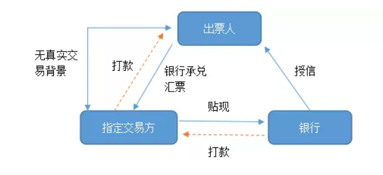

# 应付票据融资：无真实业务背景

## <a hre="http://etrlawfirm.com/cn/lssb/info_66.aspx?itemid=10128767&parent">违规票据融资之IPO应对思路</a>

发布时间：2019-02-13 来源于：广东广信君达律师事务所赵剑发、鲁莎莎

近日，某公司IPO被否决，上会时，某公司被关注了其票据融资问题：

“招股说明书披露，发行人存在无真实交易背景的银行借款受托支付情形，同时，发行人存在向子公司开具银行承兑汇票的情形。请发行人代表说明：（1）上述无真实交易背景的贷款背景及原因，发行人上述行为是否存在违法违规情形，是否存在被处罚的风险，是否对此次发行造成重大影响；（2）开具银行承兑汇票是否存在真实交易背景，是否属于变相资金融通，是否违反《票据法》相关规定，是否存在被行政处罚风险；（3）相关内控制度是否完善并有效执行。请保荐代表人说明核查依据、过程并发表明确核查意见。”

某公司披露的招股说明书中未见其对该问题的详细披露，对某公司的具体情况，我们不得而知，但从过往IPO审核案例来看，不乏存在票据融资情形的成功上市IPO案例，下面让我们一起来解读违规票据融资之IPO反馈应对策略。

### 一、什么是违规票据融资

#### （一）违规票据融资的定义及操作模式

违规票据融资是指银行承兑汇票的贴现申请人由于资金需要，虚构交易背景将未到期的银行承兑汇票转让于银行并贴现的一种融资行为。违规票据融资的流程如下：

 

实践中，由于向银行贷款审核手续繁琐并审批难度大，部分企业会与其关联公司或关系较好的供应商之间虚构交易进行银行承兑汇票的贴现，以获取流动资金，以解决融资效率问题并降低资金成本。

#### （二）相关法律法规

《中华人民共和国票据法》明确要求票据的签发、取得及转让需具有真实的交易背景。目前，违规票据融资的IPO案例均为无真实交易背景的银行承兑汇票贴现，违反的是《中华人民共和国票据法》第十条规定。若企业故意伪造、变造票据或者存在其他违法使用票据的行为，则将可能被认定为具有刑事责任的票据欺诈行为，《中华人民共和国票据法》及《中华人民共和国刑法》均对票据欺诈行为的刑事责任做了明确规定，具体如下：

>1、《中华人民共和国票据法》    
>第十条【票据与其基础关系】票据的签发、取得和转让，应当遵循诚实信用的原则，具有真实的交易关系和债权债务关系。    
>票据的取得，必须给付对价，即应当给付票据双方当事人认可的相对应的代价。    
>第一百零二条【票据欺诈行为的刑事责任】有下列票据欺诈行为之一的，依法追究刑事责任：    
>（一）伪造、变造票据的；    
>（二）故意使用伪造、变造的票据的；    
>（三）签发空头支票或者故意签发与其预留的本名签名式样或者印鉴不符的支票，骗取财物的；    
>（四）签发无可靠资金来源的汇票、本票，骗取资金的；    
>（五）汇票、本票的出票人在出票时作虚假记载，骗取财物的；    
>（六）冒用他人的票据，或者故意使用过期或者作废的票据，骗取财物的；    
>（七）付款人同出票人、持票人恶意串通，实施前六项所列行为之一的。    
>第一百零三条　【票据欺诈行为的行政责任】有前条所列行为之一，情节轻微，不构成犯罪的，依照国家有关规定给予行政处罚。    
>2、《票据管理实施办法》    
>第四条　票据当事人应当依法从事票据活动，行使票据权利，履行票据义务。    
>3、《中华人民共和国刑法》    
>第一百九十四条　【票据诈骗罪】有下列情形之一，进行金融票据诈骗活动，数额较大的，处五年以下有期徒刑或者拘役，并处二万元以上二十万元以下罚金；数额巨大或者有其他严重情节的，处五年以上十年以下有期徒刑，并处五万元以上五十万元以下罚金；数额特别巨大或者有其他特别严重情节的，处十年以上有期徒刑或者无期徒刑，并处五万元以上五十万元以下罚金或者没收财产：    
>（一）明知是伪造、变造的汇票、本票、支票而使用的；    
>（二）明知是作废的汇票、本票、支票而使用的；    
>（三）冒用他人的汇票、本票、支票的；    
>（四）签发空头支票或者与其预留印鉴不符的支票，骗取财物的；    
>（五）汇票、本票的出票人签发无资金保证的汇票、本票或者在出票时作虚假记载，骗取财物的。    
>【金融凭证诈骗罪】使用伪造、变造的委托收款凭证、汇款凭证、银行存单等其他银行结算凭证的，依照前款的规定处罚。    

### 二、票据融资反馈关注要点及应对策略分析

#### （一）反馈问题情况

我们在2017年以来证监会披露867份反馈意见中以“无真实交易背景 票据融资”为关键词检索，发现共12家企业的反馈意见中被问及违规票据融资问题，主要集中在制造业行业。从反馈的问题来看，就违规票据融资，除了会被关注企业合规性问题外，还通常与内部控制有效性的问题被共同发问，主要反馈问题内容包含：    
（1）请申请人披露说明开具无真实交易背景的票据进行融资的详细情况、用途及原因；    
（2）是否符合对应银行的规定，是否符合相关法律法规的规定，是否存在被行政处罚等法律风险，是否构成重大违法违规行为，是否取得相关主管机关的专项认定意见；    
（3）公司内部控制制度是否能够有效执行。    

#### （二）应对思路

我们摘取了如下3个反馈被问及违规票据融资问题的典型案例，该等案例被问及的相关问题及答复思路如下：

##### 【案例一】X股份上会时间2017年4月25日

反馈问题：报告期内发行人注销了A公司和B公司两家公司。控股股东注销了其实际控制的C。

报告期内，发行人与C之间相互提供多笔资金往来滚动拆借，且存在公司向其开具和背书无真实交易背景的应付票据情况。请发行人说明：发行人与C之间开具和背书无真实交易背景应付票据的原因、合理性及合法性，说明每一笔无真实交易背景票据情况．包括开具或背书实际、金额、C持有票据的用途、处理票据的时间、金额等，说明是否存在纠纷或潜在纠纷。

答复思路

1、阐述发行人与C之间开具和背书无真实交易背景应付票据的原因为公司对天安越汇提供融资支持。C主要从事汽车零部件的出口业务。在其从事业务的过程中，因其为注册资本较小的小型贸易公司，设立时间不长，其从上游采购零部件时往往需要垫付较多资金。在C融资渠道有限的背景下， 公司采取向其背书或开具无真实交易背景的票据，C取得票据后，再由其背书给C的上游供应商。

2、详细阐述开具无真实交易背景票据的情况及发生金额，并说明已经停止该等开票行为，且应付票据均已到期，因此产生的债权债务关系均已结束，且该行为并未给相关各方造成损失，也未因此发生任何纠纷。

3、上述开具和背书无真实交易背景票据行为虽然违反《中华人民共和国票据法》第十条之规定：“票据的签发、取得和转让，应当遵循诚实信用的原则，具有真实的交易关系和债权债务关系。票据的取得，必须给付对价，即应当给付票据双方当事人认可的相对应的代价”，但其目的是为了充分利用商业信用、拓宽中小企业融资渠道，所取得资金全部用于经营活动，并未用于其他非法用途。报告期内，上述行为并未给相关银行及其他债权人造成任何实际损失，也未因此发生任何纠纷，不属于《中华人民共和国票据法》第一百零二条所述票据欺诈行为之一。

4、为防止该等情形发生，严格执行内部控制制度。发行人为防止发生类似行为，将严格执行《公司章程》、《关联交易决策制度》、《重大决策管理制度》及相关的资金管理等财务制度，并制定了上市后将执行的《防止控股股东或实际控制人及关联方占用公司资金的管理制度》。

5、中国人民银行武进支行出具不存在重大违法违规行为的专项合规证明。

6、实际控制人兜底承诺。

##### 【案例二】S上会时间 2017年7月5日

反馈问题：发行人与A票据融资的产生原因及合法合规性、是否构成重大违法违规、是否取得相关主管机关的专项认定意见、相关款项用途。

答复思路

1、阐述发行人与A票据融资的产生原因系为了用于偿还B公司及正奇租赁借款。

2、上述票据融资行为未严格遵守《票据法》第十条“票据的签发、取得和转让，应当遵循诚实信用的原则，具有真实的交易关系和债权债务关系。”的规定，但相关票据在到期时全部解付，未造成任何经济损失和纠纷。

3、中国人民银行合肥中心支行出具不构成重大违法违规行为的合规证明。

##### 【案例三】W上会时间2015年3月13日

反馈问题：请发行人说明向关联方开具无真实交易背景的银行承兑汇票的具体过程，关联方是否背书给主要供应商，虚构何种交易，行为是否构成重大违法，与A、B、C等主要供应商、客户是否存在类似情形，请保荐机构、律师核查并发表意见。

答复思路

1、说明发行人向子公司开具无真实交易背景的银行承兑汇票进行融资的具体步骤。

2、发行人向子公司开具的银行承兑汇票均被子公司资用于向银行贴现融资，因此不存在背书给发行人主要供应商的情形，也不存在与发行人主要供应商虚构交易的情形。

3、发行人向子公司开具无真实交易背景的银行承兑汇票进行融资的行为违反了《中华人民共和国票据法》第十条“票据的签发、取得和转让，应当遵循诚实信用的原则，具有真实的交易关系和债权债务关系”的规定。但鉴于：

（1）发行人不存在逾期票据及欠息情况，均已经按照《中华人民共和国票据法》 及相关票据制度及时履行了票据付款义务，且该不规范使用票据的行为已得到纠正，未给相关银行造成任何实际损失，也未实际危害我国金融机构权益和金融安全；

（2）发行人的董事及高级管理人员未从中取得任何个人利益，不存在票据欺诈行为，亦未因过往期间该等不规范使用票据的行为受到过任何行政处罚；

（3）中国人民银行莱芜市中心支行出具了《关于W公司不规范票据使用行为的函》，明确该行为不属于重大违法违规行为，不会就此问题对发行人上述票据行为实施行政处罚。

（4）发行人控股股东已经出具承诺，负责对发行人因此遭受的损失予以全额赔偿。

因此，发行人上述不规范使用票据的行为不构成重大违法，对本次发行不构成实质性法律障碍。

### 三、应对策略小结

归纳而言，违规票据融资问题的应对思路如下：

1、阐述发行人开具无真实交易背景票据的具体情况、原因及资金用途，说明用途均为用于生产经营或其他正当用途，并非以非法占有为目的的骗取银行资金的票据欺诈或票据诈骗活动。 

2、票据贴现所涉交易双方就无真实交易背景的票据行为进行说明，明确双方不存在因此而发生的债权债务关系，不存在纠纷或潜在纠纷；

3、说明票据融资行为未严格遵守《票据法》第十条“票据的签发、取得和转让，应当遵循诚实信用的原则，具有真实的交易关系和债权债务关系。”的规定，但相关票据在到期时全部解付，未造成任何经济损失和纠纷，不属于《票据法》第一百零二条、《票据法》第一百零三条、《票据管理实施办法》第三十条、《票据管理实施办法》第三十一条规定的应追究刑事责任或给予行政处罚的票据诈骗行为。

4、主管人民银行中心支行出具合规证明，说明发行人票据融资行为不构成重大违法违规行为。

5、实际控制人对可能造成的损失及处罚进行兜底承诺。

6、如为帮助关联方进行票据融资或所得融资资金为第三方占款的，还应阐述为避免该等情况再次发生而制定及执行的内部控制措施。

从过往成功IPO案例来看，违规票据融资如不构成票据欺诈行为一般来说不构成上市的实质性障碍，但其体现了公司内部控制有效性及经营合规性情况。建议拟上市努力杜绝该等情形的发生，如确实存在该等情形，通过时间换空间的方式，将其控制在报告期初，从而减轻发审委对公司内部控制及规范性的质疑。   

## <a href="http://www.cpiaoju.com/article/article/11711.html">哪些票据具备融资功能，可以融资的票据有哪些</a>

2022-01-21

近年来，从票据产品与服务衍生内在变化需求来看，中小企业服务多元化需求强烈，企业需求丰富，票据满足中小企业资金支付、短期资金周转、降低融资成本，大大提高了票据的流动性和业务办理效率，较好地满足了中小企业的融资需求。

### 1.银行承兑汇票融资

银行承兑汇票贴现是指当中小企业有资金需求时，持银行承兑汇票到银行按一定贴现率申请提前兑现，以获取资金的一种融资业务。在银行承兑汇票到期时，银行则向承兑人提示付款，当承兑人未予偿付时，银行对贴现申请人保留追索权。

特点：银行承兑汇票贴现是以承兑银行的信用为基础的融资，是客户较为容易取得的融资方式，操作上也较一般融资业务灵活、简便。银行承兑汇票贴现中贴现利率市场化程度高，资金成本较低，有助于中小企业降低财务费用。

### 2.商业承兑汇票融资

商业承兑汇票贴现是指当中小企业有资金需求时，持商业承兑汇票到银行按一定贴现率申请提前兑现，以获取资金的一种融资业务。在商业承兑汇票到期时，银行则向承兑人提示付款，当承兑人未予偿付时，银行对贴现申请人保留追索权。

特点：商业承兑汇票的贴现是以企业信用为基础的融资，如果承兑企业的资信非常好，相对较容易取得贴现融资。对中小企业来说以票据贴现方式融资，手续简单、融资成本较低。

### 3.协议付息票据贴现

协议付息商业汇票贴现是指卖方企业在销售商品后持买方企业交付的商业汇票(银行承兑汇票或商业承兑汇票)到银行申请办理贴现，由买卖双方按照贴现付息协议约定的比例向银行支付贴现利息后银行为卖方提供的票据融资业务。该类票据贴现除贴现时利息按照买卖双方贴现付息协议约定的比例向银行支付外与一般的票据贴现业务处理完全一样。

### 4.供应链票据融资

供应链票据是指企业通过供应链票据平台签发的电子商业汇票。两项关键要素需要关注，一是签发场所为上海票据交易所供应链票据平台，二是截止目前票据类型仅为电子商业承兑汇票，非纸票，也非银行承兑汇票。

供应链票据主要是指采取“1+N”模式，即依托产业链上核心企业的信用，通过核心企业发行非金融企业债务融资工具(包括短期融资券、中期票据、超短融、定向工具等)，通过委贷方式向上下游供应链企业(尤其是中小企业)提供资金支持，缓解上下游企业资金紧张，降低其融资成本。同时发行主体在强化对上下游企业控制的同时，利用自身信用获取利差(委贷利率-债券利率)。 