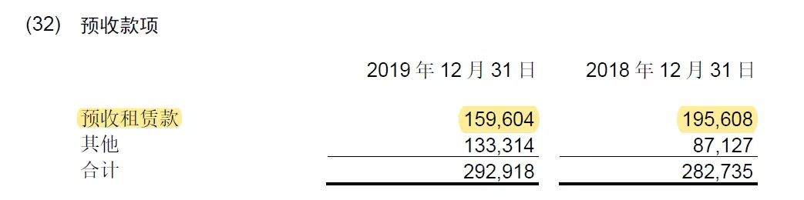
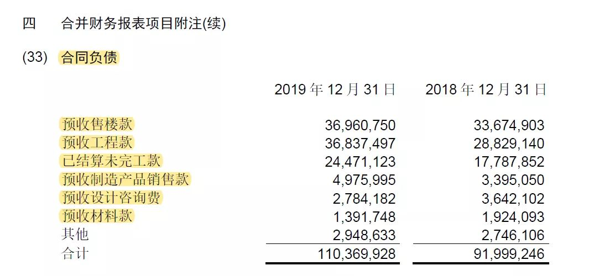

# 新收入准则：合同负债与预收账款

## <a href="https://zhuanlan.zhihu.com/p/135455385">新收入准则：合同负债VS预收账款</a> 

2022-01-07

### 1、合同负债的定义

第四十一条 企业应当根据本企业履行履约义务与客户付款之间的关系在资产负债表中列示合同资产或合同负债。企业拥有的、无条件（即，仅取决于时间流逝）向客户收取对价的权利应当作为应收款项单独列示。

合同负债，是指企业已收或应收客户对价而应向客户转让商品的义务。如企业在转让承诺的商品之前已收取的款项。

上述定义看完，感觉和预收账款没什么区别，下面引用《财务与会计》的一段解释，对两者的区别做了比较好的说明

### 2、合同负债与预收账款的区别

>区别1、所收款项是否对应于合同规定的交付商品或提供劳务的履约义务。如果收取的款项不构成交付商品或提供劳务的履约义务，则属于预收账款；反之，则属于合同负债。
>
>区别2、确认预收账款的前提是收到了款项，确认合同负债则不以是否收到款项为前提，而以合同中履约义务的确立为前提。如上所述，如果所预收的款项与合同规定的特定履约义务无关，则作为预收账款核算，但前提是已收到款项。而不管款项是否已经被企业预收，如果能够认定合同中规定的履约义务确已产生、且企业履约后对这笔款项有无条件收取的权利，企业应对此确认合同负债。也就是说，合同负债的确认不以款项收取为前提条件。

如何理解上面两点：

#### 2.1、区别1

针对第一点，文章举了两个例子：    
1、健身俱乐部收到客户交来的入会手续费属于预收账款，但俱乐部向会员发售的健身卡所收款项则属于合同负债    
2、酒店收到客户预交的房费款属于合同负债，但收到客户预订房间的定金则属预收账款

案例1与《企业会计准则第14号——收入》应用指南2018中的例子颇为相像，我们直接来看指南的原文：

>【例 65】甲公司经营一家会员制健身俱乐部。甲与客户签订了为期2年的合同，客户入会之后可以随时在该俱乐部健身。除年费2000元之外，甲公司还向客户收取了50元的入会费，用于补偿俱乐部为客户进行注册登记、准备会籍资料以及制作员卡等初始活动所花费的成本。甲公司收取入会费和年费均无需返还。

本例中，甲公司承诺的服务是向客户提供健身服务（即可随时使用的健身场地），而甲公司为会员入会所进行的初始活动并未向客户提供其承诺服务，而只是一些内部行政管理性质的工作。因此，甲公司虽然为补偿这初始活动向客户收取了入会费，但是该入会费实质上是客户为健身服务所支付的对价的一部分（不构成履约义务），故应当作为健身服务的预收款与收取的年费一起在2年内分摊确认为收入。

PS：但陈版主在会计视野论坛的回答中认为入会费50元也应属于合同负债。

案例2，客户预交的房费款最后均会转换成服务，而定金一般退房后需要退回客户的，这个案例比较简单明了。但是这里的预收账款实际上也作为其他应付款似乎更加合理。

#### 2.2、区别2

简单来说，预收账款必须先收钱，体现为分录，即：    
借：银行存款/现金    
贷：预收账款    

而合同负债在确认时，不仅可以做上述分录，还能以此形式确认：    
借：应收账款    
贷：合同负债    

企业在向客户转让商品之前，客户已经支付了合同对价或企业已经取得了无条件收取合同对价权利的，企业应当在客户实际支付款项与到期应支付款项孰早时点，按照该已收或应收的金额，借记“银行存款”、“应收账款”、“应收票据”等科目，贷记本科目；企业向客户转让相关商品时，借记本科目，贷记“主营业务收入”、“其他业务收入”等科目。涉及增值税的，还应进行相应的处理。

举个例子：

小明一早到包子铺买包子，可惜今早的包子卖完了。老板跟小明说，中午12点前，把明天的包子钱先付咯，明天给你留10个包子，共20元。小明满口答应，但是到了中午12点，小明迟迟未出现。考虑到小明的信誉良好，老板还是给小明留了10个包子。

中午12点后，包子铺做账    
借：应收账款-小明 20    
贷：合同负债 20    

第二日，小明取包子时    
借：合同负债 20    
贷：营业收入-包子 20    

### 3、实务案例

我们再来看下上市公司的年报是如何区别的：

中国中铁：2019年年度报告

可见，大部分的预收项目都已经在合同负债中核算了，保留的项目是预收租赁款，这部分应该是属于租赁准则规范的范畴，不属于新收入准则规范范围。预收的多年租金作为“其他非流动负债”列示（一年内到期部分转入预收账款）

### 4、总结

合同负债在很大的程度上能够替代原来的预收账款，但预收账款也未完全消失。我们记住应用范围少的预收账款，自然就能够比较好的区分两者的区别了。

一、在不属于收入准则范畴内的预收款项，如上述租赁准则下的预收租金。    
二、未对应履约义务的预收款：    
1、可以理解成未来可能会退回的定金等，同其他应付款。    
2、在约定履约义务之前就已经打款，后续签订了合同。即先确认为预收账款，后转变成合同负债。
