# Excel自定义格式代码

<a href="https://zhuanlan.zhihu.com/p/334303598">原文链接：花了20小时整理的Excel自定义格式代码大全</a>

### 01 如何设置单元格格式

选中需要设置单元格格式的区域范围后，至少有三种方法可以设置单元格格式：

#### 菜单栏按键法

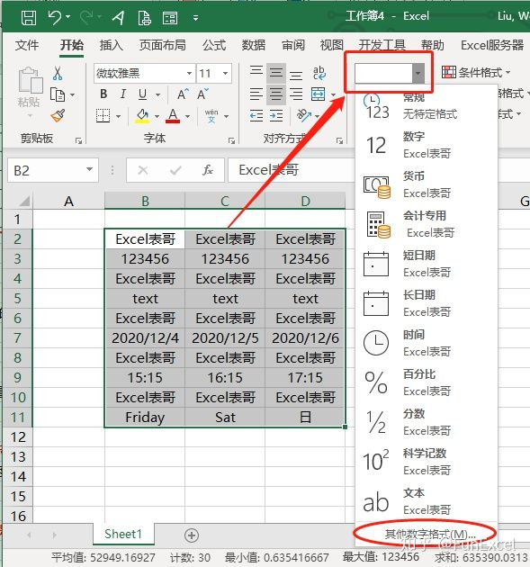

或者点击单元格格式选型卡下面的三角形符号也可以。

#### 右键菜单法

选中数据后右键单击：“设置单元格格式”。

#### 快捷键法

选中数据后按Ctrl+1也会弹出设置单元格格式的对话框。

左侧的【分类】列表中有常规、数值、货币等等选项，这里比较简单，此不赘述。我们需要重点学习的自定义格式是列表最后的【自定义】。

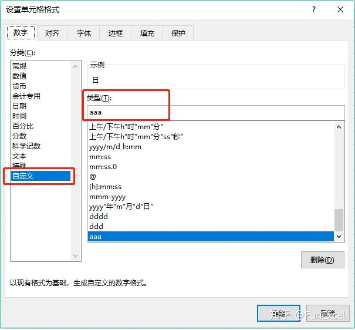

点击【自定义】就会出现【类型】编辑框,下面是系统预设的一些代码，不过这些预设代码远远不能满足我们实际的需要。

注：【自定义】单元格格式允许用户创建符合一定规则的数字格式，应用自定义格式的数字并不会改变数值本身，仅仅只是改变数值的显示方式而已。事实上所有类型的单元格格式都只是改变了数值的显示方式。

### 02 自定义格式的代码规则

自定义格式代码，共有四个区段，在代码中，用分号来分隔不同的区段，每个区段的代码作用于不同类型的数值。完整格式代码的组成结构为：

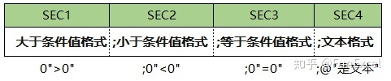

在没有特别指定条件值的时候，默认的条件值为0，因此，格式代码的组成结构也可视作：

`正数格式;负数格式;零格式;文本格式`

自定义格式代码最多可以有四节，但并不是说每一个自定义代码都必须定义四节,少于四节的代码也是可以的：

举例如下：

#### 1 如果只定义一个节，则该代码用于所有的数字上。

定义1 此区域的自定义代码为：0"是数值"    
定义2 此区域的自定义代码为：[红色]0

从例子里我们可以看到，定义的代码对"Excel表哥"文本所在的单元格并不起作用，只对数值型的单元格起作用。

#### 2 如果只定义两个节，则第一节用于0和正数，第二节用于负数。

定义1 此区域的自定义代码为：0"≥0";-0"<0"    
定义2 此区域的自定义代码为：[蓝色]0;[红色]-0

#### 3 如果只定义三个节，则第一区域用于正数，第二区域用于负数，第三区域用于0值。

定义1 此区域的自定义代码为：0">0";0"<0";0"=0"    
定义2 此区域的自定义代码为：[蓝色]0;[红色]-0;[黄色]0

从例子里我们可以看到，只定义2或者3节的代码对"Excel表哥"文本所在的单元格并不起作用，只对数值型的单元格起作用，且对数值型进行了正数、零、负数的区分。

#### 4 如果定义满四节的代码，则分别对正数、负数、零、文本进行了定义。

定义1 此区域的自定义代码为：0">0";0"<0";0"=0";@"是文本"    
定义2 此区域的自定义代码为：[蓝色]0;[红色]-0;[黄色]0;[黑色]@

自定义格式分为四个区间，每个区间用分号隔开，那么我们可以通过此规则来隐藏单元格里的内容。使用不同的格式代码，可以对数据区域的数值、文本或是全部内容进行隐藏。

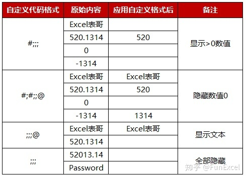

### 03 自定义格式代码占位符

上一节中自定义格式代码中的数字0其实是一种占位符号。常见的占位符号含义如下：

#### 0 占位符

0占位符是一种数字占位符，表示单元格中数字的实际最少位数，例如设置单元格自定义格式为00000，则表示单元格数字至少为5位。如果单元格内数字位数大于5位，则显示实际数字的位数；如果单元格内数字位数小于5位，则用数字0补齐。举例如下：

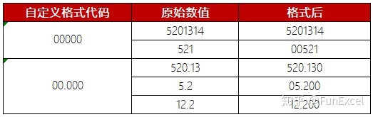

#### # 占位符

#占位符也是一种数字占位符，与0占位符相比，单元格中数字只显示有意义的0，无意义的0则不显示。举例如下：

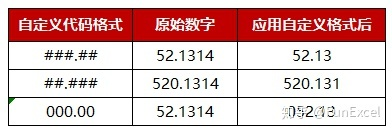

也可以使用#与0组合来设置单元格格式，举例如下：

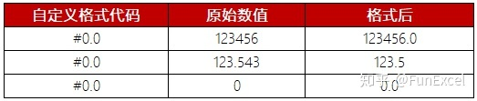

#### ? 占位符

?占位符(注意是英文的?)也是一种数字占位符，与0占位符相比，在单元格中为数字两边无意义的0自动添加空格，因此也称作空格占位符。此格式最大的用处在于：当按照固定宽度显示数字时，所有的单元格数字小数点可以对齐显示，还可以用于分数显示。举例如下：

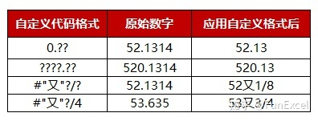

#### @ 占位符

@占位符是一种文本占位符，如果只使用单个@，作用是引用原始文本，如果使用多个@，则可以重复文本。和其他的文本内容结合在一起，可以不改变原始文本，从而扩展文本显示内容。举例如下：

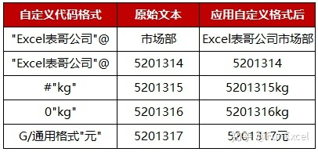

注：@文本占位符只对单元格内的文字有效，对纯数字无效。要想在数字后自动添加单位，则需要使用#或0"单位"格式。

#### * 占位符

\*占位符是一种文本占位符，表示重复\*后的字符，直到填充满列宽显示。*占位符有很多有趣实用的举例：

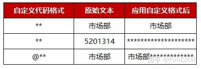

还可以用于在单元格内显示目录填充效果：

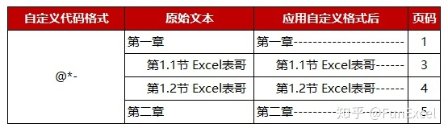

#### , 占位符

","占位符是一种数字占位符，又称千位分隔符。配合#或者0，可以将数字以千为单位进行标示显示。举例如下：

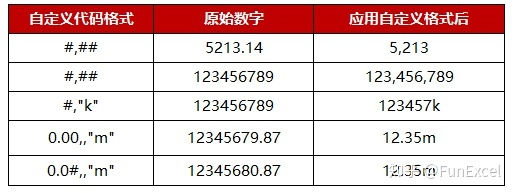

注：如果逗号在格式代码的最后，则表示将原始数字除以1000，并舍去小数部分。如果0或者#后面是两个逗号,,则表示除以两次1000，即百万。

#### ! 占位符

!占位符是一种字符转义占位符，这个转义字符用的不多，主要作用是在代码格式中，将代码字符中的#，0转变成文本内容。例如批量在编号前增加#符号：

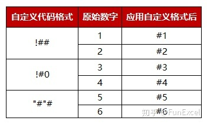

上面三种格式都可以在数字编号前增加#号，大家根据自己的喜好选择就可以。

国外比较喜欢使用千位分隔，因此Thousand，Million，Billon是老外喜欢的单元格格式。针对国内，“万”才是我们常见的单位。

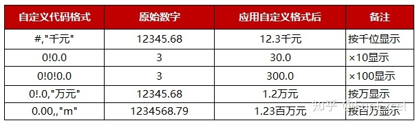

要以万为单位显示单元格内数字，可以将数字显示效果先÷1000按千位分隔显示，然后再在紧接着百位后的千位和万位之间强制增加一个小数点(!.)。效果就是再除以10。

以万为单位显示数值由于日常使用较多，此处再多列举几种方式：

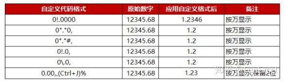

如果要保留2位有效数字，则需要按照最后一种方式设置单元格格式。方法如下动图所示：

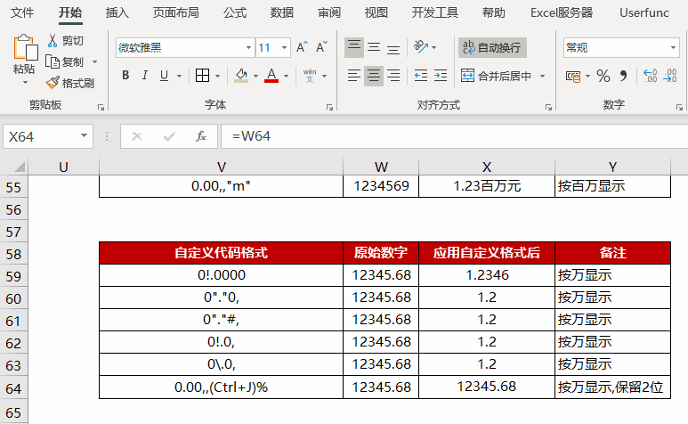

在输入单元格格式代码时候需要光标移动至%前，在键盘输入换行符号 Ctrl+J 之后按确定。自定义单元格格式代码完成后还需要设置单元格自动换行及顶端对齐并调整行高。

其他关于转义字符占位符的应用，还可以参考下面的举例：

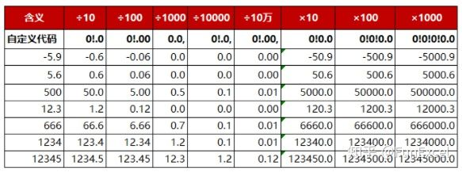

上面的举例都是通过 !. 强制指定小数点的位置实现放大或者缩小的显示效果。例如÷100就是在0(!.)00十位和百位之间增加一个小数点。至于保留的小数位数，还是要看小数点后代码指定的0的位数。

#### YMD 占位符

YMD或者ymd占位符是日期占位符，日期代码非常简单，按照下面的举例设置就ok，还可以用任意字符诸如"-" ":" "."等将年月日连接起来。例如2020-7-1，可以显示为如下格式：

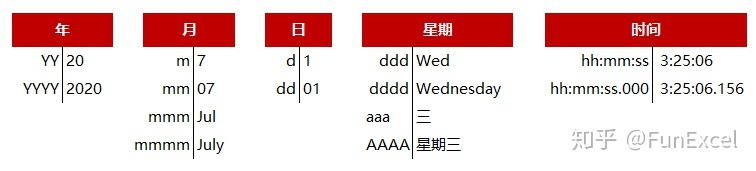

#### [] 占位符

英文[]是条件占位符，配套为满足不同条件的数字设置格式时使用，最多只能有三种条件结果，例如：

`[>85]"优秀";[>=60]"及格";"不及格"`

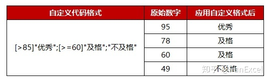

条件的判断按照从左至右的顺序进行判断，首先判断>85的条件，如果不满足则判断>=60的条件。

[]条件占位符还可以用括号指定满足条件的颜色，常见的8种颜色是： [黑色] [蓝色] [蓝绿色] [绿色] [洋红色] [红色] [白色] [黄色]。除此之外，还可以使用[颜色#]，其中#为0到56的整数。若为0，则代表无颜色。其它56个数字与颜色的对应关系如下：

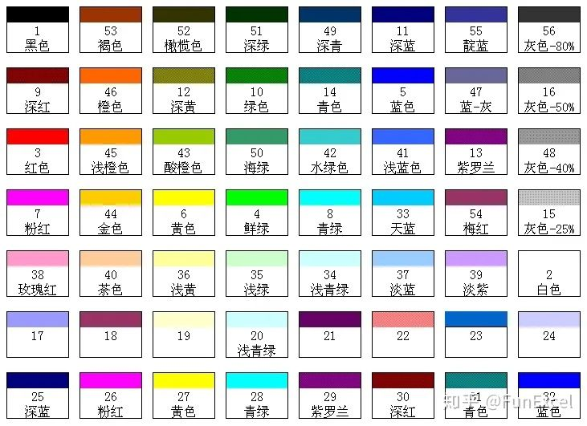

举例如下：

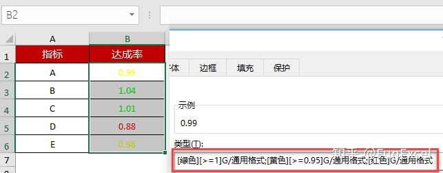

对于达成率>=1的指标，使用“绿色”显示；达成率>=0.95的指标，使用“黄色”指标显示；低于0.95的用红色显示。只需要在自定义单元格格式中填入如下代码：

`[绿色][>=1];[黄色][>=0.95];[红色]`