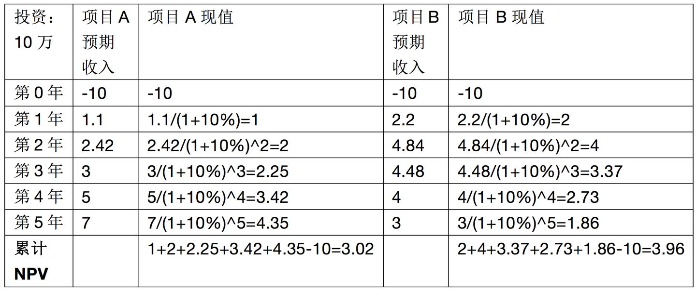

# 净现值（NPV）与内部报酬率（IRR）

## 净现值（NPV）

要理解IRR必须要先理解NPV净现值。

净现值（Net Present Value, NPV）：说的是把未来期望收入的钱换算成现在的钱（跟算利息类似，不过是反向运算，例如明年你会赚110元，假设贴现率是10%，那么换算成现在的钱也就是110/(1+10%)=100元，也就是说你明年赚到的110元就相当于现在100元的购买率，反过来就是你现在100元，利息10%，明年你就变成了110元，往后的年份一样算法），然后累加再减去投资成本得到累计净现值。累计净现值越大越好，理论上净现>0项目就可行，表示有赚头。

举例：假设两个项目A和B，都是投资10万元，贴现率10%，预期收入和净现值如下。（假设项目周期都只有5年，单位：万）

贴现率10%时项目A和项目B的净现值

从上面的例子可以看出，项目B的净现值更高更值得投资，原因是虽然A和B的5年总收入如果不考虑货币时间价值加起来是相等的都是18.52万，但是由于项目B的收入来得比较提前，所以算出来项目B的净现值高，更值得投资。从这儿可以看到净现值主要算的是刨去货币贬值影响最后还能赚多少钱。

## 内部报酬率（IRR）
内部报酬率（Internal Rate of Return, IRR）：说的是累计净现值为0的时候的贴现率。这个内部报酬率的意思就是项目能承受的最大货币贬值的比率。（赢利空间，抗风险能力。）还是以上面那个例子为例，假设现在贴现率变为20%，现在计算项目A和项目B的净现值如下：

贴现率20%时项目A和项目B的净现值

可以看到项目A净现值这时为负数，而项目B净现值还是正数，这说明项目A的内部报酬率（IRR）将小于20%，而项目B的内部报酬率大于20% ，因为内部报酬率是NPV为0时候的贴现率。我们最后通过计算得出当贴现率为18.45%时，项目A的NPV刚好等于0，如下表所示：

贴现率18.45%时项目A和项目B的净现值

这个时候我们就说项目A的内部报酬率（IRR）为18.45%。同理经过计算当贴现率为23.94%时，项目B的NPV刚好等于0，如下表所示：

贴现率23.94%时项目A和项目B的净现值

这个时候我们就说项目B的内部报酬率（IRR）为23.94%。

总结：从上面我们可以看到，净现值（NPV）说的是在考虑货币时间价值（通货膨胀贬值）下我们在项目周期内能赚多少钱，内部报酬率（IRR）说的是在考虑货币时间价值（通货膨胀贬值）下我们在项目周期内我们能承受的最大货币贬值率有多少，更通俗地说就是假设我们去贷款来投资这个项目，所能承受的年最大利率是多少。比如某项目的内部报酬率IRR是20%，说的是该项目我们最大能承受每年20%的货币贬值率，也就是如果我们去贷款投资该项目所能承受的最大贷款年利率为20%，在贷款年利率是20%的时候投资该项目刚好保本。当实际货币贬值率只有5%时（贷款利率是5%时），那么剩下的15%就将是我们的利润，虽然看上去说的是失误空间（最多我可以失误多少还能保本），抗风险能力，实际上也可以认为说的是利润空间，盈利能力。就像你去参加考试，60分及格，你的真实水平是90分，那么你的状态不好失误空间将有30分，就算你失误掉30分你仍然能及格，这个30分换算成比率就是你的内部报酬率（IRR），你的真实水平只有65分，那么你的失误空间将只有5分，稍微失误一些你将会不及格，此时你的内部报酬率就只有5分。虽然算的是内部报酬率，实际上也说明你的真实水平（90还是65）到底怎么样。

在实际项目投资中，NPV说的是具体数值，而IRR是一个比率，如果要比较我觉得IRR肯定好点因为是个相对值，单纯NPV只是个绝对值，没有考虑投资额的大小，只有再同时考虑投资额才能更充分体现项目的盈利能力，毕竟投资10万NPV是5万和投资100万NPV也是5万两个项目的盈利能力是不一样的。

